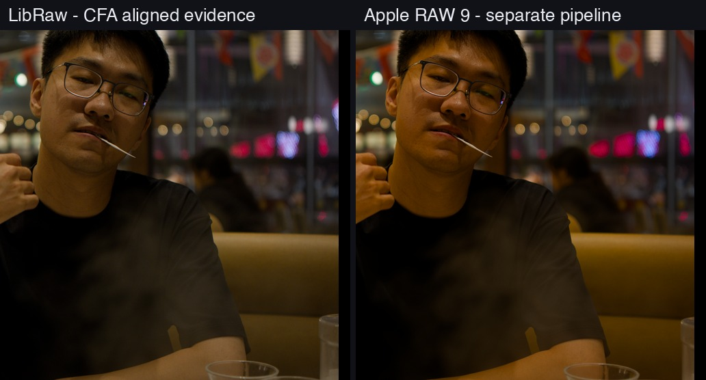
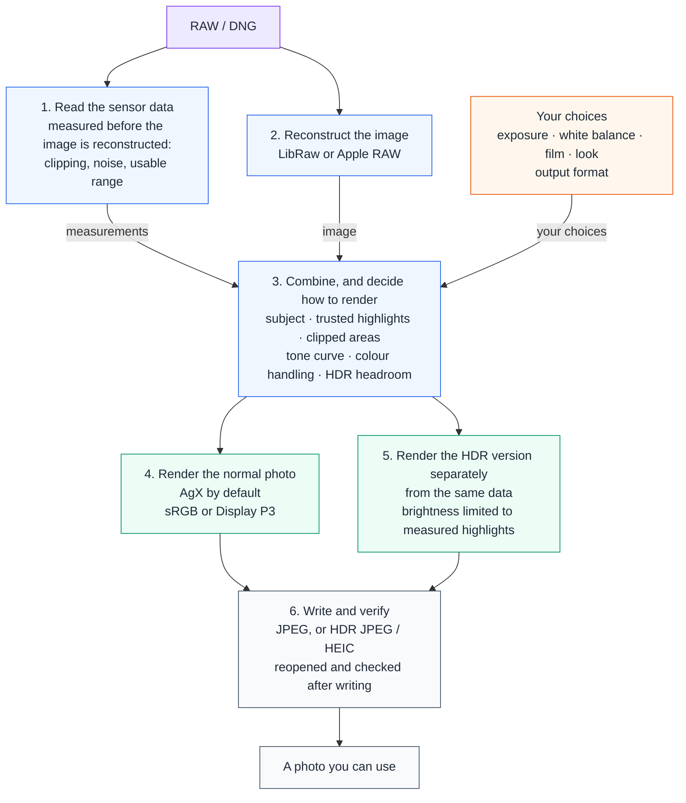

# AgXRAW

Develop RAW photographs into faithful JPEGs and real HDR photos, and see the evidence behind every
step. Open source, runs locally, and your RAW files never leave your computer.

AgXRAW began with one practical question: how can I develop a RAW with AgX without opening a full
editor? Once that worked, the more interesting questions surfaced. How much highlight signal did
the sensor actually keep? How far can reconstructed highlights be trusted? How should one capture
become both a normal photo and an HDR photo? Can a film's colour temperature, colour response and
tone curve be adjusted layer by layer instead of being baked into one filter? AgXRAW puts those
questions into one measurable, reproducible pipeline.

[简体中文](README.zh-CN.md) · [License](LICENSE) · [Third-party notices](NOTICE.md)

**Tutorials and documentation**:
[Editing tutorial](docs/EDITING_TUTORIAL.zh-CN.md) (what every slider does, with real comparisons; Chinese) ·
[Film tutorial](docs/FILM_TUTORIAL.zh-CN.md) (what every film option means, with real comparisons; Chinese) ·
[HDR tutorial](docs/HDR_TUTORIAL.zh-CN.md) (what an HDR photo is, how bright it can go, how to export; Chinese) ·
[User guide](docs/USER_GUIDE.md) (supported cameras, every number in the interface, export choices) ·
[Sensor support](docs/SENSOR_SUPPORT.zh-CN.md) (Chinese) ·
[Full documentation index](docs/README.md)

The default workflow now uses AgX with analysis-driven exposure and tone planning.
Automatic JPEG delivery searches q95–q99 using actual codec readback, with
4:2:2 as the reference sampling. HDR JPEG now has independent quality and
sampling controls while retaining its ISO gain map. HEIF can use libheif/x265
with 8/10-bit output, adjustable sampling, preset and tune; its automatic mode
searches its own quality range against a q95/4:4:4/10-bit reference. Every HDR
candidate must pass SDR and HDR reconstruction checks. Use `--ev 0` for the fixed
exposure anchor, `--delivery-profile share` for manual controls (initially
q95/4:2:0), or `--delivery-profile archive` for explicit q100/4:4:4.
[Full-resolution quality/size measurements](docs/DELIVERY_QUALITY_STUDY.zh-CN.md).

## What it does

### Develops a RAW into a photograph

AgX is the default rendering: bright areas roll off to white naturally and colours never turn
bright-and-fake. The tool first analyses the photograph — how bright the subject is, where the
darkest and brightest content sits, what clipped — and compiles a tone curve, so a straight export
is usually a usable picture. When you do want to adjust, the order is range → brightness → colour
compensation, and each slider does one thing.

| Default, nothing touched | Deeper shadows let in, then one stop brighter |
|---|---|
|  |  |

What each slider changes in the picture, and when it does nothing, is in the
[editing tutorial](docs/EDITING_TUTORIAL.zh-CN.md).

### Tells you what is actually in the RAW

Open a RAW and the tool reports what it measured: how many pixels clipped and in which colour
channel, how bright the brightest genuinely measured highlight is, and how many stops an HDR export
could add. A preview overlay marks where the sensor reached its ceiling. It records what happened
at capture and does not move when you adjust, so it separates "the RAW has no information here"
from "this is merely rendered too bright".

Every number is explained in section 3 of the [user guide](docs/USER_GUIDE.md).

### Exports real HDR photos

The three images below are **real HDR files** exported by AgXRAW, not illustrations. On an HDR
screen with a supporting browser (Safari or Chrome on a Mac or iPhone, Chrome on Android 15+), the
lamps and highlights are visibly brighter than this page's white background. If you see no
difference, your screen or browser is showing the normal photo stored in the same file — which is
exactly the fallback this format promises.

| Figure and lamp · 2.35 stops above page white | Stage lights · 1.35 stops |
|---|---|
|  |  |

| Restaurant light tubes · 1.45 stops |
|---|
|  |

The HDR version is not a brightened copy of the normal photo; it is rendered separately from the
same data. How bright it may go depends only on how bright a highlight the sensor genuinely
measured — if there is none, the export fails clearly instead of inventing headroom. Every file is
reopened and checked after writing. Details are in the [HDR tutorial](docs/HDR_TUTORIAL.zh-CN.md).

### Film simulation: twenty stocks, two ways to run them

This is not a one-click filter. Choosing a stock sets several independent layers at once: its
calibrated colour temperature, how the stock separates colours, a tone curve fixed for the whole
roll, and how rich the colours are. Every layer is visible and editable.

| No film | Portra 400 | Velvia 100 |
|---|---|---|
|  |  |  |

There are two ways to simulate a stock. **Style mode** (the default; `--film-mode observe`) borrows
the film's colour and tone and still lets AgX form the image — stable and restrained. **Full
development mode** (`--film-mode full`) computes the whole process from the stock's and the paper's
data — exposure, development, printing — and opens up many more controls: the enlarger colour head,
print exposure, development, inter-image effect, grain and halation. The plate below compares one
RAW across three stocks; the rightmost column pushes two taste dials of full development to their
limits. Columns, left to right: no film, style mode, full development, full development pushed.


What each option means and how the choices differ is in the
[film tutorial](docs/FILM_TUTORIAL.zh-CN.md).

### Two RAW decoders

The default LibRaw decoder covers nearly every camera on the market; on a Mac you can switch to the
system's Apple RAW decoder, including its newest decoding model. Both feed the same analysis and
rendering, so they can be compared on the same photograph.



Supported cameras, and what happens with bodies too new for the built-in data, are covered in
section 1 of the [user guide](docs/USER_GUIDE.md) and in [sensor support](docs/SENSOR_SUPPORT.zh-CN.md).

### One set of settings for the GUI and the command line

The local web interface and the CLI share one set of parameters: anything you set in the interface
can be reproduced as one command. `--report` prints the full analysis report; `--scan` / `--csv`
write a diagnostic dashboard and a data table.

## Quick start

An **Apple Silicon Mac** and Python 3.11 or newer are required. Apple RAW decoding and HDR export
use macOS system components, so macOS is the supported platform; earlier systems and Intel Macs are
untested. The validated rawpy/LibRaw revision is pinned as a dependency and builds locally on first
install, so Git and the Xcode Command Line Tools are also required.

The Python package and CLI keep the engine's historical name `dngscan`.

### GUI

```bash
git clone https://github.com/Gen-416/AgXRAW.git
cd AgXRAW
python3 -m venv .venv
source .venv/bin/activate
pip install -r requirements.txt
python -m dngscan.gui
```

Open the localhost address printed in the terminal. The selected RAW is sent only to the local
service on the same computer, kept in a temporary directory, removed on exit, and never sent to any
external service.

### CLI

```bash
# Default AgX render
python -m dngscan photo.dng --jpeg photo.jpg

# Also print the full analysis report
python -m dngscan photo.dng --jpeg photo.jpg --report

# Highlight reconstruction + Display P3
python -m dngscan photo.dng --jpeg photo_p3.jpg \
  --highlight-mode reconstruct --output-gamut p3

# HDR photo (macOS only)
python -m dngscan photo.dng --jpeg photo_hdr.jpg \
  --output-format ultrahdr --hdr-headroom 3

# Diagnostic dashboard and data table
python -m dngscan photo.dng --jpeg photo.jpg --scan --csv photo.csv

# Choose a film stock (style mode by default)
python -m dngscan photo.dng --jpeg photo_portra.jpg --film portra400

# Full development: overexposed one stop at capture, print exposure compensating
python -m dngscan photo.dng --jpeg photo_portra_full.jpg --film portra400 \
  --film-mode full --film-exposure 1 --film-print-timing retimed
```

See `python -m dngscan --help` for every option.

### Optional native acceleration (Rust)

Everything works without a native extension; the NumPy implementation is the reference. The
optional Rust kernels (`rust/`) accelerate the heavy parts of rendering, HDR, film and verification,
and every kernel's output is checked bit for bit against the NumPy reference. A 24 MP photo exports
in about 7 s as a normal JPEG, about 10 s as HDR, and about 15 s in full development mode with grain
and halation.

```bash
# Rust toolchain: https://rustup.rs
pip install setuptools-rust
tools/build_native.sh
```

`pip install .` builds the kernels too; without a Rust toolchain (or with
`DNGSCAN_BUILD_NATIVE=OFF`) it installs the pure-Python package.

## How it works

AgXRAW keeps "what the sensor measured" apart from "what picture you want" and joins them only when
the image is rendered.



1. **Read the sensor data.** Before the RAW is reconstructed into an image, AgXRAW records where
   each colour channel clipped and where the sensor's ceiling is, and estimates the noise level.
   Later highlight handling can still tell measured pixels from reconstructed ones.
2. **Reconstruct the image.** LibRaw or Apple RAW turns the RAW into a linear wide-gamut image. The
   decoder only decides how the RAW becomes pixels; how brightness is compressed and how colour is
   handled is decided later.
3. **Combine measurements and choices.** The analysis separates the subject, trusted highlights and
   clipped areas, then joins them with your exposure, white balance, film, look and output format
   to decide how this photograph is rendered.
4. **Render the normal photo.** AgX by default; other tone-mapping options exist for comparison.
5. **Render the HDR version separately.** It is rendered again from the same data, not stretched
   from the finished normal photo; how bright it may go depends only on the highlights the RAW
   genuinely measured.
6. **Write and verify.** The normal photo is written as a JPEG; HDR packs both versions into one
   file, which is reopened to confirm that its images and brightness are what was intended.

## How AgXRAW differs from the usual RAW workflow

**Sensor data stays in the loop to the end.** Most developers hand their tone module an already
reconstructed image that no longer knows which pixels clipped. AgXRAW keeps the pre-reconstruction
sensor data, so the tone curve knows which highlights are trustworthy and colour handling is more
conservative in clipped and reconstructed areas.

**Measurement is the program's job; taste is yours.** Black and white levels, clipping, noise and
usable range are analysed; exposure, white balance, film and look are chosen by you. Automatic
analysis describes what is in the photograph and does not decide what it should look like.

**HDR is not a brighter normal photo.** Both versions start from the same data and are rendered
independently, and the written file is reopened and checked.

**Each stage can be replaced on its own.** A new decoder does not require rewriting analysis or
rendering; a new tone-mapping method or film model reuses the same analysis; a new output format
only receives finished images. New methods can therefore be compared with old ones on the same
photograph.

AgXRAW does not manage a library and does not do local adjustments. It works as a tool for making
pictures, and as an open imaging workbench where every step can state its evidence.

## Technical documentation for developers

[Product architecture and domain model](docs/PRODUCT_ARCHITECTURE.md) ·
[Architecture and technical details](docs/ARCHITECTURE.md) (the whole pipeline and the reasoning behind each stage) ·
[Engineering notes](docs/ENGINEERING_NOTES.zh-CN.md) (Chinese) ·
[Film style mode design](docs/FILM_OBSERVATION_PLAN.zh-CN.md) (Chinese) ·
[Film full-development design and record](docs/FILM_PRINT_RENDERING_PLAN.zh-CN.md) (Chinese) ·
[HDR implementation plan](docs/HDR_AGX_V2_IMPLEMENTATION_PLAN.zh-CN.md) (Chinese)

## License

AgXRAW is released under [GPL-3.0-or-later](LICENSE).
