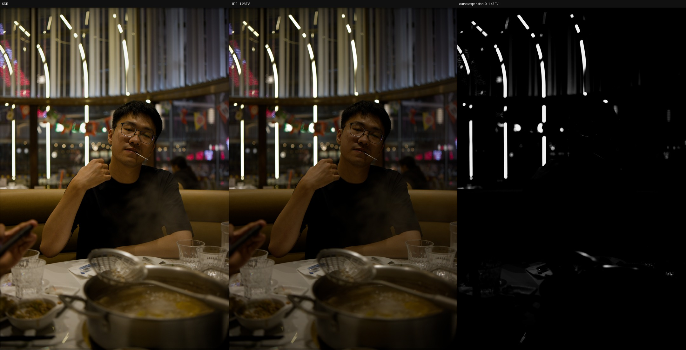
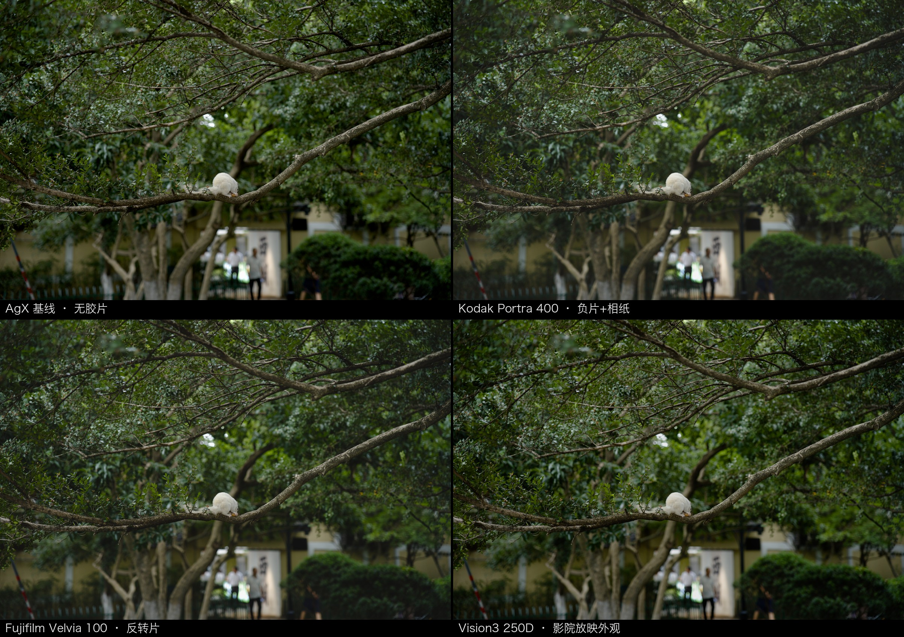
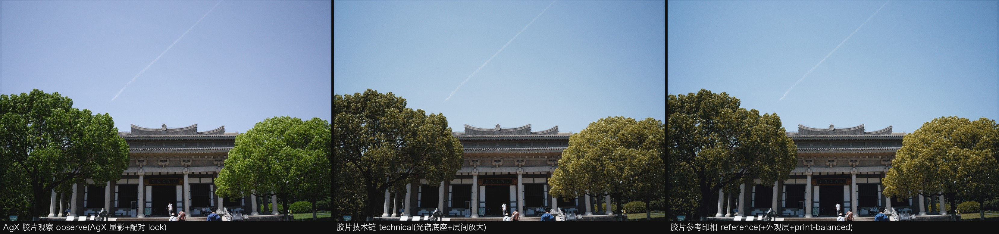
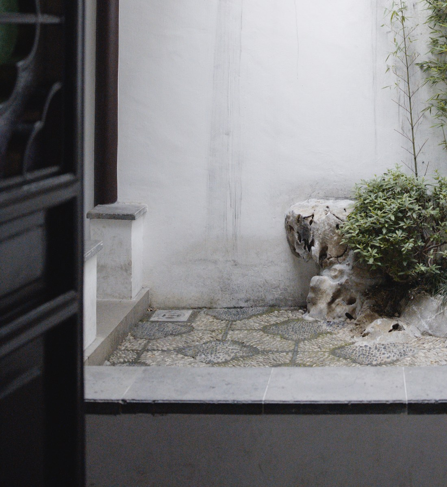
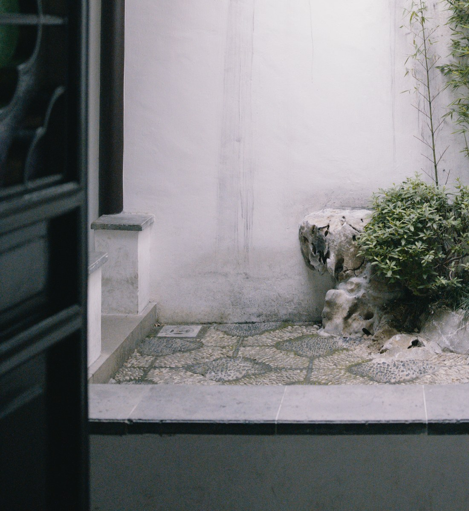
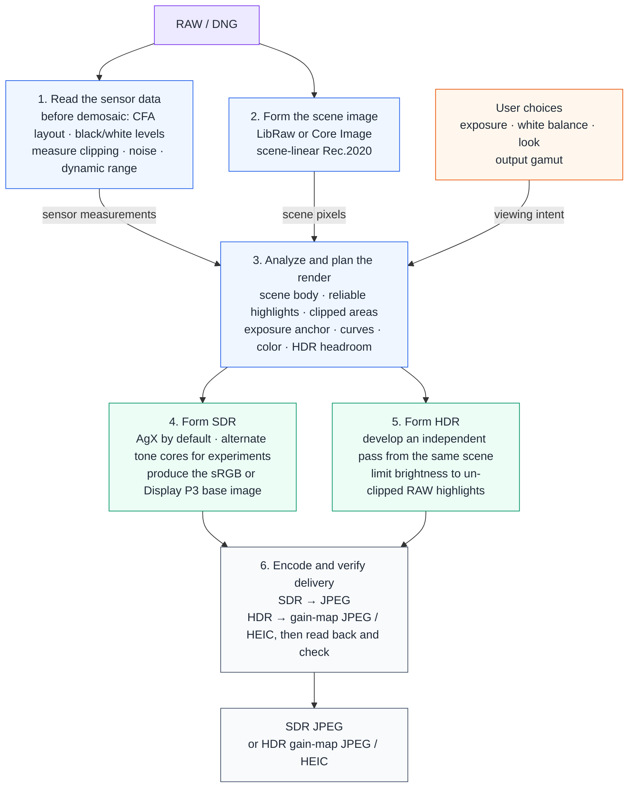

# AgXRAW

An open-source imaging workbench for making and studying SDR and HDR images from sensor data.

AgXRAW began with one practical question: how can I develop a RAW with AgX without opening a full
editor? Once that worked, the more interesting questions surfaced. How much highlight signal did
the sensor actually preserve? Which pixels came from reconstruction? How should one scene become
both SDR and HDR? Can film white balance, spectral response, and formation curves be studied
separately instead of baked into one filter?

AgXRAW gives those questions a measurable pipeline. It keeps sensor data from before demosaic,
forms a scene-linear Rec.2020 image with LibRaw or Core Image, combines measurements with explicit
image-making choices, then writes color-managed SDR or HDR and checks what was actually delivered.

It already works as a local RAW processor, but its broader value is as an imaging workbench.
Decoding, sensor analysis, display transforms, film observation, and delivery have explicit
boundaries. New decoders, tone cores, film models, and delivery formats can be compared against the
same RAW evidence and validation instead of rebuilding the whole pipeline.

[简体中文](README.zh-CN.md) · [License](LICENSE) · [Third-party notices](NOTICE.md)

**Documentation**:
[Editing tutorial](docs/EDITING_TUTORIAL.zh-CN.md) (a guided workflow from import to export, control by control; Chinese) ·
[Film tutorial](docs/FILM_TUTORIAL.zh-CN.md) (what every film slider and choice does, with samples; Chinese) ·
[User guide](docs/USER_GUIDE.md) (supported cameras, interface fields, export choices) ·
[Sensor support](docs/SENSOR_SUPPORT.zh-CN.md) (per-body data, degradation policy, LibRaw upgrades; Chinese) ·
[Full documentation index](docs/README.md) (architecture, plans with landing status, baselines)

## HDR in one frame



From left to right: ordinary SDR, an independently formed HDR rendition, and a map of the HDR
luminance expansion. In the map, black means no expansion; white means the full headroom supported
by the evidence in this RAW.

The additional brightness stays around lamps and reflections instead of lifting the entire frame.
HDR-capable devices display those highlights; an ordinary screen still receives a normal SDR JPEG.
If the RAW contains no reliable highlight information, AgXRAW does not invent HDR headroom.

## Film observation in one frame



One RAW, four observation positions: the AgX baseline (no film), Kodak Portra 400
(negative + paper), Fujifilm Velvia 100 (reversal), and Vision3 250D in its theatrical
quotation.

**Two modes, two semantics** (A13 correction — the previous text blended them into
one default film base). The default ``--film <stock>`` is **observe** mode: the film
declares what its observer sees — the WB Kelvin, the layer-separation prefeed, the
development curve — while colour is still formed by AgX; it does NOT run the paper
simulation. A stock's default look then adds two declarations that are explicitly
editorial, not measured: a separation-strength pairing and an AgX primaries pairing,
chosen by stock reputation — visible in the UI, freely adjustable, never overriding
a value you set yourself. **full** takeover mode (``--film-mode full``, experimental)
is what runs the factorised spectral chain — Stage A observer -> layer exposure ->
characteristic density -> B1 -> print timing -> paper development -> B2 -> grey-axis
neutralization -> optional reference-print appearance — with no monolithic, creative
or opaque LUT: the chain factorises into traceable B1/B2 interpolation assets (65^3
volumes solved offline from the same declared data). Inter-image amplification and
the reference recipes belong to full mode only. All twenty stocks and
five theatrical variants are listed in the [film tutorial](docs/FILM_TUTORIAL.zh-CN.md)
(Chinese); the technical base lives in the [architecture notes](docs/ARCHITECTURE.md).

## Three film interpretations in one frame



Since the appearance layer landed, a stock in full mode answers two separable
questions. **technical** is the spectral base plus the modelled inter-image
term — what the measured emulsion-and-paper system prints, with the grey scale
digitally neutralized. **reference** adds the declared reference-print
appearance on top: a per-stock palette (hue paths and colour density authored
as an Endura common base plus stock residuals — never a baked LUT), and the
print-balanced grey policy that anchors mid grey while letting the paper's own
crossover breathe at both ends. Every layer states its provenance — measured,
modelled, or editorial — and `technical` remains byte-frozen and reachable at
any time. A third mode, `custom`, exposes three bounded modifiers (richness,
colour density, neutral bias) centred on the recipe's own values. The GUI ships
with `reference` @ strength 1.0 as its factory default (calibrated once,
2026-08-12, from the owner's A/B verdicts and measured real-photo visibility);
`technical` is one click away and is the automatic fallback for stocks without
a recipe. The CLI/API default stays `technical` — scripted output is anchored
to the measured chain.

## The spectral print chain in one frame

| Digital neutralized (default) | Datasheet inter-layer crossover |
|---|---|
|  |  |

The experimental film-takeover mode (full) is no longer a per-channel-curve
heuristic: scene colour passes through a constrained observer inverse into
three emulsion exposures, through each layer's characteristic curve into
negative dye density, then through the FACTORIZED print chain — negative
density to paper-layer exposure (B1), print timing (τ), the paper's
development curves, and the viewing chain (B2). Print medium, timing
(fixed / retimed with film exposure / custom with a modelled colour head),
grey-scale neutralization, editorial developer recipes, Film Compression
and the analog optics (grain / halation / bloom) are all declarable states
of this one chain, and Ultra HDR runs it as "film print + scene HDR
extension" (the SDR base IS the film print; reliable scene highlights gain
smoothly above the print's reference white). Above is
something it renders that no grading filter can: the Verita 200D print chain's
measured inter-layer crossover — the carved door and stone steps in shadow turn
green-teal while the sunlit wall and pebbles sit still, at zero median luminance
difference. Left is the default digitally neutralized variant (grays stay
strictly neutral, `--film-neutralization bounded`); right is the datasheet
served verbatim.

## Features

- **Read the capture:** before demosaic, AgXRAW measures black and white levels, per-channel
  clipping, CFA geometry, noise, usable dynamic range, and reliable highlight headroom.
- **Choose the scene decoder:** LibRaw and Core Image / RAW 9 are independent choices, but both hand
  the rest of the system a scene-linear Rec.2020 image.
- **Experiment with image formation:** AgX is the default, alongside RAW-gated, luminance-only, and
  diagnostic tone cores. Exposure, white balance, highlight handling, scene transforms, lens
  filters, and film observation remain explicit choices.
- **Form SDR and HDR separately:** SDR targets sRGB or Display P3. HDR starts again from the same
  scene image and uses only the extra brightness supported by un-clipped RAW highlights.
- **Observe and reproduce:** the local GUI and CLI share the same controls; a diagnostic dashboard
  and CSV reports make measurements inspectable and comparisons repeatable. RAW files are never
  uploaded.
- **Deliver, then verify:** archive/share profiles control encoding without changing image
  formation. On macOS, HDR becomes an ISO 21496-1 gain-map JPEG or HEIC and is read back to verify
  the color profile, gain map, declared headroom, and pixel error.

## Quick start

**macOS on Apple Silicon** and Python 3.11 or newer are required — the
native kernel wheel is built and verified only on the build host's macOS
version (the produced wheel tags the host's platform, e.g.
``macosx_.._arm64``); earlier systems and Intel Macs are not claimed
because they are not tested. The pure-NumPy path (``DNGSCAN_FAST=0``)
carries no native requirement beyond Python + NumPy. The
tool is deeply integrated with Core Image / RAW 9 decoding, HDR gain-map
delivery and its read-back validation; macOS is the declared supported
platform — a stated boundary, not an untested default. The validated
rawpy/LibRaw dependency is built from its pinned source revision on first
install, so Git and the Xcode Command Line Tools are also required.

### GUI

The Python package and CLI keep the engine's historical name `dngscan`.

```bash
git clone https://github.com/Gen-416/AgXRAW.git
cd AgXRAW
python3 -m venv .venv
source .venv/bin/activate
pip install -r requirements.txt
python -m dngscan.gui
```

Open the localhost address printed in the terminal. A practical starting point is EV 0 with `AgX`,
`base` primaries, camera WB, and highlight reconstruction; adjust from there according to the
photograph.

The RAW field uses the browser's native file picker. The selected file is sent only to the localhost
AgXRAW service on the same computer and kept in a process-scoped temporary directory; the temporary
copy is removed when AgXRAW exits and is never sent to an external service.

### CLI

```bash
# Default AgX JPEG
python -m dngscan photo.dng --jpeg photo.jpg

# Highlight reconstruction and Display P3
python -m dngscan photo.dng --jpeg photo_p3.jpg \
  --highlight-mode reconstruct --output-gamut p3

# HDR gain-map JPEG (macOS, Display P3, AgX only)
python -m dngscan photo.dng --jpeg photo_hdr.jpg \
  --output-format ultrahdr --hdr-headroom 3

# RAW analysis dashboard and CSV
python -m dngscan photo.dng --jpeg photo.jpg --scan --csv photo.csv

# Compare the experimental RAW-gated tone core
python -m dngscan photo.dng --jpeg photo_gated.jpg --tone-core gated

# Use a film observation position
python -m dngscan photo.dng --jpeg photo_portra.jpg --film portra400
```

Run `python -m dngscan --help` for the complete option list.

### Optional C++ acceleration

NumPy is the reference implementation and works without a native extension. The optional pybind11
C++ kernel accelerates the AgX core and the shared SDR output finalizer (16-step Oklab gamut fit,
transfer, dither, and quantization); RAW analysis, render planning, and fallback policy remain in
Python.

```bash
pip install pybind11 cmake
tools/build_native.sh
```

## How it works

AgXRAW keeps measured sensor facts separate from viewing intent until they need to meet in the
render plan.



1. **Read the sensor data.** Before demosaic, AgXRAW records CFA clipping, per-channel full well,
   noise, and spatial position. Later stages can still distinguish measured highlights from pixels
   created by highlight reconstruction.
2. **Form the scene image.** LibRaw or Core Image decodes the RAW into scene-linear Rec.2020. The
   decoder determines how pixels are formed, not how their brightness and color are subsequently
   compressed.
3. **Bring measurement and intent together.** Analysis separates the scene body, reliable
   highlights, and clipped areas. Those measurements meet the chosen exposure, white balance, look,
   and output gamut in one render plan.
4. **Form SDR.** AgX is the default display transform; alternate tone cores provide controlled
   experiments and diagnostics. The result is an sRGB or Display P3 base image.
5. **Form HDR independently.** This branch starts from the same scene image instead of brightening
   the finished SDR, and uses only the highlight headroom supported by the RAW.
6. **Encode and check the result.** SDR becomes a regular JPEG. HDR packages the SDR and HDR images
   with an ISO 21496-1 gain map, then opens the file again to verify delivery.

## How AgXRAW differs

The main difference is not the number of controls. It is when the RAW evidence is discarded.

darktable's AgX module, like many display transforms, receives a decoded floating-point image.
AgXRAW carries pre-demosaic CFA evidence into the final display transform, so the curve still knows
which highlights are trustworthy and color processing can avoid regions that have clipped or been
reconstructed.

AgXRAW also keeps measurement separate from taste. Black and white levels, clipping, noise, dynamic
range, and the highlight tail belong to analysis. Exposure compensation, white balance, looks, and
LUTs remain explicit user choices. Automatic decisions describe the photograph; they do not choose
its appearance.

HDR is not a stronger version of SDR. The two renditions are formed independently from the same
scene-linear image and share only capture evidence and viewing intent. AgXRAW also does not treat
“the encoder returned no error” as proof of delivery: it reads the result back and verifies that the
SDR, HDR, and gain map are present as intended.

Those boundaries also leave room to grow. A new decoder can target the common scene contract; a new
tone core or film model can consume the same analysis; a new delivery format can encode finished
images without quietly changing their formation. Each extension remains comparable because the
measurements and validation stay visible.

AgXRAW does not currently manage a library or perform local retouching. That is a boundary of the
current product, not the full ambition of the project. Its larger potential is an open,
explainable imaging workbench: useful both for making photographs and for comparing algorithms,
testing standards, and developing new image-formation methods on the same captures.

## Technical documentation for developers

[Product architecture and domain model](docs/PRODUCT_ARCHITECTURE.md) (software layers, use cases, bounded contexts, and invariants) ·
[Architecture and technical details](docs/ARCHITECTURE.md) (the full pipeline and why each stage is built this way) ·
[Engineering notes](docs/ENGINEERING_NOTES.zh-CN.md) (problems, evidence and reasoning; Chinese) ·
[Design contract](docs/FILM_OBSERVATION_PLAN.zh-CN.md) (film observation contract and boundaries; Chinese) ·
[Film print rendering plan](docs/FILM_PRINT_RENDERING_PLAN.zh-CN.md) (full v2 design proposal: exposure state, printing, grain and halation; Chinese)

## License

AgXRAW is released under [GPL-3.0-or-later](LICENSE).
