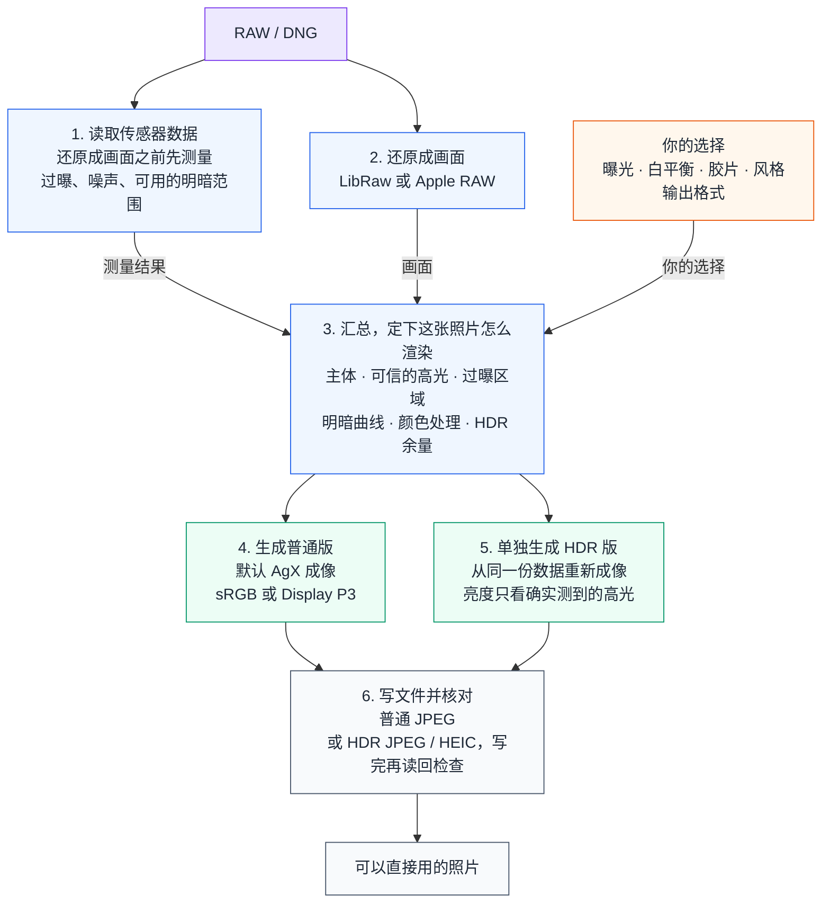

# AgXRAW

把 RAW 照片显影成忠实的 JPEG 和真正的 HDR 照片，并且告诉你每一步的依据。开源，本地运行，RAW 文件不会上传。

它最早只想解决一个很具体的问题：不打开一整套修图软件，也能用 AgX 把一张 RAW 显影好。做下去之后问题变大了：传感器到底保留了多少高光？靠算法补出来的高光还能信多少？同一份数据怎样分别做出普通照片和 HDR 照片？胶片的色温、配色和明暗曲线，能不能拆开来一层层调，而不是揉成一个滤镜？AgXRAW 把这些问题放进了同一套可以测量、可以复现的流程里。

[English](README.md) · [许可证](LICENSE) · [第三方声明](NOTICE.md)

**教程与文档**：
[修图教程](docs/EDITING_TUTORIAL.zh-CN.md)（每个滑条做什么，配实拍对比）·
[胶片教程](docs/FILM_TUTORIAL.zh-CN.md)（每个胶片选项是什么意思，配实拍对比）·
[HDR 教程](docs/HDR_TUTORIAL.zh-CN.md)（HDR 照片是什么，能亮多少，怎么导出）·
[使用说明](docs/USER_GUIDE.zh-CN.md)（支持的相机、界面上每个数字、导出选择）·
[机型支持](docs/SENSOR_SUPPORT.zh-CN.md) ·
[完整文档索引](docs/README.md)

## 它能做什么

### 把 RAW 显影成照片

默认使用 AgX、基于 RAW 分析的自动曝光和自适应影调。JPEG 自动编码在 **95–99** 范围内选择，SDR 优先 **4:2:2**，只有误差受限时才使用更小的 4:2:0；HDR JPEG 也可独立指定采样；HEIF 可用 x265 的 10-bit / 4:4:4 和独立质量刻度，逐文件验证增益图回读。手动调整曝光会切换到手动模式，`--ev 0` 可保留固定曝光锚点。[六张样张、180 个全尺寸编码的实测对照](docs/DELIVERY_QUALITY_STUDY.zh-CN.md)。

默认用 AgX 成像：亮的地方自然地过渡到白，颜色不会又亮又假。工具先分析这张照片——主体多亮、最暗最亮到哪里、哪里过曝了——自动定好一条明暗曲线，通常直接导出就是一张可用的照片。需要动手时，按"范围 → 亮度 → 色彩补偿"的顺序，每个滑条只管一件事。

| 默认，什么都不调 | 放出更深的暗部，再整体提亮一档 |
|---|---|
|  |  |

每个滑条到底改了画面的哪一部分、什么时候不起作用，见[修图教程](docs/EDITING_TUTORIAL.zh-CN.md)。

### 告诉你这张 RAW 里到底有什么

打开一张 RAW，工具先给出测量结果：有多少像素过曝了、过曝的是哪个颜色通道、照片里确实测到的最亮高光在第几档、做成 HDR 能多亮几档。预览上可以打开"RAW 过曝标记"，直接看到传感器上哪些位置已经顶到了上限。它记录的是拍摄时的事实，不随你怎么调而变，所以能帮你分清"RAW 里已经没有信息了"和"只是渲染得太亮"。

每个数字的含义见[使用说明](docs/USER_GUIDE.zh-CN.md)第三节。

### 导出真正的 HDR 照片

下面三张是 AgXRAW 导出的**真 HDR 文件**，不是示意图。如果你的屏幕和浏览器支持 HDR（Mac 或 iPhone 上的 Safari、Chrome，Android 15 以上的 Chrome），灯和高光会明显比这个页面的白色背景更亮。看不出区别也没关系：不支持 HDR 的地方会自动显示文件里的普通版，这正是这种格式的好处。

| 手办与灯 · 比页面的白亮 2.35 档 | 舞台灯 · 亮 1.35 档 |
|---|---|
|  |  |

| 餐厅灯管 · 亮 1.45 档 |
|---|
|  |

HDR 版不是把普通照片拉亮，而是从同一份数据单独成像；它能亮多少，只看传感器确实测到了多亮的高光，测不到就明确报错，不会硬造。每个文件写完都会重新打开核对一遍。细节见 [HDR 教程](docs/HDR_TUTORIAL.zh-CN.md)。

### 胶片模拟：二十款胶片，两种方式

这不是一键滤镜。选一款胶片，等于同时设好几层独立的参数：标定色温、这款胶片区分颜色的方式、整卷固定的明暗曲线、色彩的浓淡。每一层都看得见、改得了。

| 不用胶片 | Portra 400 | Velvia 100 |
|---|---|---|
|  |  |  |

有两种模拟方式可选。**风格模式**（默认）只借用胶片的配色和明暗，最后仍由 AgX 成像，稳定、克制。**冲印模式**把整个过程按这款胶片和相纸的数据算一遍：感光、冲洗、印相，可调的环节也多得多——放大机色头、印相曝光、冲洗方式、层间效应、颗粒与光晕。下图是同一张照片在三款胶片上的对比，最右一列把冲印模式里两个口味项开到了上限。


每个选项是什么意思、有什么区别，见[胶片教程](docs/FILM_TUTORIAL.zh-CN.md)。

### 两种 RAW 解码器

默认的 LibRaw 覆盖市面上绝大多数相机；在 Mac 上还可以换成系统自带的 Apple RAW，包括它最新一代的解码模型。两者之后走的是同一套分析和成像，可以在同一张照片上直接比较。


支持哪些相机、太新的机型怎么处理，见[使用说明](docs/USER_GUIDE.zh-CN.md)第一节和[机型支持](docs/SENSOR_SUPPORT.zh-CN.md)。

### 图形界面和命令行是同一套设置

本地网页界面和命令行共用一套参数，界面上能调的，命令行都能写成一行复现。命令行加 `--report` 打印完整的分析报告，加 `--scan` / `--csv` 输出诊断图和数据表。

## 快速开始

需要 **Apple Silicon 的 Mac** 和 Python 3.11 或更新版本。Apple RAW 解码和 HDR 导出用的是 macOS 系统组件，所以支持的平台限定为 macOS；更早的系统和 Intel Mac 没有测试过。项目把验证过的 rawpy / LibRaw 版本锁为依赖，首次安装会在本机编译，因此还需要 Git 和 Xcode Command Line Tools。

Python 包和命令行沿用引擎原来的名字 `dngscan`。

### 图形界面

```bash
git clone https://github.com/Gen-416/AgXRAW.git
cd AgXRAW
python3 -m venv .venv
source .venv/bin/activate
pip install -r requirements.txt
python -m dngscan.gui
```

在浏览器里打开终端显示的本机地址（localhost）即可。选中的 RAW 只会传给同一台电脑上的本地服务，保存在临时目录里，退出后自动清理，不会发送到任何外部服务。

### 命令行

```bash
# 默认 AgX 出片
python -m dngscan photo.dng --jpeg photo.jpg

# 同时打印完整的分析报告
python -m dngscan photo.dng --jpeg photo.jpg --report

# 高光重建 + Display P3 广色域
python -m dngscan photo.dng --jpeg photo_p3.jpg \
  --highlight-mode reconstruct --output-gamut p3

# HDR 照片（需要 macOS）
python -m dngscan photo.dng --jpeg photo_hdr.jpg \
  --output-format ultrahdr --hdr-headroom 3

# 诊断图和数据表
python -m dngscan photo.dng --jpeg photo.jpg --scan --csv photo.csv

# 选一款胶片（默认风格模式）
python -m dngscan photo.dng --jpeg photo_portra.jpg --film portra400

# 冲印模式：拍摄时过曝一档，印相曝光跟着补偿
python -m dngscan photo.dng --jpeg photo_portra_full.jpg --film portra400 \
  --film-mode full --film-exposure 1 --film-print-timing retimed
```

完整参数见 `python -m dngscan --help`。

### 可选的原生加速（Rust）

不编译原生扩展也能正常使用，NumPy 实现是基准。可选的 Rust 内核（`rust/` 目录）会加速成像、HDR、胶片和校验等计算量大的环节；回归测试按算子的数值契约验证逐位一致或限定误差，不能把固定样本的逐位一致推广到所有 BLAS 平台和输入尺寸。24 MP 的照片导出一张普通 JPEG 约 7 秒，HDR 约 10 秒，冲印模式带颗粒与光晕约 15 秒。

```bash
# Rust 工具链：https://rustup.rs
pip install setuptools-rust
tools/build_native.sh
```

`pip install .` 也会编译内核；没有 Rust 工具链（或设置 `DNGSCAN_BUILD_NATIVE=OFF`）时安装纯 Python 包。

## 工作原理

AgXRAW 把"传感器测到了什么"和"你想要什么样的照片"分开处理，到出图时再合到一起。



1. **读取传感器数据。**在把 RAW 还原成画面之前，先记录每个颜色通道在哪里过曝、传感器的上限在哪里，并估算噪声水平。这样到后面处理高光时，仍然分得清哪些像素是传感器真实测到的，哪些是算法补出来的。
2. **还原成画面。**LibRaw 或 Apple RAW 把 RAW 解成一张线性的广色域画面。解码器只决定 RAW 怎样变成像素；之后亮度怎样压、颜色怎样处理，由后面的步骤决定。
3. **把测量和选择合到一起。**分析把主体、可信的高光和过曝区域分开，再和你选的曝光、白平衡、胶片、风格、输出格式一起，定下这张照片怎么渲染。
4. **生成普通版。**默认由 AgX 成像，也可以换别的影调映射方式做对照。
5. **单独生成 HDR 版。**从同一份数据重新成像，不是把做好的普通版拉亮；能多亮，只看 RAW 里确实测到了多亮的高光。
6. **写文件并核对。**普通版直接写成 JPEG；HDR 把两版画面装进一个文件，写完之后重新打开，确认里面的画面和亮度都符合预期。

## 和常见的 RAW 处理流程有什么不同

**传感器数据一直参与到最后。**多数显影软件的影调模块拿到的是已经还原好的画面，不再知道哪些像素过曝过。AgXRAW 一直保留还原之前的传感器数据，所以明暗曲线知道哪些高光可信，颜色处理也会对过曝的和补出来的区域保守一些。

**分析给出默认值，手动选择保留。**程序根据黑白电平、过曝、噪声和场景分布设置默认曝光与影调；白平衡默认使用拍摄记录，胶片和风格默认关闭。自动曝光受高光保护约束，手动调整可以覆盖建议。

**HDR 不是更亮的普通照片。**两版画面都从同一份数据出发，各自成像；文件写完之后还会重新打开核对。

**各个环节可以单独替换。**换一种解码器，后面的分析和成像不用重写；新的影调映射方式或胶片模型可以复用同一份分析；新的输出格式只接收已经成像的画面。所以新方法可以和旧方法放在同一张照片上比较。

AgXRAW 目前不管理图库，也不做局部调整。它既可以直接用来出片，也可以当作一个开放的、每一步都说得清依据的成像实验台。

## 面向开发者的技术文档

[产品架构与领域模型](docs/PRODUCT_ARCHITECTURE.zh-CN.md) ·
[架构与技术细节](docs/ARCHITECTURE.zh-CN.md)（完整流程和每个环节的设计理由）·
[工程决策记录](docs/ENGINEERING_NOTES.zh-CN.md) ·
[胶片风格模式的设计](docs/FILM_OBSERVATION_PLAN.zh-CN.md) ·
[胶片冲印模式的设计与实施记录](docs/FILM_PRINT_RENDERING_PLAN.zh-CN.md) ·
[HDR 实施计划](docs/HDR_AGX_V2_IMPLEMENTATION_PLAN.zh-CN.md)

## 许可证

AgXRAW 以 [GPL-3.0-or-later](LICENSE) 发布。
