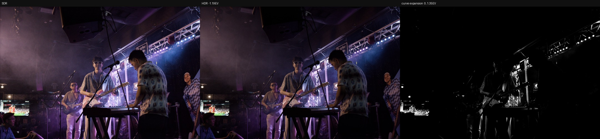
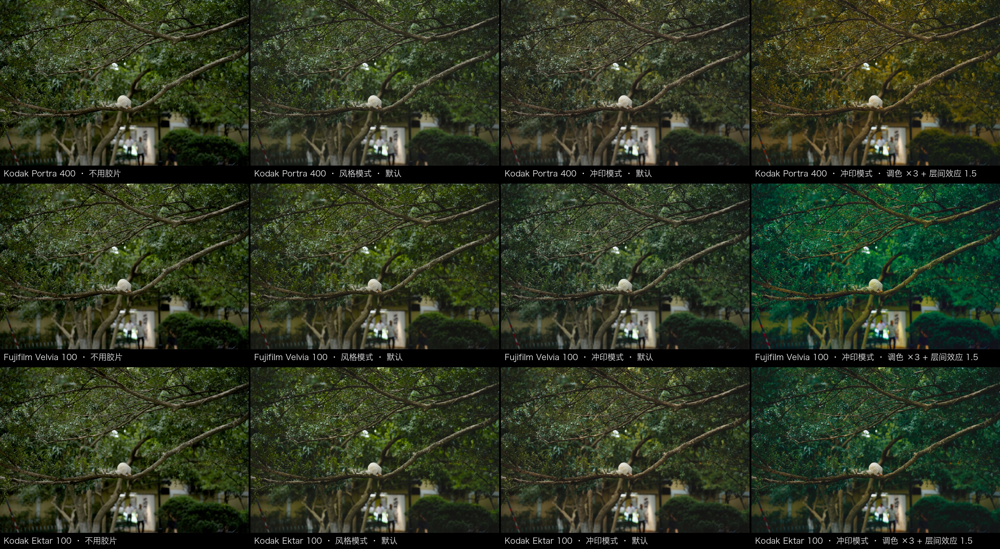
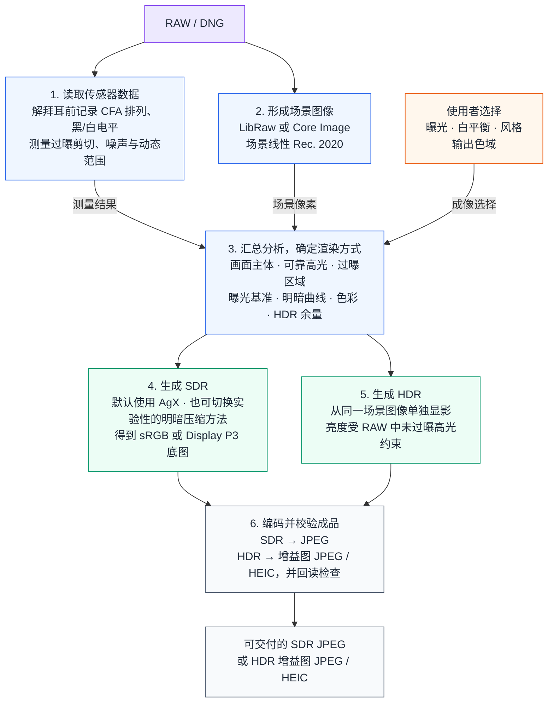

# AgXRAW

一套从传感器数据出发、用于生成和研究 SDR / HDR 影像的开源数字成像工作台。

它最早只是想解决一个很具体的问题：怎样不打开完整编辑器，也能用 AgX 把一张 RAW
显影好。真正做下去，问题很快变大了：传感器到底保留了多少高光？高光重建补出的像素
还能信多少？同一份场景数据怎样分别生成 SDR 和 HDR？胶片的白平衡、感色特性和显影
曲线，能不能拆开研究，而不是揉成一层滤镜？

AgXRAW 把这些问题放进同一套可测量的流程里。它在解拜耳前保存传感器数据，用
LibRaw 或 Core Image 形成场景线性 Rec. 2020 图像，再把测量结果与使用者的成像选择
汇总成渲染方案，最后生成经过颜色管理的 SDR 或 HDR 文件，并检查实际交付结果。

它现在可以直接当作本地 RAW 显影器使用，也已经长成了一座小型成像实验台。解码、
传感器分析、显示变换、胶片观察和交付编码各有边界；新的解码器、明暗压缩方法、胶片模型
或交付格式，可以在同一份 RAW 数据和同一套验证方法上比较，不必重新发明整条管线。

[English](README.md) · [许可证](LICENSE) · [第三方声明](NOTICE.md)

**文档**：
[修图教程](docs/EDITING_TUTORIAL.zh-CN.md)（从导入到导出的完整流程，逐个控件讲用法）·
[胶片教程](docs/FILM_TUTORIAL.zh-CN.md)（每个胶片滑条和选择到底有什么用，配样张）·
[使用说明](docs/USER_GUIDE.zh-CN.md)（支持的相机、界面字段、导出选择）·
[机型支持](docs/SENSOR_SUPPORT.zh-CN.md)（传感器数据、降级策略与 LibRaw 升级）·
[完整文档索引](docs/README.md)（架构、计划书落地状态、基线记录）

## 一张图看 HDR


从左到右：普通 SDR、单独生成的 HDR（按自身实际余量压回 SDR 屏幕可见的范围）、
HDR 相对参考白的亮度分配图——越亮表示该处用到的余量越多，黑表示没有增加。

HDR 不是把 SDR 成片放大。同一份 scene-linear Rec.2020 在显示形成之前分成两条独立
的 DRT：SDR AgX 与 HDR AgX 共享拍摄曝光意图和 RAW 分析，但 HDR 自己持有 tone
curve、色彩几何和扩展 P3 投影，不要求任何像素与 SDR 一致。它能用多少余量由三件
事的最小值决定：**RAW 里可靠的高光尾部**（经剪切证据筛过，不是白点也不是重建
高光）、**显示容量**（默认 +3 EV 上限）、**曲线本身**（K 以上单调 Hermite 肩部，
逐段 C1，白端零导数）。这张 fp 样张的可靠尾部在中灰之上 +3.94 EV，挣得 1.47 EV
余量；写入文件的 gain map 回读为 1.447 EV，误差 0。RAW 里没有可靠高光时余量就是
0，导出会明确失败，而不是伪造。

亮度与颜色分开授权。**亮度**由原生 HDR 曲线单独决定，是唯一的 Y 权威；**颜色**
的自由度 ρ 只在"参考白 AgX 色度路径"和"扩展白原生路径"之间混合，两条路径先对齐
到同一 Y，再由逐像素 CFA 剪切掩码从不可信通道撤回原生路径——被剪切的光源越接近
内容峰值，色度权威收敛得越彻底（2026-08 起逐像素亮度/色度置信度分开）。下面舞台帧
的 A/B 就是这项规则看得见的地方：灯具高光在 HDR 里保持中性而不是发色，
而 SDR 底图不受影响。



交付用 Apple ISO 21496-1 gain-map 封装（JPEG 或 HEIC，macOS/Core Image 后端）。
每个文件写完都会重新展开 HDR 像素，核对 P3 profile、辅助图、声明余量、SDR 底图
码值误差与 HDR 色品误差，任一门禁不过就不保留文件；不认识 gain map 的查看器优雅
退化为 SDR 底图。胶片接管模式下 HDR 以"胶片印相 + scene HDR 扩展"参与：印相是
SDR 底图，参考白之上由场景高光增益补上——不声称物理胶片 HDR。三个 latitude
旋钮（ρ 基准、白点余量、肩起点）留给用户，默认即数学口径。技术细节见
[架构文档](docs/ARCHITECTURE.zh-CN.md)与
[HDR 实施计划](docs/HDR_AGX_V2_IMPLEMENTATION_PLAN.zh-CN.md)。

## 一张图看观察与接管



同一张 RAW（白松鼠公园，`--wb 5500k --highlight-mode reconstruct`），三卷胶片，四列。
这四列之间的差距是整个胶片链最核心的一件事：**谁在显影**。

- **AgX 基线**：无胶片，AgX 直接显影。
- **观察（observe，默认）**：`--film portra400`。胶片只声明"观察者看见了什么"——
  标定色温 5500K、感色层分离前馈、整卷固定的特性曲线，外加一组明确标注为编辑
  取向的风格配对（前馈强度倍率与 AgX 原色几何，界面可见可改）。颜色仍由 AgX
  显影，**不经过**相纸。这是验证最充分、也最克制的路径：对基线的平均 ΔE
  5.6 / 6.4 / 5.8（Portra / Velvia / Ektar），差别住在树荫的绿和暗部密度里。
- **接管（full，默认）**：`--film portra400 --film-mode full`。颜色的形成本身被
  换成因式分解的光谱链：Stage A 观察者 → 三层乳剂曝光 → 特性密度 → B1 →
  印相 timing → 相纸显影 → B2 观看 → 灰阶中性化 → 参考印相外观配方（默认 @1.0）。
  默认状态按数据手册标定，所以同样克制：与观察相比 ΔE 2.8 / 4.0 / 2.6，
  可见像素 5% / 30% / 16%，Velvia 的绿系色相转了约 8°。
- **接管 · 配方 ×3 + 层间 β 1.5**：同一条接管链，把链上两个明确标注为编辑取向的层
  拉到数学安全域上限：`--film-mode full --film-neutralization native
  --film-appearance reference --film-appearance-strength 3 --film-interimage custom
  --film-interimage-beta 1.5 --film-grain 0.5 --film-halation 0.4 --film-bloom 0.3`。
  对基线 ΔE 8.3 / 14.2 / 10.2：Portra 走向琥珀暖调，Velvia 走向深绿密度，Ektar
  介于两者——这才是接管链能走到的地方。

差距从哪里来：观察模式里胶片层只改变"进入 AgX 的场景"（白平衡、分离、曲线），
显影者始终是 AgX，它的收敛规则决定了高光怎么褪白、饱和色怎么收；接管模式里
乳剂分层曝光、染料密度、相纸再显影都是链自己算出来的，色相路径、暗部的层间
漂移和印相密度不再受 AgX 约束。默认值把这条链钉在数据手册的标定态——它不是
"胶片味"的上限，而是测量底座；外观配方与层间放大是链上明确标注为编辑取向的
两层，量程由数学安全域给出（无折叠、灰轴不动），要多重由你决定，GUI 与 CLI
都露出这两个旋钮。链没有单体、创意或不透明的 LUT：B1/B2 是同一声明数据离线
求解的可追溯插值资产。二十款胶卷与五款影院变体的完整清单见
[胶片教程](docs/FILM_TUTORIAL.zh-CN.md)，技术底座见
[架构文档](docs/ARCHITECTURE.zh-CN.md)。

## 一张图看三种胶片解释


外观层落地后，full 模式下一卷胶片回答两个可分离的问题。**technical（技术链）**
是光谱底座加 modelled 层间放大——公开光谱数据（乳剂感度、染料密度、相纸、光源）
约束下的三刺激重建，加声明的 modelled 层间项，关闭编辑性外观，灰阶数字中性。它不是
"实测这张印相"的宣称：报告带着实际运行的 Stage A 模型及其 held-out 残差。
**reference（参考印相）**在其上叠加声明的参考印相外观：按卷 author 的 palette
（hue 路径与色密度，以 Endura 公共基调 + 每卷 residual 表达，从不是烘焙 LUT），
以及 print-balanced 灰阶策略——锚定中灰、让相纸自己的两端 crossover 呼吸。每一层
都声明来源（measured / modelled / editorial），`technical` 始终字节冻结、随时可回。
第三档 `custom` 暴露三个以 recipe 自身为中心的有界修饰（颜色丰度/色密度/灰阶
偏色）。GUI 出厂默认为 `reference` @ 强度 1.0（2026-08-12 一次性校准；依据
A/B 判词与真实照片可见性实测），`technical` 一键可回、无配方卷自动回退；
CLI/API 默认保持 `technical`（脚本口径以测量链为基准）。

## 一张图看光谱印相链

| 数字中性化（默认） | 数据手册层间漂移 |
|---|---|
|  |  |

胶片接管模式（full）不再是"逐通道曲线"的启发式：场景颜色经过该卷的 Stage A——
held-out 交叉验证选出的色度场修正 LUT，或在场没有胜出时的受约束 3×3 观察者——
折算为三层乳剂曝光，过各层特性曲线进入**因式分解的印相链**——负片密度 → 相纸层
曝光（B1）→ 印相 timing（τ）→ 相纸显影曲线 → 观看链（B2）。印相介质、印相 timing
（固定 / 随胶片曝光重定时 / 自定义色头+印相曝光；重定时对全部负片可用，反转片没有
印相环节一律固定）、灰阶中性化、编辑显影配方、Film Compression 与模拟光学
（颗粒/halation/bloom）都是这条链上可声明的真实状态；链的光源假设固定为 D55——实测
表明经白平衡后钨丝与高显色 LED 场景和日光同级，所以不设光源档。Ultra HDR 下它以
"胶片印相 + scene HDR 扩展"参与（SDR 底图=胶片印相，参考白之上按场景高光平滑增益）。
上图是它能渲染而调色滤镜渲染不出的东西——Verita 200D
印相链按数据手册实测的**层间漂移**（crossover）：雕花木门与石阶的阴影转出绿青，
白墙与受光的卵石地纹丝不动；全图亮度差中位数为 0。左边是数字中性化变体（灰阶
严格保持中性，`--film-neutralization technical-neutral`，CLI 默认；GUI 默认"跟随
胶片解释"，由所选解释决定灰阶策略），右边是数据手册原样（`native`）。

## 功能

- **读懂拍摄数据**：在解拜耳前测量黑电平、白电平、各颜色通道的过曝剪切和彩色滤光片
  阵列（CFA）排列，并据此估算噪声、可用动态范围和可靠的高光余量。
- **选择场景解码器**：LibRaw 与 Core Image / RAW 9 是两种独立选择，但都会向后续步骤
  交付场景线性 Rec. 2020 图像。
- **试验成像方法**：AgX 是默认选择，同时保留 RAW 门控、仅亮度和固定曲线等实验或诊断
  方法。曝光、白平衡、高光处理、场景变换、镜前滤镜和胶片观察都可以明确选择。
- **分别生成 SDR 与 HDR**：SDR 输出到 sRGB 或 Display P3；HDR 则从同一份场景图像
  重新显影，只使用 RAW 中未过曝高光真正支持的额外亮度。
- **观察并复现实验**：本地图形界面和命令行使用同一套设置，图形界面覆盖命令行全部
  可调项（报告/诊断输出除外）。图形界面的"RAW 满阱"开关
  把 RAW 里达到满阱 97% 以上的像素（色度退让区，未必已溢出）按 CFA 通道标在预览上，并列出全尺寸硬剪切百分比；命令行默认只打印写出的文件，完整分析
  报告按需用 `--report` 打印（`--scan` / `--csv` 诊断运行自动附带），诊断图与 CSV 让
  测量结果可查、对照过程可复现；RAW 文件不会上传。
- **交付后再验证**：`archive` / `share` 档只改变编码，不改变成像。在 macOS 上，HDR
  可写成符合 ISO 21496-1 的增益图 JPEG 或 HEIC，随后回读检查颜色配置文件、增益图、
  文件声明的 HDR 余量和像素误差。

## 快速开始

需要 **Apple Silicon 的 macOS** 与 Python 3.11 或更新版本——原生内核 wheel
只在构建机的 macOS 版本上构建与验证（产物按构建机平台打标签,如
``macosx_.._arm64``）;更早的系统与 Intel Mac 未经测试,不作支持声明。纯
NumPy 路径（``DNGSCAN_FAST=0``）除 Python + NumPy 外无原生要求。工具与 Core Image /
RAW 9 解码器、HDR 增益图交付及其回读校验深度集成，支持平台限定为 macOS——这是声明的
边界，不是未测试的默认。项目已把验证过的 rawpy/LibRaw 源码版本锁为直接依赖，首次安装
会进行本机构建，因此还需要 Git 与 Xcode Command Line Tools。

### 图形界面

Python 包与命令行沿用引擎的历史名 `dngscan`。

```bash
git clone https://github.com/Gen-416/AgXRAW.git
cd AgXRAW
python3 -m venv .venv
source .venv/bin/activate
pip install -r requirements.txt
python -m dngscan.gui
```

在浏览器中打开终端显示的本机地址（localhost）即可。可以先用 `EV 0`、`AgX`、`base` 原色、
`camera` 白平衡和 `reconstruct` 高光处理，再根据照片本身调整。

预览卡上的"RAW 满阱"开关把 RAW 里达到满阱 97% 以上的像素（渲染里色度退让生效的区域，未必已经溢出）按通道标在预览图上，旁边另列全尺寸的硬剪切百分比——只有这个数字才证明信息丢失（红/绿/蓝＝该通道
溢出，白＝三通道全溢出），旁边显示过曝像素占比。它来自解码证据，与白平衡无关，也不随
EV 滑条变化——用它判断该压 EV 还是收肩部。Core Image 解码没有逐像素 CFA 证据，此时
开关置灰并注明原因；需要特定环境或资产的选项都遵循这一规则。图形界面只出图，不显示
分析报告。

顶部的 RAW 入口使用浏览器原生文件选择器。选中的文件只会传给同一台电脑上的 localhost
服务，并保存在进程级临时目录中；退出 AgXRAW 后临时副本会自动清理，不会发送到外部服务。

### 命令行

```bash
# 默认 AgX JPEG（只打印写出的文件）
python -m dngscan photo.dng --jpeg photo.jpg

# 同时打印完整分析报告（证据、曲线端点、色彩矩阵健康度、Stage A 残差等）
python -m dngscan photo.dng --jpeg photo.jpg --report

# 高光重建 + Display P3
python -m dngscan photo.dng --jpeg photo_p3.jpg \
  --highlight-mode reconstruct --output-gamut p3

# HDR 增益图 JPEG（macOS、Display P3、仅 AgX）
python -m dngscan photo.dng --jpeg photo_hdr.jpg \
  --output-format ultrahdr --hdr-headroom 3

# RAW 分析图和 CSV（诊断运行自动附带分析报告）
python -m dngscan photo.dng --jpeg photo.jpg --scan --csv photo.csv

# 对比 RAW 门控（保真）明暗压缩
python -m dngscan photo.dng --jpeg photo_gated.jpg --tone-core gated

# 使用胶片观察位置（默认 observe：胶片声明观察者，AgX 显影）
python -m dngscan photo.dng --jpeg photo_portra.jpg --film portra400

# 胶片显影链整体接管，印相随胶片曝光重定时
python -m dngscan photo.dng --jpeg photo_portra_full.jpg --film portra400 \
  --film-mode full --film-exposure 1 --film-print-timing retimed
```

完整参数见 `python -m dngscan --help`。

### 可选的 C++ 加速

NumPy 是参考实现，不编译原生扩展也可以正常使用。可选的 pybind11 C++ 内核加速 AgX
核心与共享的 SDR 输出终段（16 轮 Oklab gamut fit、transfer、dither、量化）；
RAW 分析、渲染方案和出错时的回退处理仍由 Python 负责。

```bash
pip install pybind11 cmake
tools/build_native.sh
```

## 工作原理

AgXRAW 会先把传感器测到的数据与使用者主动选择的设置分开处理，到生成图片时再汇总成
一份渲染方案。



1. **读取传感器数据。** 解拜耳之前，AgXRAW 会记录彩色滤光片阵列各通道发生过曝剪切的位置
   和满阱容量，并估算噪声水平。后面处理高光时，仍能分清哪些像素来自传感器，哪些像素
   是高光重建补出来的。
2. **形成场景图像。** LibRaw 或 Core Image 将 RAW 解码为场景线性 Rec. 2020 图像。
   解码器只决定 RAW 怎样变成像素；之后怎样压缩亮度、怎样处理颜色，由后面的步骤决定。
3. **把测量与选择汇总起来。** 分析会把画面主体、可靠高光和过曝区域分开，再与使用者
   选择的曝光、白平衡、风格和输出色域一起，确定这张照片的渲染方式。
4. **生成 SDR。** 默认由 AgX 完成显示变换，也可以切换其他明暗压缩方法做对照和诊断；
   结果是一张 sRGB 或 Display P3 底图。
5. **单独生成 HDR。** 这一支从同一张场景图像重新显影，不会把完成的 SDR 硬拉亮；能用
   多少额外亮度，只看 RAW 里还保留了多少未过曝的高光。
6. **编码并检查成品。** SDR 直接写成普通 JPEG；HDR 则把两版图像装进带增益图的 JPEG
   或 HEIC，写完后重新打开，确认文件里的图像和 HDR 余量都符合预期。

这套流程按两条路线推进。**路线一**只从相机数据编译 AgX / HDR 的参数与色彩处理许可，
不逐机改写曲线：趾部由传感器信噪比给出的场景坐标决定，肩与白点来自可靠主体与高光
尾部，色度处理的许可来自 CFA 剪切证据，HDR 余量取内容、显示与曲线三者的最小值，并分别
带亮度与色度置信度。**路线二**是与相机无关、由公开光谱数据约束的虚拟胶片与印相链：
它承认同色异谱的限制，忠实翻译声明观察者的报告，而不是"某台相机拍某卷胶片"的复刻。

## 与常见 RAW 处理流程的区别

区别不在于少了多少按钮，而在于传感器数据从什么时候开始不再参与处理。

darktable 的 AgX 和许多显示变换模块接收的是解拜耳后的浮点图像；AgXRAW 则一直保留
解拜耳前的彩色滤光片阵列数据。这样，明暗曲线仍然知道哪些高光可信，颜色处理也能
降低对过曝剪切区域和重建区域的信任。

AgXRAW 还会把测量与审美分开。黑电平、白电平、过曝剪切、噪声、动态范围和高光范围交给
程序分析；曝光补偿、白平衡、风格和查找表（LUT）仍由使用者选择。自动分析只负责说明
照片里有什么，不替使用者决定照片应该是什么样子。

HDR 也不是更亮的 SDR。两版图像都从同一份场景线性图像出发，各自完成显影。文件写完后，
AgXRAW 还会重新打开成品，确认 SDR 底图、HDR 效果和增益图都符合预期。

这些边界也给项目留下了扩展空间。增加解码器时，只要交出约定好的场景图像，后面的分析
和成像就不用重写；新的明暗压缩方法或胶片模型可以复用同一份分析；新的交付格式只接收已经
形成的图像，不会反过来改变它们。测量与校验始终可见，因此新方法仍然能放在一起比较。

AgXRAW 目前不管理图库，也不做局部调整。这是现阶段产品的边界，不是项目想象力的边界。
它更大的潜力，是成为一套开放、可解释的数字成像工作台：既能直接用来出片，也能在同一
批照片上比较算法、验证标准，并继续发展新的成像方法。

## 面向开发者的技术文档

[产品架构与领域模型](docs/PRODUCT_ARCHITECTURE.zh-CN.md)（软件分层、用例、边界上下文与不变量）·
[架构与技术细节](docs/ARCHITECTURE.zh-CN.md)（完整管线与每个环节的设计理由）·
[工程决策记录](docs/ENGINEERING_NOTES.zh-CN.md)（问题、证据与解法的推理过程）·
[设计合同](docs/FILM_OBSERVATION_PLAN.zh-CN.md)（胶片观察的生产合同与计算边界）·
[胶片印相与模拟成像层计划](docs/FILM_PRINT_RENDERING_PLAN.zh-CN.md)（full v2 合同与实施记录：曝光状态、印相、颗粒与 halation；已落地）

## 许可证

AgXRAW 以 [GPL-3.0-or-later](LICENSE) 发布。
