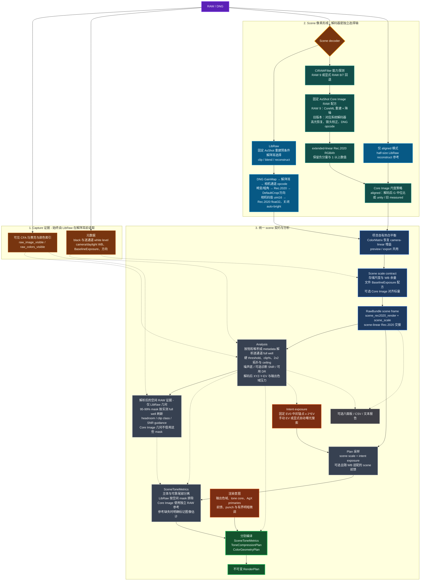
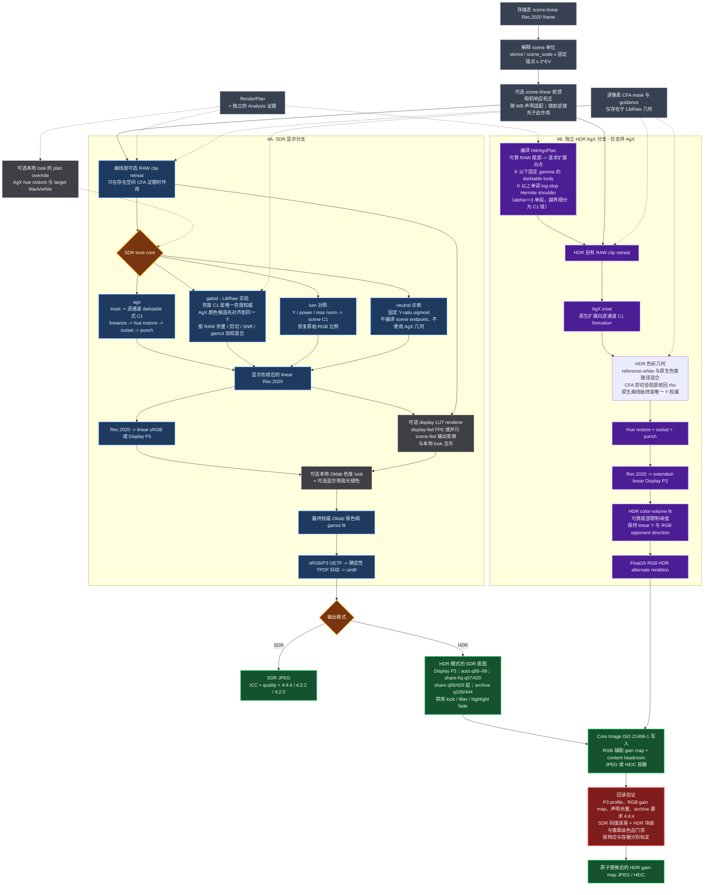
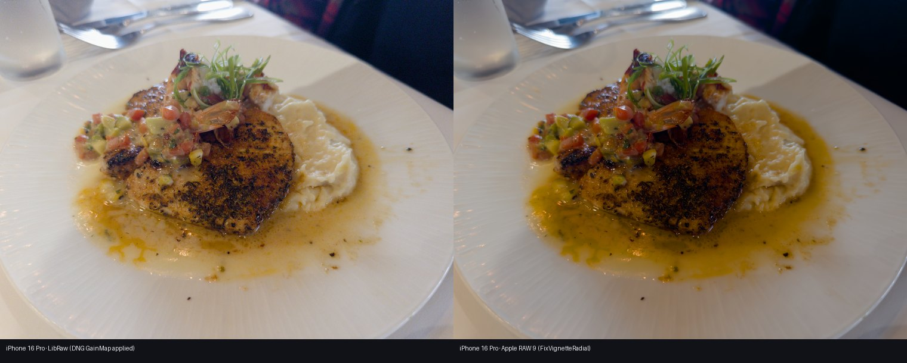
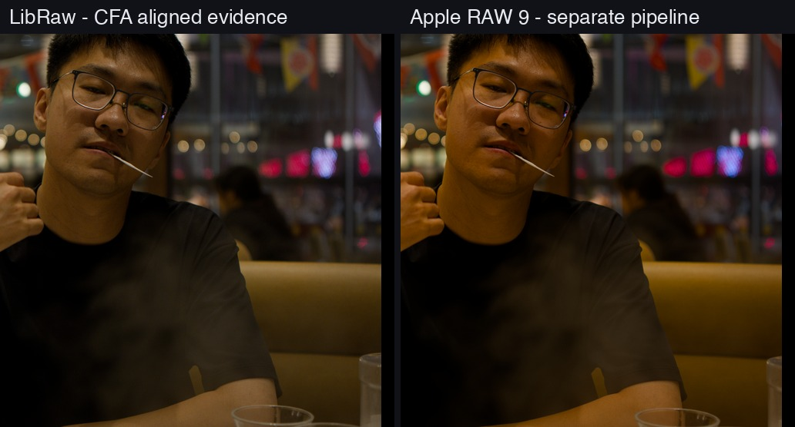
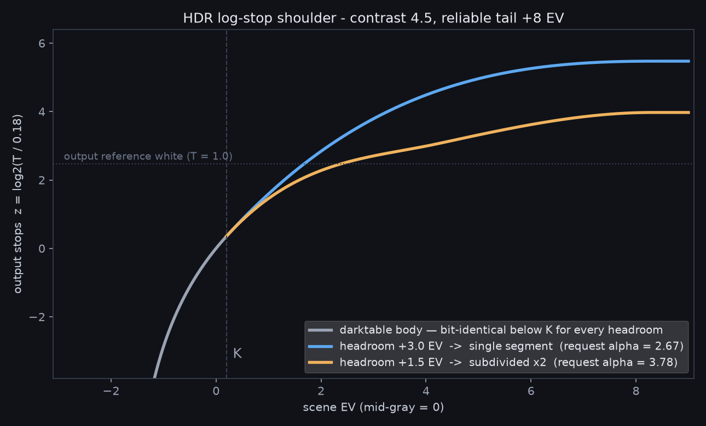
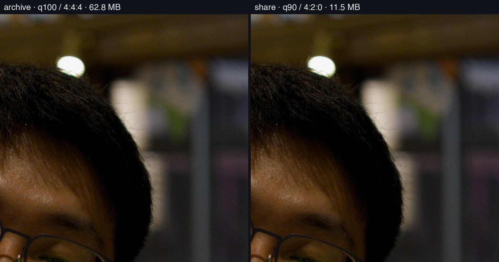
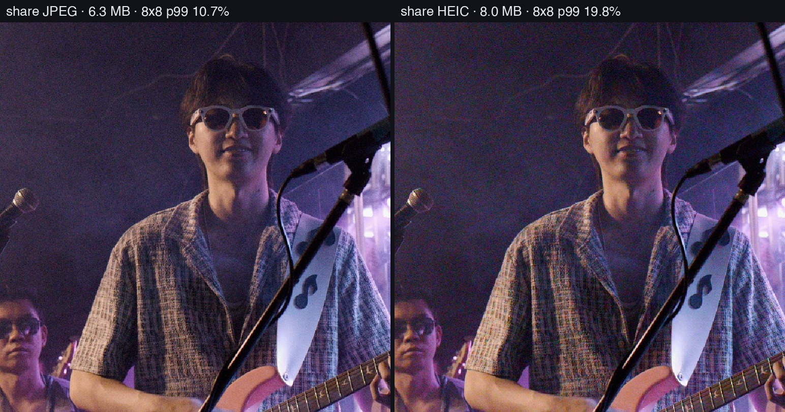
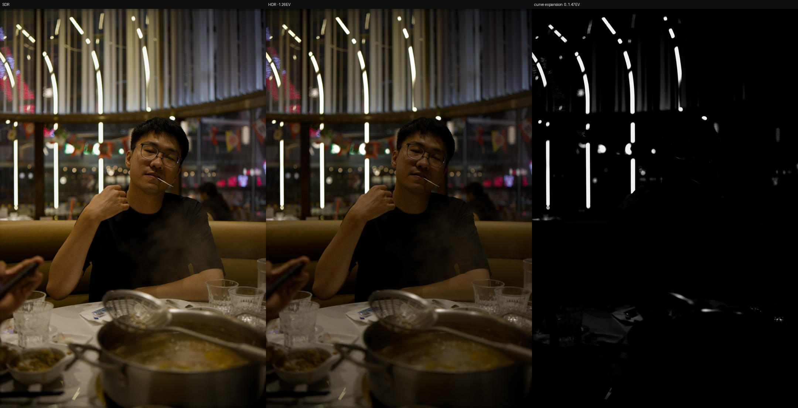
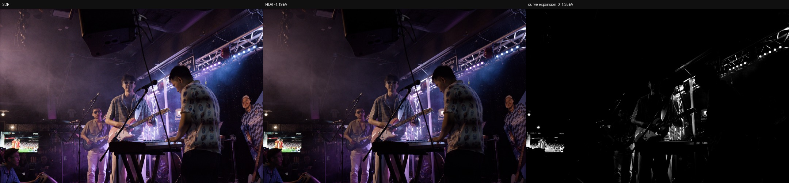
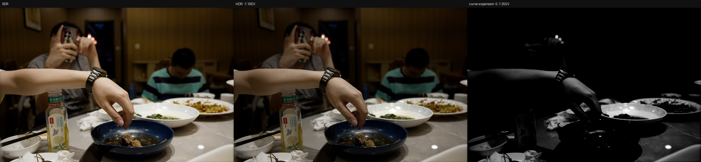

# dngscan 架构与技术细节

> 本文承载完整的管线展示与每个环节的设计理由，是 [README](../README.zh-CN.md) 的
> 技术下层。只想用起来看[使用说明](USER_GUIDE.zh-CN.md)；想看问题与解法的推理过程
> 看[工程决策记录](ENGINEERING_NOTES.zh-CN.md)；机型支持与
> 降级策略在 [SENSOR_SUPPORT.zh-CN.md](SENSOR_SUPPORT.zh-CN.md)。想先了解软件分层、
> 用例和领域模型，请看[产品架构与领域模型](PRODUCT_ARCHITECTURE.zh-CN.md)。本文中的
> Capture、Tone、Color geometry、Delivery 是像素处理阶段，不是表现层、应用层、领域层、
> 基础设施层四层软件架构。

先读[认识论基调](#认识论基调与声明纪律)——它解释这条管线的每个"为什么"共享的
那个前提。然后按四层往下读：

| 层 | 负责什么 | 不负责什么 |
|---|---|---|
| [Capture](#一层：capture--raw-证据从哪里来) | 从 RAW 读出可测量的事实 | 不决定观感 |
| [Tone](#二层：tone--曝光和曲线怎样确定) | 亮度关系与显示动态范围 | 不动色相与色度 |
| [Color geometry](#三层：color-geometry--agx-真正改变了什么) | 色相路径、色度压缩、向白过渡 | 不移动黑白端点 |
| [Delivery](#四层：delivery--sdr-与-hdr-交付) | 编码、容器、gain map | 不改变已成形的像素 |

[解码器](#解码器：libraw-与可选的-core-image--raw-9)是与这四层正交的一根轴：它决定 RAW
怎样变成 scene-linear 像素，不决定这些像素之后怎么被压缩。分层是刻意的：调整某个
环节时，至少能知道画面为什么发生变化。

## 认识论基调与声明纪律

管线将传感器证据与成像选择分开保存，使数值精度、数据出处与复现性都能逐步核对。

由此推出三条**声明纪律**，全库通用：

1. **公开出处**：每个常数要么有出版物/数据手册可引（mired 表、CIE 轨迹、
   文档化的相机元数据），要么有可复现的标定脚本；
   "不知道哪来的 3×3 矩阵"（Siragusano 讥为 *magically derived from somewhere*）
   不准入库。
2. **固定管线位置**：每个变换声明它作用在链条的哪一点（滤镜在前馈前、曝光在曲线前），位置本身是合同的一部分。
3. **可测量的残差**：每次拟合发布 rms/max 与钉界参数（`fit.pinned`=声明的域外
   外推）；残差是产品的一部分，不是要藏起来的尴尬。

相机光谱敏感度无法严格满足人的配色函数，所以校准仍有可测量残差，不能宣称精确复现人眼观感。

同一纪律的另一面是**降级也要声明**：机型缺标定数据时照常渲染，但报告与 GUI 标明
"暂无足够数据支撑准确运算，输出可能有无法预测的偏差"——声明的降级可用，静默的
降级等于隐藏白平衡（见 [SENSOR_SUPPORT.zh-CN.md](SENSOR_SUPPORT.zh-CN.md)）。

## 为什么单独做这条管线

darktable 的 scene-referred 管线很像一间信号处理实验室，理解每个模块怎样改变信号正是
其中的重要部分。dngscan 从里面取出与目标最相关的路径：LibRaw 解释、scene-linear
Rec.2020，以及 darktable GPL `agx` 模块里的曲线构造与色彩浓淡。AgX 本身来自 Troy
Sobotka，并在 Blender / EaryChow 生态里发展；这里主要通过 darktable 面向照片的实现来
继承它。

但如果这里只是把 darktable 的 AgX 模块单独拆出来，意义其实不大。dngscan 真正想做的，
是把 RAW 采集层的信息一直带到最终显示变换里。

darktable 的 AgX 模块工作在解拜耳、白平衡和曝光之后的浮点图像上。它能看到图像，却
看不到原始 CFA：不知道哪个通道真的在传感器上剪切了，也不知道一块平滑高光究竟来自
真实信号还是高光重建。dngscan 是一体化的小管线，可以在解拜耳前保存这些证据，再用
它们区分可靠的场景主体、传感器尾部和已经丢失的高光信息。

这里的“自动”也建立在同一原则上。自动判断不是替照片决定审美，而是把可以测量的东西交给
测量：黑白电平、逐通道 CFA 剪切、噪声底、可用动态范围、亮度主体和高光尾部。这些信息
可以决定曲线需要容纳多少 scene EV、什么时候允许色度向白退让，以及什么时候不应该相信
一个重建出来的像素。

曝光补偿、白平衡、风格和 LUT 是另一回事。它们表达的是拍摄意图或个人口味，因此留在
这套自动分析之外，作为明确的选择。曝光与白平衡不必永远不动；约束在于内容自适应算法
不能在没有说明的情况下把夜景拉成灰色，或者把现场光本来的颜色抹掉。

## 管线

第一张图从采集证据与解码像素开始，一直画到不可变的 render plan。实线表示图像数据流，
虚线表示证据或控制信息。



配色标记的是**来源**，这是最容易在阅读中丢失的信息：琥珀色是解拜耳前读到的 RAW 证据，
蓝色是 LibRaw 解码器，青色是 Apple 的，灰色是两者共同汇入的契约层，橙色是人给出的意图，
绿色是编译完成、下游必须遵守的 plan。

第二张图展开真正的渲染过程。SDR 与 HDR 共享 capture、scene intent、曝光和可选前馈，随后在
显示形成之前分叉；HDR 不会把已经完成的 SDR 像素当作 tone-map 输入，两者分别从 scene 形成。



紫色是 HDR 分支，蓝色是 SDR。两者只在左侧的灰色共享节点和右侧的封装处相遇——**没有任何
箭头从完成的 SDR 像素指向 HDR 分支**，这正是整个分叉要保证的性质。红色节点是唯一能否决
成品文件的关卡：它重新读回已写出的内容，与文件声称承载的 rendition 比对。

这几个层次是刻意分开的。Tone 层只负责亮度关系和显示动态范围；Color geometry 层负责
色相路径、色度压缩与向白过渡；Capture 层提供事实，但不直接决定口味。这样调整某个环节
时，至少能知道画面为什么发生变化。

Core Image 在图里出现两次，但用途完全不同：`CIRAWFilter` 是可选的 scene decoder，
`CIContext` 则是 HDR 容器写入器。选择 LibRaw 不妨碍使用 Apple gain-map 导出；选择 RAW 9
也不等于直接采用 Apple 原生成片作为 HDR DRT。两种情况下，dngscan 自己的 SDR/HDR
formation 都位于 scene 解码与 JPEG 交付之间。预览 proxy 与原生（Rust）/NumPy 分块只改变分辨率或
执行方式，不改变上述顺序；全分辨率导出沿用相同的 plan 语义。

### 架构契约

解码器与 tone core 是两个正交的选择轴。`libraw` / `coreimage` 决定 RAW 怎样变成
scene-linear 像素；`agx` / `gated` / `lum` / `neutral` 决定这些像素怎样进入显示域。
RAW 9 不是第五条 tone curve，`neutral` 也不是另一种 RAW 解码器。

以后修改这套管线时，下面几条应当保持不变：

- 原始 CFA、黑白电平、剪切比例与噪声统计始终由 LibRaw 在解拜耳前读取。只有
  LibRaw 的 scene frame 能携带对应的空间 mask；Core Image 执行了不同几何，只能接收
  聚合证据，不能借用逐像素 mask。
- 两种解码器都交接 scene-linear Rec.2020。负色彩分量和 diffuse white 以上的数值在
  DRT 前都是合法信号；输出色域 fit 发生在 tone 和可选 look 之后，不属于 capture。
- DNG [`BaselineExposure`](https://developer.apple.com/documentation/coreimage/cirawfilter/baselineexposure)
  是文件写入的基线显影补偿。它不是快门/光圈/ISO，不是传感器
  绝对标定，也不是内容自适应自动曝光；显式 `--ev` 调整发生在它之后。
- 场景亮度只编译 tone endpoint 与趾部/肩部；RAW 过曝和输出色域压力只编译颜色
  权限。颜色指标不能移动黑白端点，亮度百分位也不能冒充已经丢失的 CFA 色彩。
- `agx` 配 darktable `base` primaries 是成片默认。`lum`、`neutral` 是受控对照，
  `gated` 是仅限 LibRaw 的 RAW 证据实验。

## 一层：Capture — RAW 证据从哪里来

### 黑白电平与逐通道剪切

dngscan 从 `raw_image_visible` 和 `raw_colors_visible` 读取解拜耳前的 CFA 数据。黑电平
来自 metadata；full-well 则先检查每个通道顶端是否存在可信的饱和堆积，有就使用实测
ceiling，没有才回退到逐通道 metadata white level。它不会拿一个标量替所有 R/G/B，
剪切阈值因此也是一张按 CFA 颜色生成的 threshold map。没有任何通道出现可靠堆积时，
报告会明确把 full-well 标为 metadata fallback，而不是把估计值写成实测值。

这一点会影响的不只是报告里的 clip%。硬 clip%、2×2 cell 指标、高光分类和诊断剪切图
使用同一张逐通道 threshold map。渲染时的**软余量 mask**与它相关，但刻意不完全相同：
每个通道都按扣黑后的 full-well 从 95% 处的 0 平滑渐入到 99% 处的 1，让颜色能在插值形成
硬断层前开始退让。如果绿色比红色更早到满阱，硬统计与软权限图都会保留这个通道差别。

2×2 cell 的旧指标保留“裁切感光点数量”语义；HDR 通道分离另用 `color_clip_k_of_all_pct`
统计丢失的 R/G/B 颜色组数量。Bayer 的 G1、G2 同时裁切仍只算一种颜色，不能与 R+B 裁切
混为一谈。X-Trans 按一个完整 CFA 周期聚合，Linear RGB 按像素聚合；未知颜色布局不给
通道分离权限，不能把缺失证据当作零裁切。

高光重建可以补出连续的亮度和看起来合理的颜色，但它不能重新获得传感器没有记录的信号。
因此剪切证据在重建之前保存，后面重建得再平滑，也不能反过来定义全图的 white endpoint。

### 解拜耳

全分辨率导出的 `auto` 顺序是 DHT → DCB → AHD，具体取当前 rawpy/LibRaw 构建实际支持的
最高优先级算法；X-Trans 等非 Bayer 数据继续走 LibRaw 对应路径。预览使用 half-size
2×2 超像素合并，所以预览适合看曝光、颜色和高光路径，不适合评价最终纹理。

dngscan 的可选色度降噪 `--chroma-nr` 默认 0。启用时由独立 `a×signal+b` 噪声模型经低频 CFA 近似传播到场景层，再以 BayesShrink 思路收缩；局部结构只降低阈值，不再用每级 MAD 推断噪声。场景层亮度投影保持 Y，但不保证真实颜色纹理无损。缺模型、Apple RAW、实测频谱不适用或未知传递时跳过并诊断。适用时 SDR、AgX HDR formation 与 HDR pair 两腿共用校正场景。见[色度核合同](CHROMA_NR.zh-CN.md)与[实测标定接口](NOISE_CALIBRATION.zh-CN.md)。DHT 适合低 ISO 的干净信号；重噪声
夜景里，DCB、AAHD、VNG 或 PPG 有时比更激进的细节插值自然。标准 rawpy wheel 不一定包含
AMaZE、LMMSE、VCD、AFD 等 GPL demosaic pack 算法，实际可选项取决于本机 LibRaw 构建。
GUI/CLI 可手动指定 `dht / dcb / ahd / aahd / vng / ppg`；如果本机 LibRaw 还带有其他
算法，把它加入 `DEMOSAIC_CHOICES` 即可交给现有的可用性检测与回退逻辑。

### 白平衡

`camera` 使用文件里的 AsShot 测量，`daylight` 使用 LibRaw 的日光标定乘子。前者跟随拍摄
现场，后者适合让同一光线下的一组照片保持固定配平。固定色温模式（`6500k` D65 显示白点、
`5500k` 摄影日光/日光卷、`3400k`/`3200k` Type A/B 钨丝卷、`9300k` 日本广播传统白点）是
声明的标准参考而非肉眼调整：LibRaw 侧经**标定阶梯**求解——文件自身的 DNG 双光源
标定（ColorMatrix1/2 按倒数色温插值）→ LibRaw 的机型 Adobe 矩阵 → 本项目为
"比安装版 LibRaw 还新"的机型准备的回退矩阵表（`camera_matrices.py`）→ 全部缺失时
**退化为相机 AsShot 并显式警示**，渲染照常（声明的降级可用，静默的降级等于隐藏
白平衡）。RAW 9 侧兑现的是同一份声明：两种解码器都按固定 AsShot 中性解码，声明的
色温参考在线性交接之后由项目热 WB 矩阵统一施加（阶梯求解出的矩阵正是这一变换的
输入）。在适马 fp 参考帧上，求解的 6500K 乘数与厂商日光元数据吻合在 0.1%
以内。逐机型支持状态、传感器先验表（PhotonsToPhotos 实测曲线）与 LibRaw 升级路径
见 [SENSOR_SUPPORT.zh-CN.md](SENSOR_SUPPORT.zh-CN.md)。

日光、阴天和阴影大致落在可预测的日光轨迹上，机内测量通常足够有用；混合光、窄谱 LED、
荧光灯和钠灯则不是一个简单的色温问题。还有些看起来像“白平衡不对”的变化，实际来自
tone curve 对亮度与纯度的重新分配，所以 WB 与 DRT 在管线里保持独立。AsShot 相对日光
乘子的偏离也会写入分析结果，它既是白平衡数据，也是拍摄现场光源留下的信息。

显示器前已经适应环境的肉眼不能作为绝对白点测量。Hunt、
Stevens、Abney、Bezold–Brücke 等色貌效应还会让亮度和纯度变化被感知成色相或冷暖变化，
肤色、天空和植物这些记忆色也不是简单的色度学目标。看见“偏色”时，先区分它来自光源、
相机配平，还是 tone/color geometry，通常比直接转动色温更有用。

### 高光处理

LibRaw 的三种选择处理的是重建后的观感：

- `clip` 在饱和处直接截断，最接近传感器实际状态，但逐通道剪切可能留下色边。
- `blend` 在剪切边界混合，让过渡更平缓。
- `reconstruct` 根据幸存通道估算丢失通道，可以恢复连续结构，但色度属于推断。
- 重建色相往往会向幸存通道偏移，因此连续不等于色彩真实。

默认即 `clip`——诚实的白不会错，剪切证据机制又让高光信任与填充方式解耦，多数照片
看不出差别；`blend`/`reconstruct` 在部分通道过曝的平坦光源上值得一试，重建色度始终
属于推断。无论选哪一个，RAW 过曝证据都不会改变。

LibRaw 会把 `blend` 和 `reconstruct` 的 uint16 整幅缩暗，倍数正好是归一化后的最大
白平衡增益，目的是给名义白点以上的重建值留容器码值。dngscan 现在把这段余量记进
`scene_scale`，不再把它当成整张照片的曝光下降。Sigma fp 样张上 `max WB = 2.33`，也就是
1.22 EV；修正后 clip 与 reconstruct 的可靠主体在 0.03 EV 内一致，而 reconstruct 仍保留更多
高光范围。

## 解码器：LibRaw 与可选的 Core Image / RAW 9

RAW 入口区分三种能力：LibRaw 解包提供 `RawEvidence` 的传感器 mosaic、CFA、
黑白电平、白平衡证词与颜色矩阵；场景解码器生成 scene-linear RGB；可选的 LibRaw
校正参考提供尺度和独立可靠样本。`acquire_raw_evidence(path)` 没有 decoder 参数，
切换场景解码器不会改写已有证据，但证据失败不再阻断仍能工作的 Apple 解码。
Apple-only 时 `evidence`、原始数组和白电平为缺席状态，CFA/SNR/剪切统计不可用，
不会以零剪切或伪造的 Bayer 数组替代。报告和缓存保存实际解码器、证据来源及失败原因。

两层各自打开解码句柄，LibRaw scene 的 GainMap / postprocess 不可能回写 Evidence 副本。
Apple 的 half-size LibRaw 校正参考不会替换 `RawEvidence`。它在自己的几何中用传感器
剪切与处理损失筛样本，再转换到 Apple 的场景曝光单位；`aligned` 模式同时用绿色中位数
校准曝光比例。参考失败保留已有原始证据和 Apple 场景，尺度标为 decoder-native，
HDR 改用明确标记的有上限图像估计。缺少项目白平衡标定时保留 Apple AsShot。

`--decoder coreimage` 是另一种 capture decoder，与 tone core 的选择彼此独立；它不是
默认画质升级。解码前，dngscan 会查询当前文件的
`CIRAWFilter.supportedDecoderVersions()`，不会把相机型号名单当作文件必然支持 RAW 9 的
依据。自动模式按文件提供的版本从高到低尝试，配置或渲染失败时以新 filter 重试旧版；
Apple 全部失败且 LibRaw 可解码时回退 LibRaw。报告显示实际采用版本和回退原因。
显式指定 `--coreimage-version 9/8/7/6` 则保持严格，失败直接报错。支持探针只报告预检能力，
不再把“解包和颜色矩阵可用”表述成已完成全部校正与渲染。解码结果以 signed
RGBA half-float 渲染到 extended-linear Rec.2020。负色彩分量和 diffuse white 以上的值
会原样交给 AgX，不再经过 uint16 百分位缩放。look 类控制项按中性线性交接配置（RAW 9 的
moire 值刻意保留 Apple 更保细节的默认）；高光重建与镜头校正则显式开启。配置遵循 Apple
在 [WWDC21 session 10160](https://developer.apple.com/videos/play/wwdc2021/10160/) 中对线性 RAW 配方与可编辑冲洗方式的区分。

它是**独立管线，不是 LibRaw 的后端**。Core Image 会执行文件里的 DNG opcode：在
Sigma fp 的 DNG 上是逐平面 `WarpRectilinear` 加一张镜头阴影 `GainMap`。这个畸变校正
把画面角落移动了数十像素。LibRaw 路径现已自行执行这些畸变，但 Apple 的重建、裁切与
采样坐标并未暴露为可核验的对应关系，因此仍不借用 LibRaw 的空间掩码，避免把 clip retreat
作用在错误的位置上。Core Image 路径没有逐像素 CFA 证据：`--tone-core gated` 会被拒绝，clip retreat
不运行，`--highlight-mode` 也不适用（Core Image 有自己的高光重建）。而聚合型 RAW 事实
（黑白电平、剪切百分比、SNR、噪声底、白平衡证词）是分布而非像素位置，依然有效，仍由
LibRaw 提供。Apple 的主体亮度使用自身输出，可靠尾部则使用同文件的独立 LibRaw 参考：
在参考图自己的坐标内合并传感器软剪切掩码与处理损失，排除不可靠样本后再取样。两种损失
按空间并集处理，不再相加百分比，也不再从 Apple 图像的最亮端按比例删像素。因此暗部或
边缘的处理损失不会错误地删除有效高光。

参考样本归一化到当前 Apple scene unit，随后与主图接受相同的白平衡、曝光、镜头滤镜和
scene transform。其 p99.99 尾部还受 Apple 实际输出尾部限制；它只提供全局亮度约束，不
声称两幅图的像素对应。参考成功但有效样本不足 5% 或不足 256 个时，保存空参考并拒绝
授予 HDR 余量。参考无法取得则是另一种能力状态：使用明确标为 `decoded-image-estimate`
的图像域估计，扩展最多 1 EV，且关闭 HDR 通道分离；这是工程降级策略，不能视为传感器
实测。已知传感器剪切达到 95% 时仍否决该估计。不存在传感器数据时，裁切率和噪声保持未知。

有独立 RAW 参考时，高光保色 `rho` 仍受 0.25 上限约束，HDR formation 保持在 `[0, peak]`
内。验收同时约束两个方向：真实裁切不能产生额外余量，有效高光也不能因无关的暗部损失
而消失。固定 Sigma 日光样张要求可靠尾部与 LibRaw 相差小于 0.3 EV，并且 HDR 余量大于零；
这个样张回归条件不表示不同解码器在所有相机、场景和色彩上都应相同。

LibRaw 的 DNG 校正由 `dng_opcodes.read_plan` 读取主 RAW IFD，保留指令顺序、版本和必需/可选标志。场景句柄与原始证据句柄独立；只有前者可修改。

1. OpcodeList1 在原始码值域执行坏点修复、MapTable、MapPolynomial 和行列偏移/增益。存在单调可逆的 LinearizationTable 时，先恢复存储码值，再执行指令并重新线性化；无法逆转的表明确拒绝，不能猜测已丢失的原始码值。
2. BlackLevel、BlackLevelRepeatDim 和可选的 BlackLevelDeltaH/V 组成逐位置黑电平；没有 Delta 标签的非均匀重复图案也必须执行。按 DNG SDK 的最大黑电平将工作缓冲一次归一化为零黑、白值 65535，并用显式 `user_black` / `user_cblack` 清除 LibRaw 后续重复图案扣黑。stage-2 指令接收同一归一化工作域。均匀整数黑电平保留 LibRaw 原生路径，避免无意义的重新量化；证据的传感器 DN 始终不改写，噪声估计和 headroom 读取同一空间黑电平模型。
3. OpcodeList2 按顺序执行 GainMap、查表、多项式与行列变换。GainMap 在工作马赛克上原地运行，AreaSpec 的空矩形表示整幅图像，带负边界的矩形与图像相交后保留 pitch 相位。Linear DNG 按真实图像平面执行，图像平面 `p` 读取增益平面 `min(p, map_planes−1)`，与指令的起始平面分别解释。Linear DNG 可测颜色平面剪切，但不声明独立感光点噪声或电子域 SNR。
4. LibRaw 固定 AsShot 重建后，OpcodeList3 的 WarpRectilinear、WarpFisheye、WarpRectilinear2、FixVignetteRadial 及点变换作用于相机 RGB，然后才混色到浮点 Rec.2020。可选 WarpRectilinear2 生效后跳过紧跟的旧版兼容 warp，避免双重畸变。方形像素图像支持列表尾部一个或连续多个 TrimBounds，逐次验证矩形包含关系，保留原图坐标并与 DefaultCrop 求交；它后面只能有颜色转换与最终裁剪。带像素坐标的 stage-3 点变换和 TrimBounds 在全尺寸执行后才缩预览。
5. 相机矩阵按 LibRaw 的实际选择规则解析：rawpy `color_matrix` 暴露的是文件候选 `cmatrix`，符合条件的 DNG 才采用；非 DNG RGB 相机从 `rgb_xyz_matrix` 按 LibRaw 的 D65 行归一化求逆。转换结果保留负值与超过 65535 的值，`scene_scale` 仍以原相机码值尺度定义。
6. DefaultScale 的像素比例由 LibRaw 执行一次。校正后的图像、传感器剪切、headroom 和处理损失采用同一几何顺序，再执行 DefaultCrop 与方向。裁剪边界不落在半尺寸证据网格上时，以实际场景像素覆盖的来源范围取最大损失，避免将奇数坐标先四舍五入后造成错位。半尺寸 TrimBounds 预览若舍弃末尾单行/列，返回的几何范围也记录实际保留区域；Apple 的独立 LibRaw 参考使用同一份已执行配方。

畸变公式依据 [Adobe DNG SDK](https://android.googlesource.com/platform/external/dng_sdk/+/refs/heads/android14-prebuilt-test/source/dng_lens_correction.cpp) 与 [DNG 1.7.1 规范](https://helpx.adobe.com/content/dam/help/en/camera-raw/digital-negative/jcr_content/root/content/flex/items/position/position-par/download_section_733958301/download-1/DNG_Spec_1_7_1_0.pdf)。Rust 三次插值核直接遍历输出行，不分配整幅浮点坐标图，支持多项式、扩展多项式和厂商径向样条；NumPy 行带版本作为数值参考。

Fujifilm RAF 和 Sony ARW 可读取文件自带的暗角、畸变与横向色差曲线。标签布局与数学约定对照 [darktable 的 EXIF 解析](https://github.com/darktable-org/darktable/blob/master/src/common/exif.cc) 和 [镜头模块](https://github.com/darktable-org/darktable/blob/master/src/iop/lens.cc)。没有文件参数时不套用猜测的镜头配置；DNG 由 opcode 负责，避免重复应用私有曲线。这仍不是通用镜头数据库。

校正新增的剪切、坏点替代和边界外采样进入独立 `processing_clip_masks`；后续降低增益不能恢复这些已丢失的信息。传感器硬剪切百分比仍只描述原始证据。可靠性经过插值支撑范围时取保守值，因此 HDR 不会把校正后出现的像素当成新的传感器余量。

尚未支持的具体组合包括：stage-1/2 TrimBounds、TrimBounds 后仍有其他 stage-3 指令、不可逆线性化表上的 stage-1 操作，以及非方形像素与 stage-3 点变换或 TrimBounds 的组合。前级裁剪需要正确改变后续图像原点、CFA 相位和标定坐标，不能挪到导出末尾代替执行。当前对这些必需组合明确报错；按可选标志跳过的未支持指令写入诊断。

校准回归使用完整合成 DNG 文件经过实际 LibRaw 解码，覆盖非均匀黑图案及零 Delta 标签、归一化后 stage-2 运算、GainMap 空区域/绝对平面、奇数坐标 TrimBounds，以及主场景和独立参考样本的裁剪与畸变一致性。Rust/NumPy 对照只验证计算路径一致，不能替代这些文件语义测试。

噪声模型来源、单帧局部变化和相关性证据分别记录。空间错位 G1/G2 的残差相关性仅为线索，不单独认定机内处理，也不撤销匹配标定。Linear DNG、可疑 ISO、读出模式不匹配或无法校准 DN 尺度时，不宣称有效电子域先验；缺噪声模型与 RAW 剪切证据缺失是不同状态。独立实测频谱高/中频比超出 [0.5, 2] 时保留有效 shot/read 模型，但限制 HDR 尾部并跳过当前粗网格 NR；比值正常不是白噪声证明。完整适用范围见[实测标定接口](NOISE_CALIBRATION.zh-CN.md)。等面积确定性采样减少固定步长与周期高光对齐的盲区；默认 AgX 自动曝光与预览共享全尺寸统计样本。

GUI 重用 Analysis 时会对新解码的 bundle 重放实测 full-well 掩码刷新，并保留处理损失。预览缓存版本为 18，旧计算和几何结果失效。
以下图片为此前暗角补偿路径的对照记录，不作为新畸变核的像素回归基准：





Core Image 与 LibRaw 并没有暴露同一个 scene unit，单一固定补偿也无法跨相机、跨场景成立。
所以默认改为 `--coreimage-scale aligned`：dngscan 会对同一文件快速做一次 half-size LibRaw
重建，再用两种解码结果的绿色通道中位比，对 RAW 9 整幅乘一个标量。以前解释里引入的 RAW
green 项会在分子分母中严格约掉；这里得到的是逐文件解码器 A/B 标尺，不是传感器绝对标定。
它不会把中位数拉到 18% 灰，也不改变画面内部的光比，但解码器色彩、几何和重建都会影响
这个统计量；它与上文的 Evidence 获取是两个独立调用和数据契约。

`--coreimage-scale unity` 不应用该尺度比较，保留 Core Image Apple 原始数值；`measured` 只应用旧的
Sigma fp 固定 `1/1.0293` 倍率，用来复现早期 A/B。三个模式现在在效果上互斥，固定倍率不会
再被后续逐文件对齐抵消。
有 LibRaw 证据时，三个模式都会尝试取得经过矫正的独立 RAW 参考。unity/measured 不改变
主图尺度，而是把参考样本映射到主图现有单位。参考失败不使已取得的传感器证据失效，
HDR 转入上述有上限、明确标记来源的图像域估计。

这类对比里有两种亮度口径，**不能互相引用**。**可靠主体**中位是 scene-linear 的，量在色调
曲线之前；LibRaw 可排除空间过曝样本，Apple 的主体统计则不能假装具备同样的空间筛选。
**最终输出**中位量在渲染完成的图像上，此时 AgX 已经压缩两端。两者回答的问题不同，引用
解码器比较数据时必须注明统计人口与处理阶段，不能把输出亮度差当成 scene-linear 尺度差。

除对齐之外，差别主要来自相机解释本身——色彩分离、噪声重建和高光走向。另有三点行为差异
来自解码器本身而非口味：

- **自动曝光按钮在两条管线上可能给出不同 EV。** 它从当前解码器且经过所选
  scene transform 的结果里读取可靠主体中位，不再拿 LibRaw CFA 直方图代替亮度。然后用同一份
  已编译 plan 搜索最终输出的高光安全上限。这让按钮可以跨解码器工作，却不会把 EV 0 变成
  隐式自动曝光。要比较解码器本身，仍应固定 `--ev`。
- **Apple 缓冲保留 diffuse white 以上的镜面值，但重建结果不等于传感器测量。** 完整的
  RAW 9 尾部用来区分大面积高光与点状灯源；可用时由独立 RAW 参考约束全局白点与 HDR
  预算，参考缺失时则明确报告为有上限的解码图像估计。
- **固定 `--ev` 依旧不能完全隔离解码器差异。** 两个缓冲可能编译出略有差别的 plan，Core
  Image 还执行了不同的几何。`tools/decode_ab.py` 会让每个缓冲分别走过两套 plan，把解码与
  plan 的影响拆开。当前 SD 卡抽样里，ISO 3200 的输出中位只差 +0.006 EV，明亮 ISO 100
  样张差 -0.020 EV；近乎全黑的 ISO 25600 样张则差 -0.413 EV，而且几乎全部来自 RAW 9
  解码本身。这也是它仍作为对照路径而非静默替换 LibRaw 的原因。

**RAW 9 的降噪来自架构本身。** Apple 把它描述为一个把解拜耳与降噪融合在一起的分块
CoreML 模型（[WWDC26 session 305](https://developer.apple.com/videos/play/wwdc2026/305/)），所以不存在"未处理模式"可以索取：重建本身就是解码器。
也因此 `luminanceNoiseReductionAmount` 为 0 **并不等于"不降噪"**——它只是在一个始终运行
的模型上选中了标定范围里最不平滑的一端。

dngscan 仍会清零暴露出来的 look 类控制项，包括 `sharpnessAmount`——它在版本 8 上无效、
版本 9 上生效，默认值随文件与版本而变（见过 0.485 和 0.954）。在全分辨率下逐项对着
Apple 默认值实测，版本 9 上真正起作用的只有三项，而当前配置已经处在 API 所能达到的
**最锐一端**：

| 控制项 | 相对本文所用设置的变化 |
| --- | --- |
| `colorNoiseReductionAmount`、`detailAmount` | 无——0/0.5/1.0 全程改变 0.00% 像素 |
| `sharpnessAmount` 取 Apple 默认 | 高频能量 +5.9% |
| `luminanceNoiseReductionAmount` 取默认 0.043 | −3.1%；取 1.0 则 −59.8% |
| `moireReductionAmount` 强制为 0 | −59.8% |

其中两行值得重读。第一行**订正了本文此前的一个论断**——先前写的是"这三者表现得像同一个
内部控制的别名，0.5 的默认值会改变 93.6% 的像素"；重测后不成立，在这两项上 Apple 的文档
是对的。而 `moireReductionAmount` 是**有意保留** Apple 的 0.55 而非清零：它的零点是这个
控制**最平滑**的一端而不是"关闭"，强行清零付出的细节代价与满强度亮度降噪相当。于是唯一
还能拿到的只剩 `sharpnessAmount`，而那是空间锐化，不该出现在 scene-referred 缓冲里。

所以 RAW 9 渲染里残留的柔化来自模型本身，不是某个没关掉的开关。没有可以再关的东西了。

即便如此，残余差异依然很大，而且差多少取决于场景。以画面最暗 30% 区域内 8×8 块局部标准差
的中位数为度量，两条路径都固定 `--ev 0`：

| 片子 | ISO | 亮度噪声 / LibRaw | 色度噪声 / LibRaw | 纯黑像素 |
| --- | --- | --- | --- | --- |
| 演出，近乎全黑 | 25600 | 15% | 15% | 9.5% 对 8.1% |
| 园林，阴天日光 | 12800 | 78% | 28% | 1.5% 对 1.4% |

色噪的清理是稳定的，亮噪不是。模型的优势主要来自信噪比真正糟糕的地方；在曝光正常的
片子上，最暗的 30% 只是**影调**暗而并不缺信号，两条路径于是几乎收敛。阴影并没有付出
代价：`shadowBias` 清零后（见下），纯黑像素比例与 LibRaw 路径相差约一个百分点。把
LibRaw 换成更平滑的解拜耳（VNG、PPG）并不能缩小差距，所以这是模型本身而非插值选择。
这一点与本工具"不做降噪、把纹理选择留给解拜耳"的立场需要各自权衡。

**解码严格采用 Apple 的线性提取结构。** `baselineExposure`、`shadowBias`、`boostAmount`、
`localToneMapAmount` 和 RAW `exposure` 在 CIRAWFilter 内部清零，EDR 与 gamut mapping 关闭，
结果渲染到 `extendedLinearITUR_2020`。文件原本的 `baselineExposure` 会在清零前记录，再像
LibRaw 路径一样通过 `scene_scale` 恢复一次。这样交接像素本身保持直接 scene-linear，文件的
显影意图也没有丢失，更不会和用户 EV 重复。

**aligned 是逐文件的实用解码器对照。** half-size LibRaw 参考使用与主 LibRaw 路径相同的
白平衡、高光重建与存储尺度契约；它的解码绿色中位除以 RAW 9 的解码绿色中位，得到整幅使用
的单一标量。旧解释中的 RAW mosaic 归一项在分子分母里完全相同，数学上会约掉，因此把结果
称作 raw→scene 传感器增益并不正确。

当前样张中 half-size 因子与全分辨率约在 0.02 EV 内。报告会写明因子；统计无效或超出可信
范围时会写明失败并回退为 1×。这一步不对齐几何，也不对齐 tone plan：两个缓冲仍各自编译
端点，RAW 9 也保留自己的重建、色彩分离与噪声行为。要检查这些原生尺度差异，应使用
`unity`。

这个标量比自动曝光窄得多：它没有外部亮度目标，也不会重排照片内部的光比，夜景仍然是夜景。
但两种解码器的颜色和几何并不完全一致，所以统计仍可能受内容影响；因此这里把它称作 A/B
标尺，而不是物理标定。

预览与导出的统计对齐：GUI 先全分辨率解码，缓存从原尺寸图像按等面积分层、散列偏移抽取的最多 80 万个样本及对应蒙版。预览与导出据此编译 tone plan，避免固定步长与周期性细节重合。默认 AgX 的自动曝光检查也复用这份样本，不能改用已经缩图、稀释小高光的代理像素。分层抽样仍有统计误差，不声称等同于完整逐像素分位数。

**BaselineExposure 在两条管线上都被遵从。** Apple 明确把它定义为 RAW 文件请求的 baseline
exposure，默认值可以随相机设置变化；ProRAW 还会随场景动态范围写入逐图配方。它不是快门/
光圈/ISO 所描述的物理拍摄曝光，也不是要求把画面归一到某个中位亮度。LibRaw 不应用该标签，
所以 dngscan 在两条路径都把 gain 折进 `scene_scale`：Core Image 先读取并清零该属性，再在
线性交接后恢复，LibRaw 则直接从 DNG metadata 恢复。改变尺度而不放大存储缓冲，可以保留
高于名义白点的码值与精度。主观微调仍由 `--ev` 完成，报告会写出文件值及其应用位置。

`shadowBias` 是最容易漏掉的一项：默认值 **5.0**，作用是从阴影中减去一个量，本质是
display-referred 的黑电平基座，在 scene-linear 缓冲里没有立足之地。保留默认值会让
ISO 12800 那张有 1.4%、ISO 25600 那张有 21.0% 的分量被压到恰好为零——清零后分别是
0.006% 和 0.18%，**都低于** LibRaw 路径自身的 0.16% 和 1.9%——并且会把亮度的第 1 百分位
推成负值。看上去像被 CoreML 降噪吃掉的暗部细节，大部分其实是这个减法。

**清零控制项的边界在“重建”处。** 除此之外，“把控制项全部清零”是从 LibRaw 路径继承来的
规矩，把它不加分辨地套到一个假设完全不同的解码器上，得到的不是更纯净的解码，而是更错误
的解码。重建类控制会被显式设定，避免系统默认值变化悄悄改变数据契约：

- **`highlightRecoveryEnabled` 显式开启。** 它重建的是被剪切的通道，干的
  是 LibRaw 那边 `--highlight-mode reconstruct` 同样的活，不是 look 控制。关掉它，被剪
  高光返回时绿通道被钉在远低于红蓝的位置——近白均值 R 1.933 / G 0.681 / B 1.816，绿为
  最大通道的占比 0%——渲染出来就是品红色的高光核心和粉色光晕，导出 JPEG 上实测品红偏移
  +0.077，而 LibRaw 在同处是 −0.000。开启后同一批像素均值为 1.981 / 1.980 / 1.980，
  偏移降到 +0.002，同时镜面余量完好（p99.995 2.08、max 2.22）。这比 LibRaw 路径的
  "剪到同一白点"严格更好——后者的中性高光是靠丢掉滚降换来的。
- **`lensCorrectionEnabled` 显式开启。** RAW 9 与文件中的 DNG opcode 共同组成相机标定
  解码；这也正是 LibRaw 的逐像素掩码不能沿用的原因。
- **`gamutMappingEnabled` 保持关闭**。它是输出端钳位，位置应在视图变换之后。开启后
  p99.995 从 2.08 压到 1.07，所有负分量（Rec.2020 之外的真实场景色）被清零，14% 的像素
  发生变化。AgX 在下游有自己的色域处理，因此这一级的交接保持 scene-referred。

像素交接尽量直接照 Apple 的示例：`RGBAh`、extended-linear Rec.2020、signed half-float，
没有百分位归一化，也没有 unsigned clamp。半尺寸代理路径（CLI 探测用；GUI 预览是全分辨率
解码，不走这里）通过 `CIRAWFilter.scaleFactor` 直接请求长边 1280px，而不是先解出约 6MP
再缩小；交互 `CIContext` 复用并启用 `cacheIntermediates=true`，全分辨率导出使用另一套
复用 context，关闭中间缓存并给出 1024MB memory target。历史实测（24MP Sigma fp）：RAW 9
解码在 1280px 为 1.24s、6000x4000 为 2.08s；完整全尺寸 decode + analyze + plan + render
在 JPEG 编码前约 5.1s。

`extendedDynamicRangeAmount` 被显式设为 0，避免 Apple 的显示侧 HDR 映射先于 AgX 进入
scene 缓冲。调到 1.0 确实在最顶端拉出更多分离度
（顶部像素极差 0.11 → 1.74），但高光区与默认渲染在 log2 上的相关系数是 0.996，说明基本
是同一批信息的重映射，而且会把峰值推到 20，远超这条管线预留的余量。

**选哪个解码版本，以及哪个变体。** 全新初始化的 filter 报告的是版本 8 而非 9，因此即使
文件支持 RAW 9 也必须显式 opt-in；macOS 27 上 `supportedCameraModels` 列出 921 个机型，
其中包含 Sigma fp。版本列表里还提供 `.dng` 变体（`9.dng` 与 `9` 并存），二者是真正不同的
解码，99.96% 的像素有差异。以 LibRaw 依据文件自带矩阵得到的色彩为基准，`9` 的色度距离是
0.015，`9.dng` 是 0.041 且明显偏蓝，因此本管线请求的是不带后缀的 `9`。

**需要留住的可调接口。** RAW 9 是计算导向的解码器，它的若干旋钮是对模型的**标定控制**，
而不是可以关掉的处理级。`exposure` 已接线。白平衡接口（`neutralTemperature` /
`neutralTint` / `neutralChromaticity` / `neutralLocation`）是在解码内部移动白平衡的
受支持途径。`--wb daylight` 在这条路径上**受支持**（review A9）：帧按固定 AsShot
中性解码，项目热 WB 变换随后以日光标定帧的逆组合出应用配平——与 LibRaw 路径同一套
声明语义，而不要求 RAW 9 去近似一套它并未定义的元数据乘数映射。`linearSpaceFilter`
仍是 Apple 自己提供的钩子，用于在图像仍处于线性状态时插入一个 CIFilter——任何想
下沉进解码阶段的 scene-referred 操作，架构上都该放在这里。

RAW 9 随系统分发，一次 macOS 更新就可能换掉模型，而 `decoderVersion` 仍然回答 "9"。
现在报告会同时记录系统版本/build fingerprint，至少能把两次输出追溯到具体运行环境。金样本
回归仍只覆盖预解码后的稳定算法层；Core Image 解码测试断言性质而非固定字节，系统升级后仍需
用同一组 RAW 做显式 A/B，不能把相同的版本号当作相同模型。

## 二层：Tone — 曝光和曲线怎样确定

### 固定曝光锚点

整条管线以 scene-linear `0.18` 作为名义中灰。当前显影锚点是统一固定标量
`0.18 * 2^3` 再叠加手动 EV；它还不是逐机型标定，也不会把每张照片的中位数自动变成
18% 灰。文件存在 DNG `BaselineExposure` 时，会更早按文件冲洗方式遵从。常数缩放不会
破坏场景意图：暗场景进 AgX 前依然暗，明亮场景依然亮。

GUI 与 CLI 默认执行自动曝光（`--ev auto`）：尝试把可靠场景中位对到 18% 灰，但只允许高光预算以内的正向提亮；高调场景不会被自动压暗。白平衡默认遵从拍摄记录。自动曝光与曲线编译共用全分辨率统计样本，手动 EV 可以覆盖建议。全图中位并非主体识别，因而保留显式手动控制。

生产 SNR 与读噪底使用独立噪声模型：适用用户标定优先于包内先验，随后可回退到合法的 Raw IFD DNG `NoiseProfile`。条件方差在扣黑归一化 RAW 域表示为 `a×signal+b`，来源与近似明确记录；缺模型时不可用，不以单帧局部变化量补造物理 SNR。CFA 相位统计和健康诊断仍保留，不能据其块内变化或绿色差分推断噪声全貌。模型来源、标定选择顺序及限制见[实测标定说明](NOISE_CALIBRATION.zh-CN.md)。

### 场景统计不是简单 min/max

Tone plan 会把主体和可靠高光尾部分开。LibRaw 路径剔除空间 CFA clip mask 对应的样本；
Core Image 的主体来自自身图像，可靠尾部使用前文的独立参考。SNR 会约束黑端和 gated 颜色权限，但不是另一张
主体 mask。尾部只负责给肩部留出空间。点状灯源与大面积明亮表面也不是同一种高光：
前者可以进入 roll-off，后者如果被同样压到顶端，会让整张图显得又暗又刺眼。

因此 tone plan 里的几件事分别有自己的依据：

- `black point` 与 `toe` 参考噪声底、暗部可用范围和目标黑场。
- `white point` 与 `shoulder` 参考可靠亮度尾部、显示余量和发光体拓扑。
- `pivot` 当前固定在校准 EV 0，`contrast` 固定为 3.0；主体统计不会自动移动它们，GUI
  中的有限调整是明确的人为偏置。
- `view brightness` 只抬曲线内部，保持真黑与目标白端点，用于干净但整体偏暗的场景。

### GUI 中的四个明暗微调

GUI 不直接暴露校准支点或编译后的 black/white EV，而是在 tone plan 上提供四个有限
偏置。四个滑块的`自动`中心值就是分析结果，不是另一套 preset；全部归零时直接沿用原来的
render plan，输出不变。

| 选项 | 向左 | 向右 | 不会改变什么 |
| --- | --- | --- | --- |
| `中间调亮度` | 主体更沉、更暗 | 提亮主体和可见暗部 | 不移动 scene exposure、黑点或白点 |
| `中间调对比` | 中间调更柔和 | 拉开校准支点两侧的明暗距离 | 不移动支点本身 |
| `暗部过渡` | 趾部更深，更快沉入黑场 | 趾部更开放，阴影层次更容易看见 | 不移动黑点，也不会创造低 SNR 信号 |
| `高光过渡` | 肩部更直接，高光更有冲击力 | 肩部更柔和，更早保留亮部层次 | 不移动白点或 RAW 过曝位置 |

`中间调亮度`和曝光 EV 最容易混淆。曝光 EV 在 scene-linear 域缩放信号，会改变进入
肩部的位置并消耗高光余量；中间调亮度是显示侧的内部曲线调整，真黑和目标白保持不动。
`中间调对比`也不是另一个亮度控制：它围绕校准支点改变斜率，决定主体内部的明暗距离，
而不是把主体整体上下移动。

实际使用时，先用`中间调亮度`确定主体明暗，再用`中间调对比`确定立体感，最后分别调整
`暗部过渡`和`高光过渡`。打开暗部只能展示已经记录到的内容；低 SNR 场景开得过多，也会把
读出噪声和色噪一起带出来。`高光褪白`不属于这四个亮度控制，它只处理接近显示白的色度路径。

### 黑白点依据：自适应与独立证据约束

EV 之所以感觉像“数字亮度”，是因为默认端点追随场景百分位、曲线随场景平移。
`endpoint_mode` 补上“界”这一轴：**adaptive**（默认）保持现状——黑端点参考主体 p1
与噪声下界，白端点参考可靠尾部加边距；**evidence** 把端点钉在传感器证据上——黑端点
= 独立模型读噪底 EV（固定曝光锚下 RAW 过曝标记位于 +`MIDGRAY_HEADROOM_STOPS` EV，
读噪底占归一化编码范围的比例 `f` 对应 `MIDGRAY_HEADROOM_STOPS + log2(f)`；shot/read
先验或文件模型给出 `f`，标记来源为 `model`，缺模型时不用单帧 tile-σ 冒充实测），白端点只允许可靠 RAW 尾部
（保留与自适应相同的边距与最低白点地板，防止肩部塌到主体上；重建尾部永远无权定义
白端点，证据缺席时如实回退并注记）。两种模式下校准支点都不动：EV 0 仍映射 18%，
端点变宽只是把曲线两端伸向证据边界，重编后的参数照常经过 C1 求解器的合法性钳制。

配套的两个有界偏移作用在编译后的 plan 上：`toe_end_offset` 移动曲线落到近黑
（display-linear 0.002）的 EV 位置，通过重解 toe power 实现——刻意不用 latitude 下移，
因为把线性 latitude 段向下延伸，会用中段直线替换本来抬起的趾部 sigmoid，实测反而压暗
深阴影；`shoulder_white_offset` 移动曲线升到近白参考的 EV 位置，通过重解肩部曲率
实现——刻意不做 latitude/肩部起点上移：起点移动会先被合法性钳制吸收，正是被替换
掉的死控制。
两者都不移动黑白端点与支点，编译后的实际值（含被钳制的请求）通过
`drt.compiled_curve_transitions` 回报给 GUI 与报告。

### 肩部自由度的几何：为什么有些照片的高光收白纹丝不动

（本节承接《修图工作流说明书》"为什么样张一的高光收白纹丝不动"的白话结论，
给出完整推导。）收白点定义为曲线升到"近白参考"——黑地板到白点跨度的 90%
——的场景 EV。肩部从校准支点出发能支配的显示空间等于中段斜率的投影升幅
减去实际需要的升幅：

```
contrast × white_ev / 16.5 − (1 − 0.18^(1/2.2))
```

对比度 3 时这个量在白点 ≈ 2.98 EV 处恰好归零。防御性白点下限把逆光桥样张
的白点钉在 3.0 EV（侧光人像样张 3.01），肩部因此被迫编译成一条贴着切线的
直线，合法曲线族里没有任何成员能把它掰弯：`shoulder_white_offset` 从 −1
拉到 +2，编译后的收白点仅从 2.726 移到 2.739 EV——0.013 EV，任何眼睛都
看不见。白点被真实高光推高时同一滑块立即恢复行程：灯盘烧毁样张的白点在
+5.15 EV，收白点从 +2.8 EV（−1）走到 +3.7（0）再到 +4.5（+2），共 1.7 EV
的真实行程。明暗卡实测行显示的正是这里的编译后收白点
（`drt.compiled_curve_transitions`）——数字不动是曲线几何无自由度的如实
回报，不是钳制故障。

### darktable 风格的 C1 曲线

现在的主曲线沿用 darktable AgX 的 C1 分段构造：趾部、线性 latitude 和肩部在连接点
同时保持数值与一阶导数连续。black/white EV、contrast、趾部/肩部 power 和 latitude
由 tone plan 提供，但 EV 0 到 18% 的校准锚点保持稳定。

采用这条结构，是因为只把场景 min/max 塞进一条普通 sigmoid 很容易让少数灯源定义
white EV，结果就是高光很刺眼而主体仍然偏暗。C1 端点和主体/尾部分离，让“场景有多宽”
与“主要内容应该落在哪里”成为两件不同的事。

## 三层：Color geometry — AgX 真正改变了什么

裸的逐通道 S 曲线会让 R/G/B 以不同速度进入趾部和肩部，高纯度颜色的色相因此会
随亮度漂移。AgX 不只是一条 sigmoid；它的关键是曲线前后的色彩浓淡。

曲线前的 `inset` 把工作原色向中性轴收缩并做小幅旋转，避免极纯颜色直接撞上单通道上限，
给饱和高光留出平滑的 path-to-white。曲线后的 `outset` 再恢复纯度，但它刻意不是 inset
的严格逆矩阵。两者之间的差异，以及可选的 hue restore，共同构成 AgX 的颜色性格。
这也在预先处理裸逐通道曲线的 notorious six：例如纯红随亮度走向橙黄、纯蓝走向 cyan；
inset 的小幅旋转同时承担一部分 Abney 式感知色相补偿。

dngscan 把这部分数学锁定到 darktable commit
`cf5e698c1a5afac52de785c3bf63fcbcb71707d3`。该版本 scene-referred 默认使用 `base`
几何和 0.6 hue restore，所以 dngscan 也以它为默认。矩阵构造按 darktable 的转置存储顺序
和 D50 ICC 连接空间复现；直接使用未适配的 D65 Rec.2020 坐标或把矩阵乘法顺序反过来，
都会改变色彩路径，甚至破坏中性轴。`smooth`、`punchy` 和 `muted` 保留为明确的几何对照，
不参与 RAW 分析，也不改变曝光。

hue restore 是**逐预设**的值而不是一个全局默认：编译器给 `base`、`punchy`、`muted` 写
0.6，给 `smooth` 写 0.0——后者的类 sigmoid 几何在上游就不需要恢复。能决定这个数字的地方
有三处：`ToneCompressionPlan` 的 dataclass 默认、编译器里的逐预设写入，以及只有重命名之前
的旧 plan 对象才会读到的 `AGX_HUE_RESTORE` 兜底，因此测试把三层全部钉住。只断言那个常量
是没有意义的：改掉它，全部 golden 渲染逐字节不变。

AgX 的代价也来自同一个结构。inset 在曲线前先降低纯度，而这份纯度主要由落入趾部的内容
通过逐通道扩张赚回来，因此高 ISO 夜景有时反而显得很浓，明亮宽 DR 日景却容易偏平。
Blender 生态常把 Base 与 Punchy look 配套使用，本质上也是在处理这件事。另一个代价是
色度与内容在曲线上的位置耦合：同一个物体换一个构图或曝光，落入不同曲线区间后可能得到
不同纯度。`punch`、`gated` 和 `lum` 都是为了把这些影响拆开观察，而不是否定 AgX。

### 四条影调映射

四条核心共用同一个曝光锚点和交付端保护，方便在相同 EV 下拆开比较。它们并不都能拿到
相同的空间 CFA 证据：mask 只存在于 LibRaw 路径，各核心对现有证据的使用方式也不同。

| 核心 | 底层差别 |
| --- | --- |
| `agx` | 完整的 inset → 逐通道 C1 curve → hue path → outset。默认成片路径。 |
| `gated` | 仅限 LibRaw 的实验：同时计算 AgX 色彩与亮度保持结果，由 RAW 过曝、余量和噪声置信度逐像素混合。 |
| `lum` | 同一条场景编译的 C1 曲线只作用于亮度 norm，RGB 比例保持，不进入 AgX inset/outset。 |
| `neutral` | 固定 Y 比例诊断曲线，不使用场景编译 endpoint 或 AgX 几何；不是成片基线。 |

`gated` 不是另一条曝光曲线。它先把 AgX 候选归一到与 lum 候选相同的 Rec.2020 亮度，再
决定混入多少色度路径，所以亮度只有一个权威，mask 边界不会产生明暗接缝。它利用的是
darktable 模块本身看不到的 CFA 信息：某个颜色变化究竟来自有效通道，还是发生在已经
剪切并被重建的区域。

`lum` 则是刻意保留 RGB 比例。它能保住中频颜色纯度，但亮而饱和的颜色也更容易出现霓虹感，
因为颜色不会像 AgX 那样主动向白退让。`y`、`max` 和 `power` norm 分别在色度学亮度、最响
通道保护和两者折中之间选择。

`neutral` 连 tone window 也固定，因此适合单独检查场景 plan 与 AgX 几何分别带来了什么。
但保持 RGB 比例会把窄带高饱和高光直接推向 sRGB/P3 边界。最终 gamut fit 能保证输出合法，
却不会让它获得 AgX 那种逐渐向白过渡的路径。

### RAW clip retreat、punch 与 gamut fit

RAW headroom retreat 只在解拜耳前 CFA 表明通道接近或到达 full-well 时工作。95% 到 99%
的软渐变是保守权限信号：低端表示“开始不可靠”，不表示“已经剪切”。它在曲线前把颜色向
该亮度下的中性轴收回。它与 AgX 的全局 inset 不同：一个由传感器余量驱动，一个是显示变换
本身的颜色几何。

`punch`（GUI 中的`色彩浓度`）用来补偿 AgX inset 在明亮宽动态场景里的整体去纯度。
它在 Oklab 中工作，自动值由主体亮度、可用 DR 和 tone window 共同门控；在中性轴、深影、
亮部、已经很浓的颜色和肤色
区域分别衰减。所有权重都乘在增益的增量上，因此 gain 始终 ≥ 1：它只补纯度，不会在某个
区域反向去饱和。夜景或高 ISO 场景可以精确归零并短路算子，避免放大暗部色噪声。GUI 强度
只是分析值的倍率，`1` 使用自动值，`0` 完全关闭。这仍然是基于有限样张调出的全局策略，
不是传感器测量本身。

`高光褪白`是另一层很轻的显示侧色度偏置。它不改亮度肩部，也不冒充 RAW 高光重建；
向右让接近显示白的颜色更早收向中性轴，向左则在最终 gamut fit 的保护下保留更多高光色度。

最后的 gamut fit 发生在 tone 和风格之后。它把无法装进目标 sRGB/P3 的颜色沿 Oklab 色度
方向压回边界，而不是简单逐通道 clip。这样 AgX 或 P3 保下来的高光颜色不会在最后一步突然
崩成硬原色。

## 四层：Delivery — SDR 与 HDR 交付

SDR JPEG 由带确定性 TPDF 抖动的 8-bit 母版编码，默认由 `auto` 在 q95–99 中选择质量与受约束的采样；也支持 SDR HEIC。抖动发生在量化前，
用来减轻平滑渐变的断层；它不改变 tone plan。也可以选择 4:2:2 或 4:2:0 来减小文件，
代价是色度分辨率。Display P3 会嵌入 ICC profile，找不到 profile 就停止导出，不写未标记
的宽色域数据。

HDR 输出是可选的 Apple ISO 21496-1 gain-map 封装（JPEG 或 HEIC），目前只在
macOS/Core Image 后端可用，并且只接 AgX tone core。HEIC 与 JPEG 共用同一套 formation
masters；实际大小与回读误差由主图和辅助图的编码参数共同决定，测量范围见 [交付质量实测](DELIVERY_QUALITY_STUDY.zh-CN.md)。它不是把 SDR 成片直接放大：同一份 scene-linear
Rec.2020 在 display formation 前分成 SDR AgX 与 HDR AgX 两条独立 DRT。两者共享拍摄曝光
意图和 RAW 分析，但 HDR 自己持有 tone curve、色彩几何和扩展 P3 投影，不要求任何像素区域
与 SDR 成片一致。

HDR 可用余量不是用户所选屏幕容量的同义词。屏幕容量只是上限；初始请求由
所选证据来源支持的高光尾部决定。LibRaw 使用逐像素 CFA mask，Apple 使用独立 RAW 参考。
参考成功但没有足够可靠样本时 headroom 为零，HDR 导出明确失败；参考不可用时允许单独
标记的图像域估计，最多 1 EV 且不使用通道分离。GUI 与导出消费同一个来源及预算函数，
不会把估计值标为传感器实测，也不会以 SDR white endpoint 补造余量。

这个请求会编译成一条不改写 body 的 HDR 曲线。K 以下继续使用 darktable 式 AgX body，内部
gamma 固定为历史值 2.2；K 以上在 output-stop 坐标中接 cubic Hermite，从实际渲染 body
的数值与解析切线出发，在 W 到达场景挣得的峰值并以零导数结束。白端切线钉零时，单段
Hermite 单调的充要条件是归一化起点切线 `alpha <= 3`；显示容量 3 EV 下整个生产策略域都在
界内（用户可调 contrast=1.5-4.5 全范围的最坏值为 2.9306）。但显示容量独立于尾部驱动的 W
封顶 Z_peak，低容量显示配上很长的可靠尾部会把 `alpha` 合法地推过 3——这不是畸形请求，
只是一个压缩很强的 shoulder，与 Blender HDR AgX 在同一处境下加大肩部弯折是同一类事。
此时编译器细分为多段单调 Hermite 链，结构合同与单段完全一致：K 点锚定值与切线不动、
白端导数为零、段间 C1、逐段单调，由同一个验收函数把关；headroom 控制因此全程连续，
不会跳到"无 HDR"。严格 fail-closed 只留给真正退化的输入（空窗口、非正上升量、非有限
锚点）。管线里没有整体 gamma 抬升、曲线后 smootherstep gain、allocation window 或
lift-rate 启发式。



原生 HDR 曲线是唯一亮度权威。`rho` 只在 reference-white AgX 色度路径和扩展白原生路径之间
混合，两条路径先对齐到原生曲线决定的同一 Y。固定为 1.0 的 reference-white endpoint 不与
场景 W 耦合，因此这个辅助色度候选可以显式细分 Hermite 区间；它不进入权威 tone plan，也
不能改变输出 Y。逐像素 CFA 剪切 mask 会从不可信通道撤回原生路径。最后用保持 Y 的中性轴
投影收进扩展 P3 `[0, peak]` 色彩体积，不做逐通道硬裁。这里保持
的是线性 P3 的 opponent direction，不是严格的感知色相。ACES 2 在色貌模型 JMh 中完成更强
的色相约束；dngscan 当前投影器刻意更简单，这也是 HDR 仍需实机标定的边界之一。

Core Image 只把已完成的 SDR/HDR 两张 rendition 写成 RGB gain map。每个文件写完后
都会重新展开 HDR 像素，检查 P3 profile、RGB 辅助图、声明 headroom、SDR 底图码值误差，
以及 HDR 的块级与像素级色品误差；archive 档额外要求 4:4:4 底图。各容差集按投递档位
与容器分别在真实样张回归集上标定（share HEVC 在同样名义参数下的损失明显大于 share
JPEG）；任一门禁不过就不会保留输出文件。现在 HDR 不支持 display look/filter，
因为这些 SDR 算子还没有独立 HDR 定义。数学约束和验收线在
[`docs/HDR_AGX_V2_IMPLEMENTATION_PLAN.zh-CN.md`](HDR_AGX_V2_IMPLEMENTATION_PLAN.zh-CN.md)。

### 自动交付默认值

默认 `auto`，只渲染一次。JPEG 实际试编码 q99、98、97、96、95，自动质量不低于 95；SDR 优先 4:2:2，并在误差预算允许时尝试 4:2:0。HDR JPEG 同样支持独立 420/422/444：ImageIO 计算 gain map，libjpeg 编码主图，重封装时重定位 MPF 地址并保留辅助图字节。HEIF 有 libheif/x265 时默认 10-bit / 4:4:4 / slow / ssim，候选为 95、92、90、87、85、82、80；这是 HEVC 自己的质量刻度。HEIF 主图替换会重建 item extent 与属性关联，辅助图及 ISO tmap 元数据不重新计算。缺少 x265 时自动使用 Apple 路径，采样以逐文件验收结果为准。

除默认 `auto` 外，`share-hq` 固定 JPEG q97/420、保留原尺寸，用于 SDR / HDR JPEG；`share` 是手动档，初始为 q95/420，质量与采样可独立修改；`archive` 固定 q100/444。`share-hq` 在完成元数据搬运后按最终文件的 20,000,000 bytes 参考线生成体积提示；超限仍保留已验证的成片，不自动降质或缩图。HEIF 不接受 `share-hq`，GUI 切至 HEIC 时改回 `auto`。HEIF 可调位深为 8/10-bit，编码速度 fast/medium/slow/slower，纹理策略 ssim/psnr/grain。12-bit 在本机部分采样组合回读异常，未作为交付选项。

候选至少节省 5% 字节，且亮度、色度与局部误差满足 `auto_encode.additional_error_acceptable`。默认 SDR 亮度 RMSE 预算为 1.0 码值，局部绝对误差 p99 为 1.5 码值；参考本身超过时使用相对预算。色度保持接近参考，避免质量值掩盖采样损失。HDR 继续经过既有绝对门禁并限制相对参考的 HDR 误差。容差是工程政策，不能等同于主观无损或全局最优。

SDR 检查尺寸、ICC 字节和实际采样，用最终回读像素生成统计。候选在私有临时目录完成，最后原子替换输出；不写处理配方文件。全尺寸数据、六张样张与政策依据见 [交付质量实测](DELIVERY_QUALITY_STUDY.zh-CN.md)。

下节仅保留旧 Core Image 单一编码路径的历史回归对照；关于中间质量和采样不能选择的结论，已被上面的主图独立编码方案替代。

### 历史对照：旧系统编码器的两个操作点

> 以下原始样张和描述对应旧 Core Image 单一编码路径；其中 q90 share、平台大小假设与 HEIC 结论不是当前参数或通用兼容性承诺。现行四个档位见上节，独立编码后的测试见 [交付质量实测](DELIVERY_QUALITY_STUDY.zh-CN.md)。

当时的两个导出档位是两个被测量过的操作点，不是一根质量滑杆。在全分辨率回归样张（24.5 MP
Sigma fp）上：archive q100/4:4:4 约 60 MB——验证级母版，约为源 DNG 的两倍，因为去拜耳
后的三通道 q100 JPEG 加 gain map 本来就比无损压缩的 14-bit 拜耳马赛克大。share
q90/4:2:0 为 11–27 MB，gain map 与 content headroom 完整保留；最坏情况（高 ISO 舞台帧）
仍在微信原图 25 MB 上限之内。在当时仅用 Core Image 的路径上，中间档位收益很小：主图色度采样由
quality 涌现，实测只有恰好 q100 才输出 4:4:4，而 q90 到 q99 保真度几乎不变、体积单调
增长——损失由 4:2:0 主导，不由 quality 数字主导。



share 操作点在普通内容上观感透明、体积小 5.5 倍；它的实测代价集中在像素级色品统计——
这正是按档位标定的门禁所盯的量。容器选择优先 JPEG：ISO 21496-1 gain-map JPEG 是
Apple 与 Google 收敛后的跨平台格式（iOS 18+、Android 15+、Chromium），在不认识它的
查看器里优雅退化为 SDR 底图；而国内通讯应用在多数路径上会把 HEIC 转码成 JPEG，gain
map 随之销毁。share HEVC 在本机实测也严格更差——文件更大、块级误差约 1.8 倍——所以
`ultrahdr-heic` 是为必须收 HEIC 的下游准备的，不是效率升级。



### HDR 对比

下面是 SDR 诊断图，不是 HDR 屏幕截图。每张依次是 SDR、按实测 headroom 降曝光后的原生
HDR，以及 curve expansion map。中间面板把 reference white 以上的细节压回普通网页范围，
所以理应更暗。右侧面板计算同一 HDR 分支中原生扩展白曲线与 reference-white 对照渲染的
log-stop 亮度比，因此只回答“DRT 把额外亮度放在哪里”，不会把色彩几何和 JPEG 封装混进来。

| 样张 | 编译余量 | 像素实际达到 | 超过 SDR 白的通道样本 | 主体亮度变化 |
|---|---:|---:|---:|---:|
| `_SDI0150` 混合光 | +1.36 EV | +1.20 EV | 1.75% | -0.00014 EV |
| `_SDI0199` 舞台 / ISO 25600 | +1.26 EV | +1.14 EV | 1.72% | -0.00004 EV |
| `_SDI0133` 暗光餐厅 | +1.32 EV | +1.17 EV | 3.13% | -0.00015 EV |

接近零的主体亮度变化是这里最重要的控制量：HDR 把显示余量花在高光上，没有把 headroom
变成隐蔽的整体曝光提升。表里的百分比统计超过 reference white 的 RGB 通道样本，不是整像素。
这些半分辨率诊断图由 [`tools/hdr_ab.py`](../tools/hdr_ab.py) 生成；正式 JPEG 仍按全分辨率渲染，
并在写入后展开 gain map 做 round-trip 校验。

**混合光室内人像——额外亮度留给线形灯具与反光**



**舞台 / ISO 25600——稀疏光源获得余量，环境仍保持暗调**



**暗光餐厅——小面积反光和皮肤高光展开，不整体抬升场景**



[早期对比页](archived/HDR_COMPARISONS.md)保留使用已删除 smootherstep allocator 时做的
RAW9/LibRaw 与 AgX/neutral 实验，作为开发记录，不再是当前像素参考。Core Image/ISO 在
macOS 上已经逐文件 round-trip；Android/Chrome 互认和项目自定色彩参数的 EDR 样张标定仍
需要真机完成。

这次 HDR 边界核对使用了 Apple 的 [Adaptive HDR 与 Core Image
流程](https://developer.apple.com/videos/play/wwdc2024/10177/)、Android 的
[libultrahdr gain-map 数学](https://android.googlesource.com/platform/external/libultrahdr/+/refs/heads/main/lib/include/ultrahdr/gainmapmath.h)、[darktable AgX
处理顺序](https://docs.darktable.org/usermanual/development/en/module-reference/processing-modules/agx/)，
以及 ACES 2 公布的 [chroma](https://docs.acescentral.com/system-components/output-transforms/technical-details/chroma-compression/)
和 [gamut](https://docs.acescentral.com/system-components/output-transforms/technical-details/gamut-compression/)
compression 说明。它们定义职责边界和参照方法，不会把 dngscan 自己的阈值变成上游常数。

## 附：保留的前馈实验


这个实验始于“在进入 AgX 之前，先用测量数据补偿相机某些可重复缺陷”的想法。更进一步，
如果两套传感器与滤镜栈的光谱响应都测得足够清楚，也可以在原相机真正记录到的信息范围内，
近似另一台相机的部分响应关系。

项目里的 ARRI-like 前馈来自一个主观目标：让 Sigma fp 稍微靠近这个实验预期的 ARRI 肤色，
也就是血色撑起来的温润感，以及偏冷 cyan 环境带来的衬托。最初的猜想与 ALEV 滤镜栈
较宽松的红光/近红外响应有关，而 fp/IMX410 本身也有不同的滤镜和洋红行为。

现在这份实现把公开的相机 SSF、光源 SPD 和材料反射谱做光谱积分，对皮肤、植物、cyan、
中性与洋红等材料类别拟合受约束的 3×3 映射，再用 `(R/G, B/G)` 色度平面上的软窗口限制
每个映射的作用域。窗口会通过 von Kries 缩放随所选白平衡移动；中性轴约束避免它变成
隐性白平衡，逐类残差和跨类泄漏则进入置信度。

ALEV III SSF 数字化自 Leonhardt & Brendel 的 CIC23 论文。ARRI 在论文中对五台 ALEXA
的测量取平均，因为传感器叠层的干涉纹理会随个体变化。Sigma fp 一侧使用 AMPAS
`rawtoaces-data` 中由 Weta Digital 测量的 Sony A7 III 整机 SSF；它同样基于 IMX410，
但不能等同于 fp 自己的完整滤镜栈。相机到 Rec.2020 的 profile 使用 AMPAS 的 190 条训练
反射谱拟合。这里的来源和替代关系都保留在标定文件里，不把“同一块 CMOS”写成“同一台
相机”。

它有很明确的物理边界：如果两种材料在 fp 上已经成为同色异谱，逐像素矩阵不可能重新创造
它们在 ALEV 上本应有的区别。而且传感器滤镜栈存在个体差异，严肃标定应该针对实际使用的
每一台相机。目前缺少可控光源、标准靶和光谱设备，所以现有结果更接近一个克制的几何颜色映射，
离最初设定的 ARRI 肤色目标仍有距离。数据来源、假设、CSV 和拟合报告放在
[`dngscan_assets/spectral/`](../dngscan_assets/spectral/) 里。

## 附：风格与 LUT

仓库自带一个本地设计且日常使用的 `optic_warm_cyan`。它是 AgX 之后的 Oklab 色度场，
不是厂商 LUT，也不冒充相机前馈。

代码还留了 RED IPP2 和 Sony LC-709TypeA 的可选 `.cube` 槽位。合法拥有的
LUT 可以放进 `dngscan_assets/vendor_luts/` 下对应路径，GUI 会自动识别；仓库本身不分发
这些文件。前馈、AgX 几何和显示端 LUT 分属三个不同位置，效果即使相似，含义也不一样。

## 附：RAW 分析图

`--scan` 输出六面板报告，包括 SNR 对档数、分离的 R/G/B RAW 分布、曝光与色域压力、空间
曝光区与剪切通道图，并列出逐通道 full-well、clip、black level 和 WB 读数。RAW 分布横轴
使用距剪切的 stops，纵轴为峰值归一化线性密度；图上的密度曲线会轻微平滑以便阅读，
clip%、中位、分位和其他统计始终从未平滑的原始样本计算。SNR 曲线是独立模型在该帧信号坐标上的推算，
读噪底另标模型来源；它们不是本帧完整 photon-transfer 测量。缺模型时如实省略对应数值，
RAW 过曝与分布仍可单独报告；容器 bit depth 也不等于可用动态范围。
