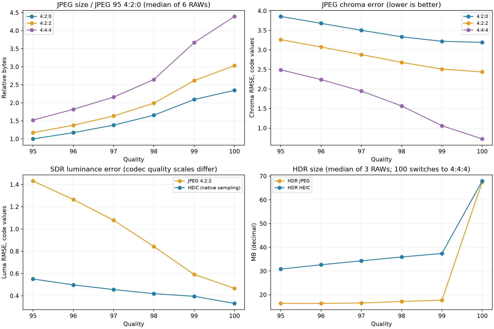

# JPEG / HEIF 高质量交付实测（2026-09-18）

本次比较的目标是保留相机解析力与颜色细节，同时避免 q100 文件体积失控。基于这批样张的判断：**SDR JPEG 的实用折中在 q97–98 / 4:2:2；偏重高保真可取 q98。HDR 要按实际编码器另作判断，不能照搬 JPEG 的质量数字。**

## 测试口径

六张 RAW：Sigma fp 的 `_SDI0150`、`_SDI0199`、`_SDI0133`，Sony 的 `DSC00225.ARW`，Fujifilm 的 `DSCF0214.RAF`，iPhone 的 `Original RAW 26-05-11 193721820.dng`。覆盖餐厅、舞台高 ISO、树叶细节、建筑与天空、食物纹理。每张保持完整输出分辨率，使用同一份未压缩 Display P3 8-bit 成片，默认 AgX/base、自动曝光、拍摄白平衡、LibRaw clip。编码时没有重新成像或缩图。

共 144 个 SDR 编码：JPEG q95–100 × 420/422/444 × 六张，以及 Core Image HEIC q95–100 × 六张。三张 Sigma 另测 36 个 HDR 编码：JPEG/HEIC × q95–100。HDR 每张共享同一对 SDR/HDR masters。总计 **180 个全尺寸编码**。HDR 使用现有 RGB ISO gain-map 路径，q100 采用 archive 的辅助图设置，其余质量采用 share 设置；因此 HDR 100 的跳变包含编码器的采样和辅助图行为。

体积为十进制 MB，不含后续 EXIF 搬运。亮度误差是码值域 Y′=0.299R′+0.587G′+0.114B′ 的 RMSE；色度误差是 R′−Y′、B′−Y′ 两通道的 RMSE。边缘指标在原成片梯度 ≥5 码值处比较两方向梯度误差。它们衡量编码误差，**不能解释成“损失了多少百分比的可见细节”**，也不是主观无损认证。高 ISO 帧的噪声同样会计入误差，不能单凭 RMSE 区分噪声与纹理。

环境：macOS 27.2 arm64，Pillow 12.3.0 / libjpeg-turbo 3.1.4.1；HEIC 与 HDR 为本机 Core Image / ImageIO。跨编码器的 quality 数字不可直接视为相同保真度。

## JPEG 质量档位

下表固定 4:2:2，取六张照片各自相对 q95 的比值后取中位数；误差列也为六张的中位数。

| quality | 相对 q95 体积 | 亮度 RMSE（码值） | 相对 q95 亮度误差降低 | 色度 RMSE（码值） |
|---|---:|---:|---:|---:|
| 95 | 1.00× | 1.432 | 0.0% | 3.263 |
| 96 | 1.19× | 1.264 | 11.6% | 3.074 |
| 97 | 1.41× | 1.079 | 24.5% | 2.881 |
| 98 | 1.71× | 0.842 | 40.9% | 2.682 |
| 99 | 2.25× | 0.592 | 58.6% | 2.508 |
| 100 | 2.60× | 0.467 | 67.3% | 2.437 |

q97 的亮度误差比 q95 低约 25%，体积增加约 41%；q98 则低约 41%，体积增加约 72%。从 q97 到 q98，体积中位增加约 22%，亮度 RMSE 再降约 22%。这段仍有可测量收益。q99–100 继续降低误差，但已经主要是在不到一码值的误差范围内换取更大文件，是否值得取决于输出用途，不能推出唯一数学最优档位。

## 4:2:0、4:2:2 与 4:4:4

4:2:0 在两个方向减少色度采样；4:2:2 保留完整的垂直色度采样，水平方向仍减半。两者都保留亮度采样，因此不能理解成照片整体分辨率减半。**提高质量值不能恢复已被采样丢掉的颜色细节。**

在 q97 下，4:2:2 相比 4:2:0：六张体积增加 15.8%–24.0%，色度 RMSE 降低 14.0%–20.5%，亮度 RMSE 差异不到 0.6%。4:4:4 能进一步保留颜色细节，但体积明显更大，尤其高 ISO 颜色噪声会消耗大量字节。

| 样张 | q95 / 420 MB | q97 / 422 MB | q98 / 422 MB | q100 / 444 MB |
|---|---:|---:|---:|---:|
| DSC00225 | 10.92 | 17.26 | 20.81 | 43.85 |
| DSCF0214 | 8.62 | 14.84 | 18.60 | 45.13 |
| Original RAW 26-05-11 193721820 | 4.76 | 7.33 | 8.65 | 17.75 |
| _SDI0133 | 6.53 | 11.37 | 13.97 | 32.61 |
| _SDI0150 | 6.39 | 10.81 | 13.26 | 30.48 |
| _SDI0199 | 13.38 | 20.33 | 23.22 | 43.65 |

## 首轮 Core Image / ImageIO 基线（旧编码路径）

这里测试的是本项目实际可用的 Apple HEIC（HEVC）路径，不代表所有 HEIF 编码器。SDR HEIC 使用同一份 8-bit master；没有声称测试了从高位深 master 直接导出 10-bit SDR HEIF。

| quality | SDR HEIC 中位体积 MB | SDR HEIC 亮度 RMSE | SDR HEIC 色度 RMSE | HDR JPEG 中位 MB | HDR HEIC 中位 MB |
|---|---:|---:|---:|---:|---:|
| 95 | 17.17 | 0.551 | 3.738 | 16.35 | 30.84 |
| 96 | 18.22 | 0.498 | 3.729 | 16.37 | 32.66 |
| 97 | 19.21 | 0.456 | 3.722 | 16.54 | 34.30 |
| 98 | 20.25 | 0.419 | 3.714 | 17.18 | 35.92 |
| 99 | 21.03 | 0.396 | 3.710 | 17.73 | 37.41 |
| 100 | 38.68 | 0.331 | 0.578 | 67.58 | 67.96 |

HEIC 95 的亮度误差已经接近或低于 JPEG 99；直接用“都是 95”比较体积会误判它的效率。但本机 HEIC 95–99 保持 4:2:0，色度损失仍存在，提升 quality 对这部分帮助很小。它不同时赢得体积、亮度和色度三个维度。

HDR JPEG 在 95–99 间的实际量化变化远小于 Pillow JPEG；例如 `_SDI0150` 从 95 到 99，体积 13.74→14.99 MB，SDR 底图亮度 RMSE 1.178→1.109。100 切换到 4:4:4 后为 67.58 MB。相同图的 HDR HEIC 95 为 28.10 MB，底图亮度 RMSE 0.534，但局部 HDR 亮度误差 max 为 0.659，高于 JPEG 95 的 0.346。**单看 SDR 底图更锐或平均误差更小，不能保证 HDR 高光更忠实。**

36 个默认 clip HDR 候选均通过既有绝对门禁。另一个 reconstruct 探针曾出现 HEIC q95 的局部 HDR 误差超标，说明本批通过不能替代逐文件回读；没有因此放宽门禁。

已实测 Core Image 的 `kCGImageDestinationEncodeBasePixelFormatRequest`：请求 `422f`、`444f`、`2vuy` 时，JPEG/HEIC gain-map 路径仍输出 4:2:0。普通 Pillow JPEG 的 4:2:2 有效。这是旧 Core Image API 的实测限制，不是文件标准限制。**现已用独立主图编码解除，新的 HDR JPEG 与 x265 HEIF 均可指定 4:2:2。**

## 自动编码政策

JPEG 自动质量范围固定为 **95–99**，100 保留为显式 archive 或手动设置。SDR 与 HDR JPEG 都以 q99 / 4:2:2 为参考；x265 HEIF 以 q95 / 4:4:4 / 10-bit 为参考，试 95、92、90、87、85、82、80；参考未通过回读时向下寻找最高质量的有效参考。所有质量均不通过则导出失败，保留已有文件。

在通过回读的候选中，至少节省 5% 字节才采用更小文件。SDR 默认亮度预算为不超过 1.0 码值 RMSE、8×8 局部绝对误差 p99 不超过 1.5 码值；当参考编码自身超过这两个值时，允许相对参考有限增加。色度 RMSE 限制为参考 ×1.10+0.10 码值。SDR 另试最终质量的 4:2:0，只有仍满足参考的亮度／色度预算、且相对选中的 4:2:2 再节省至少 5% 才采用。所有公式见 `dngscan/auto_encode.py`。

HDR 除上述编码误差外，继续经过现有 SDR/HDR 绝对门禁，并限制相对参考的局部 HDR 亮度和色品变化。局部 HDR MAE 的候选预算为 max(0.04, 参考×1.10+0.002)，避免基线误差很小时过度放大相对变化；最坏高光和色品预算保留。每张仅渲染一次，编码多次；不通过缩图、额外降噪或改变 AgX 来节省字节。

本批实际自动输出为五张 q98 / 4:2:2、一张 q97 / 4:2:2。旧编码路径三张 HDR 在 JPEG 和 HEIC 下均选择 q95 / 4:2:0；这不是新路径的结果，见下表。SDR 自动试编码加回读约 1.7–6.1 秒，HDR JPEG 约 7.1–7.9 秒，HDR HEIC 约 10.4–12.7 秒（并行运行了回归测试，只作开销量级参考，不含 RAW 分析和渲染）。此策略是偏重保真的工程默认值，尚不是人眼感知模型；对细彩线、文字、织物等特别敏感的保存用途，可显式使用 4:4:4。固定 q95 / 4:2:0 的 share 档仍可一次编码。

## 独立编码后的验证

JPEG 的主图改由 libjpeg 编码，保留原 ISO gain map 并重定位 MPF 地址。HEIF 使用 libheif 1.23.1 / x265 4.2，以新主图替换 HEIF primary item，重建 extent 与属性关联，原辅助图和 tmap 数据按字节保留。这样不再需要通过 quality 数字间接操控采样。

在 512×512 实际样张裁片上验证了 JPEG 95–100 × 420/422/444 的 18 个组合，均通过正式写入和 SDR/HDR 回读。HEIF 验证 8/10/12-bit × 三种采样，以及 fast/medium/slower 和 psnr/grain；8/10-bit 组合通过。12-bit 420 通过，但本机 ImageIO 的 12-bit 422/444 回读严重异常，错误文件被丢弃，产品仅提供 8/10-bit。控制验证记录包含失败结果：[codec-controls.json](assets/delivery-quality/codec-controls.json)。

另一组 1024×1024 裁片表明：x265 q95、97、99 在该图上产生相同码流。libheif 的 [x265 实现](https://github.com/strukturag/libheif/blob/v1.23.1/libheif/plugins/encoder_x265.cc) 将 quality 换算为 CRF=(100−q)/2；很高的 quality 可能已触及量化下限，不能类比 JPEG q95。10-bit 444 在 q80/85/90/95 的色度 RMSE 分别为 1.217/0.921/0.761/0.667；q85 的文件比 q95 小约 12.5%。这是裁片结果，不外推为所有照片的固定最优值。

随后用与首轮相同的三份全尺寸 HDR masters 运行正式自动导出，共 36 个候选（JPEG 5 档、HEIF 7 档，各三张），所有选中结果都通过原有绝对门禁：

| 样张 | 自动 HDR JPEG | JPEG MB | 自动 HDR HEIF | HEIF MB | HEIF 主图 / 其他数据 MB |
|---|---|---:|---|---:|---:|
| _SDI0150 | 98 / 422 | 20.19 | 87 / 444 / 10-bit | 37.53 | 22.95 / 14.57 |
| _SDI0199 | 98 / 422 | 35.50 | 95 / 444 / 10-bit | 58.81 | 39.00 / 19.80 |
| _SDI0133 | 98 / 422 | 23.36 | 87 / 444 / 10-bit | 42.14 | 25.25 / 16.88 |

这组 HEIF 偏重完整色度，高 ISO 帧也会保留大量噪声。_SDI0150 的 HEIF 底图亮度/色度 RMSE 为 0.308/0.785，JPEG 为 0.806/2.430；更低编码误差确有成本。RGB gain map 等辅助数据还占约 15–20 MB，单独优化主图无法消除它。自动 HEIF 全尺寸编码约 124–154 秒，JPEG 约 8.5–10.7 秒；本机并行运行其他测试，耗时仅作量级参考。默认分享仍优先 JPEG，HEIF 是有明确色度/容器需求时可选的高保真交付，不承诺一定更小。

上述编码比较固定了 masters，隔离了前端管线变化。另用最新管线对本地 **35 张 RAW** 完成解码、分析、自动曝光及 AgX 渲染冒烟检查，记录见 [pipeline-corpus.json](assets/delivery-quality/pipeline-corpus.json)。不能把冒烟检查等同于逐张主观成像验收。

2026-09-18 首轮完整回归在本机 Python 3.14 / NumPy 2.5.2 上执行：`DNGSCAN_FAST=1` 与 `DNGSCAN_FAST=0` 分别运行 `python -m unittest discover -s tests -q`，各 1499 项，均无失败，分别跳过 38 / 77 项。跳过项不计作通过。另验证了 GUI 的手动质量/采样保留、HEIF 设置恢复、自动参数请求，以及最新管线从原始 DNG 到 SDR/HDR JPEG 的完整导出；两次实际选择均为 q98 / 422。实现与未支持的 DNG 组合见 [架构文档](ARCHITECTURE.zh-CN.md)。

2026-09-19 再次检查非胶片管线：[三张全尺寸 RAW 的预览/导出一致性记录](assets/delivery-quality/nonfilm-pipeline-audit.json)覆盖 Sigma DNG、Sony ARW、Fuji RAF，自动曝光、AgX 端点与可靠高光尾部一致，开启诊断也没有改变曝光。Fuji 这张成片的可信高光不足以支持扩展白，HDR 计划返回 0 EV，而不是强行拉亮。新增元数据搬运完整性门禁后，实际 SDR JPEG、HDR JPEG 和 10-bit/444 HDR HEIF 均成功保留拍摄元数据，同时主图和 gain-map 压缩内容保持不变；HEIF 只允许无视觉影响的属性/地址重排。检查另修正了 `imir=0` 仍表示镜像的边界处理。

最新管线的完整 DNG→HEIF 还暴露了固定 masters 基线未覆盖的情况：`_SDI0150` 的低精度辅助图在系统 HEIF 与 x265 下都造成局部高光失真，主图质量再高也无法补回。现在最高质量参考未通过 HDR 检查时，会提高辅助图编码精度再搜索主图档位。该文件最终为 q95 / 10-bit / 444、56.44 MB，gain map 从 420f 改为 444f，局部最大亮度误差由约 1.58 降至 0.047，门限不变。最终元数据搬运后再次回读的记录见 [end-to-end-heif.json](assets/delivery-quality/end-to-end-heif.json)。这也说明对 HDR 容器不能只优化主图，且不能保证 HEIF 比 RAW 或 JPEG 更小。

完整回归还捕获到连续调用空间核时的偶发线程预算超额：丢弃 scoped-thread handles 后，隐式 scope 等待只保证线程函数完成，退出清理可能与下一批线程重叠。现对 AgX、HDR、镜头、输出与空间核的相关工作批次显式 `join`，不改变像素计算或线程预算。修复后，原线程数量门禁连续 30 轮通过；另增加受控线程退出测试，确认释放预算前会等到退出清理完成。Rust 的这一区别见 [scope / join 文档与实现](https://doc.rust-lang.org/src/std/thread/scoped.rs.html)，受控测试可用 `rustc --edition=2021 --test rust/src/budget.rs -o /tmp/agxraw-budget-test && /tmp/agxraw-budget-test` 单独运行。

2026-09-19 最终完整回归使用重建后的 Rust ABI 14，并允许实际调用 macOS 图像 API：上述 `DNGSCAN_FAST=1` / `0` 命令各运行 **1505 项**，均无失败，分别跳过 **6 / 45 项**，耗时 312.200 / 734.478 秒。相较首轮，额外执行了原来受沙箱限制而跳过的 Apple RAW、ImageIO 与 gain-map 检查；跳过项仍不计作通过。最终代码通过 `git diff --check`，GUI 参数行为检查与上述实拍交付记录一并保留。

## 复现与原始结果

完整数据见 [measurements.json](assets/delivery-quality/measurements.json)，旧路径自动选择见 [automatic-results.json](assets/delivery-quality/automatic-results.json)，新路径全尺寸 HDR 自动选择见 [tunable-hdr-results.json](assets/delivery-quality/tunable-hdr-results.json)。用 `tools/benchmark_delivery.py --mode sdr --out /tmp/codec-test RAW...` 或 `--mode hdr` 复测旧系统路径；增加 `--encoders tunable` 比较独立质量/采样，增加 `--encoders auto` 运行正式 HDR 自动选择。只读 RAW，输出写入指定测试目录，测试文件可能包含尚未通过 HDR 门禁的候选；请以 `hdr_gates_pass` 判断。此脚本用于测量，不绕过正式导出的逐文件检查。

质量数值的意义及 q100 仍有采样／舍入损失的说明见 [libjpeg-turbo 使用文档](https://github.com/libjpeg-turbo/libjpeg-turbo/blob/main/doc/usage.txt)。Apple 编码控制见 [压缩质量选项](https://developer.apple.com/documentation/imageio/kcgimagedestinationlossycompressionquality) 与 [底图像素格式请求](https://developer.apple.com/documentation/imageio/kcgimagedestinationencodebasepixelformatrequest)。
