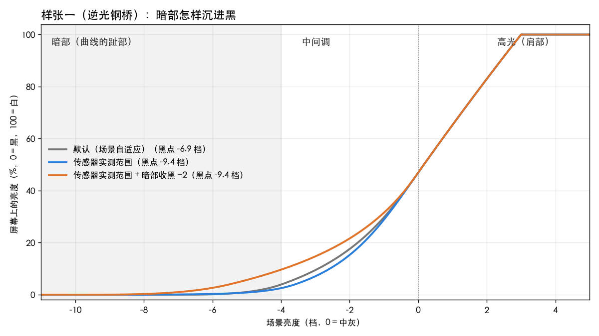
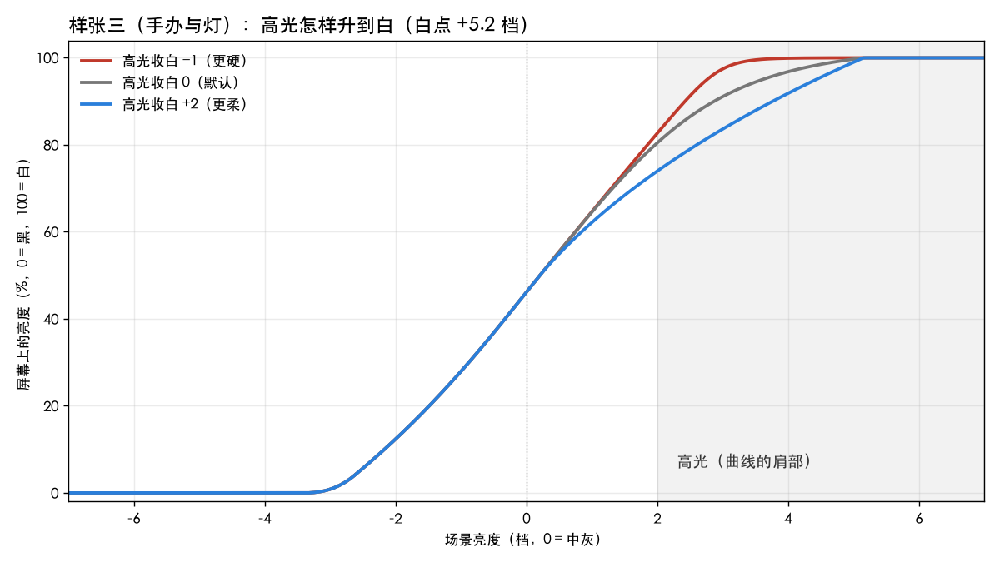
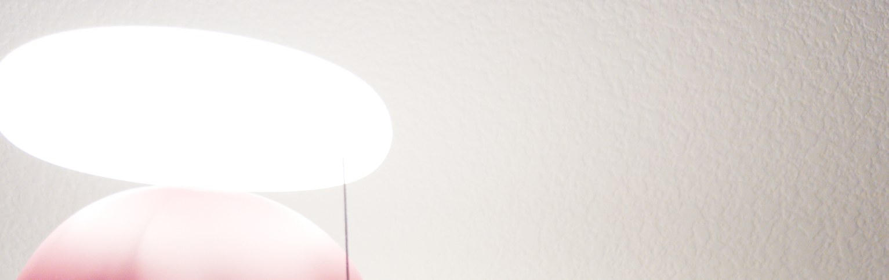
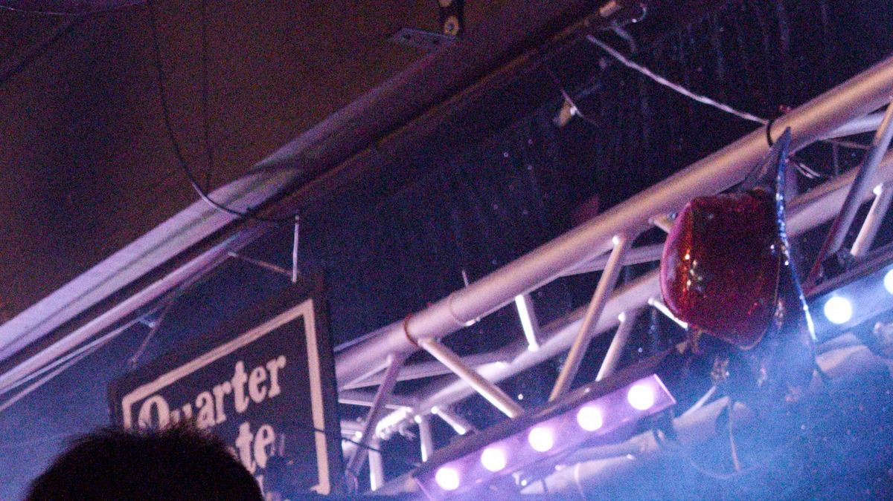
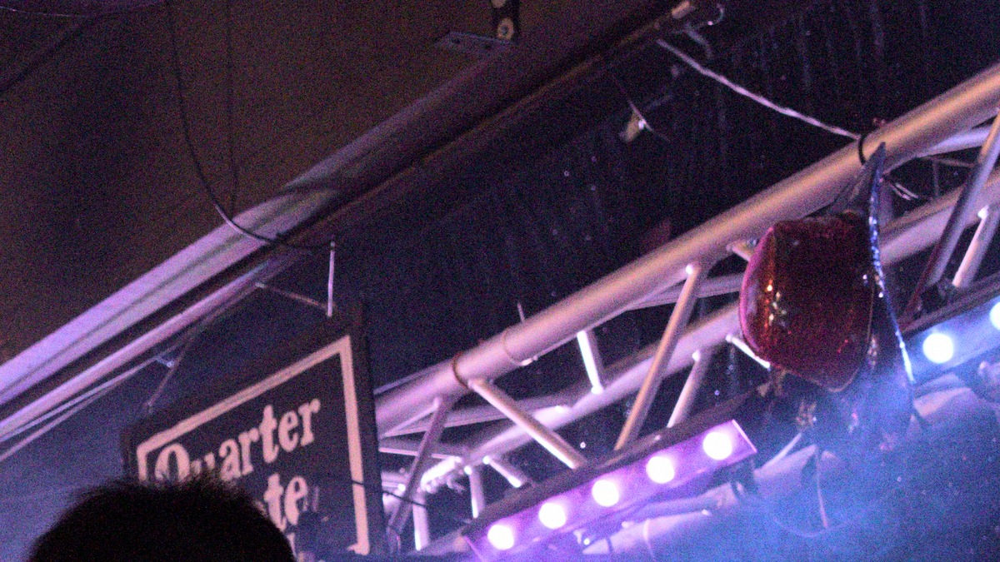

# 修图工作流说明书 —— 每个滑条做什么，怎么用由你定

> 当前默认已开启分析驱动的自动曝光。本文既有对比图保留原来的显式 EV 设置；复现零曝光对照时请关闭自动曝光或使用 `--ev 0`。

[修图教程](EDITING_TUTORIAL.zh-CN.md) · [胶片教程](FILM_TUTORIAL.zh-CN.md) · [HDR 教程](HDR_TUTORIAL.zh-CN.md) · [使用说明](USER_GUIDE.zh-CN.md) · [架构与技术细节](ARCHITECTURE.zh-CN.md)

这份说明书只做一件事：讲清每个滑条**做的是什么**——它改变画面的哪一部分，你能在照片上看到什么变化。至于"这张照片该不该这么调"，由你的眼睛决定。文中所有对比图都是 dngscan 按所列参数实际渲染的，不是示意图；每一句"会发生什么"旁边都放着它的依据。

修图的顺序是三个问题，答完一个再进下一个，不用回头：

> **范围 → 亮度 → 色彩补偿。**
> 先决定"画面里显示多少明暗信息"（黑白点、暗部、高光），再决定"这些信息放多亮"（曝光 EV 或中间调亮度），最后处理"变亮带来的颜色损失"（色彩浓度）。

后面会反复说到"暗部"和"高光"这两头怎么调，第一步里有一张图专门讲清它们在做什么。

全文用三张样张，各自演示效果看得见的滑条。文中也收录了两个"这张照片用不上这个滑条"的例子——知道一个滑条什么时候不起作用，和知道它起什么作用一样重要。

| 样张 | 相机 | 它演示什么 |
|---|---|---|
| 一 · 大逆光钢桥 | 富士 X100VI，ISO 250 | 范围（黑白点、暗部）、两种提亮方式的分工、色彩浓度补偿；高光收白在这张上**调不动** |
| 二 · 航机厨房 | iPhone 16 Pro，ISO 200 | 什么都不用调的对照例子；顶灯板演示三种高光模式的差别；色彩浓度在这张上**自动值为 0** |
| 三 · 手办与灯 | iPhone 16 Pro，ISO 200 | 两种提亮方式的分工：灯不动、手办提亮；高光收白最有用的场合（真实过曝的高光）；RAW 过曝标记怎么看；HDR 亮度怎么看 |

---

## 第零课 · 什么都不用调的照片

先看一张不需要修的：航机厨房，人工光，标准曝光。

判断的依据在**场景 EV 直方图**（曝光卡内）：这一帧从最暗到最亮的可信内容，几乎全部落在曲线的黑点和白点之间。亮的一端全部装下了，暗的一端只有 0.4% 落在黑点外面。**画面的亮度范围被黑白点整个装下，就是"不用调"的样子。**后面每个滑条派上用场的时候，都是直方图上画面内容和黑白点错开了；没有错开时，最好的操作就是不操作。

---

## 第一步 · 范围：显示多少明暗信息？

样张一：仰拍的逆光钢桥。默认设置把曲线的黑点放在 −6.9 EV，但照片里实际看得清的暗部还要深得多，桥底钢架有一部分被当成了纯黑。这不算错：天空占主导的逆光场景，默认的自适应做法优先保护中间调。范围工具让你**改变这个决定**。

### 先看懂这条曲线

明暗卡上的所有控件，调的都是同一条曲线。它回答一个问题：**现场这么亮的东西，放到屏幕上该多亮？**

下图是样张一（逆光钢桥）实际用的曲线，不是示意图。横轴是现场的亮度，单位是档，0 是中灰，往左越暗、往右越亮；纵轴是屏幕上显示出来的亮度，0 是纯黑，100 是纯白。

读这张图只要记住三件事：

- **中间一段是直的。**现场每亮一档，屏幕上就按固定的幅度变亮。中间调的反差就是这一段的陡峭程度。
- **两头是弯的。**屏幕最暗只能到黑、最亮只能到白，曲线不能一直直着走，所以暗的一头要慢慢贴到黑，亮的一头要慢慢贴到白。弯得缓，层次就多、过渡就柔；弯得急，就更干脆、更硬。胶片上管这两头叫趾部和肩部，本文直接叫**暗部**和**高光**。
- **曲线贴到底的位置叫黑点，贴到顶的位置叫白点。**比黑点还暗的东西，在屏幕上一律是纯黑；比白点还亮的，一律是纯白。

于是范围这一步其实只有两种操作：**挪黑白点**（决定多暗、多亮的东西才开始被显示），和**改两头弯的形状**（决定它们怎样过渡到黑、到白）。下面三个控件各管其中一件。

### 黑白点依据：黑白点放在哪

- **场景自适应**（默认）：看这张照片的亮度分布，把黑白点放在大部分内容的两端。
- **传感器实测范围**：黑点放在传感器实际能测到的最暗处（噪声水平），白点只认确实测到、没有过曝的最亮处。

图上灰线是默认，黑点在 −6.9 档；蓝线切到了传感器实测范围，黑点下探到 −9.4 档，暗部多出约 2.5 档有机会显示。中灰的位置不变（两条线在 0 档重合），所以画面整体亮度不会跳。

但只挪黑点，画面几乎不会变。看图上 −4 档的位置：灰线在屏幕亮度 3.9%，蓝线反而只有 2.5%。黑点挪远了，暗的那一头还是弯得很急，新放进来的暗部仍然被压在接近黑的地方。要让它们真的显出来，得改弯的形状——下一个控件。

也可能反过来：高感光度、小尺寸传感器的照片，传感器的噪声水平会比自适应算出的黑点还**高**，切过去暗部反而变窄。"传感器实测范围"不等于"更宽"，它只是把黑白点的依据从"这张照片的统计"换成"传感器实际测到了什么"，两个方向都有可能。

### 暗部收黑：暗部弯得多缓

这个滑条改的是暗的那一头弯的形状。**向左拉，暗部弯得更缓**：同样暗的东西，在屏幕上会更亮一些，更晚才沉到黑里。黑点、白点、中间调都不动。

看图上的橙线（传感器实测范围 + 暗部收黑 −2）。黑点和蓝线一样在 −9.4 档，但暗部整个抬了起来：

| 现场亮度 | 默认（灰线） | 传感器实测范围（蓝线） | 再加暗部收黑 −2（橙线） |
|---|---|---|---|
| −2 档 | 17.6% | 15.3% | 21.6% |
| −4 档 | 3.9% | 2.5% | 9.6% |
| −6 档 | 0.1% | 0.3% | 2.6% |

−4 档的内容从几乎全黑（2.5%）变成了看得清的深灰（9.6%）。再看 0 档往右，三条线完全重合：中间调和高光一点没动。

放回照片上，就是桥底钢架同一处的前后对比：

| 默认 | 传感器实测范围 + 暗部收黑 −2 |
|---|---|
|  |  |

看什么：腹杆、铆钉、锈迹从剪影里浮了出来，天空完全没有变。这不是碰巧，是这个滑条只改暗的那一头决定的。

向右拉则相反：暗部弯得更急，更早沉进黑，暗部更紧、更干脆。

### 高光收白：高光弯得多缓

亮的那一头同理。**向右拉，高光弯得更缓**：很亮的东西在屏幕上没那么快顶到白，层次更晚才合并，过渡更柔；代价是亮的地方整体会暗一点。**向左拉，高光弯得更急**：更早变白，更硬、更通透。黑点、白点、中间调都不动。

下图是样张三（手办与灯）的真实曲线。三条线的白点都在 +5.2 档，只是弯的形状不同：

| 现场亮度 | 收白 −1（红线） | 收白 0（灰线） | 收白 +2（蓝线） |
|---|---|---|---|
| +2 档 | 82.7% | 80.4% | 74.0% |
| +3 档 | 97.4% | 91.1% | 83.6% |
| +4 档 | 99.9% | 96.8% | 91.8% |

红线在 +3 档就几乎顶到白了（97.4%），+3 到 +5 档之间的内容全挤在最后 3% 里，看上去就是一块白。蓝线在 +3 档才到 83.6%，同样这两档的内容有 16% 的屏幕亮度可以用来分出层次。

这张样张最适合看它：手办头顶的灯盘在 RAW 里真的过曝了（约 4% 的像素），白墙的亮区占了画面大约三分之一，是高光信息真正拥挤的场景。

"真的过曝"不用猜。预览卡上打开 **RAW 过曝标记**，RAW 里读数达到传感器上限 97% 以上的像素会按颜色通道标在预览图上：红、绿、蓝表示那个通道接近上限，白表示三个通道都接近。注意这是"接近上限"，不一定已经过曝，渲染时的高光降饱和也从这条线开始。开关旁边显示两个数：全尺寸统计的"完全过曝"占比（按 R · G · B 分列，这才是"真的过曝了多少"）和标记区占比。RAW 解码卡的"高光"选择器下方也有一行"实测 RAW 过曝"。想核对本文里"约 4%"这类数字，看这两处就行。

"完全过曝"占比不低的白色标记落在哪里，哪里在拍摄时就没有记录到层次，调哪个滑条都变不出细节。彩色标记还剩下没到上限的通道，它的用处在"高光模式"一节讲。高光收白能救的是标记区**周围**还有余量的高光：灯盘边缘的光晕、白墙的肌理。标记本身不会因为收白而变小，因为它记录的是拍摄时的事实，不是渲染结果。

高光收白取 −1 / 0 / +2 的对比（灯盘和白墙的裁切）：

| 收白 −1（更硬） | 收白 0（默认） | 收白 +2（更柔） |
|---|---|---|
|  |  |  |

调了会发生什么（实测）：从 −1 到 +2，白墙亮区的亮度逐级下降，纯白像素从 7.6% 降到 0（−1 档时升到 18.8%）。看灯盘边缘：左图里灯和光晕合并成一整块硬白；右图里灯盘的轮廓、光晕的渐变、墙面的肌理逐级分开。右柔左硬，高光的层次是用整体亮度换回来的。

### 为什么样张一的高光收白纹丝不动

同一个滑条放到钢桥样张上，从 −1 拉到 +2，画面纹丝不动。回头看第一张曲线图的右上角就明白了：钢桥那条曲线一路直着走到 +3 档，直接撞上白，**根本没有弯**。这张照片的亮部内容不多，曲线的直线段已经一直延伸到了白点，没有留出一段用来弯的余地；没有弯，自然也就没有"弯得缓一点还是急一点"可调。样张三之所以调得动，是因为过曝的灯把白点推到了 +5.2 档，直线段结束之后还有两三档的空间留给高光去弯。

**明暗卡的实测行永远显示实际生效的数字。数字不动，就是这张照片用不上这个滑条，不是出了故障。**（更详细的原理见[架构文档](ARCHITECTURE.zh-CN.md)"肩部自由度的几何"一节。）

### 暗部过渡与高光过渡：为什么这两个滑条几乎看不出效果

明暗卡上还有两个没在样张里出现的滑条：**暗部过渡**和**高光过渡**。先说结论：它们是暗部收黑和高光收白的**微调**，本来就设计得很克制，效果接近肉眼能分辨的下限。拉到 ±1，只是把暗部或高光那一段曲线的弯曲程度乘以约 ±37%，黑点、白点、中灰全部不动。在本文这类照片上实测，拉满之后逐像素的最大差别只有 3–9/255 码值，而且集中在深阴影（暗部过渡）或高光过渡区（高光过渡）的一小段亮度里；整张图 99% 的像素差别不超过 10/255。把两张"对比图"并排放着你也找不出差别，所以这里没有放对比图。

换算成看得见的单位：暗部过渡拉满，约等于暗部收黑动 0.6–0.7 档；高光过渡拉满，不到高光收白的 0.1 档。想让暗部或高光真的动起来，用暗部收黑和高光收白——它们直接指定"接近黑、接近白发生在第几档"，动一档在成片上是 9–17/255 的可见变化。这两个过渡滑条留给"曲线形状只差最后一点点"的场合。另外，高光没有调整余地的照片（样张一那种）上，高光过渡和高光收白一起失效，拉满差别不到 1/255，原因相同。

---

## 第二步 · 亮度：这些信息放多亮？

范围定好了，桥底的细节看得清了，但整体还是暗。这里有两种独立的提亮方式。**它们不是二选一，可以同时用，而且很多照片就应该同时用。**下面先分开对比，是为了讲清各自动的是画面的哪一部分；弄清楚之后怎么组合，由你决定。

用上一步那张曲线图来想，两者的区别很直观。

**曝光 EV**：曲线不变，把整张照片的内容沿横轴整体往右挪。原来在 0 档的东西现在算 +1 档，原来在 +2 档的现在算 +3 档。所有区域按同样的比例变亮，AgX 的反差和色彩关系原样保留，画面就像"多曝了一档"。代价也在这里：原来就很亮的东西会被一起推向白点。

**中间调亮度**：照片的内容不挪，把曲线的中段往上抬，两头按住不动。最亮的地方还在原位，中间和暗部变亮了。代价是中间那一段的明暗反差会被压掉一部分——画面变平一些，颜色也会稍微变淡（第三步要补的就是这个）。

常见的组合用法：先用 EV（或"自动曝光"按钮）把整体曝光放到位，这一步决定高光和光比；整体对了、主体还显暗时，再用中间调把主体补上来，这一步不会惊动已经放好的高光。两个滑条的效果叠加，各管各的区域。下面的对比里它们分开出现，只是为了让你看清这一点。

选哪种方式之前，先看一眼 **RAW 过曝标记**（预览卡上的开关，上一步讲高光时介绍过）。它回答的是"高光还有没有余地"这个前提。标记记录的是拍摄时传感器上接近上限的像素（是不是真的过曝，看旁边的"完全过曝"占比），所以**它不随 EV 滑条变化**：把 EV 压低，标记一个也不会少，变的只是标记周围那些还有余量的高光被放回了曲线里。由此有两条判断：

- 标记落在你需要层次的地方（人脸、云、灯罩的花纹）：高光没有余地。应该压 EV，或者用高光收白、换高光模式（通道混合、邻域重建）来处理。中间调帮不上忙，因为它不动最亮的部分，恰好绕开了问题所在。
- 标记只落在你本来就接受是白的光源上（灯芯、太阳、镜面反光）：不必为它压 EV，按上面的组合用法照常提亮主体。

高光有余地时优先用 EV，中间调是一种会让画面变平的折中——这个顺序不变，过曝标记只是让"有没有余地"不用再靠猜。（选 Apple RAW 解码器时没有逐像素的过曝信息，这个开关会置灰并写明原因。）

### 样张一：EV +1 对比 中间调 +0.6（在传感器实测范围 + 暗部收黑 −2 的基础上）

| EV +1 | 中间调 +0.6 |
|---|---|
|  |  |

三组裁切，看三个地方。

**桥底细节**——两种方式都把细节提到了看得清的亮度，但质感不同：

| EV +1 | 中间调 +0.6 |
|---|---|
|  |  |

**天空**——差别最大的地方。EV 让云层和蓝天一起亮起来，变通透；中间调让天空留在原处，保住了深沉的情绪：

| EV +1 | 中间调 +0.6 |
|---|---|
|  |  |

**阴影里的明暗关系**——同一段桥架钢梁的实测：EV 把明暗拉开，锈色和反光跳了出来；中间调让整体收敛、层次更平——被压掉的那部分中间反差就体现在这里：

| EV +1 | 中间调 +0.6 |
|---|---|
|  |  |

### 样张三：灯不动，手办提亮——两种方式各动哪里

手办与灯（样张三）。画面里同时有最亮的灯盘和阴影里的主体，两种方式的分工在这里最不容易看错。四张全图：默认、只动 EV、只动中间调、两个一起用：

| 默认 | EV +0.7 |
|---|---|
|  |  |

| 中间调 +0.8 | 组合 · EV +0.3 + 中间调 +0.5 |
|---|---|
|  |  |

EV +0.7 把灯、墙、手办**全部**抬亮：主体亮了，灯的光晕也涨大一圈，墙面跟着变白，光比整体上移。中间调 +0.8 只把手办、酒罐和桌面托起来，灯留在原位。第四张是两个一起用的样子：EV +0.3 先把整体曝光放到位，中间调 +0.5 再把主体补足。主体区得到纯 EV 方案大约三分之二的提亮（裁切区线性亮度实测 +0.28 档，纯 EV 是 +0.44 档），灯区光晕的外扩也只有纯 EV 的六成（灯区均值 0.85→0.89，纯 EV 是 0.85→0.91）。既要整体提亮，又要"灯别跟着涨"，就是这么配的。两个滑条的效果叠加，互不抵消。

先看效果本身。主体特写：中间调 +0.8 把手办的白衣、粉发和酒罐都托亮了一截（主体区亮度实测 0.43→0.47；EV 是 0.43→0.54，抬得更多，而且连墙带灯一起）。**组合版重点看红鞋**：纯 EV 把鞋面从 0.21 提亮到 0.33，但红色被推进了高光里颜色开始变白的那一段，饱和度从 0.70 掉到 0.58——亮是亮了，红被洗淡了。组合版把同样的提亮分给两种方式：EV +0.3 停在那一段之下，剩下的交给不影响颜色的中间调，鞋面到 0.29、饱和度 0.61。提亮少一些，变淡也少一些：**同样幅度的提亮，组合方式让颜色损失更小**。这是组合的真正优势：只靠 EV 得不到"又亮又纯"，组合也不是没有代价，但它让每一档提亮付出的颜色代价更低。灯区特写里还有它的第二个优势：

| 默认 | EV +0.7 |
|---|---|
|  |  |

| 中间调 +0.8 | 组合 · EV +0.3 + 中间调 +0.5 |
|---|---|
|  |  |

再看它没动的地方。中间调最容易被误解，灯区特写可以逐一排除三种误会：

| 默认 | EV +0.7 |
|---|---|
|  |  |

| 中间调 +0.8 | 组合 · EV +0.3 + 中间调 +0.5 |
|---|---|
|  |  |

- **它不是弱一点的 EV。**EV 方案的灯区亮度实测 0.85→0.91，光晕明显外扩；中间调方案的灯区 0.85→0.87，光晕轮廓和默认几乎重合；组合版落在 0.85→0.89——主体得到了接近纯 EV 的提升，灯区只付出一半的外扩。
- **高光没有被削减。**中间调方案的灯区一点也不比默认暗，它只是留在原位没动。
- **也不是"高光没有展开"。**灯盘在 RAW 里真的过曝了（讲高光时说过，约 4% 的像素），四张图里它都已经顶在白点上；中间调改变的只是中灰以下怎样升上来。打开 RAW 过曝标记核对：默认、EV +0.7、中间调 +0.8 三种设置下灯盘的标记完全一样——它记录的是拍摄时的事实，EV 和中间调都改不了它。

代价照例是颜色变淡：中间调 +0.8 之后，粉发的饱和度实测从 0.59 掉到 0.53。这就是上一步说的"颜色损失"，下一步的色彩浓度就是为它准备的。

---

## 第三步 · 色彩补偿：色彩浓度

**先说原理**：色彩浓度不是普通的饱和度滑条。工具会分析每张照片，算出一个自动补偿值；滑条是这个自动值的**倍率**，1.0 表示"按自动值原样补"。

样张一用中间调提亮之后，天空发灰、锈色发闷——这就是上一步说的颜色损失。把浓度从 1.0 补到 1.35（这张照片的自动值比较高，1.35 已经补到头了）：

| 中间调 +0.6，浓度 1.0 | 浓度 1.35 |
|---|---|
|  |  |

看什么：蓝天的蓝、铁锈的橙红回到了提亮之前的浓度附近；明暗完全没有变——它只加颜色，不碰曲线。

两个事实：

- **只用 EV 提亮通常不需要这一步。**整体提亮不会让颜色变淡，这是两种提亮方式的本质区别之一；两种同时用时，需要补的只是中间调造成的那一部分。
- **样张二的浓度滑条没有效果，因为自动值是 0。**航机厨房这张，场景分析判断它不需要补偿，自动值是 0；滑条是倍率，0 乘多少都是 0，拉到头画面也完全一样。这和样张一的高光收白是一回事：滑条没坏，是这张照片用不上它。工具宁可让数字诚实，也不假装每个滑条在每张照片上都有用。

### 高光褪白：只影响带颜色的亮部

颜色卡上还有一个没出现过的滑条：**高光褪白**。它只调整**接近屏幕最亮白的彩色像素**的饱和度：向右让它们更早褪成白，向左保留更多颜色。亮度完全不变。不带颜色的白墙、灯芯、过曝成白的天空不会有任何变化。也就是说，它起作用的前提是画面里有"又亮又有颜色"的内容：晚霞的云、彩色灯罩、霓虹的光晕。在这类像素上拉满，单个通道最多变化约 15/255；画面里没有这类像素时，它什么也不做。白光的手办灯、人工光的航机厨房都属于后一种。即使是有晚霞的照片，实测整张图 99% 的像素差别也不超过 10/255——效果只存在于少数最亮、最艳的像素上。并排对比找不出差别，所以这里没有放对比图。HDR 输出时这个滑条被禁用（HDR 的高光颜色单独处理，导出时强制为 0），界面会置灰并写明原因。

---

## 附 · 影调映射、高光处理与 HDR 亮度

### 影调映射：同一条曲线，颜色三种处理

成像卡上的"影调映射"有四个选项，名字看上去像四种不同的压缩方法，其实不是。**前三个用的是同一条明暗曲线**，就是第一步里那条：黑点、白点、反差、两头弯的形状全都一样，所以三者的明暗基本一致。它们的区别只有一点：**一个颜色在变亮的过程中，要不要跟着变淡。**

- **AgX · 默认**：红、绿、蓝三个通道**各自**过这条曲线。想象一盏很亮的紫色舞台灯：它的蓝通道和红通道先顶到曲线的高光段、被压住了，绿通道还在往上走，三个通道越来越接近，这个紫就逐渐变淡，最后变成白。这就是 AgX 标志性的"高光过渡到白"：亮的东西看起来像在发光，颜色不会又亮又艳、假得刺眼。代价是饱和色在变亮的过程中会变淡，色相也会有一点偏移。
- **只压亮度 · 颜色不变**：先算出这个像素有多亮，只让**亮度**过曲线，再把红、绿、蓝按同样的比例缩放。紫还是原来那个紫，只是整体变暗或变亮了。颜色完全忠实；代价是很亮的饱和色显得生硬，过曝的地方也不会自然地变白。
- **按 RAW 数据自动 · 保留真实颜色**：亮度用"只压亮度"的结果，颜色在上面两种之间**逐个像素**选。依据是 RAW 里的实测情况：这个像素没有过曝、噪声小、在中间调，就保留原来的颜色；这个像素过曝了、噪声大、或者在很亮的高光里，就改用 AgX 的"过渡到白"。思路是：传感器确实测到的颜色就别去动它，只有在数据已经不可信的地方，才让 AgX 来收拾。它依赖逐像素的过曝信息，所以只有 LibRaw 解码能用。
- **固定曲线 · 诊断**：一条不看场景的固定曲线，排查问题用，不是拿来出片的。

live house 的舞台灯（SIGMA fp，ISO 12800），紫色 LED 灯排的裁切，三个选项各渲染一次，其余参数相同：

| AgX · 默认 | 只压亮度 · 颜色不变 | 按 RAW 数据自动 |
|---|---|---|
|  |  |  |

看什么：看那一排紫色 LED 和被它照亮的桁架。AgX 下，灯珠本身褪成了偏白的淡紫，周围的烟雾带一层青蓝，看起来像真的在发光；只压亮度下，灯珠和桁架保持浓郁的紫，颜色更"实"，但少了那种发光感。实测：裁切区里亮的像素，平均饱和度 AgX 是 0.34，另外两种是 0.40；AgX 和"只压亮度"之间有 57% 的像素差别看得出来（任一通道相差超过 8/255），明暗则几乎一样（平均亮度 80.6 对 77.4）。

**第三张和第二张几乎一模一样**，这一点需要说明：两者之间差别看得出来的像素只有 0.002%。原因是这张照片里 RAW 的数据判定绝大部分颜色是可信的——舞台灯很艳，但并没有过曝——所以"按 RAW 数据自动"几乎处处选择了保留原来的颜色。手办与灯那张有真实过曝的样张上也一样，两者最大只差 8/255。换句话说，在曝光正常的照片上，这个选项的实际效果很接近"只压亮度"；只有在大片过曝、或者噪声很重的高光里，它才会明显转向 AgX。

怎么选：拿不准就用 AgX，它对高光的处理最稳妥，也是其它功能（胶片模拟、HDR）验证得最充分的路径。觉得 AgX 把舞台灯、霓虹、晚霞这类又亮又艳的颜色洗得太淡时，换"按 RAW 数据自动"试试。"只压亮度"主要用来对照，看清 AgX 到底对颜色做了什么。

### 高光模式：过曝的像素用什么值进画面

这是 RAW 解码卡上的"高光"选择器（只在 LibRaw 解码下有）：传感器已经过曝的像素，用什么值进入后续处理。

- **保持过曝**（clip）：过曝的像素就按最大值算，过曝区是一片白；
- **通道混合**（blend）和**邻域重建**（reconstruct）：用没有过曝的通道，去推算过曝区原本的颜色。

**先说结论：在多数照片上，这三种模式的成片差别小到看不出来。**这是设计使然，不是巧合。过曝的区域怎样被压暗、怎样褪色，是由"哪些像素真的过曝了"这份实测记录决定的，和用什么值去填无关；HDR 能亮多少，也只认确实测到的信号。手办灯、舞台灯这类整块过曝的光源上，三种模式几乎完全一样。

**能看出差别的场景**：只有部分通道过曝的平坦光源——灯板、灯箱、透光的柔光板。样张二（航机厨房）的顶灯板正是这种情况，三种模式的差别看得很清楚：

| 保持过曝 clip | 通道混合 blend | 邻域重建 reconstruct |
|---|---|---|
|  |  |  |

看灯板内部：clip 是一片平实的白，过曝就承认过曝；blend 用没过曝的通道混出一层偏暖的过渡；reconstruct 推算得更多——注意柔光板上**偏品红的色块**，那是推算出错的样子。重建是推测，不是实测，推对了很自然，推错了就是这种颜色。这也是默认用 clip 的理由：老老实实的白永远不会错。

RAW 过曝标记的颜色正好把这种区别标了出来：红、绿、蓝的彩色标记表示只有一两个通道接近上限，还有通道留有余量可以用来推算，换模式才可能看到差别；白色标记表示三个通道都接近上限，"完全过曝"占比不低时什么都推算不出来，三种模式给出的都是白。

反过来的情况——"clip 吃亏、reconstruct 占优"——我们也认真找过：对一整张存储卡的 230 张照片做了过曝统计，挑出"只过曝一两个通道"占比最高的场景（理论上 reconstruct 最有信息可用的地方）逐张渲染，三种模式的成片差别最多只有约 11/255 码值。别的软件里 clip 常见的品红镶边、高光色阶断裂，在 dngscan 里**被过曝记录这套机制挡掉了**：过曝区怎样处理由实测的过曝记录决定，和填充方式无关。所以没有"clip 明显吃亏"的样张——不是没找到，是这套设计不让它发生。默认用 clip；看到灯板这类光源想换个味道再切，就这么简单。

（选 Apple RAW 解码器时没有这个开关：Apple 用它自己固定的重建方式。）

### HDR 亮度怎么看

（HDR 照片是什么、怎么导出、怎么确认文件没问题，见单独的 [HDR 教程](HDR_TUTORIAL.zh-CN.md)；这里只讲修图时怎样读懂"能亮多少"这个数。）

样张三的场景 EV 直方图（曝光卡内）上有一条 **p99.99** 标线，落在 **+4.85 EV**；"输出参数"里 HDR 亮度上限旁边的实测行把它写成了数字（"实测可靠尾部 …（p99.99）"）。这就是**可信的最亮高光**：传感器在过曝之前确实记录到的最亮内容，比中灰亮 4.85 档。RAW 过曝标记标出来的那些像素不算在内，它们没有被测到，只是过曝了。

减去屏幕的参考白（正常白色的亮度），这张照片有约 **+2.4 档**可以用在 HDR 上的额外亮度（同一行的"场景可用余量"）。导出 HDR 时，灯和它的光晕可以比参考白亮 2.4 档，而且每一档都有实测依据。你设置的 HDR 亮度上限（默认 +3.0）只是上限，实际使用取两者中较小的：这张用 +2.4。导出之后，预览图上方的"导出报告"会列出这个文件实际用了几档。

可信的最亮高光测不出来时，直方图上的 p99.99 线不画，实测行改为"可靠尾部不可用 · HDR 余量将为 0"——工具不会用估计值冒充测量值。

---

## 速查表：调了会发生什么

| 滑条 | 调了会发生什么 |
|---|---|
| 黑白点依据 → 传感器实测范围 | 黑白点从"这张照片的统计"改成"传感器实测范围"；原先被当成黑的暗部有机会显示出来；整体亮度不变。高感光度照片上实测范围也可能比统计更窄 |
| 暗部收黑 向左 | 更深的阴影还看得清，更晚才沉进黑；黑白点和中间调都不动 |
| 高光收白 向右 | 高光的层次更晚才合并，过渡更柔，亮区整体略暗；曲线没有余地时纹丝不动，实测行会告诉你（样张一） |
| 曝光 EV + | 整个画面一起提亮：亮、中、暗全部上移，AgX 的反差特点原样保留；可以和中间调亮度叠加使用 |
| 中间调亮度 + | 最亮处不动，中间和暗部抬起；中间的反差被压掉一部分，画面变平、颜色稍微变淡；常在 EV 定好整体之后用来补主体 |
| 中间调对比 | 以中灰为中心改变中间一段的明暗差距；和中间调亮度是一类，通常在亮度之后微调 |
| 暗部过渡 / 高光过渡 | 暗部、高光形状的微调；拉满只相当于暗部收黑 0.6–0.7 档、高光收白不到 0.1 档，变化接近肉眼分辨的下限。想看到变化用暗部收黑和高光收白 |
| 色彩浓度 ↑ | 自动值大于 0 时颜色加浓（补回中间调提亮损失的颜色）；自动值为 0 时什么都不发生（样张二） |
| 高光褪白 | 只改"又亮又有颜色"的像素的饱和度；不带颜色的亮部不变；HDR 输出时禁用 |
| 影调映射 | 前三个选项用同一条明暗曲线，区别只在颜色：AgX 让很亮的颜色变淡、过渡到白；只压亮度让颜色原样保留；按 RAW 数据自动在两者之间逐像素选择，曝光正常的照片上接近只压亮度 |
| 高光模式 | 解码时用什么值填过曝的像素；多数照片看不出差别，灯板这类平坦光源上看得出（reconstruct 可能推算出错误的颜色）；默认用 clip 即可 |
| RAW 过曝标记（预览卡开关） | 不改画面，只叠一层标记：读数达到传感器上限 97% 以上的像素按通道标出（R / G / B 表示该通道，白表示三个通道）。这条线只是"接近上限"，旁边全尺寸统计的"完全过曝"百分比才说明信息真的丢了。不随 EV 变化。标记区需要层次：压 EV，或者调高光收白、换高光模式；标记区本来就接受是白：别为它动 EV。Apple RAW 解码器下置灰 |

## 每个滑条一句话

- **黑白点依据**：曲线的黑白点跟着谁——这张照片的统计（场景自适应），还是传感器实测范围。
- **暗部收黑**：暗部在多暗的地方沉进黑；明暗卡的实测行显示实际生效的值。
- **高光收白**：高光在多亮的地方升到白；右柔左硬；没有余地时就是不动。
- **曝光 EV**：整个画面一起提亮或压暗；AgX 本来的渲染特点完整保留。
- **中间调亮度**：最亮处不动，中间和暗部抬起；代价是颜色变淡。
- **中间调对比**：以中灰为中心改变中间一段的明暗差距。
- **暗部过渡 / 高光过渡**：暗部、高光形状的微调；效果接近肉眼分辨的下限，这是有意的克制，不是故障。
- **色彩浓度**：自动补偿值 × 你给的倍率；自动值为 0 时没有任何效果。
- **高光褪白**：接近屏幕最亮白的彩色像素褪成白的程度；不带颜色的亮部不变；HDR 下禁用。
- **影调映射**：同一条明暗曲线下，颜色在变亮时要不要变淡——AgX（变淡、过渡到白）/ 只压亮度（颜色不变）/ 按 RAW 数据自动（逐像素选择）。
- **高光模式**：解码时用什么值填 RAW 里过曝的像素；成片差别通常很小，默认用 clip 即可。
- **RAW 过曝标记**（预览卡）：显示拍摄时的过曝情况，标出读数达到上限 97% 以上的像素和通道，"完全过曝"百分比另外列出；用来判断高光还有没有余地，本身不改画面。

本文全部对比图由 dngscan 按文中所列参数实际渲染。2026-08-28 起由 `tools/regen_showcases.py` 按 `tools/showcase_manifests/editing_tutorial.json` 全尺寸解码，再缩放到发布尺寸；裁切位置通过和旧图做匹配找回同一个取景框。全图长边 1600px，裁切为 1200px 原生像素。文中全部数字来自对这些渲染结果和场景分析的直接测量，没有任何后期修饰。

想自己核对这些数字：图形界面不显示分析报告，只出图（各卡的实测行给出正在生效的值，导出后的"导出报告"只列 HDR 文件的实测情况）。完整的分析报告——传感器实测数据、曲线的黑白点、颜色矩阵是否健康、胶片感色模型的误差等——在命令行里加 `--report` 打印；默认运行只打印写出了哪些文件，`--scan` / `--csv` 的诊断运行会自动附上报告。

两张曲线图由 `tools/plot_tone_curve_doc.py` 用样张自己的渲染参数画出，每条线都是 dngscan 实际使用的曲线。

样张出处：大逆光桥 `DSCF0214.RAF`（X100VI）、航机厨房与手办灯为 iPhone 16 Pro 的 ProRAW DNG、舞台灯 `_SDI0199.DNG`（SIGMA fp）。
