# 修图工作流说明书 —— 每个滑条做什么，判断归你

[修图教程](EDITING_TUTORIAL.zh-CN.md) · [胶片教程](FILM_TUTORIAL.zh-CN.md) · [使用说明](USER_GUIDE.zh-CN.md) · [架构与技术细节](ARCHITECTURE.zh-CN.md)

这份说明书只做一件事：讲清每个滑条**干的是什么**——它改变画面的哪一部分、
你能在照片上看到什么变化。至于"这张照片该不该这么动"，判断完整地属于你的
眼睛。文中所有对比图都由 dngscan 按所列参数实际渲染，不是示意图；每一处
"会发生什么"的说法旁边就放着它的证据。

顺序是三个问题，答完一个再进下一个，不需要折返：

> **范围 → 亮度 → 色彩补偿。**
> 先决定"画面里显示多少明暗信息"（黑白点、趾部、肩部），再决定"这些信息
> 放多亮"（曝光 EV 或中间调亮度），最后处理"变亮付出的颜色代价"（色彩浓度）。

先解释两个会反复出现的词：**趾部**和**肩部**是标准的感光术语——趾部是
特性曲线的暗部起步段（画面怎么落进黑），肩部是高光收尾段（画面怎么升到白）。

三张样张，各自演示效果可见的滑条；也如实收录了两个"这张照片用不上它"的
案例——知道滑条什么时候不起作用，和知道它起什么作用一样重要：

| 样张 | 相机 | 它演示什么 |
|---|---|---|
| 一 · 大逆光钢桥 | 富士 X100VI，ISO 250 | 范围（黑白点/趾部）、两个亮度杠杆的分工、色彩浓度补偿；肩部收白在这张上**动不了**（如实展示） |
| 二 · 航机厨房 | iPhone 16 Pro，ISO 200 | 什么都不用动的对照课；顶灯板演示高光模式差异；色彩浓度在这张上**自动值为 0**（如实展示） |
| 三 · 手办与灯 | iPhone 16 Pro，ISO 200 | 两个亮度杠杆的分工：灯按住、手办抬起；肩部收白的主场（真实过曝的高光）；HDR 亮度怎么读 |

---

## 第零课 · 什么都不用动的照片

先看一张不需要修的：航机厨房，人工光，标准曝光。

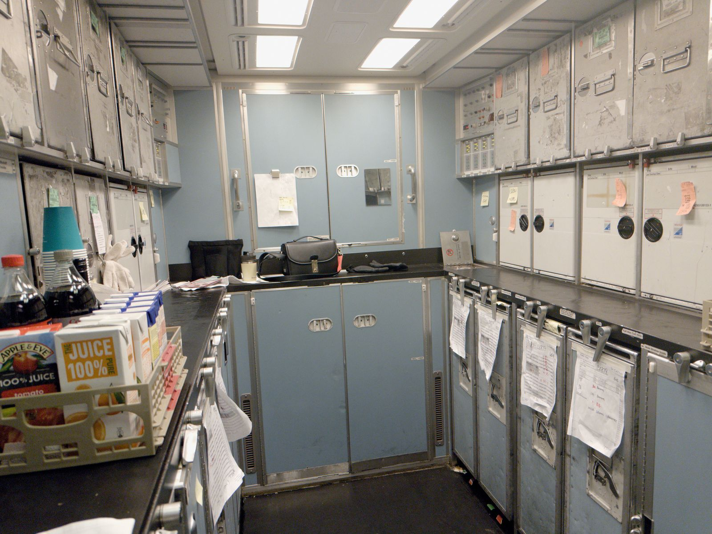

判断依据在**场景 EV 直方图**（曝光卡内）：这一帧从最暗到最亮的可靠内容，
几乎全部落在曲线的黑点与白点之间——亮的一端整个装下，暗的一端只有 0.5%
落在黑点外面。**画面亮度被黑白点整个装下，就是"不用动"的样子。**
后面每个滑条的用武之地，都是直方图上画面内容与黑白点错开的某种情况；
错开不存在时，最好的操作是不操作。

---

## 第一步 · 范围：多少信息上桌？

样张一登场：仰拍逆光钢桥。默认设置把曲线黑点放在 −6.9 EV，但照片里真实
可读的暗部还要深得多——桥底钢架的一部分被当成了纯黑。这不是错误：对天空
主导的逆光场景，默认的自适应方式优先保护中间调。范围工具让你**改变这个
决定**。

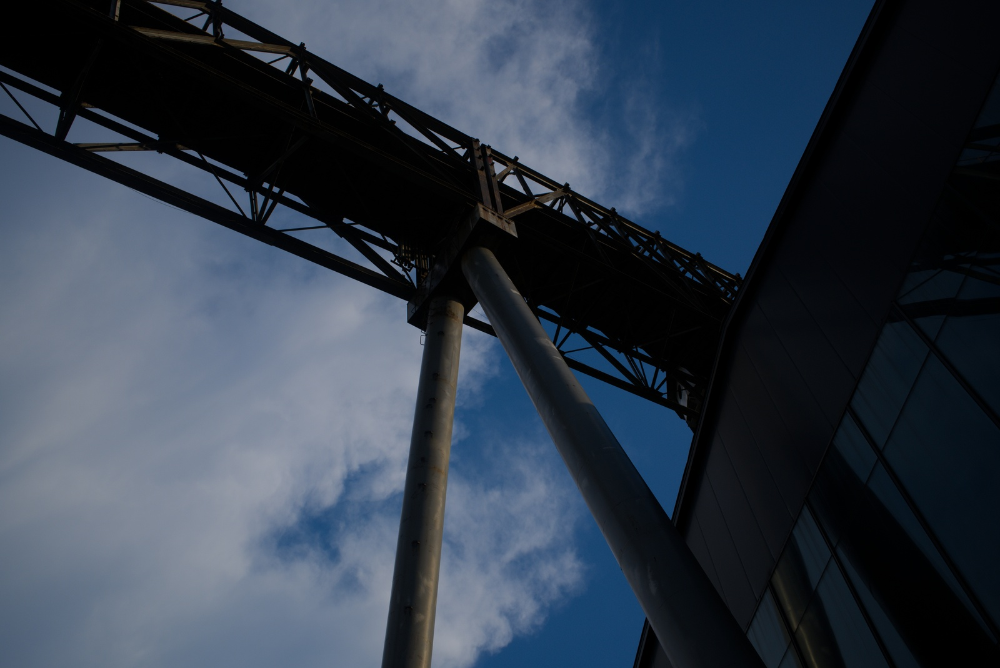

### 端点模式：黑白点跟谁

- **场景自适应**（默认）：黑白点跟着这张照片的亮度分布走。
- **证据界**（传感器实测范围）：黑点钉在传感器实际测到的噪声底，白点只信
  真实测到、没有过曝的信号。本样张切过去后黑点从 −6.9 下探到 −8.6 EV——
  暗部多出 1.7 档可以显示。整体亮度不变（中灰还是中灰），画面不会跳。

动了会发生什么：原来被当成纯黑的暗部，重新获得显示机会。也可能发生反方
向的事——高 ISO、小底机型的照片上，传感器噪声底会比统计黑点还**高**，
切过去暗部反而变窄：实测范围不是
"更宽"的同义词，它只是把黑白点的依据从"这张照片的统计"换成"传感器实际
测到了什么"，两个方向都可能。

### 趾部收黑：暗部在哪里落进黑

实测范围只是放行，AgX 的趾部默认仍然很陡，放进来的暗部会被压得很暗。
趾部收黑向左拉，让曲线更晚落到纯黑——更深的阴影保持可读、更慢地沉下去。
黑点、白点和整体亮度都不动。

本样张：实测范围 + 趾部收黑 −2。看桥底钢架同一处的前后：

| 默认 | 实测范围 + 趾部收黑 −2 |
|---|---|
| 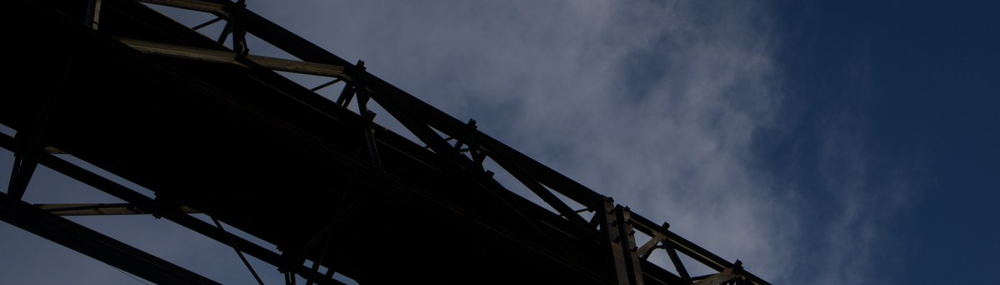 | 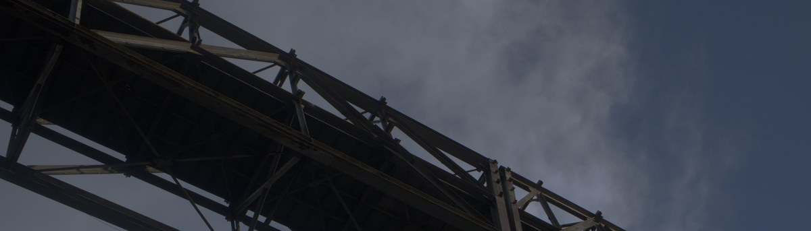 |

观察要点：腹杆、铆钉、锈迹从剪影里浮出来；天空完全没有参与——这是滑条
的设计保证（它只改暗部形状，不碰高光和黑白点），不是运气。

### 肩部收白：高光在哪里升到白

高光那一侧的对应控制：决定曲线在哪个亮度升到"接近白"。向右推迟——高光
层次更晚合并、过渡更柔；向左提早——高光更早变白、更硬。黑点、白点和
整体亮度都不动。

它的主场是样张三：手办头顶的灯盘在 RAW 里真实过曝（约 4% 的像素溢出），
白墙亮区占画面约三分之一——亮部信息真正拥挤的场景。

肩部收白 −1 / 0 / +2 的扫描（灯盘与白墙裁切）：

| 收白 −1（更硬） | 收白 0（默认） | 收白 +2（更柔） |
|---|---|---|
| 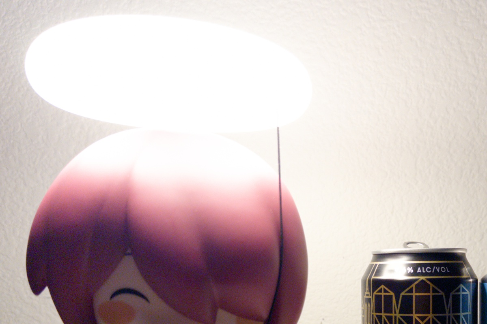 | 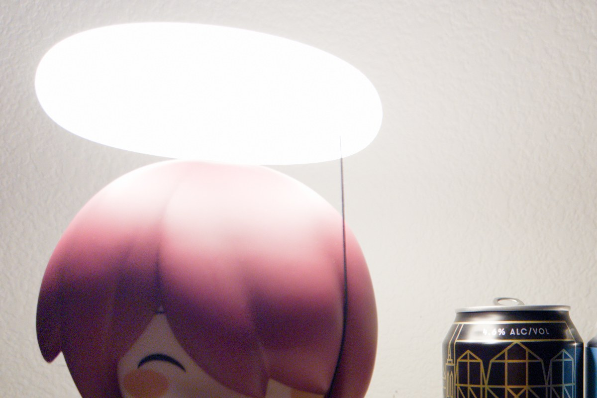 | 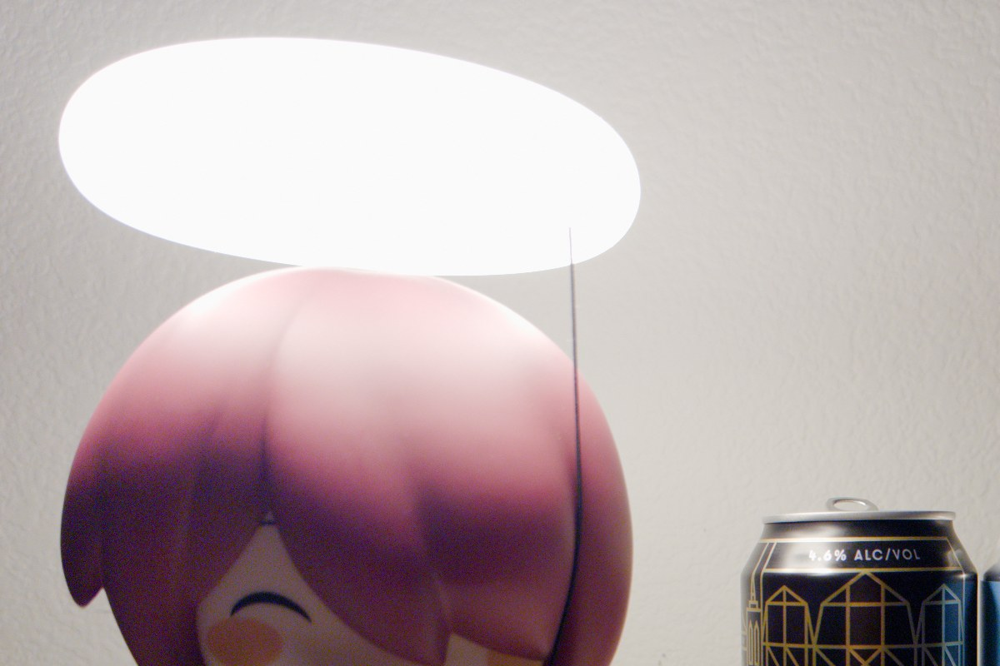 |

动了会发生什么（实测）：从 −1 到 +2，白墙亮区的亮度逐级下降，纯白像素
从 5.3% 降到 0。看灯盘边缘：左边灯与光晕合并成一整块硬白；右边灯盘轮廓、
光晕的渐变、墙面肌理逐级分开。右柔左硬，高光层次以整体亮度为代价被赎
回来。

### 为什么样张一的肩部收白纹丝不动

同一个滑条拉回钢桥样张，从 −1 拉到 +2，画面纹丝不动。**这张照片的曲线
没有给肩部留出调整空间——实测行数字不动就是在告诉你此路不通，不是故障。**
样张三之所以有真实的调整余地，是因为过曝的灯把白点推得足够高。明暗卡的
实测行永远显示实际生效的数字：数字不动，就是这张照片用不上这个滑条。
（原理见[架构文档](ARCHITECTURE.zh-CN.md)"肩部自由度的几何"一节。）

### 暗部过渡与高光过渡：为什么这两个滑条几乎看不见

明暗卡上还有两个没在样张里出场的滑条：**暗部过渡**和**高光过渡**。如实
说明：它们是趾部收黑/肩部收白的**微调档**，设计上就克制到接近视觉阈值——
满幅 ±1 只把趾部/肩部段的弯曲程度乘以约 ±37%，黑点、白点、中灰锚全部按住
不动。在本文这类照片上实测，满幅拉动后的逐像素差异峰值只有 3–9/255 码值，
且集中在深阴影（暗部过渡）或高光滚降区（高光过渡）一个不大的亮度窗口里；
整图 p99 通常不超过 10/255。并排放两张"对比图"你也找不出差别，所以这里
没有对比图。

换算成看得见的单位：满幅暗部过渡约等于趾部收黑 0.6–0.7 档，满幅高光过渡
约等于肩部收白 0.1 档以下。想让暗部或高光真正移动，用趾部收黑/肩部收白——
它们直接指定"近黑/近白发生在第几 EV"，一档的移动在成片上是 9–17/255 的
可见变化；这两个过渡滑条留给"曲线形状还差最后一口气"的场合。另外，肩部
没有弯曲余地的照片（样张一那种）上，高光过渡和肩部收白一同失效，满幅差异
不足 1/255——同一个几何原因，同样如实。

---

## 第二步 · 亮度：这些信息放多亮？

范围定了，桥底细节可读但整体仍暗。这里有两个独立的亮度杠杆——**它们不是
二选一，可以同时使用，而且很多照片就该同时使用**。下面先分开对比，是为了
讲清各自动的是画面的哪一部分；分清之后怎么组合，判断归你。

**曝光 EV**：把整个画面一起提亮。所有区域等比例移动，AgX 的对比与色彩
关系原样保留——画面就像"多曝光了一档"。

**中间调亮度**：最亮处按住不动，把中间和暗部抬起来。代价是中段的明暗
对比被压掉一部分——画面变平一些，色彩也会稍微变淡（第三步要补的就是它）。

常见的组合用法：先用 EV（或"亮度参考"按钮）把整体曝光放到位——这一步
决定高光和光比；整体对了但主体还沉着时，再用中间调把主体补上来——这一步
不惊动已经放好的高光。两个滑条叠加生效，各管各的区域；下面的对比里它们
分开出场，只是为了让你看清这一点。

### 样张一：EV +1 对 中间调 +0.6（实测范围 + 趾部 −2 之上）

| EV +1 | 中间调 +0.6 |
|---|---|
| 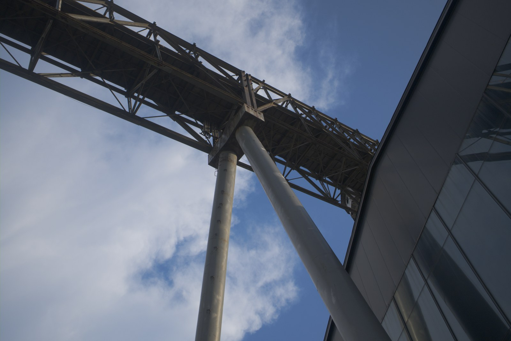 | 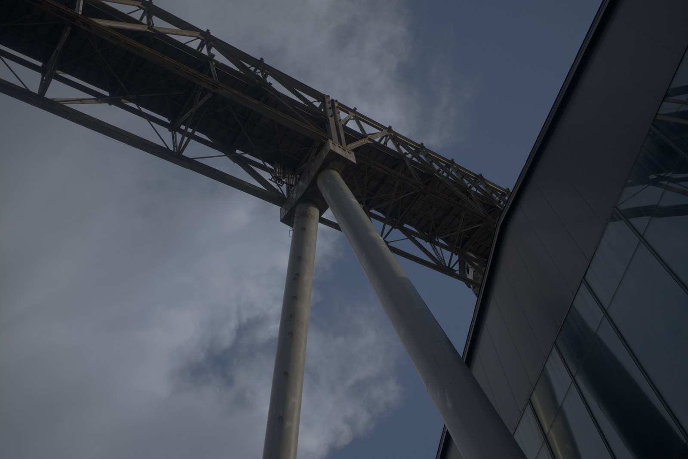 |

三组裁切，三个观察位：

**桥底细节**——两条路都把细节送到可读亮度，但质感不同：

| EV +1 | 中间调 +0.6 |
|---|---|
| 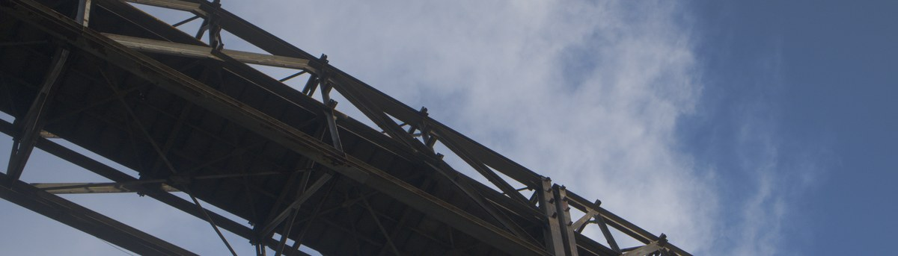 | 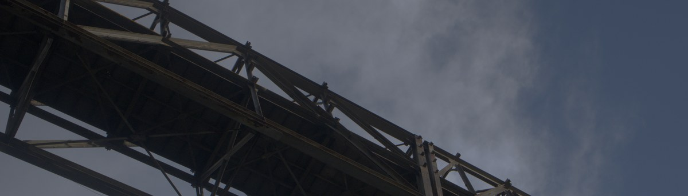 |

**天空**——分歧最大的观察位。EV 让云层与蓝天跟着亮起来、变通透；中间调
把天空按在原处，深色情绪保留：

| EV +1 | 中间调 +0.6 |
|---|---|
| 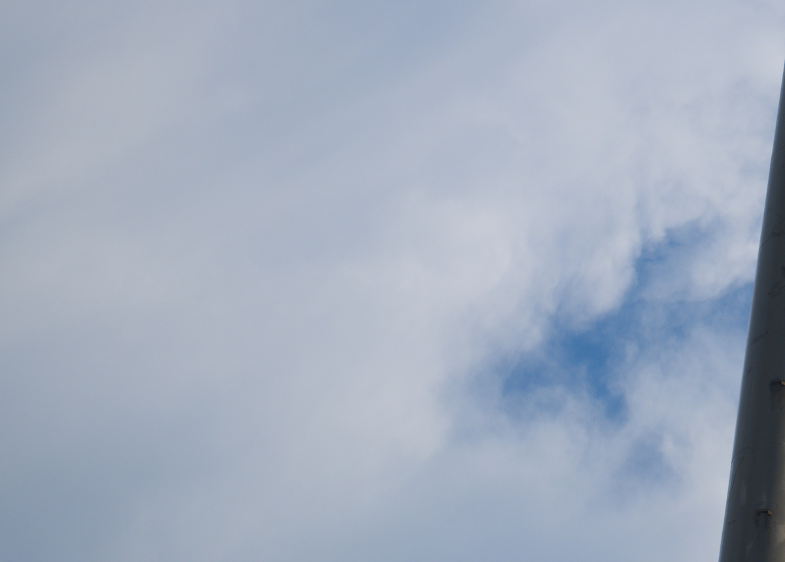 | 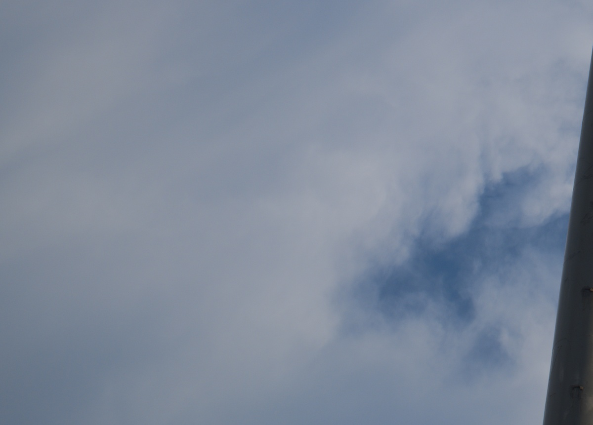 |

**阴影对比结构**——同一段桥架钢梁实测：EV 把明暗拉开，锈色和反光位
跳出来；中间调整体收敛、层次更平——被压掉的中段对比就体现在这里：

| EV +1 | 中间调 +0.6 |
|---|---|
| 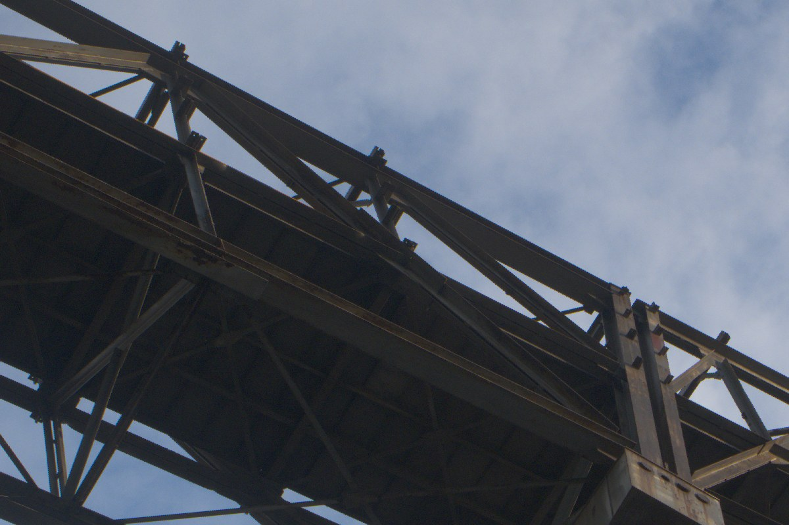 | 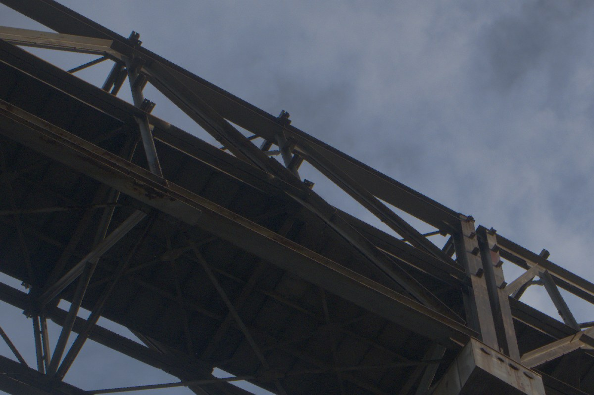 |

### 样张三：灯按住，手办抬起——两个杠杆各动哪里

手办与灯（样张三）。画面里同时有最亮的灯盘和阴影里的主体，两个杠杆的
分工在这里最不容易看错。四张全图：默认、只动 EV、只动中间调、两个一起用：

| 默认 | EV +0.7 |
|---|---|
| 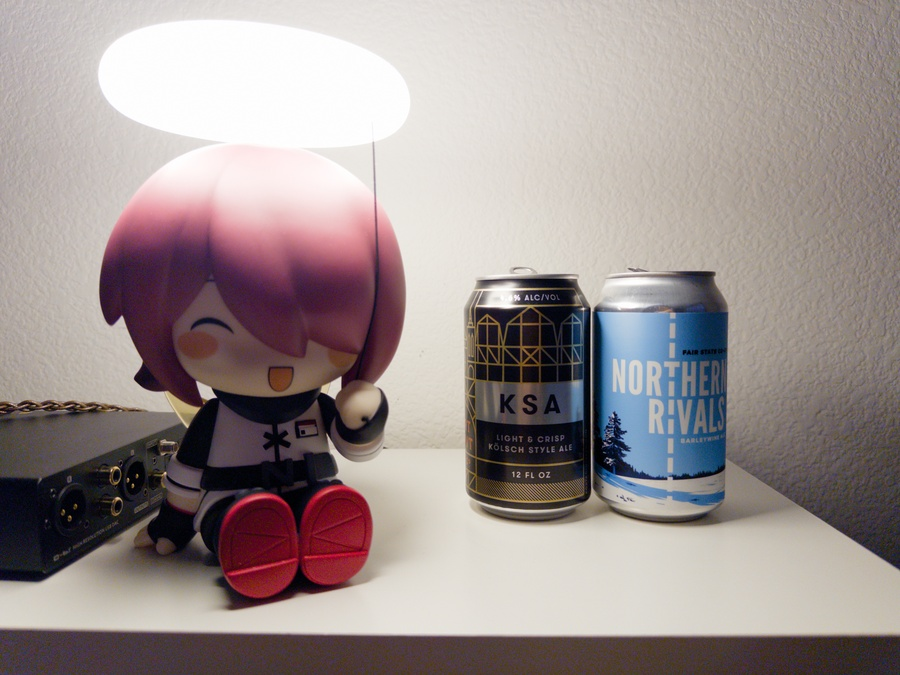 | 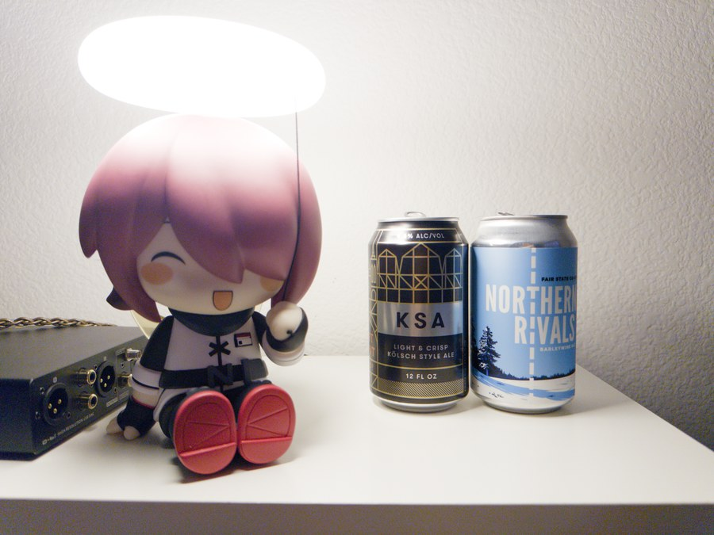 |

| 中间调 +0.8 | 组合 · EV +0.3 + 中间调 +0.5 |
|---|---|
| 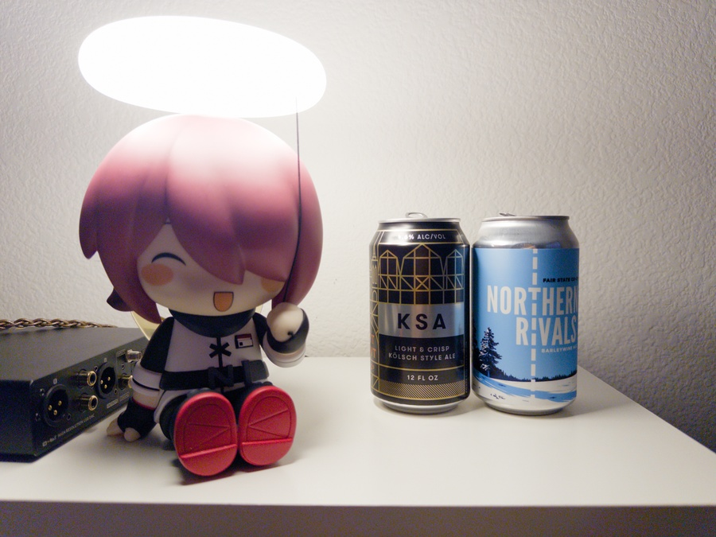 |  |

EV +0.7 把灯、墙、手办**全部**抬起——主体亮了，灯的光晕也涨大一圈、墙面
跟着变白，光比整体上移。中间调 +0.8 只把手办、酒罐和桌面托起来，灯留在
原位。第四张是两个一起用的样子——EV +0.3 先把整体曝光放到位，中间调
+0.5 再把主体补足：主体区亮度与纯 EV 路线相当（实测 +0.9 档对 +1.1 档），
灯区的光晕外扩却只有纯 EV 的一半（+0.16 档对 +0.19 档）——整体提亮和
"灯别跟着涨"两头都要，就是这么配的。两个滑条叠加生效，互不抵消。

先看效果本身。主体特写——中间调 +0.8 把手办的白衣、粉发和酒罐都托亮了
一截（主体区亮度实测 0.36→0.40；EV 是 0.36→0.54，抬得更狠，且连墙
带灯一起）：

| 默认 | EV +0.7 | 中间调 +0.8 |
|---|---|---|
| 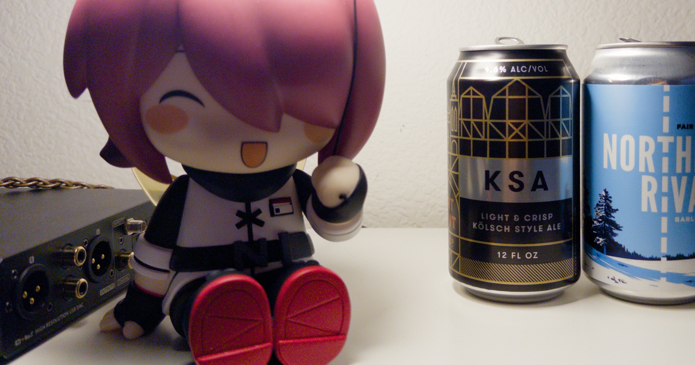 | 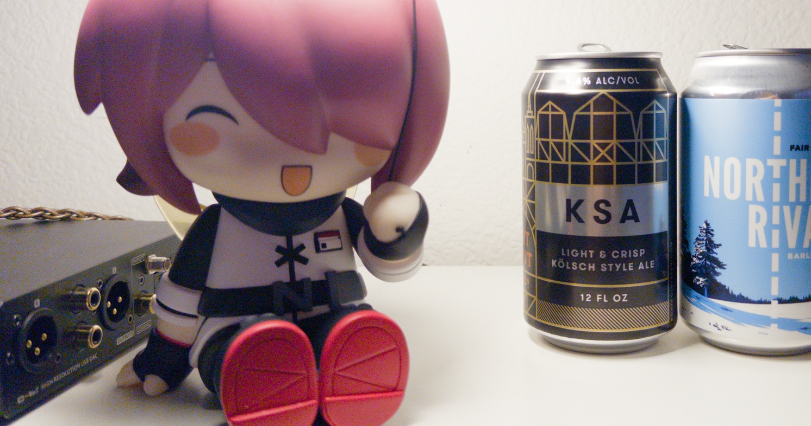 |  |

再看它没动的地方。中间调最容易被看错，灯区特写把三种错觉逐一排除：

| 默认 | EV +0.7 | 中间调 +0.8 |
|---|---|---|
| 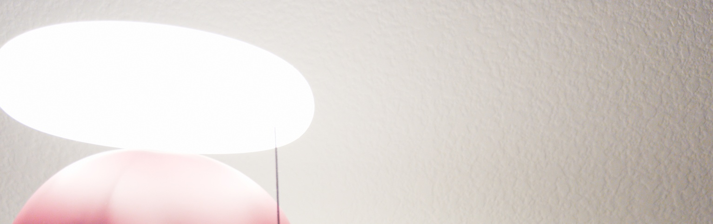 | 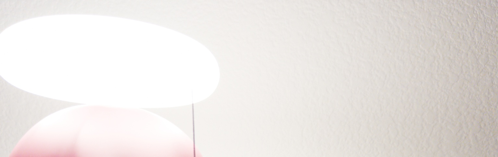 | 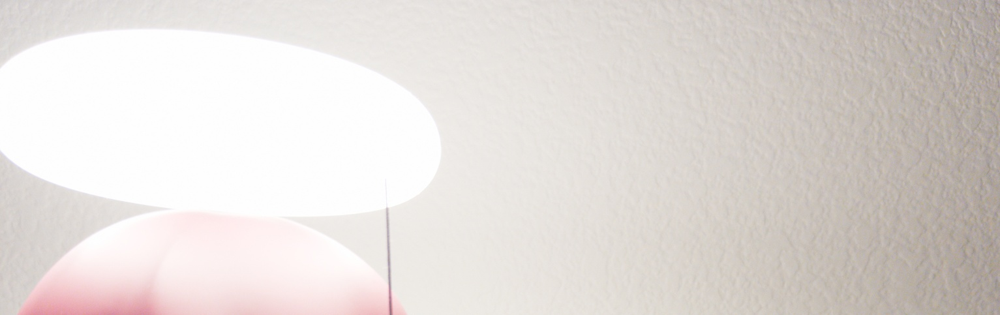 |

- **它不是小号的 EV。**EV 的灯区亮度实测 0.82→0.93，光晕明显外扩；中间调
  的灯区 0.82→0.84，光晕轮廓和默认几乎重合。
- **高光没有被削减。**中间调的灯区不比默认暗一分——它只是留在原位没动。
- **也不是"高光没打开"。**灯盘在 RAW 里真实过曝（肩部一节说过，约 4% 的
  像素溢出），三张里它都已经顶在白点上；中间调改变的只是中灰以下怎么
  爬上来。

代价照例是稀释：中间调 +0.8 后粉发的饱和度实测从 0.45 掉到 0.39——这就是
上一步说的"色彩被稀释"，下一步的浓度补偿为它存在。

---

## 第三步 · 色彩补偿：色彩浓度

**机理先行**：色彩浓度（GUI 名"中频纯度"）不是普通的饱和度滑条。工具会
分析每张照片，算出一个自动补偿值；滑条是这个自动值的**倍率**，1.0 表示
"照单全收自动值"。

样张一用了中间调提亮后，天空发灰、锈色发闷——这就是上一步说的稀释代价。
浓度从 1.0 补到 1.35（这张照片的自动值较高，1.35 已经补到头）：

| 中间调 +0.6，浓度 1.0 | 浓度 1.35 |
|---|---|
| 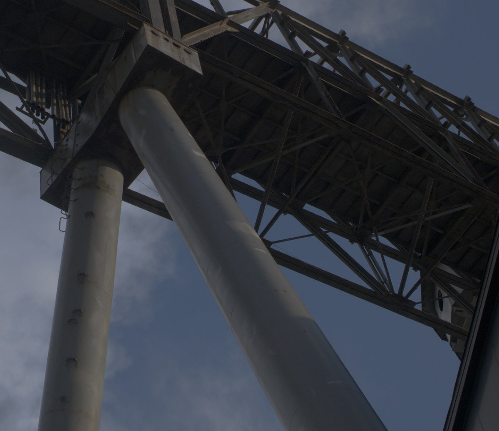 | 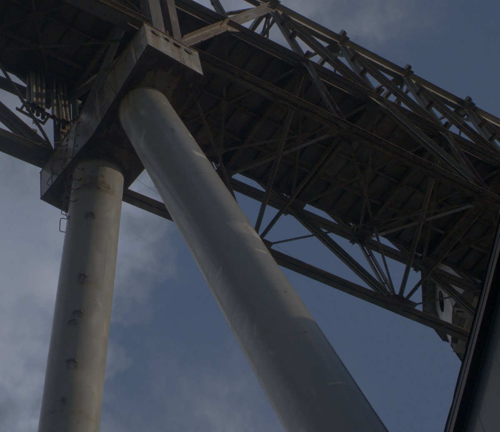 |

观察要点：蓝天的蓝、锈的橙红回到提亮之前的浓度附近；明暗完全不动——它
只加颜色，不碰曲线。

两个事实，如实陈述：

- **纯 EV 提亮通常不需要这一步。**整体提亮不稀释色彩，这是两个杠杆的本质
  区别之一；两者同时用时，需要补的只是中间调贡献的那部分。
- **样张二的浓度滑条没有效果——自动值为 0。**航机厨房这张，场景分析
  判断它不需要补偿，自动值是 0；滑条是倍率，0 乘多少还是 0，拉到头画面
  也完全一致。这和样张一的肩部是一回事：滑条没坏，是这张照片用不上它。
  工具让数字诚实，而不是假装每个滑条在每张照片上都有用。

### 高光褪白：只对彩色的亮部说话

颜色卡上还有一个没出场的滑条：**高光褪白**。它只调整**接近显示白的彩色
像素**的色度——向右让它们更早褪向白，向左保留更多颜色；亮度设计上完全
不动（它在色度平面上工作，明度按住）。中性的白墙、灯芯、冲白的天空数学上
零变化。也就是说，它起作用的前提是画面里存在"又亮又有颜色"的内容——
晚霞的云、彩色灯罩、霓虹的光晕。那种像素上满幅拉动单通道最多约 15/255；
画面里没有那种像素时，它什么都不做。白光的手办灯、人工光的航机厨房都属于
后者；即便是有晚霞的照片，实测整图逐像素 p99 也不超过 10/255——效果只
存在于少数最亮最艳的像素上。并排对比找不出差别，所以这里没有对比图。
HDR 输出下这个滑条被禁用（HDR 的高光色彩几何独立处理，导出时强制为 0），
界面会置灰并注明原因。

---

## 附 · 高光处理与 HDR 亮度

### 高光模式：过曝像素怎么进画面

这是 RAW 解码卡上的开关（LibRaw 解码线）：传感器已经过曝溢出的像素用什么值
进入处理。clip 把过曝像素按在最大值（过曝区是诚实的白）；blend 和 reconstruct
用没过曝的通道去推算过曝区的颜色。

**如实说明：在多数照片上，这三种模式的成片差异小到看不见。**这是设计使然，
不是巧合：过曝区域怎么被压暗、怎么褪色，由"哪些像素真的过曝了"的实测记录
驱动，和填充方式无关；HDR 的亮度预算也只认真实测到的信号。手办灯、舞台灯
这类整块过曝的光源上，三种模式几乎完全相同。

**能看出差别的场景**：部分通道过曝的平坦光源——灯板、灯箱、透光的扩散板。
样张二（航机厨房）的顶灯板正是这种情况，三种模式的差异清楚可见：

| clip（钳制） | blend（混合） | reconstruct（重建） |
|---|---|---|
| 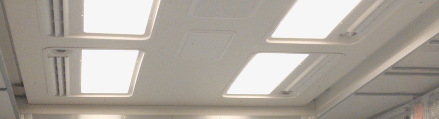 | 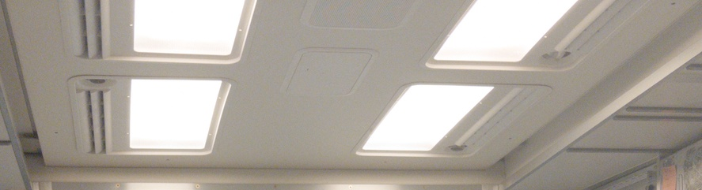 | 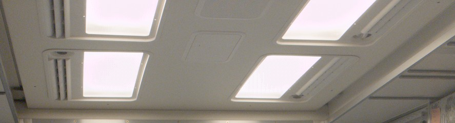 |

观察要点在灯板内部：clip 是平实的白——过曝就承认过曝；blend 用没过曝的
通道混出偏暖的过渡；reconstruct 推算得更多——注意扩散板上**偏品红的色块**，
那是推算出错的样子。重建是推测不是实测，推对了自然，推错了就是这种颜色。
这也是默认用 clip 的理由：诚实的白永远不会错。

反方向——"clip 吃亏、reconstruct 占优"的场景——我们也认真找过：全卡
230 张做了剪切普查，挑出"只溢出一两个通道"占比最高的场景（reconstruct
理论上最有信息可用的地方）逐一渲染，三种模式的成片差异上限只有约 11/255
码值。别的软件里 clip 常见的品红镶边、高光色阶断裂，在 dngscan 里**被剪切
证据机制挡掉了**：过曝区怎么处理由实测的溢出记录决定，与填充方式解耦。
所以不存在"clip 明显吃亏"的样张——不是没找到，是架构不让它发生。默认
clip，看到灯板类光源想试试别的味道再换，就这么简单。

（选 Apple RAW 解码器时没有这个开关：Apple 用自己固定的重建方式。）

### HDR 亮度怎么读

样张三的曝光卡会注记 **p99.99 = +4.85 EV**：这是**可信的最亮信号**——
传感器在过曝之前真实记录到的最亮内容，在中灰之上 4.85 档。减去屏幕的
"纸白"（正常白色的亮度），这张照片有约 **+2.4 档 HDR 可用的额外亮度**——
导出 HDR 时，灯和它的光晕可以比纸白亮 2.4 档，而且每一档都有实测依据。
你设置的 HDR 余量上限（默认 +3.0）是天花板，实际使用取两者较小值：这张
用 +2.4。这条注记不显示的时候，说明真实测到的高光证据不足——工具不用
估计值冒充测量值。

---

## 快速表：动了会发生什么

| 滑条 | 动了会发生什么 |
|---|---|
| 端点模式 → 证据界 | 黑白点从"这张照片的统计"改钉到"传感器实测范围"；原先被当成黑的暗部获得显示机会；整体亮度不动。高 ISO 照片上实测范围也可能比统计更窄 |
| 趾部收黑 向左 | 更深的阴影保持可读、更晚落进黑；黑白点和中间调都不动 |
| 肩部收白 向右 | 高光层次更晚合并、过渡更柔，亮区整体略暗；曲线没有余地时纹丝不动，实测行会告诉你（样张一） |
| 曝光 EV + | 整个画面一起提亮：亮、中、暗全部上移一档，AgX 的对比性格原样保留；与中间调亮度可叠加使用 |
| 中间调亮度 + | 最亮处按住、中间和暗部抬起；中段对比被压掉一部分——画面变平、色彩稍微变淡；常在 EV 定好整体之后补主体 |
| 中间调对比 | 围绕中灰改中段的明暗距离；与亮度同族，通常在亮度之后微调 |
| 暗部过渡 / 高光过渡 | 趾部/肩部形状的微调档，满幅只等于趾部收黑 0.6–0.7 档、肩部收白 0.1 档以下——变化在视觉阈值附近，想看见移动用趾部收黑/肩部收白 |
| 色彩浓度 ↑ | 自动值 > 0 时颜色加浓（补偿中间调提亮的稀释）；自动值 = 0 时什么都不发生（样张二） |
| 高光褪白 | 只动"又亮又有颜色"的像素的色度；中性亮部零变化；HDR 输出下禁用 |
| 高光模式 | 解码时对过曝像素的填充方式；多数照片看不出差别，灯板这类平坦光源上可见（reconstruct 可能推出错误颜色）；默认 clip 即可 |

## 每个滑条一句话

- **端点模式**：曲线黑白点的依据——这张照片的统计（自适应）还是传感器实测范围（证据界）。
- **趾部收黑**：暗部在哪个亮度落进黑；明暗卡实测行显示实际生效的值。
- **肩部收白**：高光在哪个亮度升到白；右柔左硬；没有余地时如实不动。
- **曝光 EV**：整个画面一起提亮或压暗；AgX 原生渲染特性完整保留。
- **中间调亮度**：最亮处不动，中间和暗部抬起；有色彩变淡的代价。
- **中间调对比**：围绕中灰改中段的明暗距离。
- **暗部过渡 / 高光过渡**：趾部/肩部形状的微调档；效果在视觉阈值附近，属设计克制而非故障。
- **色彩浓度**：自动补偿值 × 你的倍率；自动值为 0 时无事发生。
- **高光褪白**：接近显示白的彩色像素往白里褪多少；中性亮部不动；HDR 下禁用。
- **高光模式**：解码时对 RAW 过曝像素的填充方式；成片差异通常很小，默认 clip 即可。

本文全部对比图由 dngscan 按文中所列参数实际渲染（半尺寸解码；全图长边
1600px、裁切 1200px 原生像素）；文中全部数字来自对这些渲染与场景分析的
直接测量，无任何后期修饰。

样张出处：大逆光桥 `DSCF0214.RAF`（X100VI）、航机厨房与手办灯为
iPhone 16 Pro 的 ProRAW DNG。
