# AgXRAW 胶片参考印相外观层：研究结论与实施计划

> 状态：设计提案，尚未实现。
>
> 前置条件：现行 film v2 的 Stage A、B1、解析 timing、相纸曲线、B2 与空间成像继续作为技术底座。本计划不回退已经通过的光谱、积分、密度域和中性锚验证，也不把未知化学过程伪装成测量数据。
>
> 目标：解释并解决“full 链数学正确，但与 Dehancer/Filmbox 一类成片观感相比仍然偏弱”的问题。新增的不是一只来源不明的 LUT，而是一层有明确处理空间、来源、边界和验收方法的 **reference-print appearance**。

## 1. 结论先行

现有 full 链的主要问题不是变换幅度太小，也不是相纸响应必须继续放大，而是系统只完成了“介质模型”，没有完成“参考印相解释”。这两件事必须分开：

1. **technical base** 回答材料在当前公开数据和建模假设下怎样响应；
2. **reference print** 回答怎样把这份低对比、带介质偏色的结果解释成一张预期的成片；
3. **user grade** 回答用户还想怎样修改照片。

Dehancer 明确说明其 profile 保留实拍、光学印相得到的黑白点、对比和色偏，再由 Expand、Print、Color Density 等工具完成显示解释；Filmbox 更直接地把 negative、lab 和 print 分开，并指出 print interpretation 对最终 look 往往比负片本身更重要。Kodak 2383 的资料也说明打印材料的 toe、D-max 和三层曲线对黑位与中性高光有直接影响，但材料曲线本身并不规定唯一的数字成片。

因此，AgXRAW 不应该把 full 的光谱链改得更“不准确”以追求强烈观感，也不应该简单提高饱和度。正确方向是：

```text
measured/modelled medium response
    + declared reference-print appearance
    + optional user grade
```

三层分别保存来源，关闭 reference-print 时现行 technical full 必须逐字节不变。

## 2. 公开资料给出的边界

### 2.1 Dehancer：采样结果与成片解释是两步

Dehancer 的公开方法包含三个关键信号：

- 负片会被真实光学印到正介质，再采样成 profile；
- 每卷在 `-2/0/+2 EV` 采样，由非线性模型在曝光状态间插值；
- profile 本身通常低对比、保留余量，随后由 Expand、Print、Film Developer 与 Color Density 形成更完整的观看结果。

这说明“profile 与 AgXRAW full 相差不强”不能直接证明 full 错了；商业产品的强观感还来自 profile 之外的解释层。尤其是 Dehancer 的 Expand 并非输出端普通 Levels，而是改变 profile 如何把场景范围放入显示范围，以保留滚降而不是事后裁切。

### 2.2 Filmbox：print interpretation 是独立自由度

Filmbox 的 Print 文档把同一负片分为：

- `Full`：更接近 contact print；
- `Standard`：亮色更开放、绿色约束更少、tone 更平滑；
- `Extended`：更接近扫描/telecine，灰轴更中性、黑位更低、色域更开放。

其 `Color`、`Neutralize Balance`、`Black Point` 分开，说明“保留印相的色彩扭曲”“只中和灰阶色偏”“改变黑位”不是同一个操作。Lab 模块又把 Richness、Vibrance 与 Color Density 分开：Richness 主要增强低到中等纯度颜色；Vibrance 更偏暗色并保护肤色；Color Density 改变饱和颜色的亮度而不直接改变饱和度。

这正是现有 AgXRAW 缺少的表达能力。当前 `full` 只有介质响应、灰阶中性化、全局显影标量与高光 compression，没有按 stock/print 组合定义的曝光依赖 hue/chroma/lightness 路径。

### 2.3 ACES/OCIO/FilmLight：look 必须声明处理空间

ACES 把 Look Transform 定义为参考空间到参考空间、位于输出变换之前的系统性外观变换；OCIO 的标准化工具也把 hue-hue、hue-saturation、hue-luma、luma-saturation、sat-sat 与 sat-luma 分开。FilmLight 同样把 scene look 与 DRT/输出管理分开。

由此得到两条硬约束：

- 胶片 reference-print 不能复用现行在 sRGB/P3 输出空间执行的通用 `look.py`；否则同一配方会随输出色域改变；
- reference-print 必须在共同的 display-linear Rec.2020/参考空间中执行，再交给 gamut fit 和输出编码。

### 2.4 不可从公开数据推出的内容

公开 datasheet、染料谱、相纸感度和曲线不足以唯一推出商业插件的最终 palette。缺失信息包括真实乳剂层间作用、DIR coupler、工艺漂移、扫描/投影解释、厂商私有采样与主观调校。任何补足都必须标为：

- `measured`：项目自己有可复现的实测 oracle；
- `modelled`：由公开数据与声明假设推导；
- `editorial`：按目标观感编写，不冒充材料事实。

首版 reference-print 全部属于 `editorial`。Dehancer/Filmbox 只作为功能分解与视觉基准，禁止反推、打包或分发其专有 LUT/profile。

## 3. 当前代码的具体缺口

### 3.1 `observe` 的 style pairing 只是微调

`FILM_STYLE_PAIRINGS` 目前只组合：

- 胶片前馈分离强度；
- AgX primaries 的 `base/muted/punchy`。

它在 `observe` 中合理，因为 formation 仍是 AgX；但这是克制的全局几何调节，不足以描述 Portra 的肤色/绿系选择、Velvia 的分区色密度、电影正片的冷阴影与暖高光等曝光依赖路径。现有文档测得的差异也明确属于“精修级”。

### 3.2 `full` 没有 stock-specific appearance

`full` 当前完成：

```text
scene Rec.2020
-> observer/layer exposure
-> characteristic curves/density
-> B1/timing/paper curves/B2
-> bounded 或 datasheet neutralization
-> bloom
-> output
```

这条链有 stock-specific medium response，却没有 stock/print-specific 的 reference interpretation。`editorial_custom` 只有 contrast、fog、color density 三个通用标量；色头是 Y/M 印相控制；film compression 只处理高光。它们都不是选择性 palette。

### 3.3 `bounded` 中性化可能掩盖部分介质性格

`bounded` 对每个像素按亮度曝光查询中性阶 cast 并逐通道相除。它的数学合同清楚，但语义是“整个灰阶技术中性化”，不只是把 EV0 印相到中性。对 reference-print 来说，这会同时削弱曝光相关的冷阴影/暖高光路径。

需要新增一个中间策略：只在 EV0 解一个常数 balance，使中灰中性，但保留灰阶两端的 crossover。它不能替换旧默认，而应成为 reference-print 配方的显式选择。

### 3.4 现行通用 look 的位置不对

`look.py` 在 Rec.2020 转成 sRGB/P3 后，于输出色域 Oklab 中运行。它适合用户级显示滤镜，不适合胶片 recipe：

- sRGB 与 P3 会得到不同的 look 几何；
- HDR full 路径不允许该 grade/look；
- 处理位置晚于 gamut 选择，无法成为稳定的 stock 语义。

可以复用周期 hue 插值、软门控等数学工具，但不能直接复用处理位置或现有资产。

## 4. 新的语义与产品结构

full 路径增加三种明确状态：

| 状态 | 含义 | 现有行为 | 默认计划 |
|---|---|---|---|
| `technical` | 只运行现有可测/建模介质链 | 完全等于当前 full | 保留且逐字节冻结 |
| `reference` | technical + 项目声明的参考印相外观 | 新增 | A/B 后再决定是否成为 GUI 默认 |
| `custom` | reference + 少量用户外观调整 | 新增二期 | 不改变 recipe 的 provenance |

`observe` 继续保留为“AgX 胶片观察”，不强行并入。长期 GUI 名称建议为：

- `AgX 胶片观察`：当前 observe；
- `胶片技术链`：full technical；
- `胶片参考印相`：full reference。

CLI 旧值保留兼容；新增字段不能静默改变旧命令输出。

## 5. 目标拓扑

```mermaid
flowchart LR
    S["scene-linear Rec.2020"] --> A["Stage A<br/>observer -> layer exposure -> density"]
    A --> NFX["negative optics<br/>halation + density grain"]
    NFX --> B1["B1<br/>negative density -> paper log exposure"]
    B1 --> T["timing + paper curves"]
    T --> B2["B2<br/>positive density -> viewed Rec.2020"]
    B2 --> NB["neutral policy<br/>technical / EV0 balance / native"]
    NB --> APP["reference-print appearance<br/>common Rec.2020 reference space"]
    APP --> PB["print-medium bloom"]
    PB --> GF["gamut fit"]
    GF --> OUT["sRGB / P3 / SDR-HDR delivery"]

    APP -. "optional and editorial" .-> META["recipe id + provenance + hash"]
```



顺序选择：reference-print appearance 放在 B2 和 print-medium bloom 之间。理由是它描述“这份正介质/参考印相如何被解释”，而 bloom 应扩散已经形成的印相颜色。若未来增加 DI/show look，那是另一层，放在 bloom 之后且不得复用同一字段。

## 6. 外观层数学

### 6.1 输入坐标

输入为 B2 后、输出 gamut fit 前的 `rgb_rec2020 >= 0`。对每个像素计算：

```text
Y = dot(rgb, [0.2627, 0.6780, 0.0593])
e = log2(max(Y, eps) / 0.18)
(L, a, b) = Oklab(rgb_rec2020)
C = sqrt(a^2 + b^2)
h = atan2(b, a) mod 2pi
```

这里 Oklab 只承担局部均匀的对手色坐标，`e` 才是 recipe 的明暗坐标。不能直接用 Oklab `L` 作为曝光轴，否则 SDR/HDR 和不同白点下的同一场景位置会漂移。

### 6.2 三个正交色彩场

每个 recipe 发布三个二维周期场，横轴 hue、纵轴 exposure EV：

```text
delta_h = F_h(e, h)                         # hue path，弧度
g_c     = exp(F_c(e, h) * w_c(C))          # chroma gain
delta_L = F_d(e, h) * w_c(C)                # color density/lightness
```

应用：

```text
h' = h + strength * delta_h
C' = C * exp(strength * log(g_c))
L' = L + strength * delta_L
```

`w_c(C)` 在中性轴趋近 0，保证无彩色严格不被 hue/chroma/density 场污染。建议：

```text
w_c(C) = C^2 / (C^2 + C0^2)
```

`C0` 由 recipe 声明，但全局限制在小范围内，避免木头、肤色等低纯度颜色因阈值突变。

三个场必须分开，原因是：

- hue rotation 不能用 RGB 矩阵或饱和度近似；
- richness 是“低/中纯度颜色增加较多，高纯度颜色增加较少”；
- color density 是改变彩色区域的明度/能量关系，不等同于加饱和。

### 6.3 Richness 与高纯度软肩

为避免普通 saturation 的霓虹感，在基本 `F_c` 外加饱和度维软肩：

```text
r(C) = 1 / (1 + (C / Ck)^p)
log(C'/C) = strength * F_c(e,h) * r(C)
```

这使增益主要落在低到中等 chroma；已经很饱和的像素只移动少量。`Ck` 与 `p` 是 recipe 资产，不先暴露到 GUI。

首版不再额外实现一个含义重叠的 Vibrance。若实拍验证表明需要“暗色更浓、肤色更弱”的独立控制，再增加：

```text
v(e,h,C) = dark_weight(e) * skin_protect(h,e) * gamut_headroom(rgb)
```

不能只按 hue 定义肤色，因为木头、砖墙和皮肤会重叠；至少还要结合 chroma 与曝光范围。

### 6.4 Color Density

Color Density 只对有彩色像素改变明度，不直接改变 `C` 或 `h`：

```text
L_density = L + strength * F_d(e,h) * w_c(C)
```

符号合同必须固定：正值表示颜色更“密”，即适度降低对应 `L`；资产中可存 `density_ev`，运行时统一转换，避免不同 recipe 对正负号理解相反。

实施时要验证 Oklab `L` 变化是否保持目标色度；若重建 RGB 后实际 chroma 偏移超门槛，应改为固定 Oklab `a,b`、仅变 `L` 后再做一次有界色度补偿，而不是接受隐式饱和变化。

### 6.5 灰阶 tone bias 独立

灰阶冷阴影/暖高光不是 palette 场的副产物。另设：

```text
n(e) = [delta_a(e), delta_b(e)]
```

其默认在 EV0 有死区或精确为零，并有单独强度。该项对应 print balance 的观看偏色，不能与 `neutralization_policy` 混用：

- neutralization 决定技术链保留多少中性阶 crossover；
- `n(e)` 是 reference recipe 主动加入或保留的印相倾向。

首版 recipe 可以只使用前者，不主动合成新的灰阶 split tone。只有 A/B 证明需要时才发布 `n(e)`。

### 6.6 插值与边界

资产建议使用 `24 hue knots x 5 EV knots`：

```text
hue: 0..345 degrees，15-degree 周期
EV:  [-6, -3, 0, +3, +6]
```

约束：

- hue 首尾周期 C1；
- EV 轴用单调/有界三次 Hermite 或平滑 Catmull-Rom，并钳制过冲；
- EV 域外保持端点，不外推；
- `strength=0` 走严格恒等快路径；
- 所有输出 finite，负 RGB 在 gamut fit 前只允许来自已声明的对手色重建，并必须计数；
- hue 变换雅可比不得翻转，禁止局部色相 foldover。

### 6.7 为什么首版不用 3D LUT

3D LUT 能表达结果，但不适合作为首版 authoring contract：

- 很难区分 hue、richness、color density 与 neutral bias；
- strength 插值容易变成输出 RGB 混合，物理和感知语义都不清楚；
- 资产 provenance 与审查困难；
- HDR、P3/sRGB 一致性更难验证。

首版用小型参数场，运行时可以在稳定后离线烘成加速 LUT，但参数场仍是唯一规范和测试 oracle。

## 7. 印相范围与 tone 的处理

Dehancer 的明显成片感还来自把 profile 的低对比范围解释到显示范围。这个问题不能由 palette 场代劳。

### 7.1 不使用输出端 Levels

禁止在 B2 后简单拉黑白点。它会：

- 裁掉介质 toe/shoulder；
- 让 RGB 通道独立触顶；
- 把 reference-print 与 output encoding 混在一起。

### 7.2 参考印相 tone-fit 的建议位置

负片 exposure 不应被 reference-print tone-fit 偷改，否则 grain/halation 会像重新曝光。建议在 B1 后、相纸 1D 曲线前，对公共 paper exposure 坐标施加一个中灰锚定、C1、单调的标量 warp：

```text
u_j = ell_j(D_neg) + tau_j
u_bar = sum_j w_j * u_j
delta_j = u_j - u_bar
u_bar' = f_print(u_bar)
u_j' = u_bar' + delta_j
D_print,j = H_paper,j(u_j')
```

要求：

- `f_print(u_mid)=u_mid`；
- 一阶导数正；
- 通道差 `delta_j` 默认保持，避免 tone-fit 变成隐性白平衡；
- toe/shoulder 端点平滑进入相纸可用域；
- 变化发生在相纸曲线输入，保留介质自己的非线性和色彩耦合。

该功能属于第二阶段。首版先完成 palette/reference recipe，避免 tone 与 color 同时变化导致无法归因。

## 8. 中性化策略重构

新增内部枚举：

| 新名称 | 算法 | 用途 |
|---|---|---|
| `technical-neutral` | 当前 `bounded` 曝光依赖逐像素中性化 | 现行 full 默认，冻结 |
| `print-balanced` | 只用 EV0 解出的常数三通道 balance | reference-print 推荐起点 |
| `native` | 不做后校正，等于当前 `datasheet` | 研究/介质原样 |

迁移必须显式：

```text
bounded   -> technical-neutral
datasheet -> native
```

旧 CLI 与保存设置继续解析，技术模式结果不得变化。`print-balanced` 的构造验收：输入任意中性 EV0 必须输出中性 0.18；其他 EV 只受光谱链和 recipe 影响，不再逐像素消除 crossover。

## 9. 资产合同

每个 stock/print 组合发布一份小型 recipe：

```text
dngscan_assets/film_appearance/
  portra400__endura_reference_v1.npz
  velvia100__reversal_reference_v1.npz
  vision3_250d__2383_reference_v1.npz
```

建议 schema：

```json
{
  "schema": 1,
  "recipe_id": "portra400__endura_reference_v1",
  "stock_id": "portra400",
  "medium_id": "endura",
  "process_space": "display-linear-rec2020/oklab + luminance-scene-ev",
  "provenance": "editorial-authored",
  "neutralization_policy": "print-balanced",
  "ev_knots": [-6, -3, 0, 3, 6],
  "hue_knots_deg": [0, 15, "...", 345],
  "hue_delta_deg": "[5,24]",
  "log_chroma_gain": "[5,24]",
  "density_ev": "[5,24]",
  "neutral_bias_ab": "[5,2]",
  "chroma_knee": 0.0,
  "chroma_power": 2.0,
  "source_notes": [],
  "builder_commit": "...",
  "sha256": "..."
}
```

实际 npz 使用 float32；JSON 仅示意语义。加载器对 schema、process space、stock/medium 配对和哈希 fail closed。

### 版权与来源

- 不提交 Dehancer、Filmbox、厂商 LUT 或从其文件反演的表；
- 可用其公开文档定义功能对照，不把其视觉输出当可再分发资产；
- recipe 由项目自己的合成 chart、合法自有 RAW 和人工 A/B 编写；
- 若未来有自采胶片色卡，provenance 升级为 `empirical-own-target`，并保留拍摄、显影、印相、扫描条件与原始测量哈希。

## 10. 首批 recipe 的目标，不冒充测量

先做四个组合，覆盖差异最大的家族：

1. `Portra 400 + Endura`：低/中纯度肤色略更红暖，黄绿温和偏黄，高纯度颜色软限制，蓝青不过亮；
2. `Velvia 100 direct`：绿/青/洋红分离更明确，彩色区域有更高 color density，高纯度仍受软肩，肤色保护更强；
3. `Vision3 250D + 2383`：暗色更密，肤色温暖，青蓝阴影有轻微冷向，亮部向暖/绿后平滑回中性；
4. `Vision3 250D extended`：保留电影负片家族方向，但降低灰轴偏色、放宽 gamut、压低黑位，作为 scan/telecine 解释对照。

这些是可检验的 editorial targets，不写成“严格复现 Portra/2383”。每个 recipe 先在合成 chart 上定义，再由真实场景微调；禁止只凭单张照片手调。

## 11. 运行时接线

新增：

```python
@dataclass(frozen=True)
class FilmAppearancePlan:
    mode: str                  # technical | reference | custom
    recipe_id: str | None
    strength: float            # 0..1.5, 0 exact identity
    neutral_policy: str        # technical-neutral | print-balanced | native
    richness_delta: float      # custom only
    color_density_delta: float # custom only
    neutral_bias_strength: float
    provenance: str
    asset_hash: str | None
```

新增模块：

```text
dngscan/film_appearance.py
tools/film_palette_probe.py
tools/build_film_appearance_recipe.py
tests/test_film_appearance.py
```

接线位置：

```text
film_develop._apply_film_core_v2
    B2
    -> neutral policy
    -> apply_film_appearance_rec2020()
    -> print bloom
    -> return mapped Rec.2020
```

无空间效果的 chunk-stream 路径与有 bloom 的顺序行带路径必须调用同一个 appearance 函数。recipe 数组按 `(resolved_path, mtime, hash)` 缓存；每块不得创建全帧临时缓冲。

不要把 appearance 接到 `render.py` 的 output-gamut look 分支，也不要让 observe 自动读取 full recipe。

## 12. SDR、P3 与 HDR 合同

### 12.1 SDR 与色域

appearance 在共同 Rec.2020 参考空间完成，然后才转换 sRGB/P3。验收的是 gamut fit 之前 hue/chroma 路径一致；sRGB 因容量更小可以压缩更多，但不能换一套 recipe。

### 12.2 Film HDR

现行 full HDR 的 SDR base 直接复用 standalone SDR film render，HDR numerator 在 film mapped Rec.2020 上扩展。appearance 必须在 `mapped` 被捕获前完成，因此：

- SDR base 与单独 SDR 导出仍逐字节一致；
- HDR body 使用同一 reference-print 外观；
- gain 仍满足 `>= 1`，reference white join 不变；
- HDR 高光超出 recipe EV 网格时保持最高 EV 端点，不能外推产生新的 hue 跳变；
- recipe 开关不得令 HDR 内容余量从有变无，若发生必须报告而非静默降级。

不为 HDR 单独编一套 palette。若未来证明更高显示亮度需要不同的 appearance，则必须作为新的 viewing recipe，不能偷偷复用同一 id。

## 13. GUI 与 CLI

首版只暴露三个控件：

- `胶片解释`：技术链 / 参考印相；
- `参考印相强度`：0..150%，默认 100%；
- `灰阶平衡`：技术中性 / 印相中灰 / 介质原样。

高级 custom 二期再露：

- `颜色丰度`：调整 richness；
- `色密度`：调整 chromatic lightness；
- `灰阶偏色`：调 neutral bias 强度。

避免直接暴露 hue sectors、chroma knee 和内部 spline。GUI 文案只说明预期画面，不宣称材料真实性。

CLI 建议：

```text
--film-appearance technical|reference|custom
--film-appearance-strength 0..1.5
--film-neutralization technical-neutral|print-balanced|native
--film-richness -1..1
--film-color-density -1..1
```

旧 `--film-neutralization bounded|datasheet` 作为弃用别名保留一版，并在报告里输出规范化后的新名称。

## 14. 测量与诊断工具

### 14.1 合成 palette probe

生成固定场景线性 Rec.2020 测试体：

- 24 个 hue；
- 4 个 chroma 层级；
- EV `[-6,-4,-2,0,+2,+4,+6]`；
- 完整中性 ramp；
- Rec.2020 边界与肤色/叶绿/青天重点 patch。

输出：

- `delta hue(e,h,C)`；
- `log2 chroma ratio`；
- `delta L / delta Y`；
- neutral drift；
- gamut fit 前负值与超域比例；
- technical/reference 的 DeltaE00 图。

### 14.2 真实场景矩阵

至少固定六类自有 RAW：

1. 日光肤色；
2. 钨丝/酒吧肤色；
3. 混合 LED 与霓虹；
4. 叶绿、青天与高饱和建筑色；
5. 产品色和中性物；
6. 高动态高光与深阴影。

每张固定 RAW 解码后，使用相同 WB、曝光、highlight、输出 gamut 和 JPEG 编码，生成：

```text
AgX base | film technical | film reference | reference difference x4
```

Dehancer/Filmbox 只做本地受控观察，不进入 golden 或公开资产。比较必须拆开：

- profile/negative only 对 technical；
- profile + print/expand 对 reference。

否则会把商业产品的 appearance 层误归因于胶片介质本身。

## 15. 验收门

### 15.1 数学与回归

- `technical` 对当前 main 全部 golden 逐字节一致；
- strength 0 严格恒等，无额外 gamut fit 变化；
- 中性输入在关闭 neutral bias 时保持 `a=b=0`，EV0 DeltaE00 `< 0.1`；
- hue 周期边界值和一阶导连续；
- 无 NaN/Inf，局部 hue 映射不 fold；
- `print-balanced` 的 EV0 中性由构造保证；
- sRGB/P3 在 gamut fit 前的 appearance 输出逐元素相同；
- HDR SDR base 与 standalone SDR 逐字节一致，gain `>=1`，join C1 不回归。

### 15.2 可见性，不再用“看起来不一样”作模糊标准

针对 recipe 声明的重点 patch：

- reference 对 technical 的中位 DeltaE00 目标 `3..6`；
- 重点 hue 区 p75 DeltaE00 至少 `4`；
- 非目标中性和低 chroma 区 DeltaE00 保持 `<1`；
- 两个不同 stock reference 在各自目标色区的 DeltaE00 至少 `2`；
- 任何单 patch hue 旋转初始上限 `12 degrees`，超过必须单独审查；
- gamut fit 前超域比例不得比 technical 无上限增长，报告新增压力及位置。

这些数值是首版工程门槛，不是感知定律；P0 基线跑完后可调整，但改动必须写进决策记录。

### 15.3 主观 A/B

采用盲选而不是围绕单张图反复调参：

- 8 到 12 个场景；
- 每次随机展示 technical、reference vN 和一个弱/强变体；
- 记录偏好、失败色区与场景类型；
- recipe 只有在多数目标场景提升且没有固定失败类型时升级版本。

重点不是复刻 Dehancer，而是让每个 stock/print 组合形成稳定、可描述、跨场景的视觉身份。

## 16. 分阶段实施

### P0：冻结与仪器

1. 冻结当前 full technical 的合成 chart、四张真实 RAW 和 HDR golden；
2. 实现 `film_palette_probe.py`，导出 hue/EV/chroma/DeltaE/gamut 压力；
3. 记录当前 observe pairing 与 full technical 的真实差异；
4. 修正文档中已经不符合当前代码的“observe 淡、full 浓而坏”等历史描述。

完成条件：能量化证明“差异弱”发生在哪些 hue/EV/chroma 区，而不是只看缩略图。

### P1：计划与资产合同

1. 增加 `FilmAppearancePlan`；
2. 增加 schema、加载器、哈希与缓存；
3. `technical` 成为严格快路径；
4. 只接空 identity recipe，不改变像素。

完成条件：所有旧测试和 golden 不变，错误 recipe fail closed。

### P2：共同空间 appearance 内核

1. 实现 Rec.2020/Oklab + scene EV 坐标；
2. 实现周期 C1 hue 场、chroma richness、color density；
3. 插入 B2 后、bloom 前；
4. 接通流式、preview、SDR/P3/HDR；
5. 加 NumPy reference 与性质测试。

完成条件：identity、neutral、hue wrap、HDR/SDR 和输出色域合同全部通过；额外耗时不超过 full 胶片渲染的 10%，无新增全帧缓冲。

### P3：中性策略

1. 新增 `print-balanced` 常数 balance；
2. 迁移旧 bounded/datasheet 名称；
3. technical 默认保持不变；
4. reference recipe 默认选择 print-balanced，但在资产中显式记录。

完成条件：EV0 中性精确，灰阶两端的 native crossover 可见且连续。

### P4：四个 reference recipe

按 §10 顺序逐个 author，禁止一次生成 25 卷：

1. Vision3 250D + 2383；
2. Portra 400 + Endura；
3. Velvia 100 direct；
4. Vision3 extended。

每个 recipe 必须有合成图、真实场景矩阵、盲选记录、版本说明。通过后才扩到同家族其他卷。

### P5：印相 tone-fit

1. 先用 probe 验证 palette 已足以解决“薄弱”问题；
2. 若仍主要缺对比/范围，再实现 §7 的 paper-exposure C1 warp；
3. 参考中灰不动，黑白端点不裁切；
4. 对比普通 post Levels，证明 roll-off 和色彩路径没有被破坏。

完成条件：tone-fit 的差异可以独立于 palette 解释和关闭。

### P6：custom 控件与原生内核

1. 只暴露 richness、color density、neutral bias 三个高价值控制；
2. 参数场稳定后再加 C++ SIMD/Metal；
3. Python/原生内核逐元素 parity；
4. recipe 仍是规范，LUT/原生实现只是编译产物。

### P7：文档与默认值决策

1. README 展示 AgX、film technical、film reference 三联；
2. 架构图增加 measured/modelled/editorial 三层；
3. 用户指南解释灰阶策略和 reference 强度；
4. 只有盲测和回归完成后，才讨论把 reference 设为 GUI 默认。

## 17. 风险与失败判据

### 风险 1：把 editorial recipe 写成“精确胶片”

解决：名称、资产 metadata、报告与 README 全部写 reference/editorial；technical 链继续独立可用。

### 风险 2：颜色变强但只是普通 saturation

判据：若合成 probe 显示所有 hue/chroma/EV 的增益近似常数，则 recipe 失败；必须能看到选择性的 hue path、richness 和 color density。

### 风险 3：只在某张样片好看

解决：按场景矩阵和盲选版本化；单张图不得升级 recipe。

### 风险 4：中性化与 recipe 互相抵消

解决：先明确 neutral policy，再执行 appearance；诊断同时输出 neutralization 前后与 recipe 后三个节点。

### 风险 5：P3/sRGB/HDR 各有一套颜色

解决：appearance 只在 common Rec.2020 中运行；输出色域和 HDR 是下游合同。

### 风险 6：一次暴露太多控件

解决：内部字段可细，GUI 首版只显示模式、强度和灰阶平衡。reference recipe 是可审查默认，不是用户必须自己完成的调色工程。

## 18. 最终判断标准

这个功能成功，不是因为它“更像某个商业插件”，而是同时满足四件事：

1. technical 链仍然诚实、可复现、可关闭；
2. reference-print 明确产生比当前 full 更强但不粗暴的 stock identity；
3. 差异来自可分解的 hue path、richness、color density、neutral/print interpretation，而不是饱和度放大；
4. 同一 recipe 在日光、钨丝、混合光、肤色、绿青和高动态场景中有一致方向，不依赖单张照片。

若 P4 后仍无法达到这一点，应停止继续调小表，转向自有胶片色卡的多曝光、真实显影与真实印相采样。那时缺口是数据，不再是代码结构。

## 19. 参考资料

- [Dehancer: How we build film profiles](https://www.dehancer.com/learn/articles/how-we-build-film-profiles)
- [Dehancer: Film Profiles](https://www.dehancer.com/learn/article/film-profiles)
- [Dehancer: Film Developer](https://www.dehancer.com/learn/article/film-developer)
- [Dehancer: Print](https://www.dehancer.com/learn/article/print)
- [Dehancer: Expand](https://www.dehancer.com/learn/article/expand)
- [Filmbox: Print](https://videovillage.com/learn/filmbox/full-guide/print-module)
- [Filmbox: Lab](https://videovillage.com/learn/filmbox/full-guide/lab-module)
- [Filmbox: Grading with Filmbox](https://videovillage.com/learn/filmbox/full-guide/grading-with-filmbox)
- [Kodak VISION Color Print Film 2383/3383 technical data](https://www.kodak.com/content/products-brochures/motion-picture/KODAK-VISION-Color-Print-Film-2383-3383-technical-information.pdf)
- [ACESCentral: Look Modification Transforms](https://acescentral.com/knowledge-base-2/lmts/)
- [OpenColorIO: available transforms](https://opencolorio.readthedocs.io/en/latest/guides/authoring/transforms.html)
- [FilmLight: colour management workflow](https://www.filmlight.ltd.uk/workflow/truelight.php)
