# AgXRAW 胶片印相与模拟成像层：架构设计计划

> 状态：设计提案，尚未实现。
>
> 目标：在不破坏现有 `observe`、RAW 证据分析和 AgX HDR 的前提下，增加一条能够产生明确胶片成片观感的胶片显影/印相路径。
> 核心原则：测量、物理近似和主观 look 必须分层声明；不能靠放大矩阵或饱和度把不确定模型伪装成测量结果。

## 1. 问题定义

当前胶片功能在数学上已经不是一张 LUT：固定色温、镜前滤镜、胶片感色前馈、特性曲线、光谱印相和 full 65^3 LUT 分别落在各自合理的层。但它与 Dehancer 一类工具在最终观感上差异明显，原因不是“胶片强度太低”，而是优化目标不同：

- `observe` 是**胶片数据参与的 AgX DRT**。胶片声明观察者、色彩分离与明暗坐标，最终颜色仍由 AgX formation 负责；
- 当前 `full` 是**固定曝光、固定显影、EV0 经有效印相曝光 `q` 解到中性 0.18 的光谱链重建**；其默认 `off` 档还会在完整 LUT 之后做一次有界的灰阶数字中性化，不能把这一步误写成印相端 timing；
- 大众语境中的“胶片 look”还包含胶片曝光状态、显影配方、印相决定、观看环境，以及颗粒、halation、bloom、局部扩散等空间成像；
- AgX 基线本身已经包含 filmic toe、shoulder、逐通道色彩形成和 path-to-white，因此 `observe` 实际是在比较两种相近的 filmic rendering，而不是数码线性输出与胶片的比较；
- 当前模型为了诚实而固定 EV0、中性轴和有界色度变化，这会主动消除很多商业胶片插件用来建立强烈视觉身份的自由度。

因此，新功能不应替换或“增强” `observe`，而应把当前 `full` 发展为真正有状态的**胶片曝光 -> 显影 -> 印相 -> 光学成像**路径。

## 2. 产品与数学定位

保留两条明确的 formation 路径，不增加含义模糊的总强度模式：

| 路径 | 显示名 | 渲染槽位 | 目标 | HDR |
|---|---|---|---|---|
| `observe` | AgX 胶片观察 | AgX formation | 克制、稳定、scene-referred、可解释 | 保持现状 |
| `full` v2 | 胶片光谱显影 | 胶片链整体接管 | 胶片曝光、显影和印相后的正片/相纸观感 | 首版 SDR；后续做声明式 HDR 扩展 |

“完整胶片预设”只是上述独立层的一组显式取值，不引入第三套隐藏算法。界面可以提供“参考印相”“典型印相”“自定义”配方，但它们只写入可见参数。

### 明确非目标

- 不把 `scene_transform_strength`、饱和度或 AgX primaries 当作“胶片真实性”滑杆；
- 不在 full 胶片正片之后再次运行 AgX sigmoid/inset/outset，避免双重 DRT；
- 不把没有实测显影数据的调节命名为真实 push/pull；
- 不把颗粒或 halation 烘进 3D LUT；
- 不以“必须和 AgX 差很多”作为计量正确性门槛；视觉区分度属于配方验收，不属于光谱拟合验收。

## 3. 新管线拓扑

```mermaid
flowchart LR
    RAW["RAW CFA + metadata"] --> CAP["Capture reconstruction<br/>black/full-well/WB/demosaic/highlight"]
    CAP --> OBS["Camera-normalized<br/>scene-linear Rec.2020"]
    OBS --> SEL{"显影方式"}

    SEL -->|observe| PREF["胶片感色前馈"]
    PREF --> AGX["胶片固定 tone coordinate<br/>AgX formation"]
    AGX --> DEL["gamut fit / SDR-HDR delivery"]

    SEL -->|full v2| FCOMP["可选 Film Compression<br/>数字捕获到负片曝光的桥"]
    FCOMP --> FEXP["胶片曝光状态<br/>stock exposure EI"]
    FEXP --> LAYERS["Stage A · 运行时解析<br/>观察者逆矩阵 -> 三层乳剂曝光"]
    LAYERS --> HAL["Halation<br/>回注到乳剂层曝光"]
    HAL --> DEV["三条 1D 特性曲线<br/>得到层密度 D_c"]
    DEV --> GRAIN["曝光相关 density grain"]
    GRAIN --> MEDIUM{"介质路径"}
    MEDIUM -->|负片| B1["Stage B1 · 负片密度 -> log 纸层曝光"]
    B1 --> TIMING["+ timing stops τ(E)<br/>三个解析标量"]
    TIMING --> PAPER["三条 1D 相纸曲线<br/>得到正介质密度"]
    PAPER --> B2["Stage B2 · 正介质密度 -> 观看 Rec.2020"]
    MEDIUM -->|reversal_direct| B2
    B2 --> VIEW["可选有界灰阶数字中性化<br/>现行 crossover=off 的后继"]
    VIEW --> BLOOM["Medium bloom / intrinsic scatter"]
    BLOOM --> DEL

    RAW -. "full-well、clip mask<br/>只限制可用信息，不替用户选口味" .-> FCOMP
```



所有 tone、colour geometry 和空间算子都必须只出现一次。`full v2` 的外层仍拆成 Stage A 与 Stage B，但 Stage B 必须继续因式分解，不能重新坍缩成一只 LUT：

1. **Stage A，运行时解析段**：plain scene Rec.2020 -> 观察者逆矩阵 -> 三层曝光 -> halation -> 三条 1D 特性曲线 -> density grain，输出三通道有界层密度 `D_c`；
2. **Stage B1，负片密度域 3D LUT**：负片 `D_c` -> 染料/片基透过谱 -> 三层 `log2` 相纸曝光，不包含 timing；
3. **解析 timing 与相纸曲线**：把三个 `tau_j(E)=log2(q_j(E))` 加到纸层 log exposure，再过三条 1D 相纸特性曲线得到正介质密度；
4. **Stage B2，正介质密度域 3D LUT**：相纸/电影正片密度 -> 观看 XYZ -> display-linear Rec.2020。`reversal_direct` 跳过 B1、timing 和相纸曲线，直接由 Stage A 进入相应 B2。

现行单只 `scene -> display` 65^3 LUT 在 v2 中退役：它把中间密度坍缩掉，运行时既无法在正确位置注入 halation 和 grain，也让更换印相介质必须重烘整条前链。Stage A 保留胶片曝光、显影、halation 和 grain；B1/B2 分解则把会随 timing 平移的相纸曲线输入重新暴露出来。B1 的输入 shaper 使用负片三通道 density `Dmin/Dmax`，B2 使用目标正介质的 density `Dmin/Dmax`；所有超域值都钳到声明边界并计数报告，不能静默超出 LUT 合同。

`full v2` 的 B2 输出已经是正片/相纸在声明观看条件下的 display-linear Rec.2020；之后只允许已声明的灰阶中性化、medium bloom、gamut fit 和输出编码，不再运行 AgX formation。放大机、扫描器、投影机或观看环境的 veiling glare 不属于这条介质链，未来若实现必须进入独立的光学/观看计划。

## 4. 计划数据结构

不要继续把所有胶片状态塞进 `ToneCompressionPlan`。拆成四个不可变计划，并由 `RenderPlan` 引用：

```python
@dataclass(frozen=True)
class FilmExposurePlan:
    stock_id: str
    exposure_ev: float          # 相对胶片标称曝光，不是输出 EV
    reference_cct: float
    observer_asset_id: str

@dataclass(frozen=True)
class FilmDevelopmentPlan:
    recipe_id: str              # measured_default / editorial_custom
    contrast_delta: float
    fog_delta: float
    color_density: float
    provenance: str             # measured / inferred / editorial

@dataclass(frozen=True)
class FilmPrintPlan:
    medium_id: str              # Endura / 2383 / reversal_direct ...
    timing_policy: str          # fixed / retimed / custom
    neutralization_policy: str  # bounded / datasheet
    printer_y_cc: float
    printer_m_cc: float
    print_exposure_ev: float
    native_range: bool

@dataclass(frozen=True)
class AnalogFinishPlan:
    compression: float
    compression_knee_ev: float
    highlight_color_density: float
    grain_profile: str
    grain_amount: float
    halation_profile: str
    halation_amount: float
    bloom_amount: float
    seed: int
```

每个字段必须携带三类来源之一：`measured`、`modelled`、`editorial`。GUI 和报告不必反复显示标签，但 JSON 报告和调试输出必须保留。

字段有效域由 `medium_id` 决定，并在 plan 编译时 fail closed；不能把“控件在 GUI 隐藏”当作物理约束。负片印相与 `reversal_direct` 的逐字段合同见 §7.2。

## 5. 胶片曝光状态：第一优先级

这是当前管线与经验型胶片 profile 最大的结构差异，也是最可能带来可见但仍有物理意义变化的一层。

### 5.1 语义

`film_exposure_ev` 表示胶片乳剂相对标称 EI 多收到或少收到的光：

```text
s_e = 2^film_exposure_ev * s
```

它与输出曝光严格分开：

- 负片：`retimed` 配方会在改变乳剂曝光后重新求印相 timing，把参考中灰印回 0.18，因此总体亮度接近不变但颜色、对比、toe 和 shoulder 会变化；`fixed` 配方则保留同一放大机设置；
- 反转片：没有负片重定时，曝光本来就直接改变正片密度。首版保持真实语义，不偷偷补偿；需要同亮度比较时使用独立输出 EV；
- RAW 分析只给出传感器可靠余量与剪切警告，不自动决定胶片曝光状态，避免破坏拍摄意图。

### 5.2 光谱链

对 scene-linear Rec.2020 像素 `s`、胶片观察者逆矩阵 `A_f`：

```text
e_layer = max(A_f * (2^Efilm * s), eps)
x_c     = log2(e_layer_c / 0.18)
D_c     = H_c(x_c; theta_developer)
```

负片透过率：

```text
T_neg(lambda) = 10^-[D_base(lambda) + sum_c D_c * dye_c(lambda)]
```

printer lights 先修改放大机光谱：

```text
L_print(lambda; kY,kM) = L_TH-KG3(lambda)
                         * F_Y(lambda;kY) * F_M(lambda;kM)
```

印相纸层曝光：

```text
i_j = integral L_print(lambda;kY,kM) * T_neg(lambda)
                 * S_paper,j(lambda) d lambda
p_j = q_j * i_j
```

当前 paper-layer exposure model 中，`q_j` 是三个纸层的有效 timing gain；令 `tau_j=log2(q_j)`，则 timing 在 log exposure 域表现为严格加法。它不是有实测滤镜谱支持的放大机 Y/M 光谱模型。相纸显影后得到反射谱，再经声明观看光源积分到 XYZ，最后转换到 display-linear Rec.2020。

### 5.3 曝光范围、节点与 timing

首版公开范围固定为 `[-2,+2] EV`。GUI 滑杆在端点停止；CLI、Python API 和反序列化设置对超域值**硬拒绝**，不静默钳制。资产 metadata 同时声明有效范围，未来若某卷有更宽的实测域，可以按卷扩展，但调用端仍以资产范围为准。

两段式以后，基础曝光变化不再需要三个 `scene -> display` volume：`Efilm` 作为连续 EV 偏移直接进入 Stage A 的层曝光，三条 1D 特性曲线解析求值得到密度。`-2/0/+2` 首先是标定与 oracle 节点；未来拿到三个真实曝光/显影状态时，也只插值 Stage A 的曲线或 developer 参数。

但“曝光只影响前段”和“每个曝光节点重新把负片印回相同中灰”不能同时无条件成立。必须公开两种 print recipe：

- **fixed print timing**：沿用 EV0 解出的 `tau(0)`，曝光只影响 Stage A；这是同一放大机设置下改变胶片曝光；
- **retimed profile**：每个声明节点独立求三个 `tau_j(E)=log2(q_j(E))`，使 `neutral 0.18 -> output neutral Y=0.18`。运行时在 B1 与相纸 1D 曲线之间加入 `tau(E)`，不选择或预混输出侧 timing LUT；

面向 Dehancer 式“不同胶片曝光、最终亮度可比较”的完整预设使用 `retimed profile`；物理研究和自定义印相保留 `fixed print timing`。两者都不是最终 RGB 归一化。

`-2/0/+2` 仍是 stock 状态的标定与 oracle 声明节点，不等于 timing 表的采样密度。输出域 LUT 预混已经被实测否证；retimed 的 `tau/cast` 求解表使用 0.25 EV 步长，在节点之间插值，并由中间曝光的直接光谱 oracle 验证。

### 5.4 运行时实现（P2 修正案：预混被实测否证，改为因式分解）

Stage A 始终解析运行，逐像素成本是一次 3x3、EV 偏移和三条 1D 曲线。负片随后固定采样一只 B1 与一只 B2；fixed 和 retimed 的区别只在两者之间使用 `tau(0)` 还是 `tau(E)`。

**retimed 的原设计（预混相邻 timing LUT）被它自己的验收门否证**：输出域预混在三节点下最优域 p99 为 0.36–0.73 stop，五节点下仍为 0.13–0.22 stop，均未达到 0.03 stop 门槛。印相重定时移动的是相纸曲线的输入，输出空间的任何混合都无法精确表现这个平移；这与“烘复合 cast 撞 EV_Y 折点”属于同一失败类。

链自身给出了可因式分解的解。定义：

```text
ell(D_neg) = B1(D_neg)                 # 三层 log2 纸曝光，65^3
tau(E)     = log2(q(E))                # 三个 timing stops
u          = ell(D_neg) + tau(E)
D_print    = H_paper(u)                # 三条解析 1D 相纸曲线
rgb_view   = B2(D_print)                # 正介质密度 -> 观看 Rec.2020，65^3
```

因式分解本身对 timing 平移是精确的，剩余误差只来自 B1/B2 体积逼近和 `tau/cast` 的节点间插值。残差分解实测：体积贡献约 0.003 stop；1 EV timing 节点时插值残差约 0.037 stop；加密到 0.25 EV 后，整链 p99 为 0.010–0.017 stop、DeltaE00 p95 不超过 0.09，全部通过门槛。逐节点 bounded cast 随 E 线性插值：节点处精确，节点间是已声明并被 oracle 约束的近似。

这里的“精确”限定于当前 paper-layer exposure model：三个 `q_j` 是作用在积分结果后的有效纸层增益。未来若取得真实 Y/M 滤镜透过谱，色头会改变 B1 内的光谱积分，不能整体化为密度无关的 `tau[3]`；只有公共曝光时间的标量部分仍可在 log exposure 域解析相加，色头部分必须进入 B1 或经独立 oracle 证明可分解。

display-linear Rec.2020、XYZ log-Y+xy 与 Oklab 的预混实验及其失败数字必须保存在资产 metadata 中，作为架构否证证据，不再参与出厂渲染。§5.3 的 `-2/0/+2` 节点语义不变；`tau/cast` 的 0.25 EV 加密只是求解采样，不伪装成新的实测 stock 状态。

## 6. 显影状态

曝光不足/过度和 push/pull 不是同一件事。只有在拿到不同显影条件的特性曲线或实拍标定后，才能发布真正的 push/pull profile。

首版分两层：

- `measured_default`：沿用每卷声明的标准工艺，所有参数锁定；
- `editorial_custom`：允许调整显影对比、fog 和 color density，但报告明确写“编辑显影配方”，不冒充厂商工艺。

编辑显影必须修改三层密度函数的参数，再重新采样/选择 LUT，而不是在成片上加普通 contrast。建议把变化写成特性曲线参数的有界扰动：

```text
H'_c(x) = Dmin'_c + (Dmax'_c-Dmin'_c) * H_c(a_c*x+b_c)
```

约束中性灰不漂、各层单调、密度范围非负。首版不把这组高级参数放进默认 GUI，只建立数据合同和离线验证。

## 7. 印相层重构

当前 full LUT 把 scene->层曝光、特性曲线、指定相纸/正片和观看固定烘在每卷资产内。v2 必须拆成解析 Stage A 与密度域 Stage B，同时把“胶片负片状态”和“印相介质”拆成两个声明，避免把 Portra 与 Endura 永久视作同一材料。

### 7.1 资产拆分

- `stock_profile`：观察者逆变换、三层特性曲线、染料谱、片基、有效 EV 域与 density `Dmin/Dmax`；
- `print_profile`：相纸/电影正片感度、三条特性曲线、染料谱、Dmin/Dmax、观看光源，以及可选的 `intrinsic_scatter_profile`；
- `compiled_b1_volume`：某 stock dye stack + print sensitometry + 声明 printer-light 光谱状态的 `negative density -> log2 paper-layer exposure` 缓存，不含 `tau(E)`；
- `timing_table`：0.25 EV 网格上的 `tau(E)[3]` 与 bounded cast，含直接光谱 oracle 残差和失败的输出预混实验记录；
- `compiled_b2_volume`：目标相纸/正片的 `positive-medium density -> viewed Rec.2020` 缓存；同一 print medium 与观看条件可跨 stock 复用。`reversal_direct` 只使用对应 B2。

所有资产使用 schema v5，记录输入空间、网格、曝光节点、积分网格、每个源文件 SHA-256、构建器 commit 和 oracle 误差。运行时对 schema、哈希和输入空间 fail closed。

`intrinsic_scatter_profile` 只表示乳剂层、片基或相纸基材内部的空间散射核与强度先验，**不包含**放大机、扫描器、投影机或观看环境的 veiling glare。介质原生标定继续严格使用零观看杂光：黑位来自介质自身 Dmax，`intrinsic_scatter_profile` 不进入 Stage B 中性标定、target curve、Dmin/Dmax 或 printer timing，只能作为 §9.2 medium bloom 的 profile 数据源。未来若增加外部光学或观看环境模拟，它们必须拥有独立 plan、资产和算子，不能写回 `print_profile`。

### 7.2 印相 timing 与灰阶中性化

这两个概念必须正交，不能再用一个“技术中性/native”枚举混在一起：

- **timing policy** 决定进入相纸曲线前的三个 exposure offset `tau=log2(q)`：`fixed` 沿用 EV0 联合求解得到的 `tau(0)`；`retimed` 随 film exposure 从 0.25 EV 表中插值得到 `tau(E)`；`custom` 由 print exposure 与 Y/M 色头定义。基础 `tau(0)` 使 EV0 的 viewed RGB 精确为 `[0.18,0.18,0.18]`；
- **neutralization policy** 决定完整光谱链之后是否再校正中性灰阶：`datasheet` 不做后处理，保留 EV0 之外的曝光依赖 cast/crossover；`bounded` 使用现行按 scene luminance EV 查表的有界数字除法，使可校正范围内的灰阶保持中性。

现行开关的精确迁移如下：

| 现行 `--film-crossover` | v2 timing | v2 neutralization | 行为 |
|---|---|---|---|
| `off`（默认） | `fixed`（使用解得的 tau(0)） | `bounded` | tau 先解 EV0 中性，再对完整链输出做有界数字中性化；策略与现状相同 |
| `datasheet` | `fixed`（使用解得的 tau(0)） | `datasheet` | tau 仍解 EV0 中性，但保留其余灰阶的层间漂移；策略与现状相同 |
| observe 下任一值 | 不适用 | 不适用 | 现状即惰性，迁移后不得改变 observe |

新增 CLI 使用 `--film-print-timing` 与 `--film-neutralization`。旧 `--film-crossover off|datasheet` 保留一个稳定版本作为弃用别名；若新旧参数同时出现则硬失败，避免优先级猜测。GUI 原“层间漂移”改为“灰阶中性化”，旧设置文件加载时按上表一次性迁移，报告同时记录 timing 与 neutralization。两段式改变了 LUT 的插值与量化位置，不能承诺 v2 对旧 f16 单 LUT 逐字节相同；过渡期由隐藏的测试后端保留旧 freeze，v2 则对同一高精度光谱链 oracle 验证，并单独记录相对旧输出的可见域差异。

色头不能在 full 输出后追加 LMS 近似。当前联合色头场没有真实 Y/M 滤镜透过谱，只是 paper-layer exposure model，因此可转换为 B1 后的三个 `Delta tau_j`；在这个模型内它与 retimed timing 一样解析、可验证，但只能标为 `modelled`。取得真实滤镜透过谱后，Y/M 会改变 B1 内部的 `L_print(lambda)`，其效应通常依赖负片密度，不能再冒充固定三标量；届时必须按色头状态重建/选择 B1，或建立经过 oracle 验证的参数化 B1。observe 保留现有联合 LMS 色头作为快速近似。

per-medium 字段有效性：

| `medium_id` | `timing_policy` | `neutralization_policy` | `printer_y/m_cc` | `print_exposure_ev` |
|---|---|---|---|---|
| 负片 + print medium | `fixed/retimed/custom` | `bounded/datasheet` | `fixed/retimed` 必须为 0；`custom` 仅在介质与资产声明支持时可非零 | `fixed/retimed` 必须为 0；`custom` 可非零 |
| `reversal_direct` | **只能 `fixed`** | `bounded/datasheet` | **必须为 0** | **必须为 0** |

反转片没有印相、重新 timing 或放大机色头。任何 `reversal_direct + retimed/custom`、非零 Y/M CC 或非零 print exposure 在 plan 编译器、CLI/API、GUI payload 校验和资产加载层都必须明确失败，不能重置后继续、静默忽略或退回 fixed。

普通资产规模不是限制：按现行压缩方式，单只 float16 65^3 volume 的磁盘体积约 0.5 MB。B1 通常按 stock + print-light/print-medium 组合生成，B2 可按 print medium + viewing condition 跨 stock 复用；0.25 EV 的 `tau/cast` 表只有几十个标量，体积可忽略。真正的组合爆炸只在取得真实滤镜谱后穷举完整 `41x41` Y/M 色头 B1；在更好的参数化办法通过 oracle 以前，不预烘全部 1681 个色头 volume。

## 8. Film Compression：数字捕获到胶片曝光的桥

这一层是可选的**编辑算子**，不是某款胶片的测量 profile。用途是让数字传感器的硬高光分布在进入胶片曝光模型前更接近负片宽容度；默认值为 0，避免与 full 光谱链自身 shoulder 双重计算。

对场景亮度 EV `x`，可使用在 knee 处 C1 连续的饱和映射：

```text
x_f = x                                      , x <= k
x_f = k + w * (1 - exp(-(x-k)/w))           , x > k
x'  = (1-impact)*x + impact*x_f
```

`k` 是开始压缩的位置，`w` 是可容纳的高光范围。压缩量 `d=x-x'` 同时驱动高光色密度：

```text
C' = C * exp(-rho * d)
```

负片 `rho` 较大，反转片较小。色度操作使用保持 hue 和 Y 的颜色几何，不做逐通道 clamp。RAW CFA clip mask 必须参与：已经丢失的通道先走既有重建/retreat，Film Compression 不能宣称恢复剪掉的信息。

## 9. 模拟光学层

一般意义上的胶片观感有相当部分来自空间域，必须与颜色 LUT 分开。

### 9.1 颗粒

颗粒应在密度形成中调制图像，而不是给 JPEG 叠加均匀噪声：

```text
D'_c(x,y) = D_c(x,y) + sigma_c(exposure) * N_c(x,y)
```

- `N_c` 具有声明的尺寸、空间频谱和跨层协方差；
- 强度随局部胶片曝光变化；
- 先扰动密度，再经过印相与输出，因此颗粒会参与颜色和局部反差；
- 随机场定义在**负片物理坐标**而不是输出像素坐标：grain profile 以微米或 cycles/mm 声明粒径/频谱，另有 8/16/35/65 mm 等 gate 尺寸；
- crop、旋转和预览缩放共享从完整负片 gate 到图像的同一仿射变换。固定 seed 生成连续、带限的 film-space 随机场，预览按覆盖面积积分/降采样，不能在较小像素网格上重新抽一份噪声；
- 因而同一底片位置在预览和全尺寸导出中对应同一颗粒实现，视觉纹理可因采样率不同而变化，但密度均值、方差、频谱和跨层协方差必须在容差内一致。

### 9.2 Halation 与 Medium Bloom

- halation 从**进入乳剂前的高亮 scene exposure**提取，经过红敏背散射核扩散后回注到层曝光，位于特性曲线之前；
- medium bloom 从正片或相纸的高亮区域产生多尺度低频扩散，位于印相形成之后、输出 gamut fit 之前，其核与强度先验只能来自 `intrinsic_scatter_profile`；
- 两者不能共用一个红色 blur，也不能从已经 tone-mapped 的 8-bit 图反推光源；
- 放大机、扫描器、投影机与观看环境 glare 不由 medium bloom 代替；相关算子未来单独设计，且不能参与 Stage B 的介质中性标定；
- 第一版只做 profile + amount，复杂半径和颜色参数放到高级设置。

空间层最适合 C++/Metal 加速，但算法与资产先在 NumPy/Scipy 建立 oracle；CPU 必须有正确但可以较慢的跨平台后端。

### 9.3 分块、卷积与内存合同

halation 和 medium bloom 是空间卷积，不能破坏现行 chunk-stream renderer 的内存边界：

- 所有空间效果关闭时，继续走现行流式路径，不分配全帧空间缓冲，输出保持严格恒等快路径；
- 有限支撑核使用 `tile + overlap/halo`，halo 至少覆盖该层最大有效半径；tile 核心区只写一次，接缝对全帧 oracle 必须在 float 容差内；
- 大半径 medium bloom 使用多尺度降采样金字塔，不允许为 60 MP 图像额外常驻一份全分辨率 float32 RGB；
- grain 由 film-space 确定性场按 tile 采样，滤波所需 halo 由其最大频谱核声明；tile 调度顺序不能改变随机结果；
- 60 MP 输入下，空间层**额外峰值 working set 默认不得超过 512 MiB**，并提供 256/512/1024 MiB 预算档；tile 大小、并发数、halo 和金字塔层数由预算共同求解，超出预算时降并发而不是退化算法；
- 小图建立非分块全帧 oracle；测试覆盖 tile 边界、任意 crop、旋转、不同线程数和预览比例，验证无接缝且结果/统计与 oracle 一致。

## 10. SDR 与 HDR 分工

物理相纸和电影正片是 SDR 介质，不能把纸白直接解释为几千 nit。分两阶段处理：

1. `full v2` 首版只输出 SDR，并成为 Ultra HDR 文件的 SDR base；
2. 后续 HDR 扩展从同一 scene-linear 源生成 HDR numerator，在 reference white 以下与 SDR 胶片印相严格对齐，只把可靠场景高光扩展到 reference white 以上。

HDR 扩展应明确命名为“胶片印相 + scene HDR 扩展”，不声称物理胶片 HDR。它可以复用当前 HDR AgX 的 headroom 求解和 RAW 可靠尾部，但不得让 HDR AgX 重新改变 SDR body 的颜色。验收必须检查 gain >= 1、join C1、SDR base 不变和深影无负增益。

`observe` 的现有 HDR 路径完全不变。

## 11. GUI 与 CLI

默认界面只显示能被正常理解的控制：

- **显影方式**：`AgX 胶片观察` / `胶片光谱显影`；
- **胶片曝光**：`-2.0 ... +2.0 EV`，旁注“改变乳剂状态，不等于输出曝光”；
- **印相介质**：按该卷实际支持的介质过滤；
- **印相 timing**：`固定` / `随胶片曝光重定时` / `自定义色头`；
- **灰阶中性化**：`有界数字中性` / `数据手册漂移`；
- **模拟光学**：关闭 / 轻 / 标准 / 自定义。

高级区再展开 developer、Film Compression、grain、halation、medium bloom。GUI 延续当前惯例：**功能域未激活**（例如未选择任何胶片）时隐藏整组；胶片功能域已激活但当前模式不可用时灰显，并在界面内显示原因，同时清除会污染 payload 的陈旧值。

CLI 建议新增：

```text
--film-exposure EV
--film-development measured_default|editorial_custom
--film-print-medium ID
--film-print-timing fixed|retimed|custom
--film-neutralization bounded|datasheet
--film-compression 0..1
--film-grain PROFILE|off
--film-halation PROFILE|off
--film-bloom 0..1
--film-seed N
```

不要增加 `--film-strength`。若未来需要整体 Impact，只能作为成片后的明确编辑混合，并且不能进入 calibration report。

## 12. 分阶段实施

### P0：冻结与拆解测量

- 给当前 `none`、`observe`、`full` 输出建立 byte/hash freeze；
- 固定五类样张：日光肤色、阴天植物、钨丝人像、霓虹高光、深影室内；
- 对每张输出 AgX、曲线 only、前馈 only、observe combo、full neutralized、full datasheet 六联；
- 记录每层对 Y、Oklab C/L、hue path 和像素差的贡献，防止新功能靠未声明的层制造差异。

### P1：因式分解内核、计划对象与 schema v5

- 引入四个 plan，但所有新字段默认恒等；
- 把现行构建链拆成运行时 Stage A、B1、解析 `tau + paper curves` 与 B2；反转片旁路 B1/timing/paper；
- 拆出可重建的 stock/print 描述、负片与正介质各自的三通道 density shaper、B1/B2 compiled cache 和 timing metadata；
- 用当前 fixed timing、grain/halation 关闭、现行 neutralization 重现 full v1 的物理语义；因式分解结果必须在现有 direct-chain oracle 容差内，而不是用最终图像反推密度；旧单 LUT 仅作为隐藏测试后端保留 freeze；
- 完成 fail-closed、哈希、provenance 与报告。

### P2：胶片曝光与 retimed profile

- 对首批 Portra 400、Velvia 100、Vision3 250D 验证 Stage A 在 `-2/0/+2` 的解析密度；
- 支持 fixed print timing；再为负片在 `[-2,+2] EV` 内生成 0.25 EV 步长的 `tau/cast` 求解表，反转片保持无重定时语义；
- `-2/0/+2` 保持 stock 标定与 oracle 节点；用其间直接光谱结果验证 `tau/cast` 插值，不生成或预混 retimed 输出 LUT；
- 把 display-linear、XYZ log-Y+xy 与 Oklab 预混的失败结果写入 metadata，防止后续实现退回已否证架构；
- NumPy 因式分解端到端 A/B 后，再把两套 density shaper 与 tetrahedral lookup 接入 C++ 内核；
- GUI 增加胶片曝光滑杆，这是首个用户可见里程碑。

### P3：印相模块化

- 从负片 profile 中拆出 Endura/2383 等 print medium；
- full 色头进入构建期联合模型求解，直到取得滤镜透过谱以前标为 `modelled`；
- 支持 fixed/retimed/custom timing 与 bounded/datasheet neutralization；
- 按迁移表接管并弃用 `--film-crossover`；旧后端冻结两个旧档，v2 分别对 datasheet 与 bounded oracle 验证；
- 验证同一负片更换 print medium 时不重复 tone mapping。

### P4：显影与 Film Compression

- 先发布明确标为 editorial 的 `editorial_custom` developer recipe；
- 实现 C1 Film Compression 与 highlight color density；
- 以 RAW headroom/clip 作为安全门，而非自动口味选择；
- 拿到实测 push/pull 数据后才增加 measured recipe。

### P5：空间成像

- 顺序为 Film Compression -> layer exposure -> halation 回注 -> characteristic/development -> density grain -> optical print -> medium bloom；
- 建立负片毫米坐标下的静态图 CPU oracle、可复现 seed，以及 crop/旋转/预览缩放共享坐标测试；
- 实现 tile+overlap 与多尺度金字塔，锁定 60 MP 默认额外峰值 512 MiB；空间效果关闭时继续使用现行 chunk-stream 快路径；
- 再做 C++ 多线程卷积；Metal 仅作为可选 macOS 后端，不改变算法合同。

### P6：HDR 扩展

- full v2 SDR 成为 gain-map base；
- 构建 reference-white 以上的 scene HDR 扩展；
- 验证 body 一致、无负 gain、无高光纯白断层；
- 不改变 observe HDR 与现有 Ultra HDR 文件合同。

### P7：收口

- 删除临时 v1/v2 内部开关，只保留 `observe/full` 稳定语义；
- README 用相同解码、尺寸、ICC 和 JPEG 参数重做 A/B；
- 展示必须分别标注“胶片 profile”“印相状态”“模拟光学”，不把组合预设冒充单卷测量；
- 中英文架构、使用指南、CLI help 和报告字段同步。

## 13. 验收门槛

### 数学与计量

- 关闭胶片时现有 SDR/HDR freeze 逐字节不变；
- `observe` 默认输出逐字节不变；
- full 链无 NaN/负谱/非单调中性阶；
- Stage A 在无空间效果时对 observer inverse + 三条直接特性曲线 oracle 达到 float32 容差，输出 density 严格落在声明 shaper 域；
- B1 65^3 对直接负片染料/印相积分的 log paper exposure oracle、B2 65^3 对直接正介质染料/观看链分别设 stop/DeltaE gate；整链必须额外验证，不能让两段误差相互抵消；
- retimed 负片每个 0.25 EV `tau` 求解节点的参考中灰：`Y=0.18`，中性 DeltaE00 <= 0.5；fixed timing 不套这条断言，而是对同一 `tau(0)` 的直接链；
- `tau/cast` 节点之间对直接光谱 oracle：亮度 p99 <= 0.03 stop、DeltaE00 p95 <= 0.2、max <= 3；当前基线 p99 为 0.010–0.017 stop、DeltaE00 p95 <= 0.09，回归报告必须单列体积误差与 timing 插值误差；
- 资产 metadata 必须保存被否证的三/五节点输出预混误差及测试域；生产路径不得包含 timing volume 预混分支；
- `film_exposure_ev=0` 与 v2 零节点一致；滑杆跨节点连续，无 hue/导数跳变；
- `film_exposure_ev` 超出资产域时 GUI 不可到达，CLI/API 明确报错；
- `film-crossover=off/datasheet` 按迁移表分别进入 bounded/datasheet；旧后端保持 freeze，v2 对各自 direct-chain oracle 过门，不能互换或静默改名；
- grain 关闭、halation 关闭、bloom 关闭必须是严格恒等快路径。

### 视觉与使用

- Portra：`+2 EV` 经重新印相后总体亮度接近 0 EV，但高光更柔、颜色密度和中间调关系可见变化；
- Velvia：曝光变化仍保持反转片较窄的宽容度和较高高光色密度，不被负片算法统一褪色；
- 夜景深影不能因 medium bloom 或 grain 被整体抬灰；
- 强点光源的 halation 只围绕可靠光源和高反差边缘出现，不能给全图加红雾；
- 预览与导出在 tone/color 上一致；同一 film-space 位置的连续颗粒实现一致，缩放后密度均值、方差、频谱和跨层协方差在容差内；
- 文档 A/B 必须同源、同 crop、同像素尺寸、同 ICC、同编码设置，并附差值图或滑动对比。

## 14. 需要外部数据才能完成的部分

当前 datasheet + 光谱模型足以实现 P0-P3 原型，但不能证明最终外观等于真实胶片。真正裁决 full v2 需要配对 oracle：

- 同一标准色卡、肤色、植物和高饱和材料，在 D55、A 光源和混合光下拍摄；
- 数字 RAW 与目标胶片尽量共享镜头、曝光几何和照明；
- 胶片至少拍 `-2/0/+2 EV`，按声明标准工艺显影；
- 负片以受控 printer lights 光学印相，或用已表征 scanner 扫描并记录扫描变换；
- 若要把 full 色头升级为真实光谱求解，还需要所用 Y/M 滤镜或色头各档位的透过谱；
- 灰阶、色卡和实景同时用于训练与留出验证。

在拿到这些数据以前：曝光节点与印相模型可以称为 `modelled`；developer 自定义和模拟光学只能称为 `editorial`；不得把视觉偏好写回测量资产。

## 15. 决策摘要

1. 当前 `observe` 不是失败的胶片模拟，而是完成度较高的胶片数据驱动 AgX；保持不动。
2. 明显胶片观感由 `full v2` 承担，首要新增维度是**胶片曝光状态 + 重新印相**，不是总强度。
3. full v2 拆成解析的 scene->density Stage A，以及 `B1 -> tau(E) -> paper curves -> B2`；halation、grain、印相 timing 与介质由此获得正确插入点。
4. 印相 timing 与事后灰阶中性化正交；现行 `off/datasheet` 按迁移表保持原义。
5. 胶片、显影、印相和模拟光学分别建模；full 路径独占 DRT，不再追加 AgX formation。
6. 真实测量与主观配方并存，但必须在数据、计划、报告和 UI 中明确分层。
7. HDR 是对 SDR 胶片印相的 scene-referred 扩展，不冒充物理胶片介质。

## 参考

- [AgXRAW 胶片观察设计合同](FILM_OBSERVATION_PLAN.zh-CN.md)
- [AgXRAW 架构文档](ARCHITECTURE.zh-CN.md)
- [Dehancer: How we build film profiles](https://www.dehancer.com/learn/articles/how-we-build-film-profiles)
- [Dehancer: Film Compression](https://www.dehancer.com/learn/articles/dehancer-film-compression)
- [Dehancer: Why Dehancer is not a LUT](https://www.dehancer.com/learn/articles/why-dehancer-is-not-a-lut)
