# 胶片调整说明书 —— 每个控件干什么，判断归你

[修图教程](EDITING_TUTORIAL.zh-CN.md) · [胶片教程](FILM_TUTORIAL.zh-CN.md) · [使用说明](USER_GUIDE.zh-CN.md) · [架构与技术细节](ARCHITECTURE.zh-CN.md)

这份说明书与《修图工作流说明书》同一部宪法：只讲清胶片区每个滑条与选择器
**干的是什么**——它改变画面的哪一部分、你能看到什么变化。"这卷胶片适不
适合这张照片"，判断完整地属于你的眼睛。文中所有对比图都由 dngscan 按所列
参数实际渲染，所有数字都来自对这些渲染的直接测量；效果在屏幕上看不出来的
组合，本文如实写明，不放装样子的对比图。

八张样张，覆盖胶片区全部控件：

| 样张 | 相机 | 它演示什么 |
|---|---|---|
| 一 · 白松鼠公园 | Sony A7 V，ISO 1000 | 选卷三联、前馈强度四联、色彩由谁负责（observe/full） |
| 二 · 大逆光钢桥 | 富士 X100VI，ISO 250 | 白平衡固定色温 |
| 三 · 户外 coser 合照 | SIGMA fp，ISO 100 | 两处"效果如实很小"的诚实案例（固定色温、肤色分离） |
| 四 · 香港街景 | SIGMA fp，ISO 200 | AgX 原色几何四联、胶片色偏（Kodachrome 琥珀阴影） |
| 九 · 园林庭院 | SIGMA fp，ISO 12800 | 胶片色偏（电影负片绿青阴影）——雕花木门是现成的深阴影教具 |
| 五 · 猫吧黑猫 | SIGMA fp，ISO 3200 | 钨丝灯白平衡、Portra 曲线预设——黑猫是现成的暗部教具 |
| 六 · live house 红光舞台 | SIGMA fp，ISO 25600 | AgX 原色几何的极端饱和案例 |
| 七 · 清汤面碗 | SIGMA fp，ISO 12800 | 放大机色头 Y/M——青花白瓷是现成的中性参照物 |
| 八 · live house 品红后台 | SIGMA fp，ISO 12800 | Velvia 曲线预设——深场馆沉进反转片黑 |

---

## 第零课 · 心智模型：胶片是几层独立设置，不是一键滤镜

选中一款胶片时，界面上有五个控件被**同时设置**——白平衡（RAW 解码卡）、
感色特性与前馈强度（颜色页）、曲线预设（成像卡）、AgX 原色几何（成像卡）。
全部可见、全部可改、没有任何一层被藏起来：展开出来的值就是你自己也能逐个
设置的普通参数，你手动改过的项不会被组合覆盖。下一节的三联图就是这五层
同时落位的样子；后面每一节拆开讲其中一层。

分层的骨架是四件事：

- **白平衡**：这卷胶片的标定色温（日光卷 5500K、钨丝电影卷 3200K）——
  现场光的暖冷如实穿过，不再被相机测光抹平；
- **感色特性**（GUI 名"光谱前馈"）：这款胶片如何**分离**颜色——肤色、
  植物各有分离性格，按厂商数据手册建模；前馈强度是这个性格的浓度倍率；
- **曲线预设**：这卷胶片配上它的显示介质后的明暗性格——黑位、宽容度、
  高光过渡，整卷固定、不随场景变化；
- **色彩由谁负责**（GUI 名"显影分工"："观察 · AgX 显影"/"接管 · 胶片显影
  链"，即 observe/full）：以上设好之后，最终颜色由谁画到屏幕上。默认
  observe——胶片决定"看见什么"，颜色由 AgX 负责成像（这是整条处理链里
  验证得最充分的路径）；full 让胶片显影链整体接管——乳剂→特性曲线→印相
  →相纸→观看，灰阶中性化、印相介质与 timing、胶片解释、层间放大、胶片
  曝光、显影配方、胶片压缩、模拟光学这些控件都住在这条链上（第六、七节）。

---

## 全部胶片选项一览

二十款胶卷加五款影院变体，按负片/反转片分类。每款的标定色温、印相介质与
风格配对都是界面上可见可改的普通参数；"风格配对"列（前馈强度倍率 × AgX
原色几何）是**编辑取向不是测量**，其余各列来自数据手册。

**彩色负片 · 民用（11 款）**——印相到各自配对的相纸，支持放大机色头：

| 选项 | 胶卷 | 标定色温 | 印相相纸 | 风格配对 |
|---|---|---|---|---|
| `portra160` | Kodak Portra 160 | 5500K 日光 | Portra Endura | ×1.3 · base |
| `portra400` | Kodak Portra 400 | 5500K 日光 | Portra Endura | ×1.3 · base |
| `portra800` | Kodak Portra 800 | 5500K 日光 | Portra Endura | ×1.3 · base |
| `portra800push1` | Portra 800 迫冲 +1 | 5500K 日光 | Portra Endura | ×1.35 · base |
| `portra800push2` | Portra 800 迫冲 +2 | 5500K 日光 | Portra Endura | ×1.4 · base |
| `ektar100` | Kodak Ektar 100 | 5500K 日光 | Portra Endura | ×1.4 · punchy |
| `gold200` | Kodak Gold 200 | 5500K 日光 | Portra Endura | ×1.4 · base |
| `ultramax400` | Kodak UltraMax 400 | 5500K 日光 | Portra Endura | ×1.4 · base |
| `superia400` | Fujifilm Superia X-TRA 400 | 5500K 日光 | Crystal Archive II | ×1.5 · base |
| `c200` | Fujifilm C200 | 5500K 日光 | Crystal Archive II | ×1.4 · base |
| `pro400h` | Fujifilm Pro 400H | 5500K 日光 | Crystal Archive II | ×1.3 · muted |

**彩色负片 · 电影（5 款）**——印相到 Kodak 2383 放映拷贝；每款另有
"·影院放映外观"引用变体（暗厅对比原样上屏，不做观看条件折算），合计
五款影院变体：

| 选项 | 胶卷 | 标定色温 | 印相介质 | 风格配对 |
|---|---|---|---|---|
| `vision350d` | Kodak Vision3 50D | 5500K 日光 | Kodak 2383 | ×1.2 · muted |
| `vision3250d` | Kodak Vision3 250D | 5500K 日光 | Kodak 2383 | ×1.2 · muted |
| `vision3200t` | Kodak Vision3 200T | 3200K 钨丝 | Kodak 2383 | ×1.2 · muted |
| `vision3500t` | Kodak Vision3 500T | 3200K 钨丝 | Kodak 2383 | ×1.2 · muted |
| `verita200d` | Kodak Verita 200D | 5500K 日光 | Kodak 2383 | ×1.2 · muted |

**反转片（4 款）**——幻灯片自身就是显示介质：无印相环节、无放大机色头，
观看链为暗环境投影（标定零杂光，按环绕常数翻译到明环境交付）：

| 选项 | 胶卷 | 标定色温 | 观看 | 风格配对 |
|---|---|---|---|---|
| `provia100f` | Fujifilm Provia 100F | 5500K 日光 | 幻灯直看 | ×1.4 · base |
| `velvia100` | Fujifilm Velvia 100 | 5500K 日光 | 幻灯直看 | ×1.6 · punchy |
| `ektachrome100` | Kodak Ektachrome E100 | 5500K 日光 | 幻灯直看 | ×1.4 · base |
| `kodachrome64` | Kodak Kodachrome 64 | 5500K 日光 | 幻灯直看 | ×1.4 · muted |

全部选项都支持 observe（默认）与 full 两种显影分工（第六节）;灰阶中性化开关
仅 full 模式有效（第七节）。full 模式下，上面 21 卷负片（民用 11 + 电影 5 +
影院变体 5）都带印相资产，印相 timing 的"随胶片曝光重定时"与"自定义"对它们
全部可用；4 卷反转片没有印相环节，timing 一律固定。印相介质默认就是表里的
配对，已另外烘焙的跨介质配对目前只有两组——Portra 400 另有 Kodak Supra
Endura，Vision3 250D（含影院放映外观）另有 Kodak 2393 放映拷贝——只有这
几卷的介质下拉才会出现第二项。

另有四条不分卷的 full 可调项，选中任何一卷、切到 full 都会出现——显影配方
（实测默认/自定义显影）、胶片压缩（连同压缩 knee 与高光色密度）、介质散射
（按声明/关闭）与光学种子。它们改的是负片怎么冲、乳剂之前的场景高光、以及
空间成像的随机排布，不随上表变，第六节逐个说明。

---

## 一 · 选一卷胶片：选卷时发生什么

选择器的 GUI 名叫"胶片观察位置"。同一张公园样张，胶片选"无"、Portra 400、
Velvia 100 各渲染一次，其余参数全部保持默认：

| 无 · 场景自适应 | Portra 400 | Velvia 100 |
|---|---|---|
|  |  |  |

动了会发生什么（实测）：切到 Portra 400 后约半数像素有可见变化（全图平均
移约 10/255）——暗部被托起（负片相纸的黑位在自适应基线之上）、颜色放淡；
切到 Velvia 100 后可见变化覆盖约六成像素，亮度几乎原位，色彩向青冷方向压深。两卷动的是同一批控件，方向完全不同——这正是
"胶片 = 五层设置的一组取值"的含义。

观察要点：看树荫的绿。自适应基准偏黄绿；Portra 把整体亮度抬起、颜色放淡；
Velvia 把绿压深、变密。再看画面底部的黄墙与人物，三联里它们的亮度和色相
各不相同——没有哪一层是"叠在成片上的滤镜"，整条处理链看照片的方式被换
掉了。

---

## 二 · 白平衡固定色温与镜前滤镜

机理已在《使用指南》第四节讲过：固定色温不是用眼睛调白平衡，而是一个
标准参考值，换算系数由照片文件自身的颜色标定精确求出。对胶片模拟，它的
意义是**整卷统一**——胶片不会逐张适应现场光，5500K 日光卷在钨丝灯下就该
偏橙。

傍晚的逆光钢桥，拍摄值对 5500K 摄影日光：

| 拍摄值 · As Shot | 5500K · 日光卷 |
|---|---|
|  |  |

动了会发生什么（实测，2026-08-28 现行链重渲）：约半数像素有可见变化（平均移约 5/255），画面整体
向暖移——相机测光原本把傍晚的暖光"配平"掉了一部分，固定 5500K 后这层自动
适应被移除，现场光的暖如实穿过。

一个反方向的对照：样张三的合照拍在正午日光下，fp 的拍摄值本来就落在
日光附近（整体只差约 0.1 EV）——同样切到 5500K，画面只有一层温和的整体
位移（平均约 5/255，不到猫吧钨丝橙幅度的四成），没有方向性的剧变。
**拍摄值离标定色温越近，固定色温改变越温和**；这个选项移除的是相机的
场景适应，而不是往画面里加暖或加冷。

第三个方向，钨丝灯——机理里"5500K 日光卷在钨丝灯下就该偏橙"长什么样。
猫吧的黑猫拍在整墙暖黄灯带前，相机测光把这份暖配平掉了大半；切到 5500K
日光卷，酒墙整体沉进钨丝橙（实测约八成半像素有可见变化、平均移约
14/255，幅度是本文所有白平衡对比里最大的）：

| 拍摄值 · As Shot | 5500K · 日光卷 |
|---|---|
|  |  |

拍负片的人对这个方向不陌生：日光卷进钨丝环境不换卷、不加滤镜，冲出来
就是这一片橙。想要这份"错得正确"的现场感，选日光卷然后什么都别做；想
校正它，用下面的镜前滤镜按历史工作流来。

**镜前滤镜**（RAW 解码卡）是配套的独立选项：按柯达出版的滤镜参数模拟镜头
前的转换玻璃（85B 日光转钨丝、80A 钨丝转日光等），作用在感色特性之前，
HDR 的亮度测量也透过滤镜进行——真胶片就是这样测光的。滤镜没有强度滑杆
——玻璃没有半片。用于复刻"钨丝卷 + 85B 拍日光"这类历史工作流，详见
《使用指南》第五节。

---

## 三 · 前馈强度：分离性格的浓度

机理先行：前馈强度不是饱和度。感色特性是按厂商数据手册建模的**分色方式**
（肤色、植物、青、品各自的分离方向），强度是这套方式整体的倍率——
1.0 = 数据手册的校准强度，每卷胶片带一个推荐值（Velvia ×1.6、Portra 系
×1.3、电影负片 ×1.2），推荐值是编辑口味不是测量。

Velvia 100 在公园样张上的强度扫描，其余层保持组合值（树荫裁切）：

| ×0（关闭分离） | ×1.0（校准强度） |
|---|---|
|  |  |

| ×1.6（组合推荐值） | ×2.5（过驱动） |
|---|---|
|  |  |

动了会发生什么（实测）：×0 关闭分离后，约半数像素与推荐值有可见差异
（介质原生黑位下裁切区的暗部层次变多，差异面也随之变大）。观察要点：看前景叶簇与背景树影的**分离**。×0 的绿是均匀的一片黄绿；
强度上推后，受光的叶保持黄绿、背光的叶被推向青蓝，同一丛树里的色相距离
被拉开——这就是"感色分离性格"的浓度，不是全图一起加饱和。

一个如实写明的边界：本文原计划在合照样张上演示负片的肤色分离，实测
Portra 400 的前馈从 ×0 拉到 ×1.3，**在屏幕上看不出区别**（过可见阈的
像素只有 0.3%）——负片的肤色分离本来就以温和为目标，这张合照又恰好落
在它几乎不动的区间。按本文
宪法，看不见的对比不放图；改用分离性格最强的 Velvia + 植物场景演示同一个
控件。你在自己的人像上把这个滑条拉到头而画面几乎不动时，滑条没有坏——
这款胶片在这类内容上本来就动得少。

---

## 四 · 曲线预设：整卷固定的明暗性格

选中曲线预设后，一组固定的明暗参数整体替换场景自适应：Velvia 100 的黑点
在 −4.05 EV，对比、趾部、肩部都按厂商数据手册的特性曲线定死（介质原生
黑位下它的白点解在 +7.59——v2 时代顶满拟合域上界 +8.5 是观看杂光烘进
目标的副作用，解耦后曲线族容纳全部反转片，残差 0.027 档如实入档）。场景分析照常运行（HDR 亮度预算仍读真实场景），但明暗曲线不再看这张
照片的直方图——**整卷一致就是选它的目的**。

两卷曲线，各自放到性格合适的题材上；只动曲线层，白平衡与感色特性保持
默认。

先看负片。正午的香港山道，画面从白墙、玻璃楼一路铺到绿山和晴空——全是
亮堂的中间调，正适合看清曲线在**看得见的亮度**上做了什么。自适应把白点
解在 +4.16：白墙顶得透亮，整张照片是数码相机的爽利。Portra 400 把白点钉
到 +6.13、对比 3.23——同样的场景整体沉下来一档：白墙有了灰阶、绿山变得
厚重、天空的蓝往深里走。这就是负片印相的**中调密度**：胶片不把"亮"用满，
换来的是从白到黑每一档都有颜色站着（约七成半像素可见变化）：

| 场景自适应 · 默认 | Portra 400 曲线预设 |
|---|---|
| 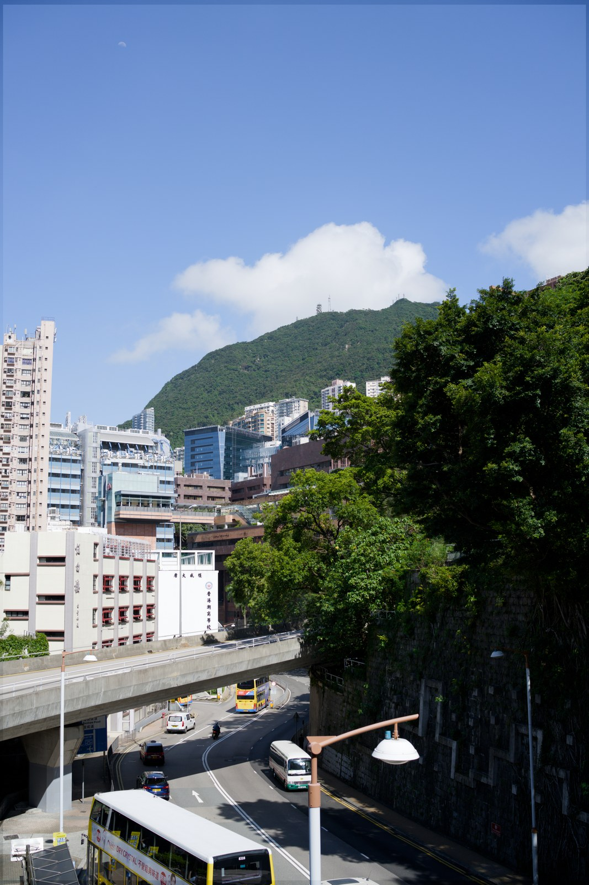 |  |

特写看白楼与绿树。自适应下校舍的白墙贴着纸白、细节靠边缘撑着；Portra 把
它压回中调，墙面的每一级窗洞都分出了灰阶，树冠的绿从"绿色的亮"变成
"有分量的绿"——把白墙拍成有灰阶的白，正是负片扫描件最认得出的长相：

| 自适应 · 白楼特写 | Portra 400 · 白楼特写 |
|---|---|
| 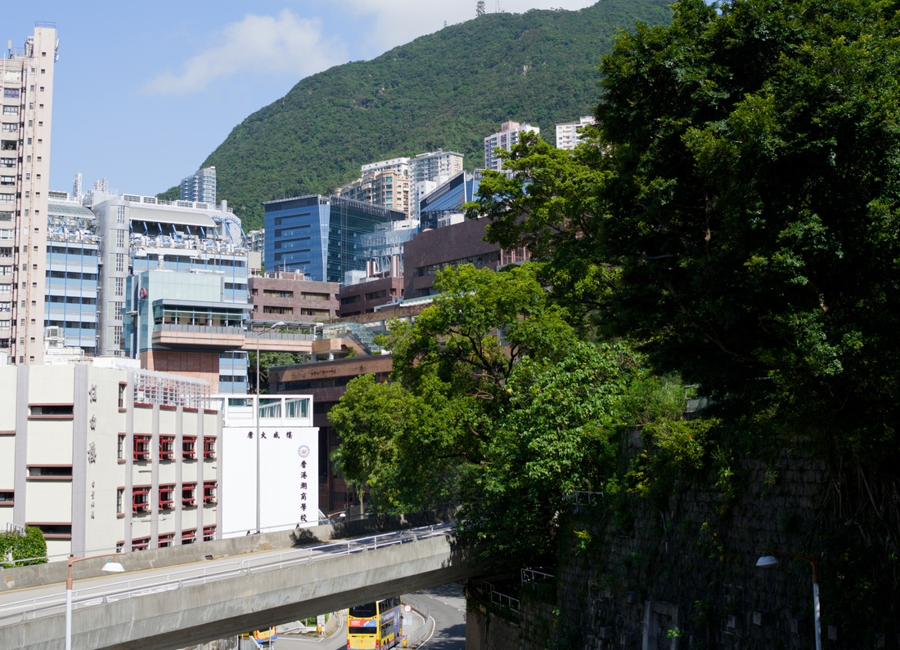 | 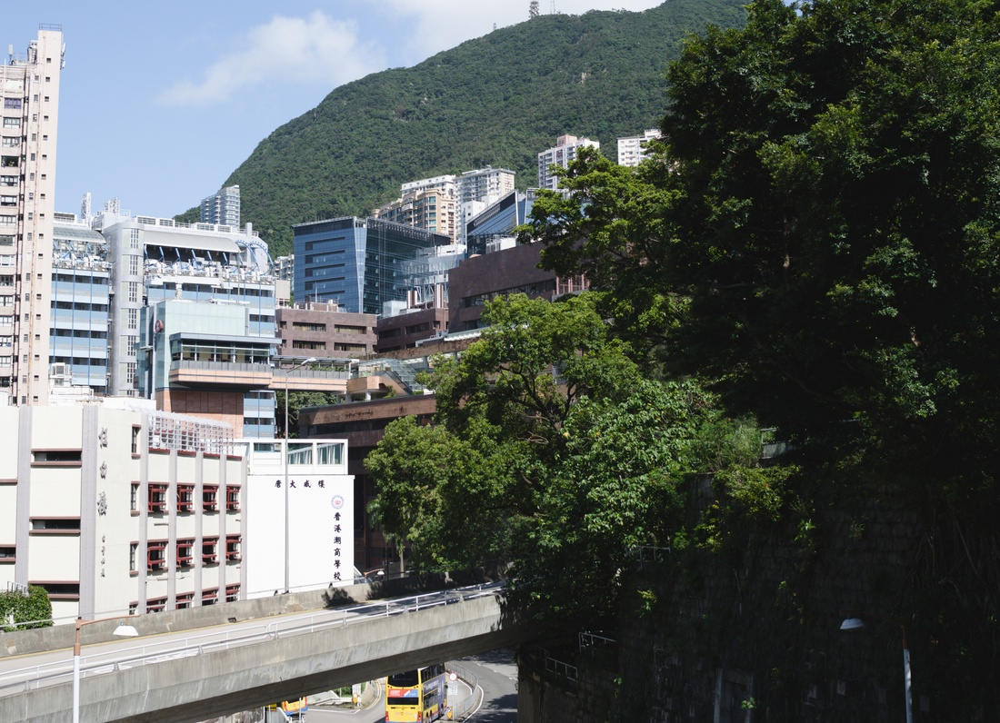 |

再看反转片。Velvia 100 黑点钉在 −4.05、对比压硬——**反转片黑得干脆**：
幻灯自身的 Dmax 深到 0.5% 线性，这就是它黑的本钱。
live house 的后台视角，自适应把黑点放到 −8.3 EV，天花板的桁架、墙面的
杂物都留在微光里；Velvia 曲线把这整个上半场馆干脆利落地沉进黑，品红灯板
变浓，白衬衫白裤把乐手从黑里剪出来（近九成像素可见变化）：

| 场景自适应 · 默认 | Velvia 100 曲线预设 |
|---|---|
|  |  |

特写看顶棚。自适应让顶棚浮在棕绿的微光里——夜店的天花板被数码扒开了；
Velvia 把它整个沉黑，灯的品红变浓，白衬衫从黑里剪出来。反转片的世界观：
**黑得干脆，亮的东西才配发光**——正片直接投影没有印相环节替它妥协，
这份决绝就是幻灯片观感的核心：

| 自适应 · 顶棚特写 | Velvia 100 · 顶棚特写 |
|---|---|
| 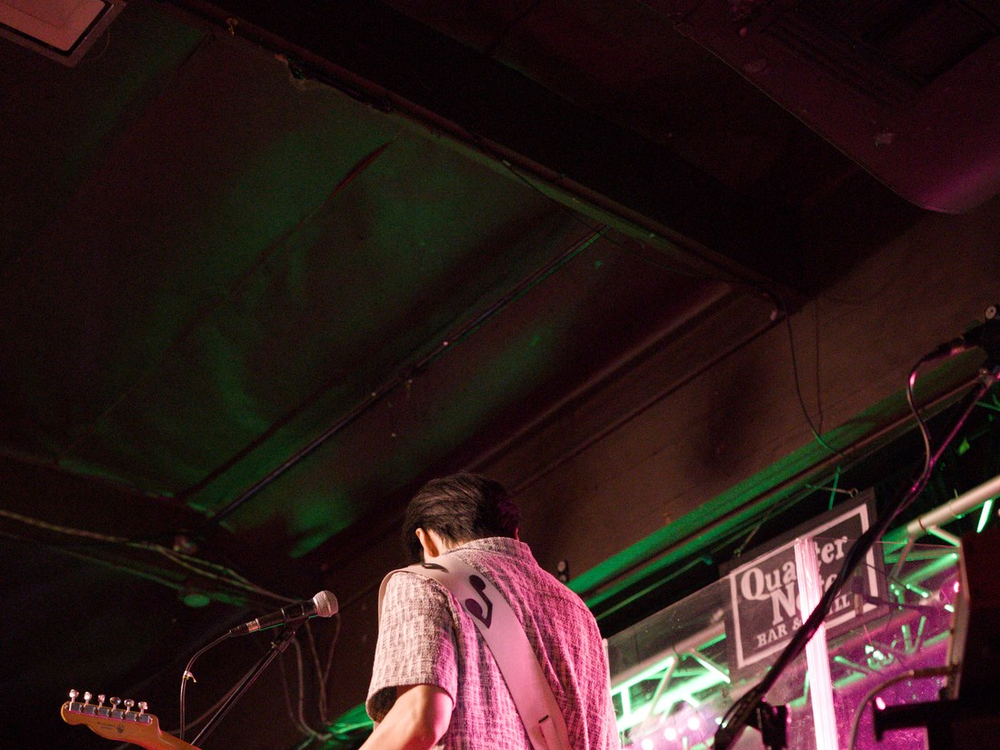 | 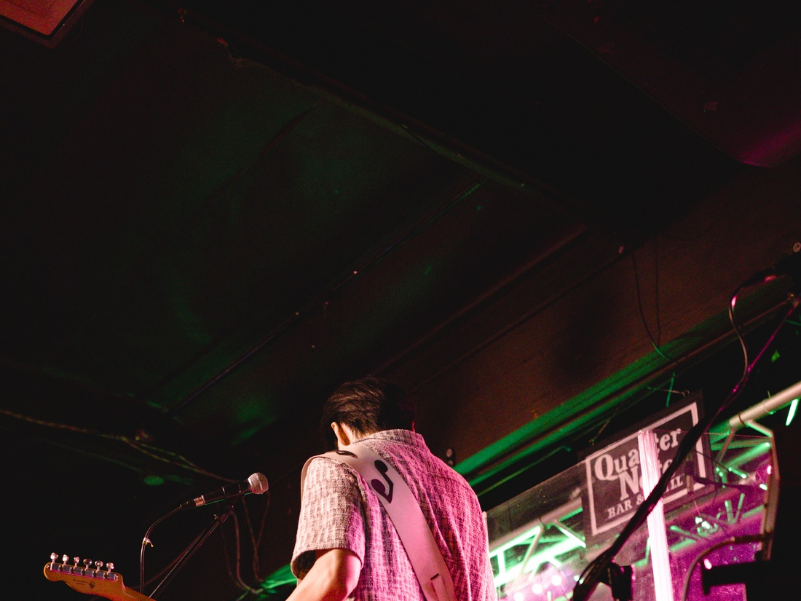 |

### 整卷一致：胶卷不看直方图

单看一对样张，曲线预设像"另一种精修"；它的实质要两个场景放在一起才
显形。自适应给每张照片单独解一组端点：昏暗的猫吧它把黑点挖到 −6.3、白点
只给 +4.13；晴天的博物馆正殿它把黑点收在 −4.7、白点 +4.10——张张重新
决定。Portra 400 给谁都是同一条：黑 −4.89、白 +6.13。于是同一卷胶片在
猫吧主要动**黑端**（暗部托起，黑猫的毛面浮出层次、黑仍沉实），在正殿
主要动**白端**（白点上移两档，石殿和绿树沉进负片的中调密度）——两个
场景被同一条曲线从不同的方向拉过来：

| 猫吧（暗场景）· 自适应 −6.3/+4.13 | 猫吧 · Portra 曲线 −4.89/+6.13 |
|---|---|
|  |  |

| 博物馆正殿（亮场景）· 自适应 −4.7/+4.10 | 正殿 · Portra 曲线 −4.89/+6.13 |
|---|---|
| 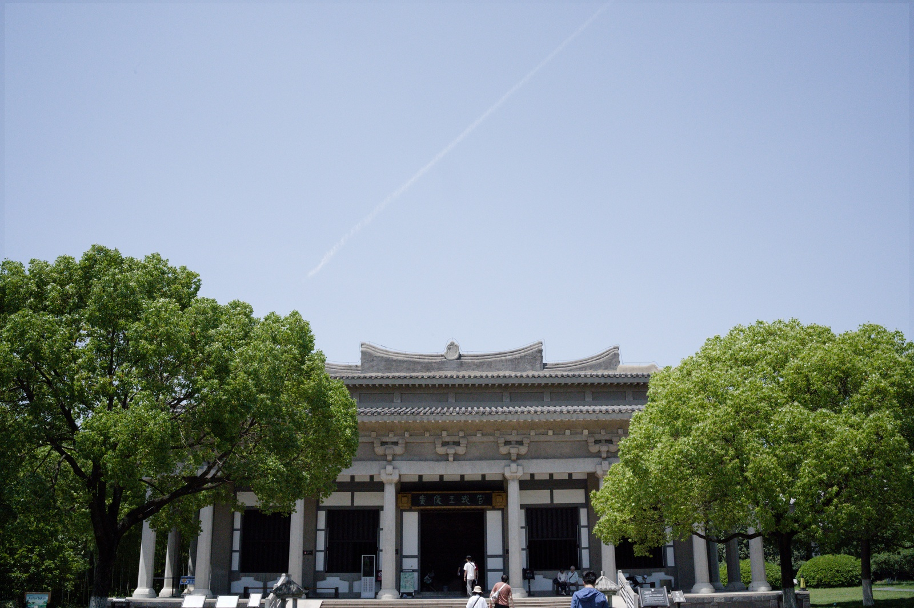 | 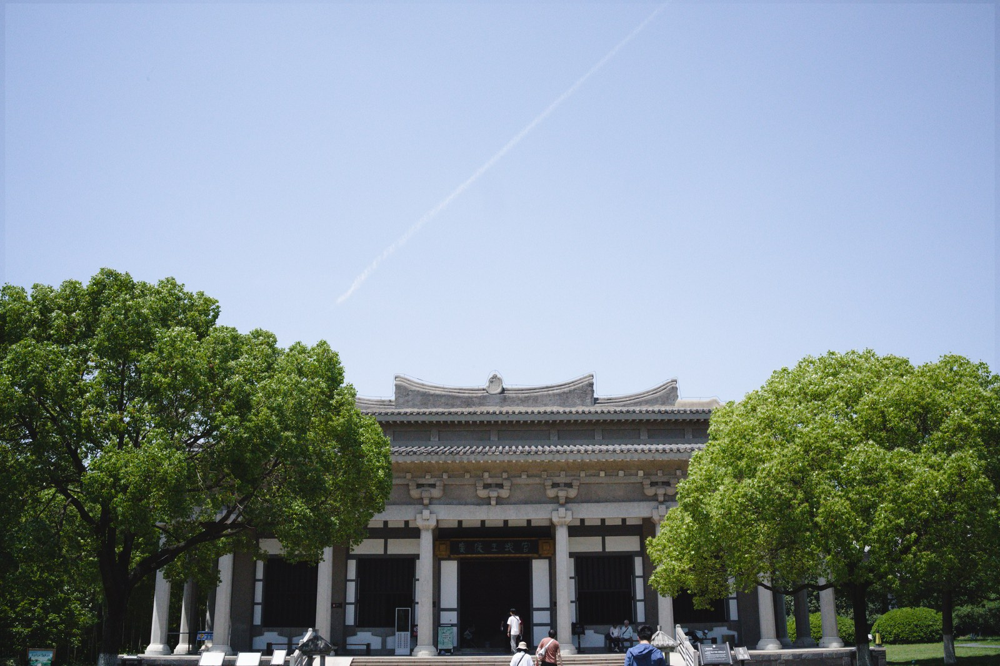 |

猫吧与正殿都对约六成半像素可见——合在一起才是重点：两个毫不相干
的场景被拉上同一条曲线，相邻两张的明暗性格连贯起来——扫描仪吐出一卷
胶片时正是这个观感，这也是"选一卷胶片"区别于"逐张精修"的全部含义。

两卷方向相反——负片向上托也向下压、反转片一律干脆。**这就是"整卷固定
的明暗性格"**：预设不看这张照片的直方图，它把自己的世界观带过来。这不是
"更好或更坏"，是"这卷胶片就这样看世界"对"为这张照片量身定制"的取舍。

三个事实，如实写明：

- **端点模式在曲线预设激活时不适用。**预设自带黑白点，这时切到证据界不会
  报错，画面也完全一致、不会有任何变化。写在这里免得你对着不动的画面困惑。
  （实现细节见[架构文档](ARCHITECTURE.zh-CN.md)。）
- **趾部收黑/肩部收白仍然有效**，它们在预设的曲线上继续微调（黑位以预设
  的相纸黑为底）。本节后台样张实测：Velvia 曲线上趾部收黑 −2 仍有明显
  效果（约半数像素可见变化）——微调余地真实存在。
- **同一个微调的余地，取决于那段曲线上有没有内容。**Velvia 的肩部是所有
  预设里最硬的：高光有内容的照片（本节后台）肩部收白 +2 还有约 7% 像素的
  可见变化；高光少的照片（公园样张）只剩 0.5%——几乎纹丝不动。数字不动
  是曲线在说话，与《修图工作流说明书》里"样张一的肩部纹丝不动"是一回事。

---

## 五 · AgX 原色几何：成像端的浓度杠杆

机理先行：这个选择器改的是颜色变亮时**如何向白收敛**，管住的是饱和色的
"浓"。它在曲线之后、属于"怎么成像"的一半；每卷胶片带一个配对
（Velvia→punchy、Kodachrome→muted），配对是编辑口味，随时可改。

香港街景（无胶片，单独看这一层），双层巴士裁切：

| base · darktable 默认 | punchy · 纯度增强 |
|---|---|
|  |  |

| smooth · 平滑收色 | muted · 纯度柔和 |
|---|---|
|  |  |

观察要点在**高饱和的巴士黄**：punchy 的黄更密、更沉；muted 的黄明显放淡；
smooth 的中低饱和区几乎与 base 重合、差异集中在最饱和的颜色怎么收进白
——它是四个选项里离 base 最近的。中性的路面与白色路标几乎不动：这个控件
只弯折色彩，不碰明暗。

低饱和的画面上四个选项彼此接近（本文的公园与钢桥样张几乎看不出差别）——
想看清这个控件，找画面里最饱和的那块颜色。极端的一端长这样：live house
的红色舞台光，整片又亮又饱和，"怎么收进白"没有藏身之处——

| punchy · 纯度增强 | muted · 纯度柔和 |
|---|---|
|  |  |

punchy 的红密而沉，桁架和背景的光洗透着密度；muted 把同一片红放淡一档、
亮部的红更早向白让路。看不受管的部分：白衬衫、肤色、黑暗处几乎不动——
两张的明暗几乎一样（均值差 2/255）。这就是"只弯折饱和色、不碰明暗"在极端场景下的样子。

---

## 六 · 色彩由谁负责：observe 与 full

机理对照。**observe**（GUI"观察 · AgX 显影"，默认）：胶片决定观察者看见了
什么——白平衡、颜色分离、明暗性格——最终颜色由 AgX 负责成像。这是验证得
最充分的路径，HDR 照常工作。**full**（GUI"接管 · 胶片显影链"）：胶片显影链
整体接管——这是已经落地的 film v2 正式链路，不再是实验开关。它不是"逐通道
曲线吃 RGB"的启发式，而是**因式分解的完整光谱链**——场景颜色先经受约束的
3×3 观察者矩阵折算为三层乳剂曝光，再叠一层曝光齐次的色度场修正 LUT（它只
看色度、把亮度外提，所以曝光齐次性不破；每卷按留出交叉验证在"色度场"与
"纯 3×3"之间二选一，选中的模型连同它的留出残差一起随资产发布，报告里的
Stage A 行打印的就是实际运行的那一个），过各层特性曲线得到负片染料密度
（Stage A，运行时解析，胶片曝光态与显影配方在这里生效），再过 B1（负片密度
→相纸层曝光）、印相 timing τ、相纸显影曲线与 B2（正介质密度→观看色彩）回到
屏幕（Stage B，两只 65³ 密度域体积+一维曲线；换印相介质只换 B2 侧，不重烘
前链）。观察者的光源假设是 D55：固定色温白平衡之后，钨丝灯与高显色 LED
场景的留出残差与 D55 同级，所以**不设光源档**——曾经出现过的
`--film-illuminant` 已撤回，不是待补的功能。如实声明两条边界：三个数字恢复
不了光谱，观察者的同色异谱残差按卷实测盖章在数据里（留出 p99 按卷约
0.41–0.73 档，纯 3×3 基线约 0.47–1.13 档）；显影抑制耦合（DIR）等层间效应
**数据中没有**——2026-08 起链里补了一个声明为 modelled 的层间放大项（有界、
灰轴恒等、按卷分档，报告中写作"光谱底座 + modelled 层间放大"），光谱底座
本身仍可单独取得——GUI"层间放大"下拉选"关 · 光谱基线"、CLI
`--film-interimage off`，均入缓存键与导出指纹（本节末尾逐个说明）。

动了会发生什么（实测，2026-08-28 现行链重渲——含默认介质散射；"可见阈"
按最大通道差 >8/255 计）：在公园样张上 observe 与 full 约三成二像素过可见阈，
平均差温和（约 3.9/255）——差异住在树荫的绿里：full 的绿更暖（绿系色相
中位差约 11 度），明度几乎不动（绿系像素均值 −2.8/255）。两条
彼此独立的路径（AgX 显影声明 vs 光谱链直算）对同一卷胶片仍给出同方向的
答案，互为印证。

| observe · Velvia 100 | full · Velvia 100 · 印相 fixed·默认配对·bounded 中性化 · 观感光学关·介质散射 declared |
|---|---|
|  | 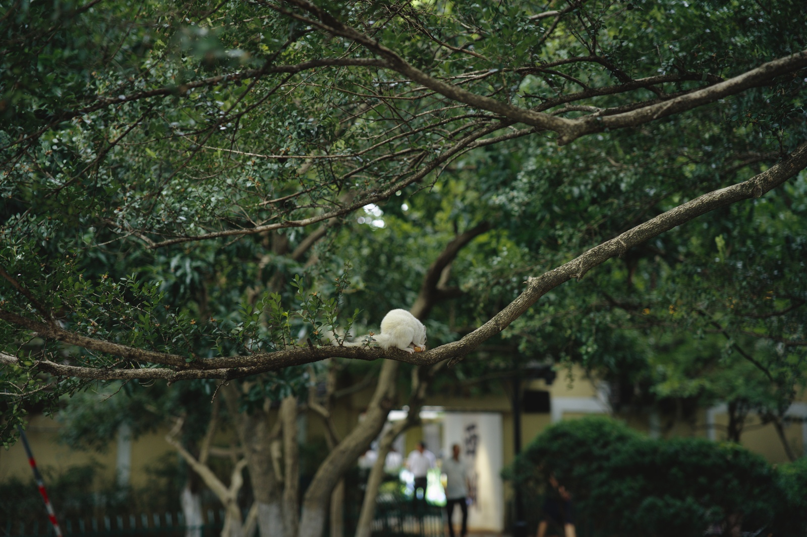 |

分歧住在哪种颜色里，取决于场景把哪种颜色端给它。树荫的绿只是温和地变暖；
**晴空的蓝分歧最大**——同一卷 Velvia，香港山道的天空在 full 下明显转向
深紫蓝（天空区域九成以上像素可见，蓝通道平均 +9 码值、红 +9、绿降约 8 码），是光谱链
自己算出来的方向，与 Velvia 声名在外的深蓝天一致；observe 的 AgX 成像端
则把蓝天留在更"标准"的位置。色彩侧无外部 oracle 的声明对两条路径一体
适用——这里展示的是分歧本身：

| observe · Velvia 100 | full · Velvia 100 · 印相 fixed·默认配对·datasheet · 观感光学关·介质散射 declared |
|---|---|
| 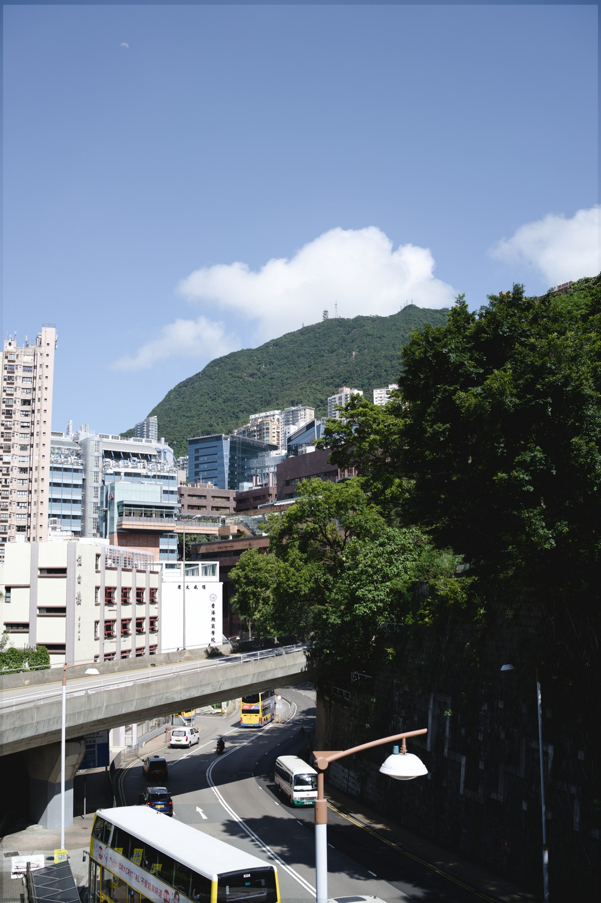 | 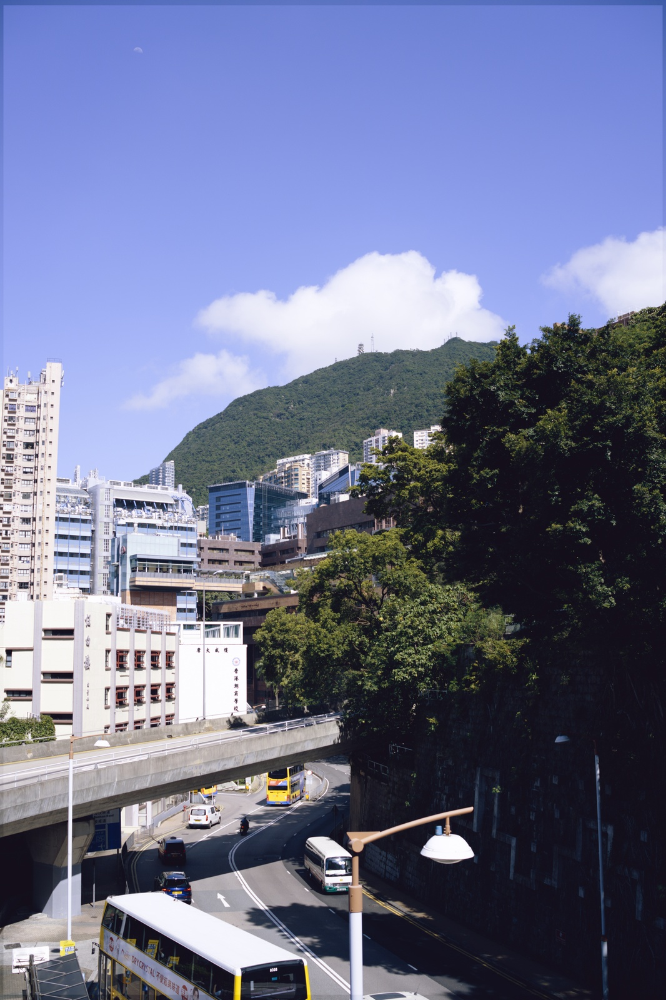 |

换一卷负片作对照：Portra 400 的 full 温和得多（两成多像素过阈、集中在
暗部密度与织物色的细微下沉）——full 与 observe 的距离**随卷不同**，
反转片的硬性格在光谱链里最放得开：

| observe · Portra 400 | full · Portra 400 · 印相 fixed·默认配对·datasheet · 观感光学关·介质散射 declared |
|---|---|
| 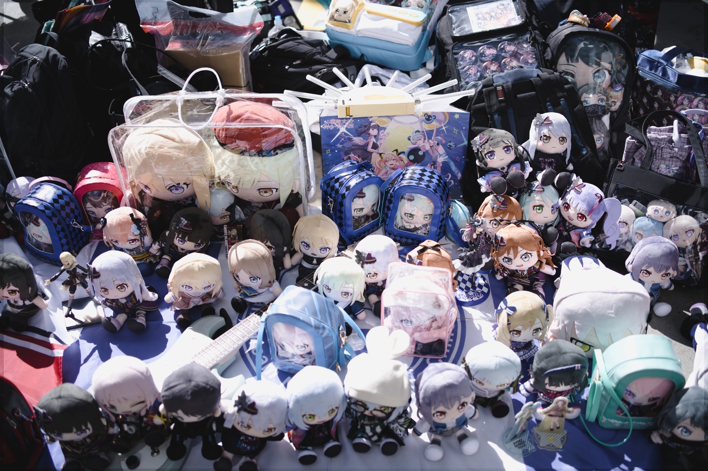 |  |

上面三张对比图表头里的 `bounded 中性化` / `datasheet` 是渲染当时的取值名，
对应今天的"数字中性"（technical-neutral）与"数据手册漂移"（native）——图
不重渲，标签照旧。

full 的独有载荷还有：印相介质与 timing、胶片曝光、胶片解释、层间放大、
显影配方、胶片压缩、模拟光学（下面逐个说明），以及下一节的灰阶中性化。Ultra HDR 下 full 以
"胶片印相 + scene HDR 扩展"参与：SDR 底图就是胶片印相，参考白之上按场景
自身高光平滑增益，不声称物理胶片 HDR。

### full 模式下的其余控件

下面这些控件只在 full 模式出现（GUI 切回 observe 时它们收起并归零，CLI 里
都标着"仅 full"）。GUI 上每个只给一句话，完整说明在这里。

**印相介质**（`--film-print-medium`）：负片印到哪张相纸/拷贝，反转片直看
哪张幻灯。默认是"全部胶片选项一览"里的出厂配对；下拉只列已经烘焙的介质，
所以大多数卷只有一项、下拉根本不出现，目前多出第二项的只有 Portra 400
（Kodak Supra Endura）与 Vision3 250D 含影院变体（Kodak 2393）。换介质只换
B2 侧（相纸显影曲线与观看变换），前链一字不动。

**胶片曝光**（`--film-exposure`，±2 EV）：乳剂相对标称 EI 的曝光状态，
**不是输出曝光**——它改的是负片落在特性曲线的哪一段：过曝的负片密度厚、
趾部离开片基，颜色分离与对比随之变；欠曝沉进趾部。域 ±2 EV 由资产声明，
越域报错。要让成片整体变亮变暗请用曝光页的 EV，那是另一层。

**印相 timing**（`--film-print-timing`）三档，决定放大机怎么应对上面的
胶片曝光：

- **固定 · 默认**（fixed）：沿用 EV0 联合求解的印相时间 τ(0)。胶片曝光改
  了、放大机没动——曝光多的负片密度厚，同一放大机设置下印出来就偏亮，像
  暗房里不重测直接印。
- **随胶片曝光重定时**（retimed）：按暗房惯例随胶片曝光重新求解印相时间
  ——总体亮度接近不变，改变的是颜色、对比与趾肩。要该卷带印相资产，全部
  21 卷负片都有；反转片没有印相环节，一律固定。
- **自定义 · 色头+印相曝光**（custom）：手动印相——τ(0) 加"印相曝光"滑杆
  （±2 EV，log2）加色头 Y/M 的 Δτ，在相纸层曝光模型内解析，声明为
  modelled。只对负片开放，并且要求灰阶中性化取"数据手册漂移"（互斥合同：
  手动印相不能再让链去数字中性化）——GUI 会自动联动，CLI 不配则硬失败。

**胶片解释**（`--film-appearance`）：链算出来的颜色怎么"读"。

- **技术中和**（technical）：光谱链本体，不叠外观层——CLI 不给参数时的
  默认值。
- **参考印相**（reference）：该卷在配对相纸上的参考调色板外观层——GUI 的
  出厂默认，但它需要这卷的配方资产：目前有配方的是 Portra 400、Ektar 100、
  Velvia 100、Vision3 250D 四卷，其余卷在 GUI 里该项置灰并回到技术中和，
  CLI 硬失败。**解释强度**（0–3，默认 1）是外观层的施加倍率：0 = 调色板
  严格恒等（灰阶中性化仍按解释声明解析），1 = 配方声明值，> 1 外推。
- **自定义**（custom）：参考印相之上再加三个有界修饰——**丰度**（−1..1，
  配方颜色丰度）、**色密度**（−1..1，压亮不改饱和）、**灰阶偏色**（0..2，
  配方灰阶偏色的强度；当前首批配方这一场为零，滑杆预留）。0 / 0 / 1 就是
  配方原样。

**解释变体**（`--film-appearance-variant`）：**参考印相**（印相解读，默认）
或 **扫描对照 extended**（scan/telecine 解读：同家族方向、0.6 幅度、灰轴
数字中性）。extended 要单独的资产，目前只有 Vision3 250D 有，其余卷不出现
这个下拉。

**层间放大**（`--film-interimage`）：上文那个 modelled 层间放大项。
**声明 · 默认**（declared）用该卷声明的 β（声明表范围 0.32–1.05）；
**关 · 光谱基线**（off）回到纯光谱底座——oracle 认证口径，对照与调试用；
**自定义 β**（custom）露出"层间 β"滑杆，β ∈ [0, 1.5]，0 等效关。数学上
无虞的口味项就交给你的手，不做 A/B 裁决。

**模拟光学**（`--film-grain` / `--film-halation` / `--film-bloom`）：胶片的
空间成像，不是颜色。四档：**关闭 · 默认**、**轻**（颗粒 0.25 · halation
0.20 · bloom 0.15）、**标准**（0.50 · 0.40 · 0.30）、**自定义**（三条滑杆各
0–1）。三条滑杆各管一个物理上不同的过程，0 都是严格恒等：

- **颗粒**：密度颗粒。随机场住在负片的毫米坐标里（36×24 mm 片门），预览、
  裁切、全尺寸对同一乳剂位置采样同一次实现——纹理随采样率变，统计不变。
  幅度不是常数：按密度逐通道查实测的 **σ(D)** 表——柯达数据手册的漫射
  RMS 颗粒度曲线数字化（负片侧 5207 / Vision3 250D，拷贝侧 2383），以数据
  手册的 48 µm 微密度计孔径校准，让输出按图表的量法量出来能复现图表数字、
  更细的像素间距下如实更粗。各卷目前共用这两张表，逐层染料密度与真实
  Status 密度计读数之间的串扰也未建模，所以它的来源级别写作 derived 而不是
  逐卷 measured。颗粒先扰动密度再经印相，所以它参与后面的颜色与局部对比，
  不是贴在成片上的噪点。随机只决定颗粒的空间排布（种子由下面的"光学
  种子"给定），不改粒径、频谱、密度响应与跨层协方差。
- **Halation**：高亮场景曝光经片基背散射，通过红敏为主的散射核扩散后
  **回注到层曝光**，位置在特性曲线之前——所以它是随高光长出来、由红敏层
  承担大头的光晕，不是均匀的模糊。声明为 modelled。
- **Bloom**：进乳剂之前的捕获辉光——作用在场景线性光上的加性眩光，声明为
  editorial：它是口味，不是介质属性。
- **介质散射**（`--film-media-scatter`）不在三条观感滑杆上，是模拟光学块
  里单独一个下拉：乳剂散射与相纸成像散射是所声明介质的属性而非观感量——
  由数据手册 **MTF** 曲线拟合、能量守恒、全分辨率——所以它不问上面选的
  是关闭还是标准。**按声明 · 默认**（declared）按编译好的介质 profile
  施加；**关闭**（off）只用于算子隔离的测量口径与对照，不是口味项。GUI
  下拉底下那行"profile · 颗粒:derived×2介质 · halation:modelled ·
  散射:derived · bloom:editorial"就是这四项的来源级别。
- **光学种子**（`--film-optics-seed`）：颗粒等随机排布的相位，同在模拟
  光学块里，一个数字输入框。留空 = auto：加载 RAW 时随机取一次、本次载入
  内固定，预览与导出一致，报告写出实际生效的 seed 供复现；填一个非负整数
  = 永远可复现。种子只决定空间排布，不改粒径、频谱、密度响应与跨层协方差。

**显影配方**（`--film-development`）：负片"怎么冲"的声明。各卷的特性曲线
是按数据手册的标准显影实测的，这个下拉决定要不要在它上面动手，两档：

- **实测默认**（measured_default，默认）：数据手册显影原样，下面三个扰动
  锁定为 0——CLI 里给了 `--film-dev-*` 却不声明配方会直接报错，不会悄悄
  生效。
- **自定义显影**（editorial_custom）：解锁三条有界滑杆，都绕中灰锚构造
  ——中灰不漂由构造保证，动的是曲线形状与染料的量；报告如实标注"编辑
  显影"。**显影对比**（`--film-dev-contrast`，[−0.5, 0.5]）绕中灰锚缩放
  特性曲线的 logE 轴，是推冲/拉冲的对比维度；**显影灰雾**
  （`--film-dev-fog`，[0, 0.3]）给三层均匀加密度——化学灰雾，会整体提亮
  中灰与印相，这是 fog 的真实行为，链不做隐藏补偿，所以它只有正方向；
  **显影色密度**（`--film-dev-density`，[−0.5, 0.5]）绕中灰锚缩放显影出的
  染料量。

两条互斥合同（GUI 自动联动并在状态栏说明，CLI 与服务端不配则硬失败）：
自定义显影**要求灰阶中性化取"数据手册漂移"**（native）——数字中性与印相
平衡的校正曲线都是按实测显影求解的，负片密度被你改过之后它们就不再成立，
GUI 会自动切过去并把其它中性化选项置灰；自定义显影也**不能与"随胶片曝光
重定时"并用**——retimed 的 τ 表同样按实测显影求解，GUI 把重定时置灰并回
到固定（自定义 timing 仍可用）。切回实测默认时三个扰动复位为 0，切回
observe 时整块收起。

**胶片压缩**（`--film-compression`，[0, 1]，默认 0）：乳剂之前对场景亮度
EV 做的饱和压缩——数字传感器的硬高光与负片宽容度之间的一道 editorial 桥。
knee 之上的场景亮度被平滑（C1 连续）地压向饱和，knee 之下不动，0 = 严格
恒等；它作用在场景光上、在特性曲线之前，所以被压下来的高光是以正常的乳剂
曝光走完后面整条链，不是在成片上压亮度。滑杆 > 0 时露出两条随行滑杆：
**压缩 knee**（`--film-compression-knee`，中灰之上 [0, 6] EV，默认 2）是压缩
从中灰之上几档开始；**高光色密度**（`--film-highlight-density`，[0, 2]，
默认 0）让被压缩的高光按压缩深度指数地向保亮度的中性收敛
（C′ = C·exp(−ρd)）——负片高光染料密度趋满时颜色褪向中性的观感；它只在
压缩 > 0 时有意义，压缩归零时 GUI 把它复位、CLI 报错。

---

## 七 · 灰阶中性化：胶片色偏与阴影里的层间漂移（仅 full）

GUI 名"灰阶中性化"（`--film-neutralization`；旧名 `--film-crossover`/"层间
漂移"已为弃用别名），机理即胶片术语 crossover。机理先行：真实胶片的三层感光
乳剂并不完全平行——同样的中性灰，在暗部和亮部会显出不同程度的偏色，这
就是胶片的层间色偏。各卷的幅度与方向都来自数据手册特性曲线：Kodachrome
的阴影偏暖（琥珀色——三层在低曝光端的密度差，摄影史上有名的性格），
Velvia 的阴影温和偏冷，电影负片系偏绿青。这个开关决定实测数据怎么用，
GUI 上四个值：

- **跟随胶片解释 · 默认**（GUI 出厂默认；CLI 不给 `--film-neutralization`
  即此）：由第六节的"胶片解释"决定——技术中和→数字中性，参考印相→印相
  平衡，扫描对照 extended→数字中性（配方自己声明）；
- **数字中性**（technical-neutral；CLI 旧名 bounded 仍作弃用别名，内部旧名
  off——下方样张表沿用 off 标签）：**数字中性化变体**——每个通道除以中性阶在该像素亮度
  曝光处的染色（与色头同一条单轴约定），且校正每通道限幅在 ±2 档以内：
  介质自身灰阶偏离中性两档之内的染色被完全中和，更深的染色（典型如
  Kodachrome 的地板色）如实保留为介质性格。这是声明的数字约定，不是第
  二个物理过程；
- **印相平衡**（print-balanced）：同一张染色表只在中灰锚点取值一次，解出
  恒定平衡——中灰依构造中性，灰阶两端保留介质自身曝光相关的 crossover
  （印相性格）；
- **数据手册漂移**（native；CLI 旧名 datasheet 仍作弃用别名——下方样张表
  沿用 datasheet 标签）：光谱链原样——中灰由印相求解锚定中性，暗部和亮部
  按链自身的层间数据偏移。偏移幅度尚无外部数据校验。

一条耦合：印相 timing 选"自定义 · 色头+印相曝光"时，这个开关必须是"数据
手册漂移"——手动印相与数字中性化是互斥合同，GUI 会自动把它联动过去，CLI
不配则硬失败（第六节）。另外弃用的 `--film-crossover` 与
`--film-neutralization` 同时给出也硬失败，别把新旧两把开关一起拨。

不同的卷，方向和幅度都不同——两对样张，各配偏移性格最合适的卷。

**电影负片的绿青阴影**，园林庭院 + Verita 200D full（印相链 crossover，
本文各卷里幅度最大的一族），off 对 datasheet：

| off · 中性灰保持中性 | datasheet · 按实测偏移 |
|---|---|
| 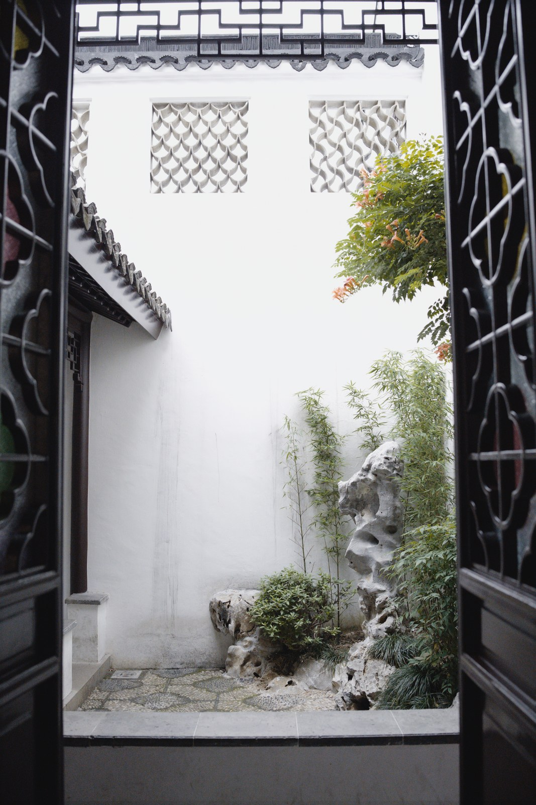 | 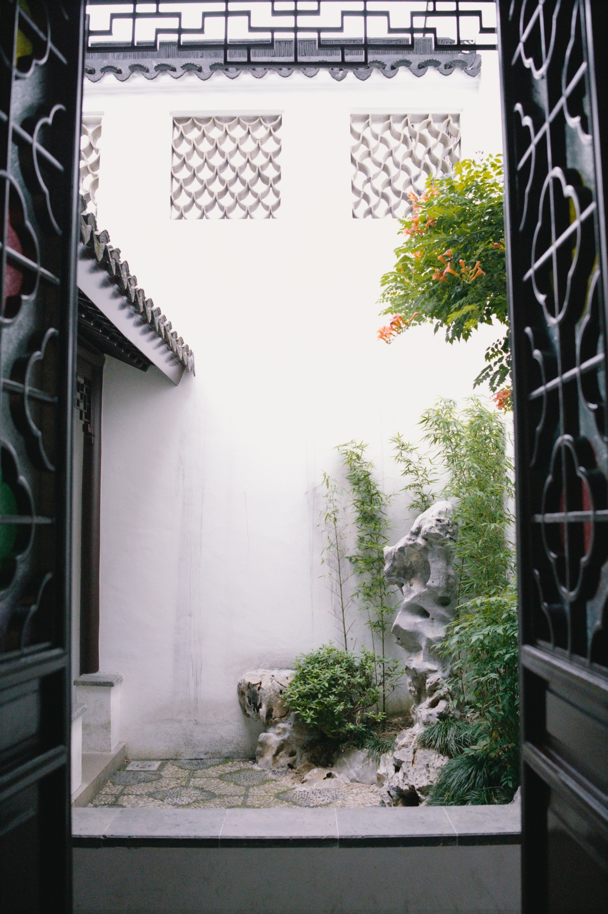 |

阴影裁切（雕花木门、石阶与卵石地）：

| off | datasheet |
|---|---|
|  |  |

实测（2026-08-28 现行链重渲）：过可见阈的像素约 8%，八成住在暗部
（放宽到 3/255 的尺子则约七成五像素都有轻微移动）——暗部均值移动集中在
红绿（红 −6.5、绿 +1.8），亮部均值只动两三个码值，全图亮度差中位数为 0。观察要点：雕花
木门和石阶平台从中性黑转出绿青，白墙和受光的卵石地纹丝不动——门里门外
正好是"阴影动、亮部不动"的现成分区。

**Kodachrome 的琥珀阴影**，香港街景 + Kodachrome 64 full——这卷的偏移
幅度本来就温和（数据手册如此），放在这里当"方向不同"的对照：

| off | datasheet |
|---|---|
| 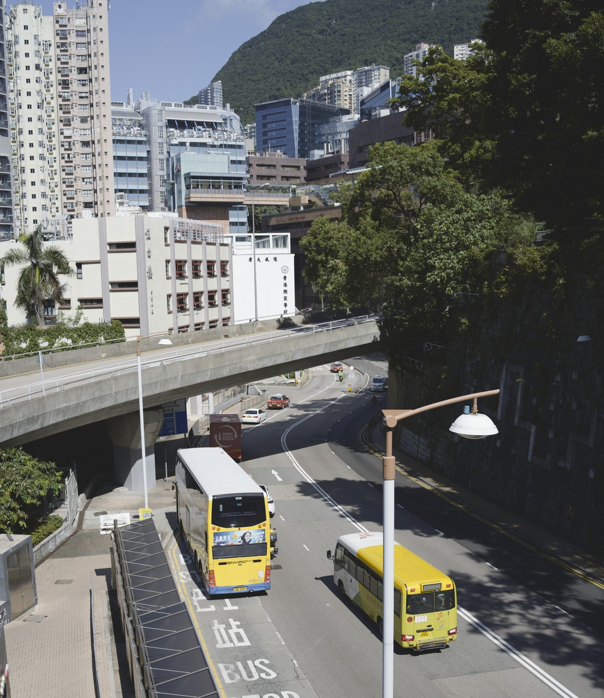 | 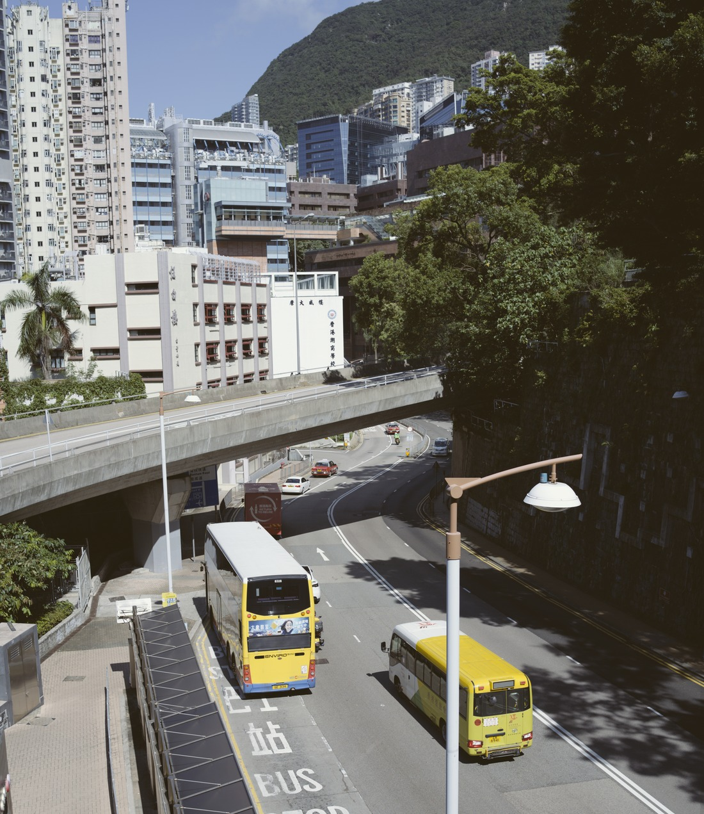 |

实测（2026-08-28 现行链重渲）：过可见阈的像素约两成三（3/255 尺子下约
四成），暗部均值向暖移约 16 个码值（红 +6、蓝 −10——标定去掉观看杂光后，
数据手册的琥珀移不再被杂光稀释），亮部均值接近零。观察要点：树影里的沥青和背光挡土墙转出琥珀暖意，日照路面、
大巴和天空不动。（全图对比见
[off](assets/film-tutorial/crossover_k64_off.jpg) /
[datasheet](assets/film-tutorial/crossover_k64_datasheet.jpg)。）

两个如实写明的边界：层间偏移住在阴影里，**内容集中在中灰上方的明快照片
几乎看不到这个开关**；各卷幅度差异很大——电影负片系最明显，Kodachrome
温和，Velvia 更温和到接近不可见。它是声明开关，不是风格开关。另外它只在
full 模式有意义：observe 模式下开不开完全一致。

---

## 八 · 放大机色头：负片的印相决策（仅负片）

机理先行。彩色负片没有"自己的颜色"——底片只是中间记录，最终颜色在放大机
下由人决定；色头上的 Y/M 分色滤镜档位就是那次决策。dngscan 的两条滑杆用
**真实暗房单位**：CC 滤镜密度 0–200、步进 5，30CC = 0.30 光学密度 ≈ 该
分色 1 档印相曝光衰减。方向背暗房口诀：**成片偏什么色，加什么色的滤镜**
——偏黄加 Y（黄滤镜吸收蓝光、少曝相纸蓝敏层、少生成黄染料），偏品加 M。
响应模拟真实印相光路，改档位后亮度自动保持不变。
（实现方式见[架构文档](ARCHITECTURE.zh-CN.md)"放大机色头"一节。）

两种显影分工下它都在，入口不同：observe 模式下选中任何负片曲线预设即可用
——本节样张全部是 observe；full 模式下 fixed/retimed 印相由联合求解决定，
色头只在印相 timing 切到"自定义 · 色头+印相曝光"后解锁（Δτ 在相纸层曝光
模型内解析，声明为 modelled；GUI 会同时把灰阶中性化联动到"数据手册漂移"，
第六节）。其余情况两条滑杆置灰并归零，原因写在滑杆旁。

### 实用尺度：精修在 2–10CC

先看日常作业区间。真实暗房的精修步长是 **2–10CC**——30CC 以上属于"这张片子
色彩大错"级别的粗调（滑条量程到 200 只是复刻硬件拨轮的物理行程，不是邀请）。
清汤面碗 + Portra 400——木桌的暖光让出厂中性印相带一点暖，青花白瓷就是
现成的中性参照物；Y 档小步修正：

| Y 0 · 中性印相 | Y 5 | Y 10 |
|---|---|---|
|  |  |  |

动了会发生什么（实测）：Y +5CC 把暖罩明显减轻、白瓷还站在暖侧；Y +10CC
恰好穿过中性，青花瓷的白干净落位。**这两步就是色头的日常**：5CC 一档地
试，看白色物件（白瓷、白墙、白衬衫）落在中性的哪一侧。

M 档同尺度更烈（相纸对绿的响应更陡）：M +10CC 就把画面明显推向绿——品绿
轴的精修步长比黄蓝轴还要再小一半才稳。

| M 10（对照） |
|---|
|  |

色头改的是各分色的印相配平，不是曝光——换挡时中灰的印相曝光自动补偿，
它模拟的是印相光路，不是在成片上叠一层偏色（大档位下画面观感自然跟着
颜色走，浓色看起来更沉，那是颜色的重量）。两档都在 0 时和不启用完全
一致：0 就是预设出厂的中性印相决定。

### 量程演示：30CC 起是粗调

往上是方向教学用的大动作——30CC = 0.30 光学密度 ≈ 该分色 **1 整档**印相
曝光，经相纸放大后是剧烈的色彩位移（这不是模型夸张：同样的档位在真暗房里
同样剧烈，暗房口诀"偏什么色加什么滤镜"说的正是这种纠错幅度）：

| Y 30 | Y 60 | M 30 |
|---|---|---|
|  |  |  |

实测：Y +30CC 把画面推到明显的蓝调（+60CC 更极端）；M +30CC 推到浓绿。
方向与暗房口诀一致，幅度与印相物理一致——**离谱的不是模型，是 30CC 本身
就是暗房里的大动作**。

### 为什么反转片没有色头

E-6/K-14 反转片冲洗出来**自身就是显示介质**——幻灯片直接投影或看片台
直读，物理上不存在印相环节，也就不存在色头这个决策点。所以选中反转片
预设时这两条滑杆置灰归零、屏幕上写明原因（CLI 传入会直接报错），这是诚实
设计：只提供物理上存在的控制面。当前预设的分类（由每个预设的档案给出，不按名字猜）：

- **负片（有色头）**：Portra 160/400/800（含 push1/push2）、Ektar 100、
  Gold 200、UltraMax 400、Superia 400、C200、Pro 400H、Vision3 50D/250D/
  200T/500T、Verita 200D（含全部 ·影院放映外观 变体）；
- **反转片（无色头）**：Provia 100F、Velvia 100、Ektachrome 100、
  Kodachrome 64。

---

## 九 · 调整的潜力：同一张照片的六种读法

前八节把每层控件拆开讲；这一节把它们合起来。每张合成图六个版本——没有
哪个是"正确答案"，每个都是一种成立的读法；每层调整都是声明的、可组合的、
可复现的（编号对应下方参数）。

同一张香港山道、同一卷 Velvia 100：

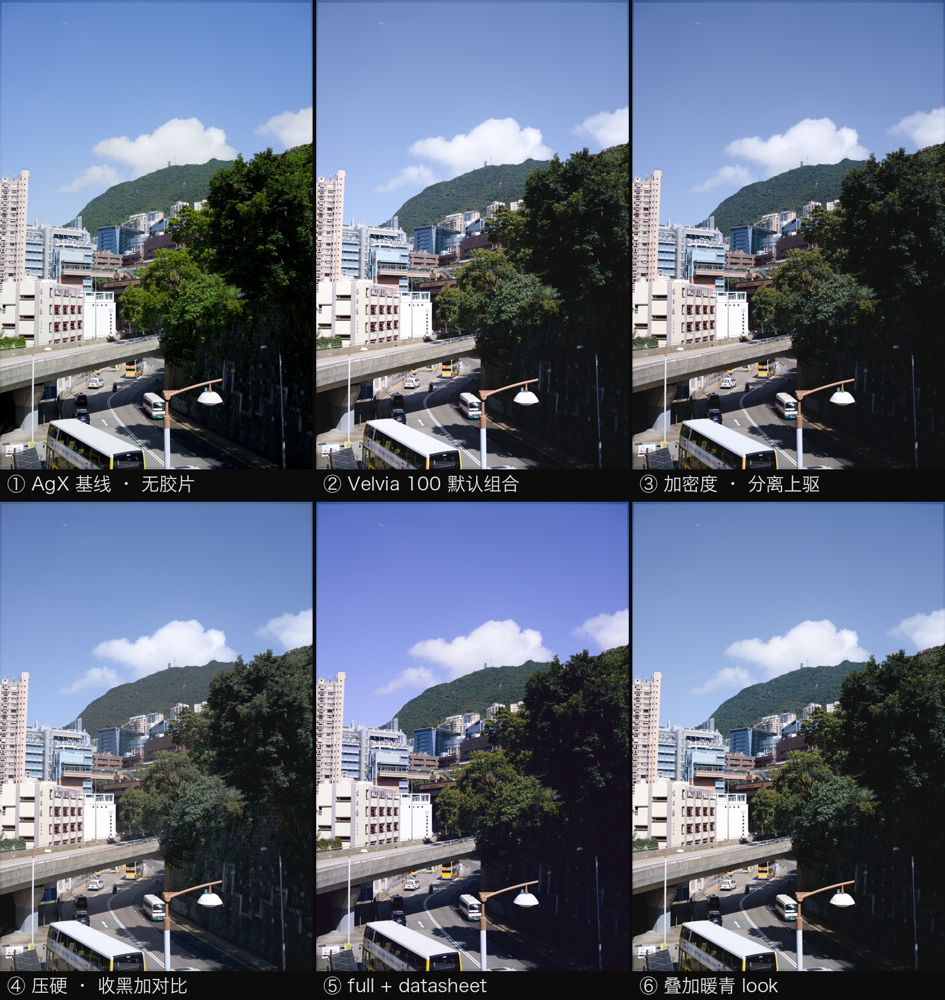

1. 默认参数（无胶片）
2. `--film velvia100`
3. ② + `--scene-transform-strength 2.2 --ev -0.3`
4. ③ + `--toe-end-offset -1 --midtone-contrast 0.3`
5. `--film velvia100 --film-mode full --film-neutralization native --ev -0.3`（色彩侧无外部 oracle 的声明照旧；Ultra HDR 下同样成立——full 以"胶片印相 + scene HDR 扩展"参与，第六节）
6. `--film velvia100 --grade look:optic_warm_cyan --grade-strength 0.5 --scene-transform-strength 2.0 --ev -0.2`

②忠实底子 → ③④密度与对比逐级推进 → ⑤晴空转深紫蓝 → ⑥胶片层上再叠独立 look 层。

公园样张换一卷负片，Portra 400——⑤展示负片独有的色头档位：

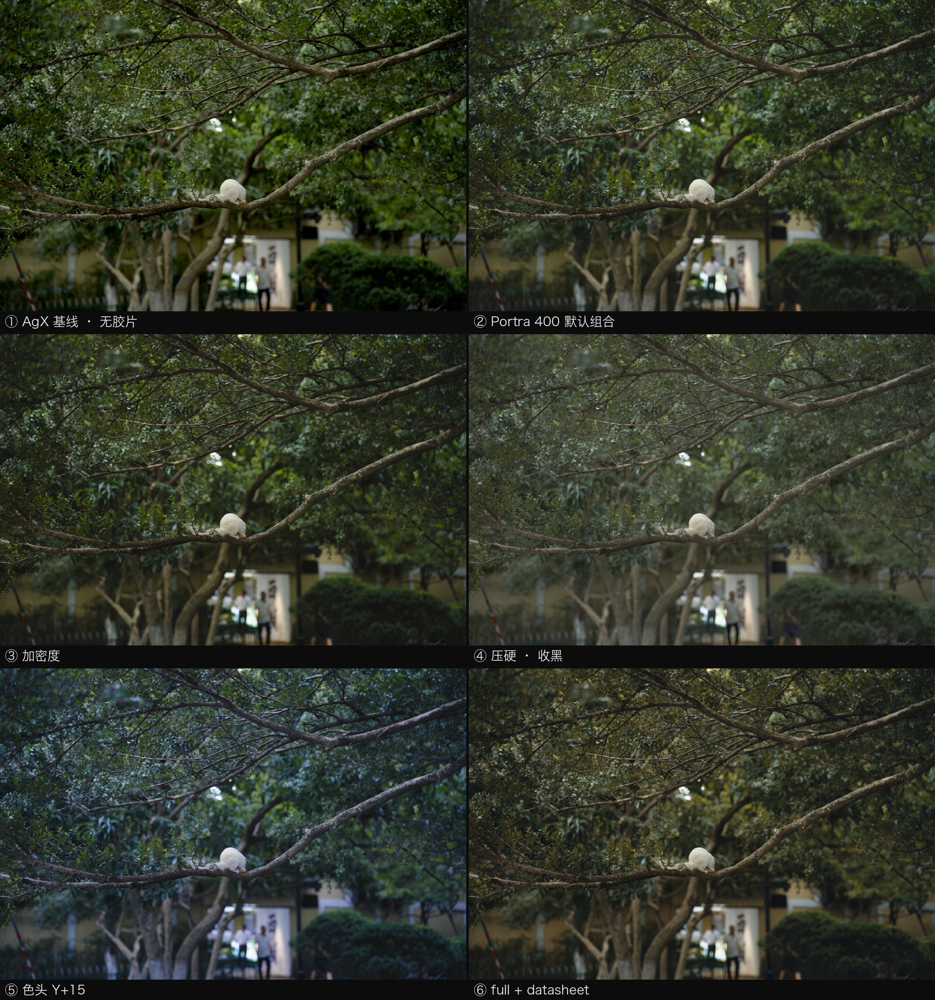

1. 默认参数（无胶片）
2. `--film portra400`
3. ② + `--scene-transform-strength 1.8 --ev -0.2 --midtone-contrast 0.2`
4. ③ + `--toe-end-offset -1`
5. `--film portra400 --color-head-y 15`
6. `--film portra400 --film-mode full --film-neutralization native --ev -0.2`

负片的推法更温和：③④密度小步走，⑤印相端 Y 档把画面往蓝侧修，⑥光谱链接管后绿的分离更放开。

暗场景同样成立——live house 后台、Velvia 100：

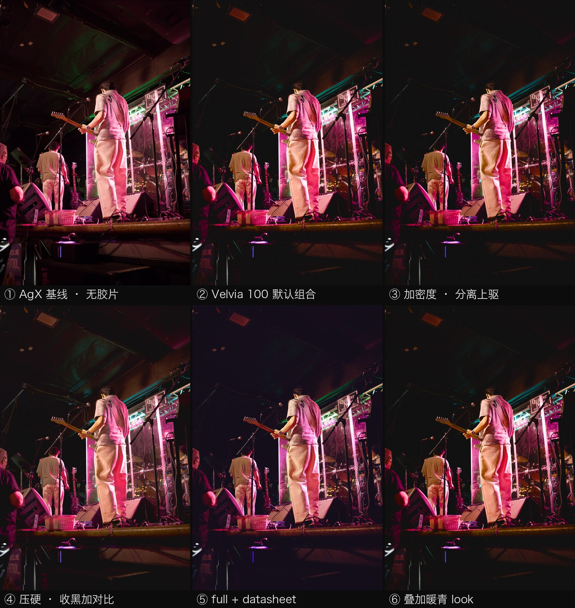

1. 默认参数（无胶片）
2. `--film velvia100`
3. ② + `--scene-transform-strength 2.2 --ev -0.3`
4. ③ + `--toe-end-offset -1 --midtone-contrast 0.3`
5. `--film velvia100 --film-mode full --film-neutralization native --ev -0.3`
6. `--film velvia100 --grade look:optic_warm_cyan --grade-strength 0.5 --scene-transform-strength 2.0 --ev -0.2`

品红与暗部逐级变浓，暗场景没有塌——同一套推法明暗通吃。

从"忠实的测量"到"最大的距离"是一条连续的路，停在哪站由你决定。

---

## 快速表：动了会发生什么

| 控件 | 动了会发生什么 |
|---|---|
| 选一卷胶片（胶片观察位置） | 五层设置同时落位（白平衡/感色特性/强度/曲线/原色几何），全部可见可改；"无"回纯 AgX |
| 白平衡固定色温 | 移除相机的场景适应，整卷统一标定色温；现场光暖冷如实穿过；拍摄值已在标定附近时几乎无变化 |
| 镜前滤镜 | 镜头前的转换玻璃，作用在感色特性之前；无强度滑杆 |
| 前馈强度 ↑ | 感色分离性格加浓：同类颜色内部色相距离拉开；这卷胶片在该内容上动得少时如实几乎不动 |
| 曲线预设 | 整卷固定的明暗性格替换场景自适应；端点模式此时不适用；趾/肩微调仍在预设曲线上有效 |
| AgX 原色几何 | 高饱和色的密度与收白路径改变（punchy 密、muted 淡、smooth 近 base）；中性内容不动 |
| 显影分工 → 接管 · 胶片显影链（full） | 胶片显影链接管颜色，整体色相/密度重画（色彩侧无外部 oracle 的声明照旧；印相介质/timing/胶片解释/层间放大/显影配方/胶片压缩/模拟光学随之可声明，Ultra HDR 走"胶片印相+scene HDR 扩展"） |
| 灰阶中性化 → 数据手册漂移 | 仅 full：中灰保持白平衡，深暗部按实测数据偏冷/偏色；中间调以上几乎不动。默认"跟随胶片解释"；自定义 timing 下自动联动到此 |
| 印相介质 | 仅 full：换相纸/拷贝只换 B2 侧；只列已烘焙的介质，多数卷只有出厂配对 |
| 胶片曝光 ±2 EV | 仅 full：乳剂落在特性曲线哪一段，不是输出曝光；固定 timing 下画面随之亮暗，重定时下亮度接近不变、颜色对比趾肩变 |
| 印相 timing | 仅 full：固定=EV0 求解的放大机不动；随胶片曝光重定时=按暗房惯例重解（全部负片）；自定义=手动印相曝光+色头（负片，需数据手册漂移） |
| 胶片解释 | 仅 full：技术中和=光谱链本体；参考印相=配对相纸的调色板外观层（有配方的四卷）；自定义=参考印相+丰度/色密度/灰阶偏色 |
| 解释强度 / 解释变体 | 外观层倍率 0–3（0 恒等）；扫描对照 extended 只有 Vision3 250D 有资产 |
| 层间放大 | 仅 full：声明=该卷 β；关=纯光谱底座；自定义 β [0,1.5]，0 等效关 |
| 显影配方 → 自定义显影 | 仅 full：解锁显影对比 [−0.5, 0.5]（绕中灰锚缩放特性曲线 logE 轴）、显影灰雾 [0, 0.3]（三层均匀加密度，整体提亮）、显影色密度 [−0.5, 0.5]（绕中灰锚缩放染料量）；实测默认锁定三者为 0；要求灰阶中性化=数据手册漂移（GUI 自动切换、其余置灰），重定时置灰回固定 |
| 胶片压缩 ↑ | 仅 full：乳剂之前把 knee 之上的场景亮度 EV 饱和压缩（0=严格恒等）；> 0 露出压缩 knee [0, 6] EV（默认 2）与高光色密度 [0, 2]（被压高光的色密度回落） |
| 模拟光学 | 仅 full：颗粒（实测 σ(D)，48 µm 孔径校准）/ halation（高光经红敏背散射回注层曝光）/ bloom（editorial 捕获辉光）；介质散射（MTF 拟合）默认按所选介质生效，见下 |
| 介质散射 → 关闭 | 仅 full：关掉所选介质的乳剂/相纸散射——算子隔离的测量口径，不是观感项；默认按声明 |
| 光学种子 | 仅 full：颗粒/光学随机排布的种子；留空=本次载入固定一次（预览与导出一致），填非负整数=永远可复现；只动排布，不动粒径/频谱/密度响应 |
| 色头 Y ↑ | 仅负片：印相去黄向蓝；精修 2–10CC 一步，30CC 起属粗调；亮度自动保持不变；full 下需 timing=自定义 |
| 色头 M ↑ | 仅负片：印相去品向绿，机理同 Y、力道更大 |

## 每个控件一句话

- **选一卷胶片**（胶片观察位置）：一次展开五层独立设置的组合预设，没有任何一层被藏起来。
- **白平衡固定色温**：整卷统一的标定色温，移除相机逐张适应。
- **镜前滤镜**：镜头前的转换玻璃，按出版参数作用在感色特性之前。
- **前馈强度**：感色分离性格的浓度倍率；1.0=校准，推荐值是口味。
- **曲线预设**：这卷胶片固定的明暗性格，整卷一致、自适应关闭。
- **AgX 原色几何**：饱和色如何收进白；比前馈强度更大幅度的风格杠杆。
- **色彩由谁负责**（显影分工）：观察 · AgX 显影=胶片观察+AgX 成像（默认）；接管 · 胶片显影链=乳剂→特性曲线→印相→相纸→观看整链接管。
- **灰阶中性化**（胶片色偏/层间漂移）：仅 full；跟随胶片解释（默认）/数字中性/印相平衡/数据手册漂移=中灰保持白平衡、暗部亮部按实测数据偏移。
- **印相介质**：仅 full；负片印到哪张相纸、反转片直看哪张幻灯，只列已烘焙的。
- **胶片曝光**：仅 full；乳剂相对标称 EI 的曝光状态（±2 EV），不是输出曝光。
- **印相 timing**：仅 full；固定 · 默认/随胶片曝光重定时（全部负片）/自定义 · 色头+印相曝光（负片，需数据手册漂移）。
- **胶片解释**：仅 full；技术中和/参考印相（有配方的卷，GUI 默认）/自定义（+丰度、色密度、灰阶偏色）；解释强度 0–3；解释变体 参考印相/扫描对照 extended。
- **层间放大**：仅 full；声明 · 默认/关 · 光谱基线/自定义 β [0,1.5]。
- **显影配方**：仅 full；实测默认（三个扰动锁 0）/自定义显影（显影对比 · 显影灰雾 · 显影色密度三个有界扰动；需数据手册漂移，不与重定时并用）。
- **胶片压缩**：仅 full；乳剂之前对 knee 之上的场景亮度做饱和压缩，0=恒等；压缩 knee（中灰之上 EV，默认 2）与高光色密度只在压缩 > 0 时露出。
- **模拟光学**：仅 full；关闭/轻/标准/自定义（颗粒 · halation · bloom）；块内另有介质散射与光学种子。
- **介质散射**：仅 full；所选介质的乳剂/相纸散射，按声明 · 默认/关闭（算子隔离的测量口径）。
- **光学种子**：仅 full；留空=本次载入的固定种子（预览与导出一致），填非负整数=永远可复现；只决定颗粒排布。
- **色头 Y/M**：负片印相环节的分色滤镜档位，真实 CC 单位（0–200，步进 5），亮度自动保持不变；full 下需 timing=自定义。

本文全部对比图由 dngscan 按文中所列参数实际渲染（全尺寸解码；全图长边
1500–1600px，裁切自全尺寸渲染同位截取后缩放；JPEG q95；2026-08-28 起全部由 `tools/regen_showcases.py` 按 `tools/showcase_manifests/` 里声明的参数在同一链状态下重渲）；文中"可见变化/
可见阈"指重采样到 1200×800 后任一通道差超过 8/255（个别标注 3/255 处按
标注），全部数字来自对这些渲染与内部状态的直接测量，无任何后期修饰。

样张出处：白松鼠公园 `DSC00225.ARW`（Sony A7 V）、大逆光钢桥
`DSCF0214.RAF`（X100VI）、coser 合照 `_SDI0238.DNG`（SIGMA fp）、猫吧黑猫
`_SDI0016.DNG`（SIGMA fp）、live house 红光舞台 `_SDI0175.DNG`（SIGMA fp）、品红后台 `_SDI0173.DNG`（SIGMA fp）、
清汤面碗 `_SDI0127.DNG`（SIGMA fp）、
香港街景
`_SDI0165.DNG`（SIGMA fp）、香港山道 `_SDI0164.DNG`（SIGMA fp）、
博物馆正殿 `_SDI0094.DNG`（SIGMA fp）、Expo 周边摊 `_SDI0231.DNG`
（SIGMA fp）、园林庭院 `_SDI0115.DNG`（SIGMA fp）。
