# 胶片调整说明书 —— 每个控件干什么，判断归你

这份说明书与《修图工作流说明书》同一部宪法：只讲清胶片区每个滑条与选择器
**干的是什么**——它改变画面的哪一部分、你能看到什么变化。"这卷胶片适不
适合这张照片"，判断完整地属于你的眼睛。文中所有对比图都由 dngscan 按所列
参数实际渲染，所有数字都来自对这些渲染的直接测量；效果在屏幕上看不出来的
组合，本文如实写明，不放装样子的对比图。

七张样张，覆盖胶片区全部控件：

| 样张 | 相机 | 它演示什么 |
|---|---|---|
| 一 · 白松鼠公园 | Sony A7 V，ISO 1000 | 选卷三联、前馈强度四联、色彩由谁负责（observe/full） |
| 二 · 大逆光钢桥 | 富士 X100VI，ISO 250 | 白平衡固定色温、胶片色偏 |
| 三 · 户外 coser 合照 | SIGMA fp，ISO 100 | 两处"效果如实很小"的诚实案例（固定色温、肤色分离） |
| 四 · 香港街景 | SIGMA fp，ISO 200 | AgX 原色几何四联 |
| 五 · 猫吧黑猫 | SIGMA fp，ISO 3200 | 钨丝灯白平衡、Portra 曲线预设——黑猫是现成的暗部教具 |
| 六 · live house 红光舞台 | SIGMA fp，ISO 25600 | AgX 原色几何的极端饱和案例 |
| 七 · 清汤面碗 | SIGMA fp，ISO 12800 | 放大机色头 Y/M——青花白瓷是现成的中性参照物 |
| 八 · live house 品红后台 | SIGMA fp，ISO 12800 | Velvia 曲线预设——深场馆沉进反转片黑 |

---

## 第零课 · 心智模型：胶片是几层独立设置，不是一键滤镜

选中一款胶片时，界面上有五个控件被**同时设置**——白平衡（RAW 解码卡）、
感色特性与前馈强度（颜色页）、曲线预设（成像卡）、AgX 原色几何（成像卡）。
全部可见、全部可改、没有任何一层被藏起来：展开出来的值就是你自己也能逐个
设置的普通参数，你手动改过的项不会被组合覆盖。下一节的三联图就是这五层
同时落位的样子；后面每一节拆开讲其中一层。

分层的骨架是四件事：

- **白平衡**：这卷胶片的标定色温（日光卷 5500K、钨丝电影卷 3200K）——
  现场光的暖冷如实穿过，不再被相机测光抹平；
- **感色特性**（GUI 名"光谱前馈"）：这款胶片如何**分离**颜色——肤色、
  植物各有分离性格，按厂商数据手册建模；前馈强度是这个性格的浓度倍率；
- **曲线预设**：这卷胶片配上它的显示介质后的明暗性格——黑位、宽容度、
  高光过渡，整卷固定、不随场景变化；
- **色彩由谁负责**（GUI 名"显影分工"，observe/full）：以上设好之后，最终
  颜色由谁画到屏幕上。默认 observe——胶片决定"看见什么"，颜色由 AgX 负责
  成像（这是整条处理链里验证得最充分的路径）；full 是实验模式，胶片模型
  整体接管颜色（第六节）。

---

## 一 · 选一卷胶片：选卷时发生什么

选择器的 GUI 名叫"胶片观察位置"。同一张公园样张，胶片选"无"、Portra 400、
Velvia 100 各渲染一次，其余参数全部保持默认：

| 无 · 场景自适应 | Portra 400 | Velvia 100 |
|---|---|---|
| 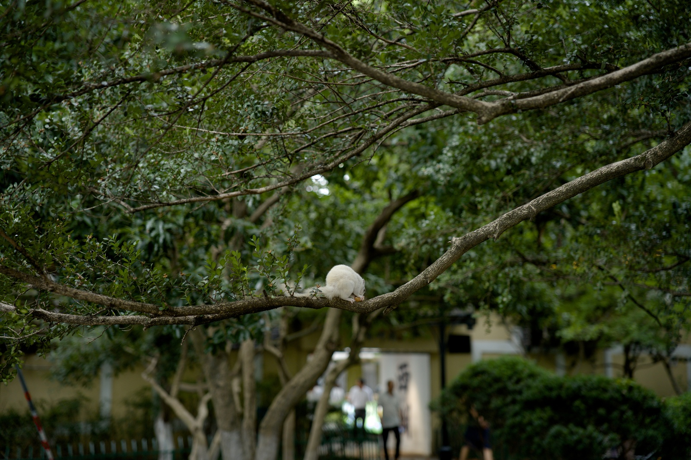 |  | 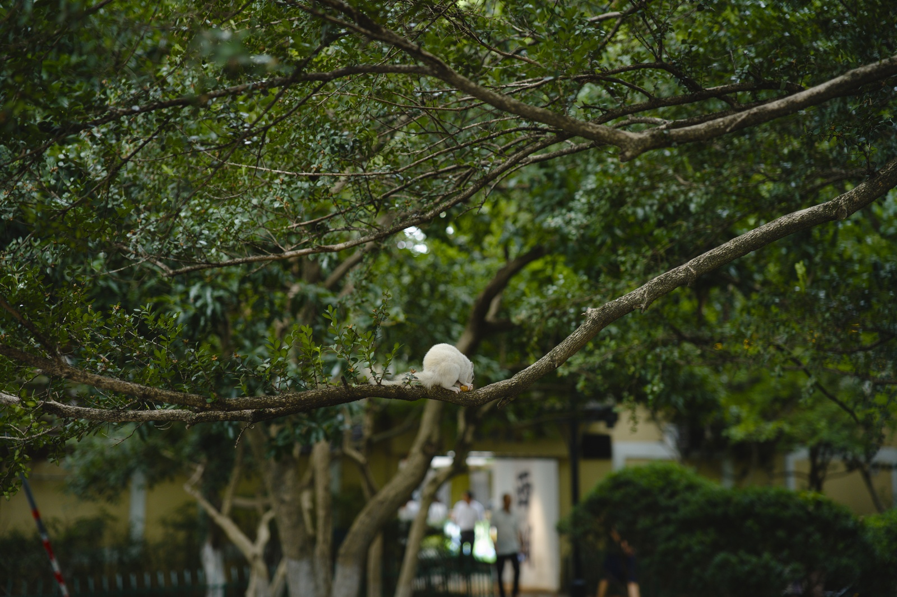 |

动了会发生什么（实测）：切到 Portra 400 后约八成像素有可见变化——整体
亮度抬起（负片相纸的黑位比较高）、颜色放淡；切到 Velvia 100 后亮度几乎
原位，色彩向青冷方向压深。两卷动的是同一批控件，方向完全不同——这正是
"胶片 = 五层设置的一组取值"的含义。

观察要点：看树荫的绿。自适应基准偏黄绿；Portra 把整体亮度抬起、颜色放淡；
Velvia 把绿压深、变密。再看画面底部的黄墙与人物，三联里它们的亮度和色相
各不相同——没有哪一层是"叠在成片上的滤镜"，整条处理链看照片的方式被换
掉了。

---

## 二 · 白平衡固定色温与镜前滤镜

机理已在《使用指南》三点五节讲过：固定色温不是用眼睛调白平衡，而是一个
标准参考值，换算系数由照片文件自身的颜色标定精确求出。对胶片模拟，它的
意义是**整卷统一**——胶片不会逐张适应现场光，5500K 日光卷在钨丝灯下就该
偏橙。

傍晚的逆光钢桥，拍摄值对 5500K 摄影日光：

| 拍摄值 · As Shot | 5500K · 日光卷 |
|---|---|
| 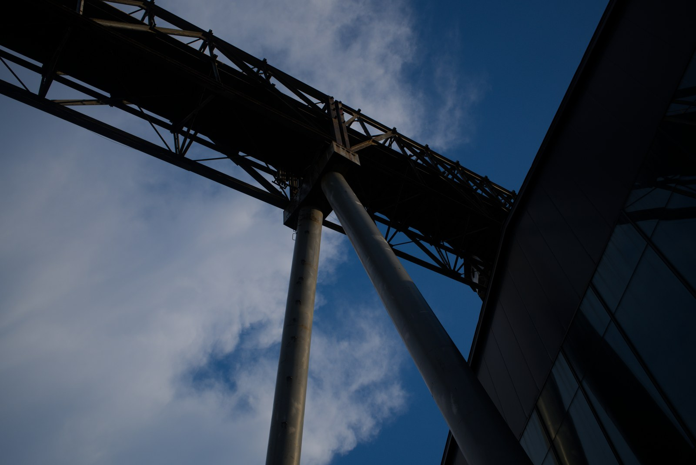 | 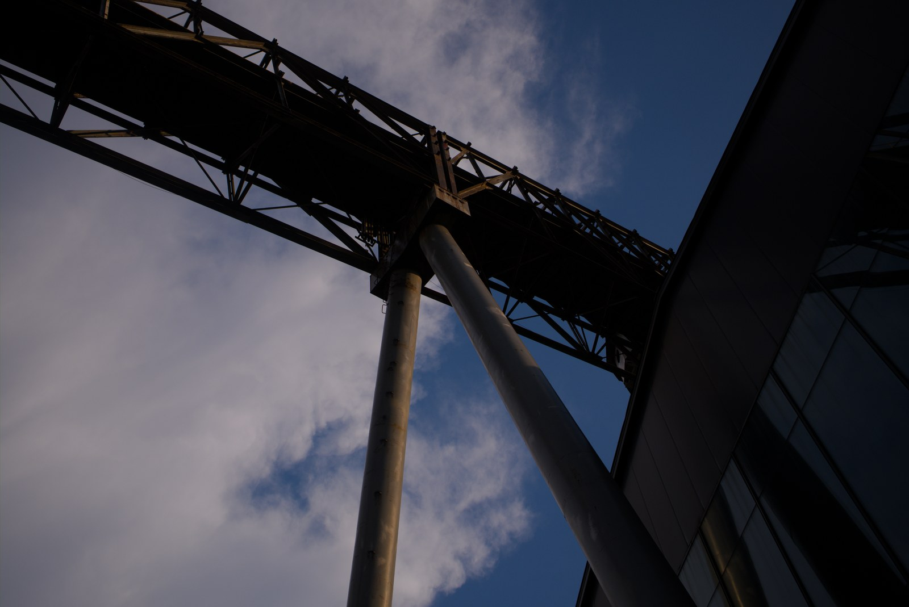 |

动了会发生什么（实测）：约七成像素有可见变化，画面整体向暖移——相机测光
原本把傍晚的暖光"配平"掉了一部分，固定 5500K 后这层自动适应被移除，现场光
的暖如实穿过。

一个反方向的诚实事实：样张三的合照拍在正午日光下，fp 的拍摄值本来就
落在日光附近（与摄影日光只差 0.1 EV 以内）——同样切到 5500K，九成像素
在可见阈以下，其余也只差十几个码值。**拍摄值已经在标定色温附近时，固定
色温几乎什么都不改变**；这个选项移除的是相机的场景
适应，而不是往画面里加暖或加冷。

第三个方向，钨丝灯——机理里"5500K 日光卷在钨丝灯下就该偏橙"长什么样。
猫吧的黑猫拍在整墙暖黄灯带前，相机测光把这份暖配平掉了大半；切到 5500K
日光卷，酒墙整体沉进钨丝橙（实测约四分之三的像素有可见变化，幅度是本文
所有白平衡对比里最大的）：

| 拍摄值 · As Shot | 5500K · 日光卷 |
|---|---|
|  | 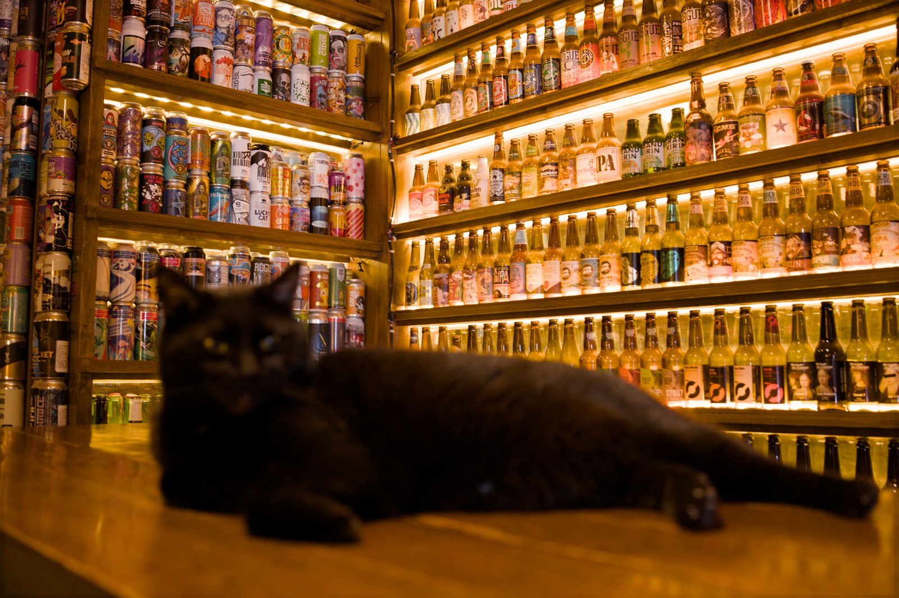 |

拍负片的人对这个方向不陌生：日光卷进钨丝环境不换卷、不加滤镜，冲出来
就是这一片橙。想要这份"错得正确"的现场感，选日光卷然后什么都别做；想
校正它，用下面的镜前滤镜按历史工作流来。

**镜前滤镜**（RAW 解码卡）是配套的独立选项：按柯达出版的滤镜参数模拟镜头
前的转换玻璃（85B 日光转钨丝、80A 钨丝转日光等），作用在感色特性之前，
HDR 的亮度测量也透过滤镜进行——真胶片就是这样测光的。滤镜没有强度滑杆
——玻璃没有半片。用于复刻"钨丝卷 + 85B 拍日光"这类历史工作流，详见
《使用指南》三点七节。

---

## 三 · 前馈强度：分离性格的浓度

机理先行：前馈强度不是饱和度。感色特性是按厂商数据手册建模的**分色方式**
（肤色、植物、青、品各自的分离方向），强度是这套方式整体的倍率——
1.0 = 数据手册的校准强度，每卷胶片带一个推荐值（Velvia ×1.6、Portra 系
×1.3、电影负片 ×1.2），推荐值是编辑口味不是测量。

Velvia 100 在公园样张上的强度扫描，其余层保持组合值（树荫裁切）：

| ×0（关闭分离） | ×1.0（校准强度） |
|---|---|
| 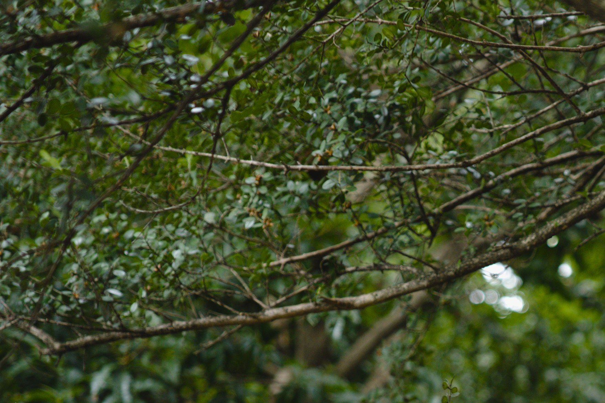 | 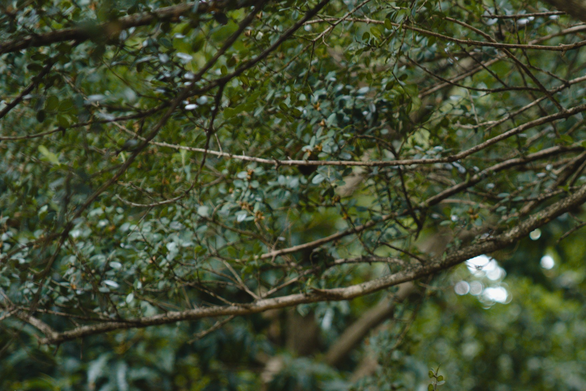 |

| ×1.6（组合推荐值） | ×2.5（过驱动） |
|---|---|
| 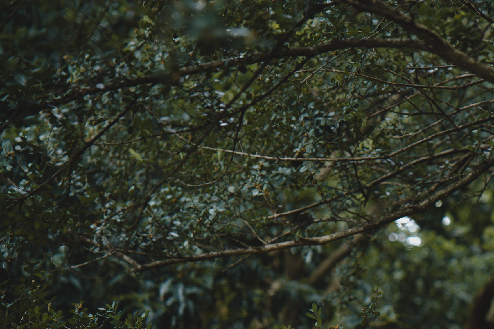 | 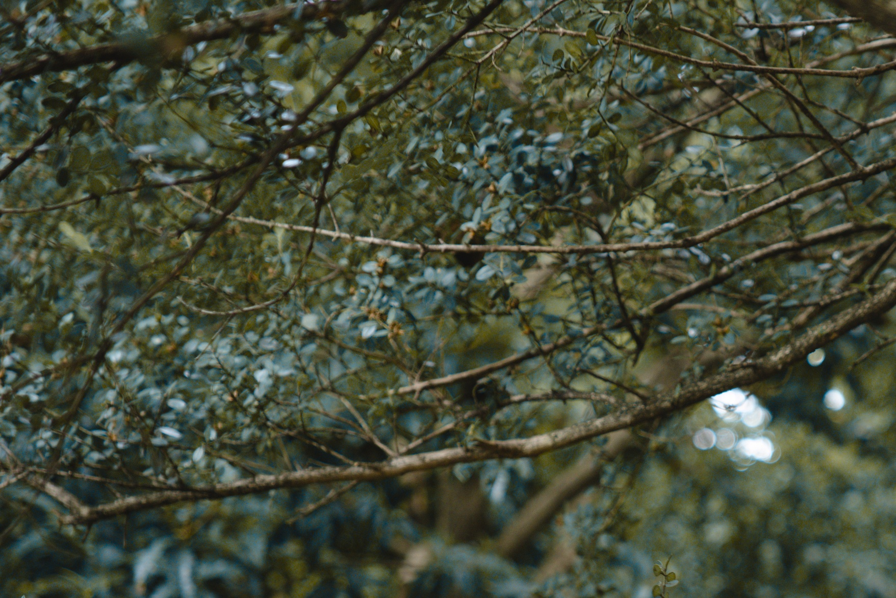 |

动了会发生什么（实测）：×0 关闭分离后，约七分之一的像素与推荐值有可见
差异——重建标定底座后分离更克制了，差异也更聚焦。观察要点：看前景叶簇与背景树影的**分离**。×0 的绿是均匀的一片黄绿；
强度上推后，受光的叶保持黄绿、背光的叶被推向青蓝，同一丛树里的色相距离
被拉开——这就是"感色分离性格"的浓度，不是全图一起加饱和。

一个如实写明的边界：本文原计划在合照样张上演示负片的肤色分离，实测
Portra 400 的前馈从 ×0 拉到 ×1.3，**在屏幕上看不出区别**（过可见阈的
像素只有 0.5%）——负片的肤色分离本来就以温和为目标，这张合照又恰好落
在它几乎不动的区间。按本文
宪法，看不见的对比不放图；改用分离性格最强的 Velvia + 植物场景演示同一个
控件。你在自己的人像上把这个滑条拉到头而画面几乎不动时，滑条没有坏——
这款胶片在这类内容上本来就动得少。

---

## 四 · 曲线预设：整卷固定的明暗性格

选中曲线预设后，一组固定的明暗参数整体替换场景自适应：Velvia 100 的黑点
在 −4.03 EV，对比、趾部、肩部都按厂商数据手册的特性曲线定死（它的白点
参数顶在拟合域上界 +8.5——反转片的硬肩在这套曲线族里就是顶格表达，
残差 0.028 档如实入档）。场景分析照常运行（HDR 亮度预算仍读真实场景），但明暗曲线不再看这张
照片的直方图——**整卷一致就是选它的目的**。

两卷曲线，各自放到性格合适的题材上；只动曲线层，白平衡与感色特性保持
默认。

先看负片。Portra 400 的相纸黑位在 1.5% 线性——**负片印相永远不会死黑**。
昏暗的猫吧在自适应下黑点放到 −6.3 EV，黑猫沉在浓黑里；换上 Portra 曲线
（黑点 −4.17、白点 +6.60），暗部被整体托起，猫的毛面和吧台木纹浮出一层
奶油般的灰（实测 20% 的像素移动超过 30/255）：

| 场景自适应 · 默认 | Portra 400 曲线预设 |
|---|---|
| 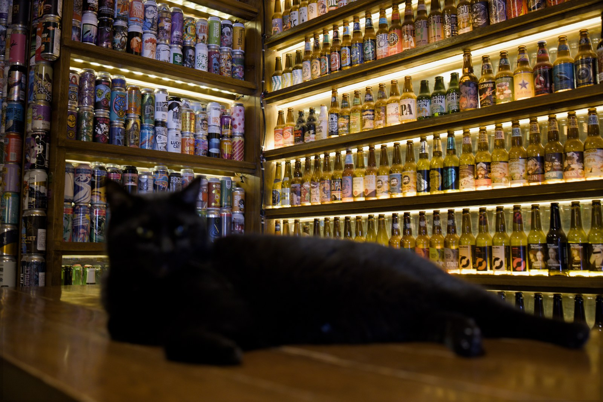 | 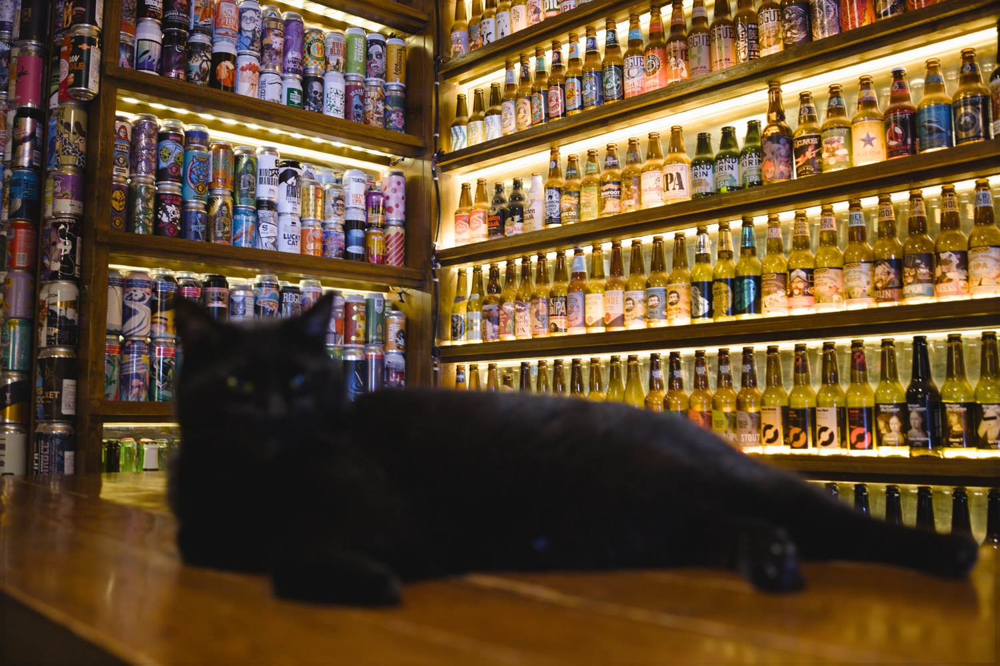 |

再看反转片。Velvia 100 黑点钉在 −4.03、对比压硬——**反转片黑得干脆**。
live house 的后台视角，自适应把黑点放到 −7.5 EV，天花板的桁架、墙面的
杂物都留在微光里；Velvia 曲线把这整个上半场馆干脆利落地沉进黑，品红灯板
变浓，白衬衫白裤把乐手从黑里剪出来（半数像素移动超过 21/255）：

| 场景自适应 · 默认 | Velvia 100 曲线预设 |
|---|---|
| 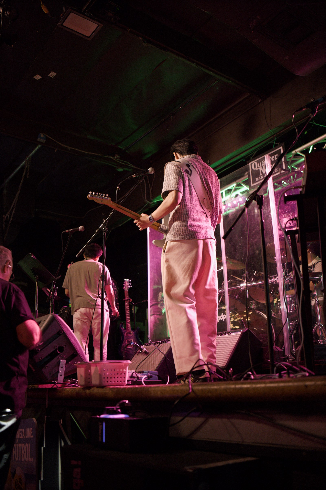 | 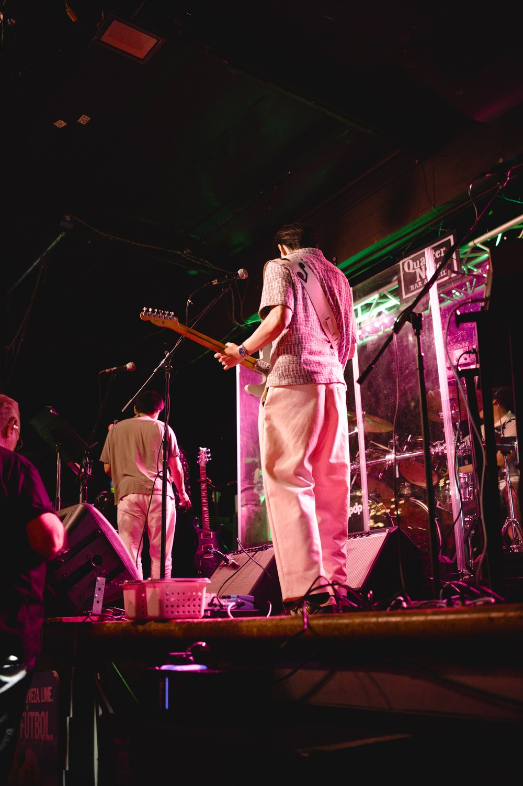 |

两卷方向相反——负片向上托、反转片向下压。**这就是"整卷固定的明暗
性格"**：预设不看这张照片的直方图，它把自己的世界观带过来。这不是"更好
或更坏"，是"这卷胶片就这样看世界"对"为这张照片量身定制"的取舍。

三个事实，如实写明：

- **端点模式在曲线预设激活时不适用。**预设自带黑白点，这时切到证据界不会
  报错，画面也完全一致、不会有任何变化。写在这里免得你对着不动的画面困惑。
  （实现细节见[架构文档](ARCHITECTURE.zh-CN.md)。）
- **趾部收黑/肩部收白仍然有效**，它们在预设的曲线上继续微调（黑位以预设
  的相纸黑为底）。本节后台样张实测：Velvia 曲线上趾部收黑 −2 仍有明显
  效果（四成像素可见变化）——微调余地真实存在。
- **同一个微调的余地，取决于那段曲线上有没有内容。**Velvia 的肩部是所有
  预设里最硬的：高光有内容的照片（本节后台）肩部收白 +2 还有约 4% 像素的
  可见变化；高光少的照片（公园样张）只剩 0.1%——几乎纹丝不动。数字不动
  是曲线在说话，与《修图工作流说明书》里"样张一的肩部纹丝不动"是一回事。

---

## 五 · AgX 原色几何：成像端的浓度杠杆

机理先行：这个选择器改的是颜色变亮时**如何向白收敛**，管住的是饱和色的
"浓"。它在曲线之后、属于"怎么成像"的一半；每卷胶片带一个配对
（Velvia→punchy、Kodachrome→muted），配对是编辑口味，随时可改。

香港街景（无胶片，单独看这一层），双层巴士裁切：

| base · darktable 默认 | punchy · 纯度增强 |
|---|---|
| 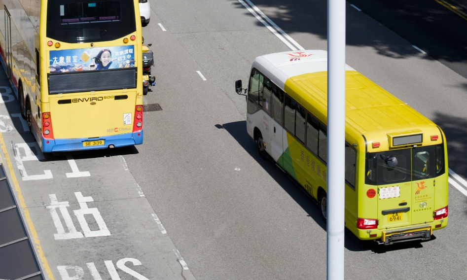 | 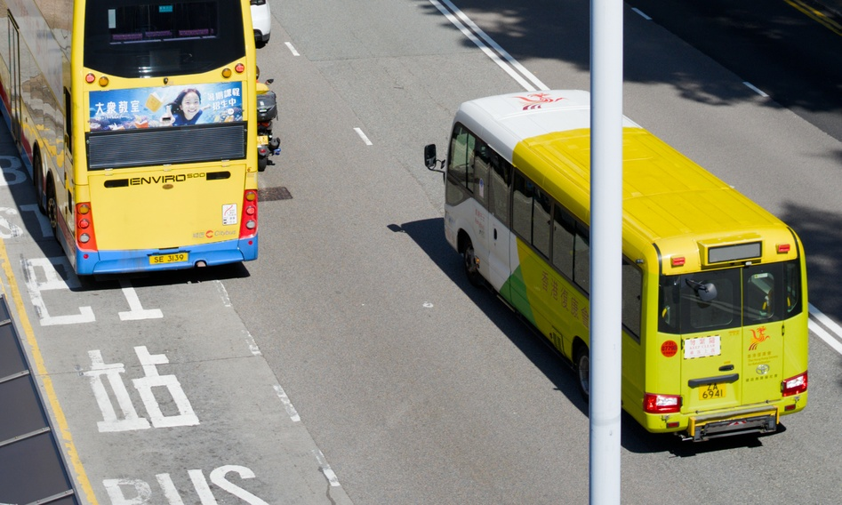 |

| smooth · 平滑收色 | muted · 纯度柔和 |
|---|---|
| 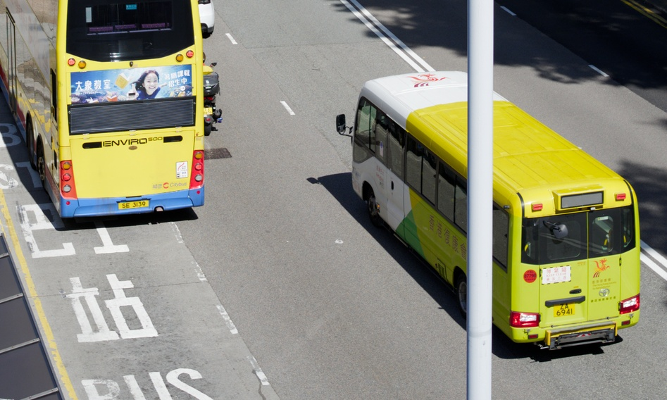 | 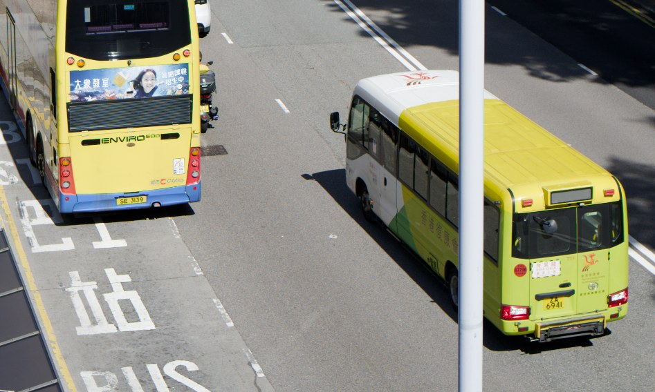 |

观察要点在**高饱和的巴士黄**：punchy 的黄更密、更沉；muted 的黄明显放淡；
smooth 的中低饱和区几乎与 base 重合、差异集中在最饱和的颜色怎么收进白
——它是四个选项里离 base 最近的。中性的路面与白色路标几乎不动：这个控件
只弯折色彩，不碰明暗。

低饱和的画面上四个选项彼此接近（本文的公园与钢桥样张几乎看不出差别）——
想看清这个控件，找画面里最饱和的那块颜色。极端的一端长这样：live house
的红色舞台光，整片又亮又饱和，"怎么收进白"没有藏身之处——

| punchy · 纯度增强 | muted · 纯度柔和 |
|---|---|
| 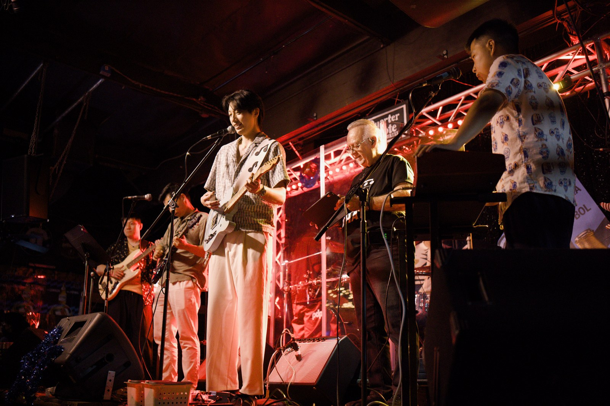 | 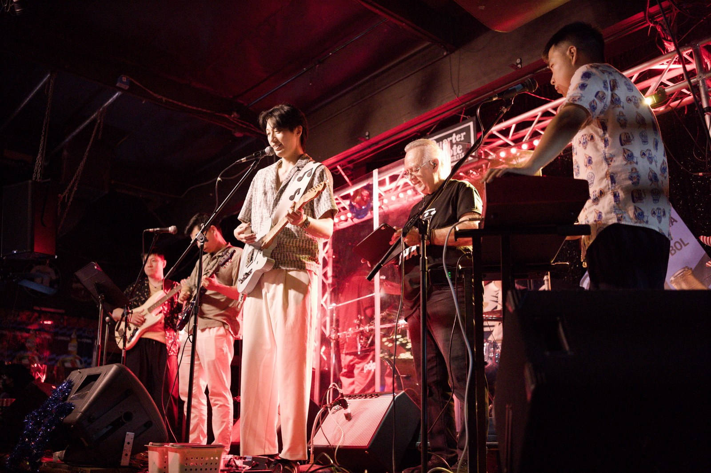 |

punchy 的红密而沉，桁架和背景的光洗透着密度；muted 把同一片红放淡一档、
亮部的红更早向白让路。看不受管的部分：白衬衫、肤色、黑暗处几乎不动——
两张的明暗也完全一样。这就是"只弯折饱和色、不碰明暗"在极端场景下的样子。

---

## 六 · 色彩由谁负责：observe 与 full

机理对照。**observe**（默认）：胶片决定观察者看见了什么——白平衡、颜色
分离、明暗性格——最终颜色由 AgX 负责成像。这是验证得最充分的路径，HDR
照常工作。**full**：胶片的显影模型整体接管。光谱底座重建后它不再是"逐通道
曲线吃 RGB"的启发式，而是离线烘焙的完整光谱链——场景颜色经受约束的观察者
逆矩阵折算为三层乳剂曝光，过各层特性曲线、负片染料光谱、TH-KG3 印相链，
再回到屏幕色彩——运行时按 65³ 查找表采样。如实声明两条边界：三个数字
恢复不了光谱，观察者逆矩阵的同色异谱残差按卷实测盖章在数据里（最坏训练
材料 p99 约 0.5–1.2 档）；显影抑制耦合（DIR）等层间效应数据中没有，链里
就没有。

动了会发生什么（实测）：**在公园样张上，几乎什么都看不出**——observe 与
full 只有约 1% 的像素过可见阈，绿系色相中位只差 4 度。这不是坏消息：两条
彼此独立的路径（AgX 显影声明 vs 光谱链直算）对同一卷胶片给出了接近的答案，
互为印证；旧版 full 那 23 度的绿移大半是被换掉的启发式的伪影，不是胶片。
按本文宪法，看不见的对比不放图。full 今天的可见载荷在下一节——层间漂移
只有它能渲染；它仍仅支持 SDR，速度与 observe 同级（本机 M4 半尺寸实测
observe 0.43 秒、full 0.68 秒/帧）。

---

## 七 · 胶片色偏：阴影偏冷、高光偏色（仅 full）

GUI 名"层间漂移"，即胶片术语 crossover。机理先行：真实胶片的三层感光
乳剂并不完全平行——同样的中性灰，在暗部和亮部会显出不同程度的偏色，这
就是胶片的层间色偏。按数据手册实测，Velvia 的偏移几乎全部在中灰以下
（阴影偏冷）。这个开关决定实测数据怎么用：

- **off**（默认）：**数字中性化变体**——每个通道除以中性阶在该像素亮度
  曝光处的染色（与色头同一条单轴约定），且校正每通道限幅在 ±2 档以内：
  介质自身灰阶偏离中性两档之内的染色被完全中和，更深的染色（典型如
  Kodachrome 的地板色）如实保留为介质性格。这是声明的数字约定，不是第
  二个物理过程；
- **datasheet**：光谱链原样——中灰由印相求解锚定中性，暗部和亮部按链
  自身的层间数据偏移（Velvia 阴影偏冷）。偏移幅度尚无外部数据校验。

大逆光钢桥 + Velvia 100 full，off 对 datasheet：

| off · 中性灰保持中性 | datasheet · 按实测偏移 |
|---|---|
| 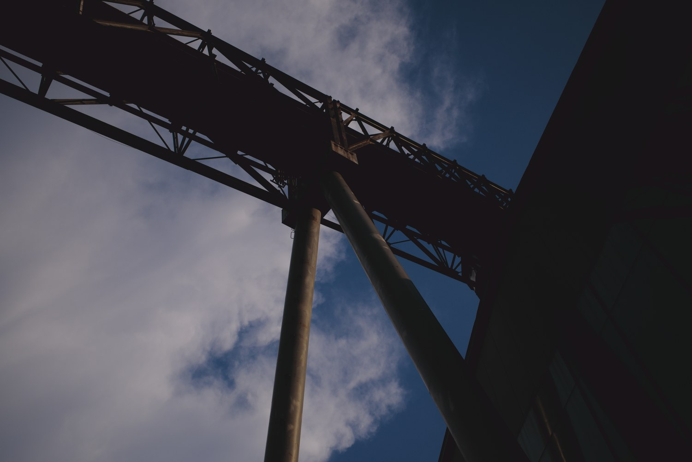 | 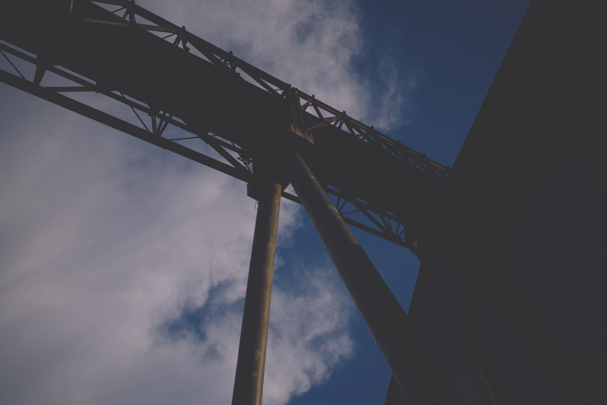 |

深阴影裁切（右侧建筑幕墙）：

| off | datasheet |
|---|---|
| 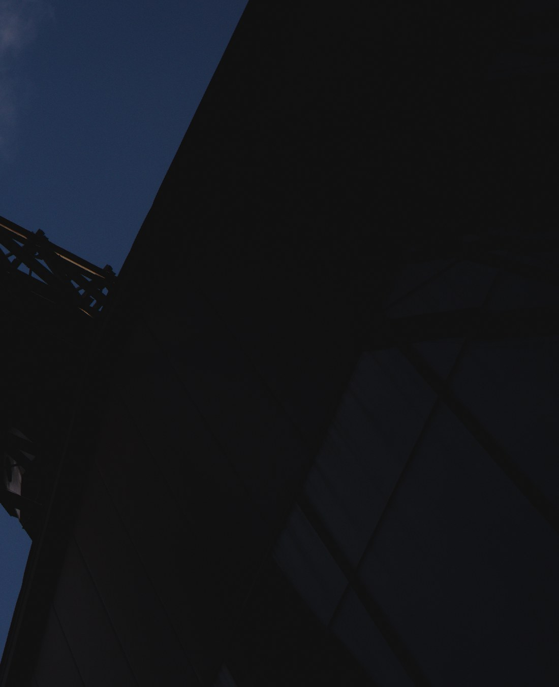 | 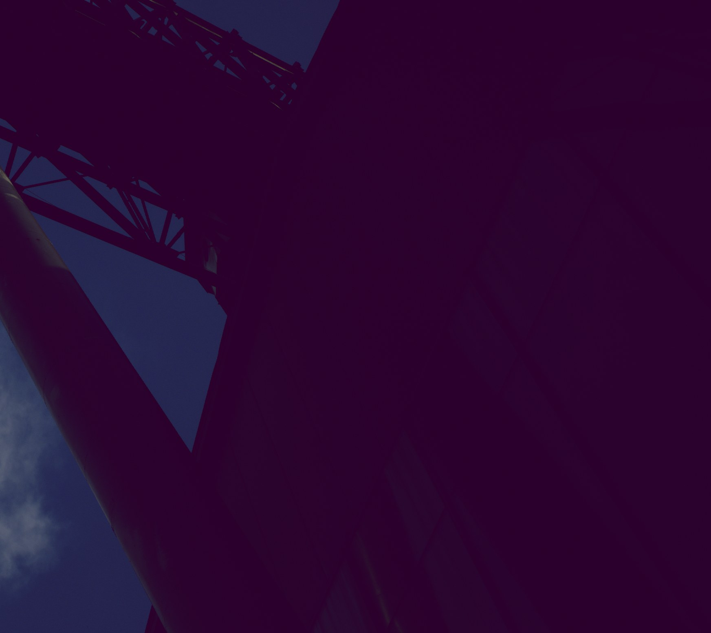 |

动了会发生什么（实测）：约五成六的像素有变化，但幅度温和——阴影与中调
向蓝偏约 3 个码值（p99 全图差仅 6），明暗完全不变——这个开关只动色，不
动明暗。观察要点：幕墙玻璃与钢架的黑带上一点冷意；天空与云不动。早期版
本里这个对比要醒目得多，那大半是染料谱带外泄漏的伪影（见工程决策记录）；
按富士数据手册，Velvia 阴影的真实冷移本来就是温和的。

两个如实写明的边界：Velvia 的层间偏移温和且住在中灰以下，**这个开关在多
数照片上接近不可见**——它是给关心中性轴语义的人准备的声明开关，不是风格
开关。另外它只在 full 模式有意义：observe 模式下开不开完全一致。

---

## 八 · 放大机色头：负片的印相决策（仅负片）

机理先行。彩色负片没有"自己的颜色"——底片只是中间记录，最终颜色在放大机
下由人决定；色头上的 Y/M 分色滤镜档位就是那次决策。dngscan 的两条滑杆用
**真实暗房单位**：CC 滤镜密度 0–200、步进 5，30CC = 0.30 光学密度 ≈ 该
分色 1 档印相曝光衰减。方向背暗房口诀：**成片偏什么色，加什么色的滤镜**
——偏黄加 Y（黄滤镜吸收蓝光、少曝相纸蓝敏层、少生成黄染料），偏品加 M。
响应模拟真实印相光路，改档位后亮度自动保持不变。
（实现方式见[架构文档](ARCHITECTURE.zh-CN.md)"放大机色头"一节。）

### 实用尺度：精修在 2–10CC

先看日常作业区间。真实暗房的精修步长是 **2–10CC**——30CC 以上属于"这张片子
色彩大错"级别的粗调（滑条量程到 200 只是复刻硬件拨轮的物理行程，不是邀请）。
清汤面碗 + Portra 400——木桌的暖光让出厂中性印相带一点暖，青花白瓷就是
现成的中性参照物；Y 档小步修正：

| Y 0 · 中性印相 | Y 5 | Y 10 |
|---|---|---|
| 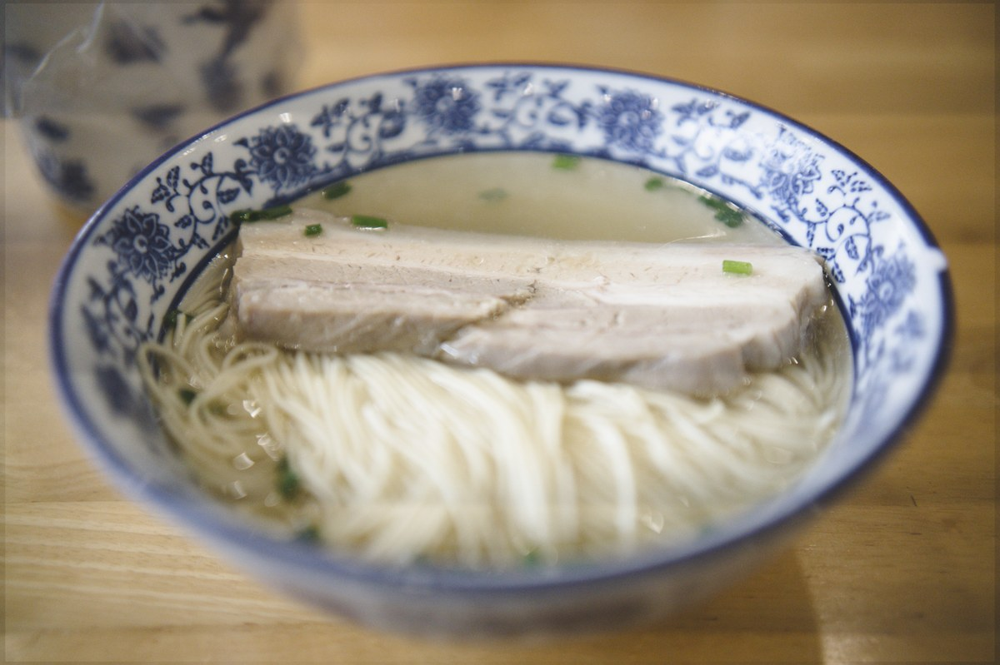 |  |  |

动了会发生什么（实测）：Y +5CC 把暖罩明显减轻、白瓷还站在暖侧；Y +10CC
恰好穿过中性，青花瓷的白干净落位。**这两步就是色头的日常**：5CC 一档地
试，看白色物件（白瓷、白墙、白衬衫）落在中性的哪一侧。

M 档同尺度更烈（相纸对绿的响应更陡）：M +10CC 就把画面明显推向绿——品绿
轴的精修步长比黄蓝轴还要再小一半才稳。

| M 10（对照） |
|---|
| 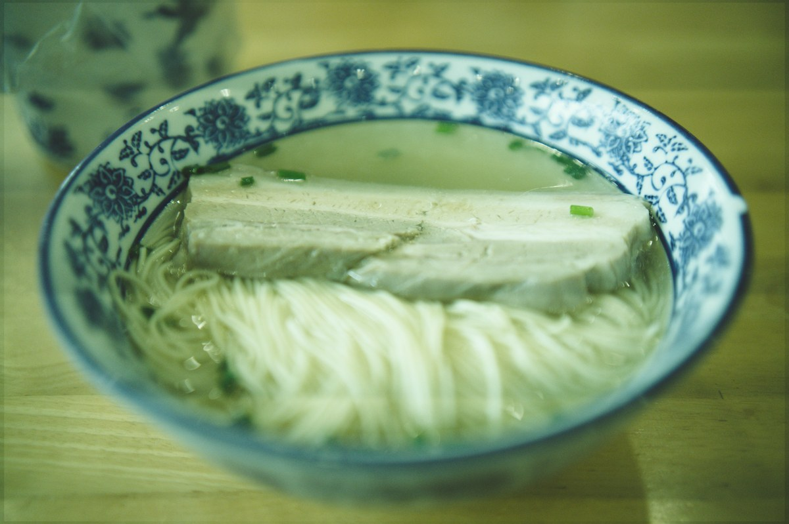 |

色头改的是各分色的印相配平，不是曝光——换挡时中灰的印相曝光自动补偿，
它模拟的是印相光路，不是在成片上叠一层偏色（大档位下画面观感自然跟着
颜色走，浓色看起来更沉，那是颜色的重量）。两档都在 0 时和不启用完全
一致：0 就是预设出厂的中性印相决定。

### 量程演示：30CC 起是粗调

往上是方向教学用的大动作——30CC = 0.30 光学密度 ≈ 该分色 **1 整档**印相
曝光，经相纸放大后是剧烈的色彩位移（这不是模型夸张：同样的档位在真暗房里
同样剧烈，暗房口诀"偏什么色加什么滤镜"说的正是这种纠错幅度）：

| Y 30 | Y 60 | M 30 |
|---|---|---|
|  | 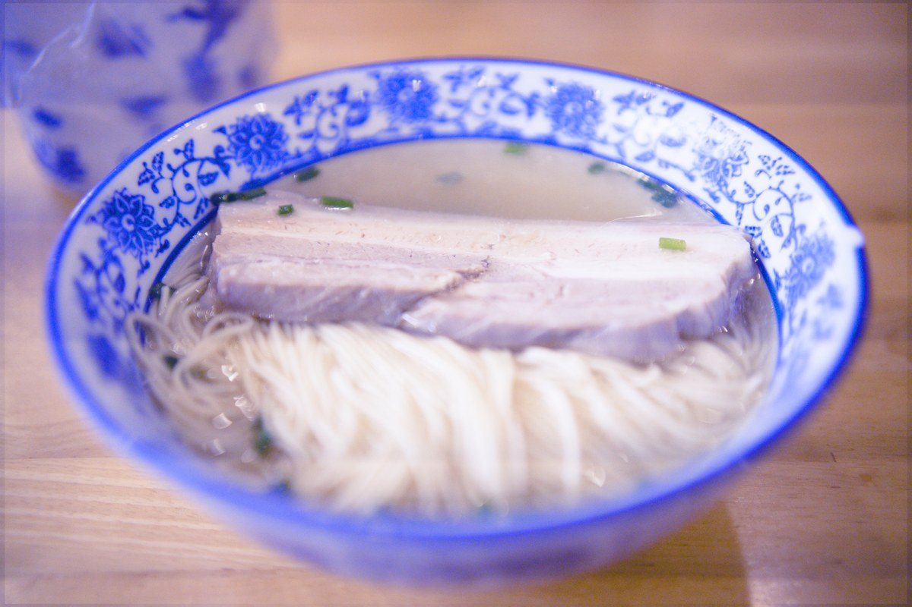 | 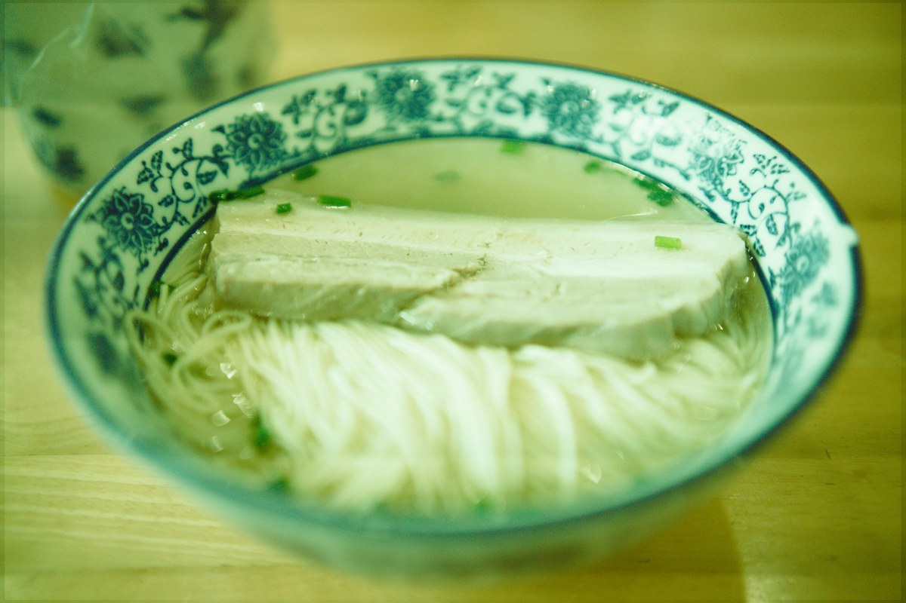 |

实测：Y +30CC 把画面推到明显的蓝调（+60CC 更极端）；M +30CC 推到浓绿。
方向与暗房口诀一致，幅度与印相物理一致——**离谱的不是模型，是 30CC 本身
就是暗房里的大动作**。

### 为什么反转片没有色头

E-6/K-14 反转片冲洗出来**自身就是显示介质**——幻灯片直接投影或看片台
直读，物理上不存在印相环节，也就不存在色头这个决策点。所以选中反转片
预设时这两条滑杆不出现（CLI 传入会直接报错），这是诚实设计：只提供物理上
存在的控制面。当前预设的分类（由每个预设的档案给出，不按名字猜）：

- **负片（有色头）**：Portra 160/400/800（含 push1/push2）、Ektar 100、
  Gold 200、UltraMax 400、Superia 400、C200、Pro 400H、Vision3 50D/250D/
  200T/500T、Verita 200D（含全部 ·影院放映外观 变体）；
- **反转片（无色头）**：Provia 100F、Velvia 100、Ektachrome 100、
  Kodachrome 64。

---

## 快速表：动了会发生什么

| 控件 | 动了会发生什么 |
|---|---|
| 选一卷胶片（胶片观察位置） | 五层设置同时落位（白平衡/感色特性/强度/曲线/原色几何），全部可见可改；"无"回纯 AgX |
| 白平衡固定色温 | 移除相机的场景适应，整卷统一标定色温；现场光暖冷如实穿过；拍摄值已在标定附近时几乎无变化 |
| 镜前滤镜 | 镜头前的转换玻璃，作用在感色特性之前；无强度滑杆 |
| 前馈强度 ↑ | 感色分离性格加浓：同类颜色内部色相距离拉开；这卷胶片在该内容上动得少时如实几乎不动 |
| 曲线预设 | 整卷固定的明暗性格替换场景自适应；端点模式此时不适用；趾/肩微调仍在预设曲线上有效 |
| AgX 原色几何 | 高饱和色的密度与收白路径改变（punchy 密、muted 淡、smooth 近 base）；中性内容不动 |
| 色彩由谁负责 → full | 胶片模型接管颜色，整体色相/密度重画（实验、仅 SDR、无外部色彩校验） |
| 胶片色偏 → datasheet | 仅 full：中灰保持白平衡，深暗部按实测数据偏冷/偏色；中间调以上几乎不动 |
| 色头 Y ↑ | 仅负片：印相去黄向蓝；精修 2–10CC 一步，30CC 起属粗调；亮度自动保持不变 |
| 色头 M ↑ | 仅负片：印相去品向绿，机理同 Y、力道更大 |

## 每个控件一句话

- **选一卷胶片**（胶片观察位置）：一次展开五层独立设置的组合预设，没有任何一层被藏起来。
- **白平衡固定色温**：整卷统一的标定色温，移除相机逐张适应。
- **镜前滤镜**：镜头前的转换玻璃，按出版参数作用在感色特性之前。
- **前馈强度**：感色分离性格的浓度倍率；1.0=校准，推荐值是口味。
- **曲线预设**：这卷胶片固定的明暗性格，整卷一致、自适应关闭。
- **AgX 原色几何**：饱和色如何收进白；比前馈强度更大幅度的风格杠杆。
- **色彩由谁负责**（显影分工）：observe=胶片观察+AgX 成像（默认）；full=胶片模型接管（实验）。
- **胶片色偏**（层间漂移）：仅 full；datasheet=中灰保持白平衡、暗部亮部按实测数据偏移。
- **色头 Y/M**：负片印相环节的分色滤镜档位，真实 CC 单位，亮度自动保持不变。

本文全部对比图由 dngscan 按文中所列参数实际渲染（半尺寸解码；全图长边
1500–1600px，裁切自半尺寸渲染截取后缩放到宽 1100px；JPEG q88）；文中全部
数字来自对这些渲染与内部状态的直接测量，无任何后期修饰。

样张出处：白松鼠公园 `DSC00225.ARW`（Sony A7 V）、大逆光钢桥
`DSCF0214.RAF`（X100VI）、coser 合照 `_SDI0238.DNG`（SIGMA fp）、猫吧黑猫
`_SDI0016.DNG`（SIGMA fp）、live house 红光舞台 `_SDI0175.DNG`（SIGMA fp）、品红后台 `_SDI0173.DNG`（SIGMA fp）、
清汤面碗 `_SDI0127.DNG`（SIGMA fp）、
香港街景
`_SDI0165.DNG`（SIGMA fp）。
