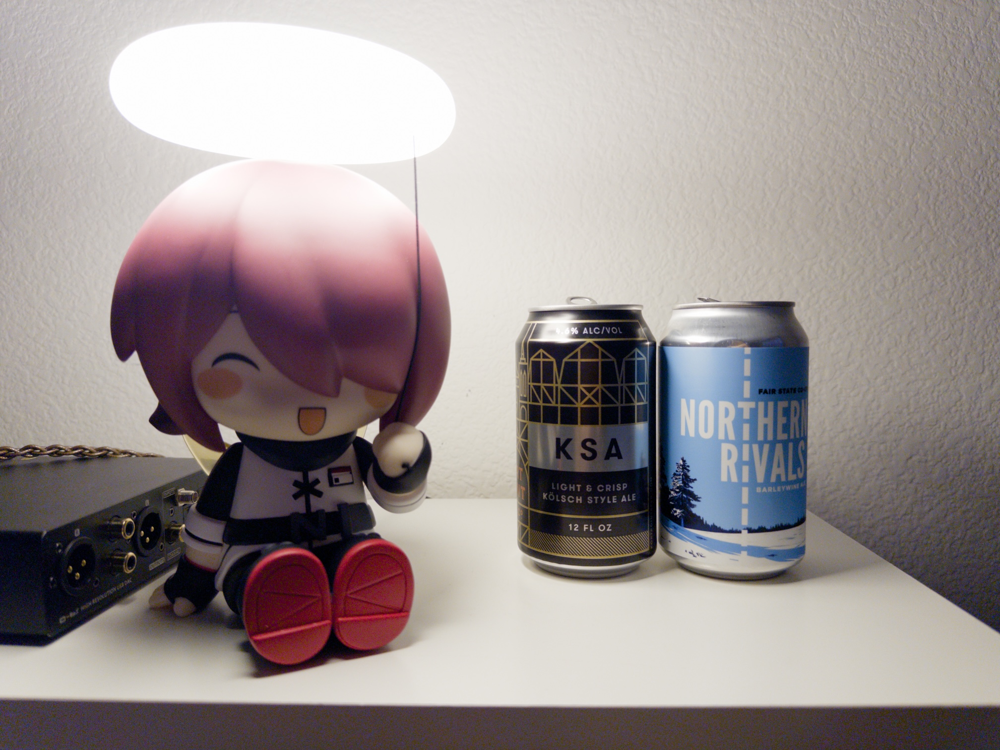
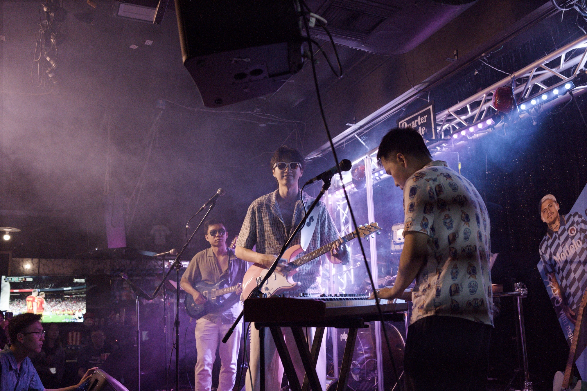
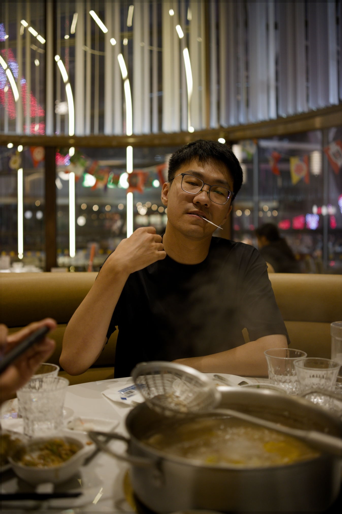

# HDR 出片说明书 —— HDR 照片是什么，能亮多少，怎么导出

[修图教程](EDITING_TUTORIAL.zh-CN.md) · [胶片教程](FILM_TUTORIAL.zh-CN.md) · [HDR 教程](HDR_TUTORIAL.zh-CN.md) · [使用说明](USER_GUIDE.zh-CN.md) · [架构与技术细节](ARCHITECTURE.zh-CN.md)

这份说明书讲四件事：HDR 照片到底是什么，一张照片能比普通照片亮多少，dngscan 的 HDR 和"把照片拉亮"有什么不同，以及怎么导出、怎么确认导出的文件没问题。

---

## 一 · HDR 照片是什么

普通照片（SDR）里，最亮只能到屏幕上"正常的白"——网页的底色、文档的纸面那种白。本文把它叫**参考白**。灯、太阳、反光这些在现实里比白纸亮得多的东西，在普通照片里也只能和白纸一样亮。

HDR 照片允许这些东西**比参考白更亮**。在支持 HDR 的屏幕上，灯会真的比旁边的白墙亮，看起来像在发光。

dngscan 导出的 HDR 照片是一个文件装两份东西：一张普通的照片，加一张"哪里该更亮、亮多少"的图（增益图）。

- 在支持 HDR 的屏幕和软件里，两者合起来显示，高光真的亮起来；
- 在不支持的地方，自动只显示那张普通照片，不会出错，也不会发灰。

所以 HDR 文件可以放心发给任何人。

### 直接看效果

下面三张是 dngscan 导出的**真 HDR 文件**（缩小到长边约 2000 像素，其余与正常导出完全相同）。如果你的屏幕和浏览器支持 HDR——比如 Mac、iPhone 上的 Safari 或 Chrome，Android 15 以上的 Chrome——灯和高光会明显比这个页面的白色背景更亮。看不出区别，说明当前的屏幕或浏览器只显示了其中的普通版，这正是它该有的退路。

| 手办与灯 · 比参考白亮 2.35 档 | 舞台灯 · 亮 1.35 档 |
|---|---|
|  |  |

| 餐厅灯管 · 亮 1.45 档 |
|---|
|  |

---

## 二 · 一张照片能亮多少

HDR 能比参考白亮几档，叫 **HDR 余量**。它由三个上限里最小的那个决定：

1. **照片里确实测到的最亮高光。**传感器在过曝之前真实记录到的最亮内容有多亮。过曝的像素不算，它们没有被测到，只是顶到了上限；靠高光重建推算出来的像素也不算。检测参数卡上的"可信最亮高光"和"HDR 可用余量"就是这个数。
2. **你设的 HDR 亮度上限。**输出卡上的滑杆，默认 +3 档，大约对应 800 尼特的屏幕。它是上限，不是目标。
3. **曲线本身。**HDR 的高光同样要平滑地过渡到最亮处，不能一刀切。

手办与灯那张：场景 EV 直方图上的 p99.99 标线落在 +4.85 档，这就是可信的最亮高光。减去参考白的亮度，可用余量约 +2.4 档，小于上限 +3，所以实际用 +2.4 档。餐厅那张可信最亮高光在 +3.94 档，得到 1.47 档余量；写进文件之后再读出来是 1.447 档，误差为零。

**一张照片没有测到真实的高光，余量就是 0，导出 HDR 会明确报错，而不是硬造一个。**一张没有亮部的照片做成 HDR 也不会有任何区别，改导普通 JPEG 就行。

---

## 三 · 它不是把普通照片拉亮

很多工具的"HDR 输出"是先做好一张普通照片，再把亮的地方按比例放大。dngscan 不这样做。普通版和 HDR 版从同一份场景数据出发，**各自单独成像**：同样的曝光、同样的 RAW 分析，但 HDR 版有自己的明暗曲线和自己的高光颜色处理，不要求任何一个像素和普通版一致。

下面这张图把三样东西并排：左边是普通版；中间是单独生成的 HDR 版，为了能在普通屏幕上看见，按它自己的余量压回了普通范围；右边是"亮度分配图"——越亮表示这个地方用到的 HDR 余量越多，黑表示和普通版一样亮。


可以看到余量只分给了真正该亮的地方：一根根灯管、玻璃上的反光点、桌上餐具的高光。人脸、衣服、墙面和整个下半幅几乎全黑，也就是和普通版一样亮，没有被"顺手"拉亮。

同样的三联，换成舞台帧：余量分给了那一排 LED 灯珠、被灯打亮的桁架和琴键、角落里的电视屏幕；烟雾、人物和暗处保持不变。


### 很亮的灯在 HDR 里是什么颜色

亮度和颜色在 HDR 里是分开决定的。亮度只听 HDR 自己那条曲线的；颜色则要看数据可不可信：**越亮、越接近过曝的光源，在 HDR 里越趋向干净的白，而不是发出一种刺眼的彩色。**原因是过曝的通道里已经没有可信的颜色信息。工具逐个像素检查哪些通道过曝了，过曝得越严重，就越不相信那里的颜色。普通版不受这条规则影响。

---

## 四 · 怎么导出

输出卡上选格式：

- **HDR gain-map · JPEG**：推荐。兼容性最好，上面的三张样张就是这个格式。
- **HDR gain-map · HEIC**：内容相同，换成 HEIC 容器。实测它并不更小，画质还略差，只有对方明确要 HEIC 时才选。

再选导出档位：

- **存档 · 最高质量**：约 60MB 一张，留底用；
- **分享 · 小体积**：约 11–27MB 一张，肉眼基本看不出差别，HDR 信息完整保留，最大的照片也在微信"原图"25MB 的限制之内。

两个档位只改变压缩，不改变成像。

命令行：

```bash
python -m dngscan photo.dng --jpeg photo_hdr.jpg --output-format ultrahdr --hdr-headroom 3
```

HDR 导出需要 macOS（用系统自带的编码器写增益图）。界面加载时会检测一次，不可用的话这两个格式会置灰并写明原因。

**发微信要注意**：聊天里必须勾"原图"，HDR 才能到对方手里；朋友圈一定会被压成普通照片，这是微信的行为，任何工具都绕不过去。重要的照片用"文件"方式发送最保险。

**在哪里能看到 HDR 效果**：macOS 的预览和访达、iPhone 相册、Android 15 以上的相册、Chrome 和 Safari。在普通显示器或旧系统上，它就是一张正常的 JPEG。

---

## 五 · 怎么确认导出的文件没问题

每个 HDR 文件写完之后，工具都会**重新打开它**，把 HDR 的像素展开出来，逐项核对：颜色配置文件对不对、增益图在不在、文件里写的余量和实际是否一致、普通版和 HDR 版的像素误差是否在允许范围内。任何一项不通过，文件不会保留。

导出之后，预览图上方的"导出报告"面板里能看到结果：文件多大，HDR 实际用了几档，压缩造成的误差有多小。

---

## 六 · HDR 高级选项

输出卡上有一个默认收起的折叠区，里面三个量默认全部自动。它们是靠测量定不下来、需要主观判断的量，所以做成可调：

- **高光保色 ρ**（默认 0.5，命令行 `--hdr-rho`）：测量结果完全可信时，高光里允许保留多少颜色。调高，亮的彩色光源颜色更浓；调低，更早变白。
- **白点留量**（默认普通场景 0.30 档、夜景灯点这类稀疏光源 0.50 档，命令行 `--hdr-white-margin`）：曲线的最亮点放在可信最亮高光之上多少。留得多，最亮处的过渡更从容，但整体余量用得更保守。
- **高光压缩起点**（默认 0.20 / 0.00 档，命令行 `--hdr-shoulder-start`）：HDR 的高光从主体亮度以上第几档开始压缩。

过曝、噪声、颜色超出色域这几项保护始终生效，不会被这三个选项绕过。

---

## 七 · 和胶片一起用

**胶片的风格模式**下 HDR 一切如常。

**胶片的冲印模式**下，HDR 的做法是"胶片印相 + 场景高光扩展"：文件里的普通版就是胶片印相本身，和单独导出的普通 JPEG 逐字节一致；HDR 版只在参考白以上，按场景里确实测到的高光平滑地加亮。真实的相纸不会发光，所以这不是"物理上真实的胶片 HDR"，工具也不这样声称——它是"这张胶片照片，加上现场本来就有的那部分高光"。

另外两点：修图教程里的**高光褪白**在 HDR 输出时被禁用（HDR 的高光颜色单独处理）；**色度降噪**在 HDR 下可用，文件里的普通版和 HDR 版用的是同一份去过色斑的画面。

---

## 常见问题

**导出时报"可信最亮高光不支持任何 HDR 余量"？**
这张照片没有测到真实的高光内容，检测参数里"HDR 可用余量"为 0。不是故障，改导普通 JPEG 即可。

**HDR 版看起来整体并没有变亮？**
这是对的。余量只分给真正亮的东西，主体和阴影与普通版一致。想让整张照片更亮，用曝光 EV。

**为什么我的屏幕上三张样张看不出区别？**
当前的屏幕或浏览器不支持 HDR 显示，或者系统里关了 HDR。文件本身没有问题，换一台支持的设备打开就能看到。

原理和实现细节见[架构文档](ARCHITECTURE.zh-CN.md)与 [HDR 实施计划](HDR_AGX_V2_IMPLEMENTATION_PLAN.zh-CN.md)。样张由 `tools/make_hdr_showcase.py` 生成：走正常的导出流程，只在编码之前把普通版和 HDR 版一起缩小，再由同一套写入和回读校验出文件。
