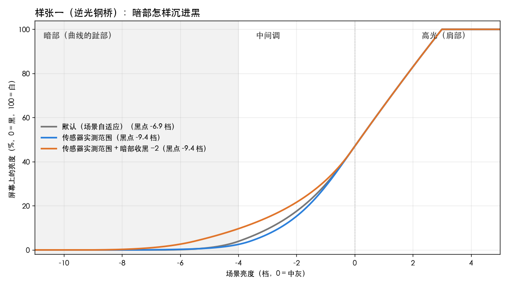

# dngscan 使用说明

[修图教程](EDITING_TUTORIAL.zh-CN.md) · [HDR 教程](HDR_TUTORIAL.zh-CN.md) · [使用说明](USER_GUIDE.zh-CN.md) · [架构与技术细节](ARCHITECTURE.zh-CN.md)

这是一份不讲数学的说明书。它回答三个问题：这个工具能处理哪些相机的照片，界面上每个数字是什么意思，导出时该怎么选。想了解处理流程的原理，请看[架构与技术细节](ARCHITECTURE.zh-CN.md)。[English version here](USER_GUIDE.md).

dngscan 只做一件事：把 RAW 照片转成尽量忠实、便于保存分享的 JPEG 或 HEIF。可以是 SDR，也可以是 HDR 照片——在支持的屏幕上高光会真的亮起来。

---

## 名词速查

文档和界面里反复出现的几个词，先在这里说清楚。

| 名词 | 意思 |
|---|---|
| **EV / 档** | 曝光单位。+1 EV 亮度翻倍，−1 EV 亮度减半。本工具里所有 EV 都以中灰为 0 |
| **中灰** | 18% 灰，大致是正常曝光下人脸中间调的亮度 |
| **过曝** | 传感器某个像素收到的光超过了它能记录的上限，这个像素的真实亮度和颜色已经丢失 |
| **参考白** | 屏幕上"正常的白色"有多亮。HDR 照片里比它更亮的部分，就是 HDR 多出来的亮度 |
| **HDR 余量** | HDR 照片最亮处比参考白亮多少档 |
| **暗部 / 高光** | 画面里暗的一端和亮的一端。对应胶片特性曲线的"趾部"和"肩部" |
| **影调映射** | RAW 记录的亮度范围远大于屏幕，把前者装进后者的方法 |
| **冲洗 / 印相** | 负片先冲洗成底片，再在放大机下印到相纸上才是成片。反转片（幻灯片）冲洗出来直接就是成片 |

---

## 一、支持哪些相机

**默认解码器（LibRaw）**覆盖市面上绝大多数相机的 RAW 格式，包括但不限于：

| 品牌 | 格式 |
|---|---|
| 佳能 | CR2 / CR3 |
| 尼康 | NEF / NRW |
| 索尼 | ARW |
| 富士 | RAF（含 X-Trans 传感器） |
| 松下 / 奥之心 / 徕卡 / 宾得 | RW2 / ORF / DNG / PEF 等 |
| 适马、iPhone（ProRAW）及一切输出 DNG 的设备 | DNG |

装好就能用，不需要按机型装插件或先做个人标定。本地已验收适马 fp DNG、Sony ARW、Fujifilm X-Trans RAF 和 iPhone 16 Pro 单帧 Bayer DNG；这批 iPhone 文件不是 Linear RGB ProRAW。具体范围见[相机支持与回退](SENSOR_SUPPORT.zh-CN.md)，不能由相同扩展名推断所有文件均已验证。

**太新的机型也能用。**刚发布、内置数据还没跟上的相机（如 A7 V、GR IV、X-E5 这一代）不会被拒绝。工具会用通用数据继续处理，并在报告里提示"该机型标定数据不完整，结果可能有偏差"，照片照常导出。部分新机型（A7 V / A7S III / A7R VI / GR IV / 尼康 Zf / X100VI / X-E5）已内置实测的传感器数据；有公开系数的机型还内置了颜色矩阵。A7R VI 的颜色矩阵没有可靠来源，所以不猜，走上面说的通用路径；GR IV 用 DNG 文件自带的标定。

**一个已知例外：尼康高效压缩（HE/HE\*）NEF。**Z9 / Z8 / Z6III / Z50II 这一代如果拍摄时选了"高效压缩"，这种格式因为编码授权问题，LibRaw 解不了，所有开源工具都一样。遇到时工具会给出具体指引。解决办法有两个：用免费的 Adobe DNG Converter 转成 DNG，转换后所有功能可用；或者在相机里改用"无损压缩"。同一台机身的无损 NEF 一切正常。

**Apple RAW 解码器（可选，"解码器"选 Apple RAW）**用的是 macOS 系统自带的 RAW 引擎。工具会探测当前文件提供的版本；自动模式优先 RAW 9，不支持或实际渲染失败时继续尝试旧版，Apple 全部失败时再尝试 LibRaw。界面和报告显示实际使用的版本及回退原因。若要固定算法，显式指定 RAW 9/8/7/6，失败就会报错。

切换解码器换的是"怎样把 RAW 还原成画面"。传感器实测数据仍由 LibRaw 读取，换解码器不会改写它们。如果 LibRaw 无法提供证据而 Apple 可以解码，仍可导出；RAW 剪切、噪声、满阱等字段会明确显示不可用。HDR 此时只按解码图像估计，最多扩展 1EV，不能当作传感器实测余量。

两个解码器出片的色彩性格略有不同，Apple 的降噪和高光重建更接近相机厂商的直出风格。两者都能正常导出 SDR 和 HDR。拿不准就用默认的 LibRaw。

RAW 解码卡上还有三个平时不用动的选项。

- **Apple RAW 亮度基准**（命令行 `--coreimage-scale`，只在解码器选 Apple RAW 时出现）：Apple 解码出来的亮度数值按什么基准交给后续处理。"与 LibRaw 对齐 · 默认"逐个文件对齐到 LibRaw 的结果；"Apple 原始数值"保留 Apple 自己的数值；"旧版固定系数"是早期版本用的固定倍率，只为复现旧结果保留。改它要重新解码。
- **过曝判定余量 DN**（命令行 `--margin`，整数 0–64，默认 4）：像素读数离传感器上限多近就算过曝。它不改变画面，改变的是分析结果：过曝比例、"RAW 过曝标记"旁的数字，以及整张检测参数卡都按它重算。改它会把这张 RAW 重新解码分析一遍，要几秒钟。
- **色度降噪**（命令行 `--chroma-nr`，0–1，默认 0 即完全不处理）：利用独立噪声模型，在约 8–128 个传感器像素的尺度上平滑色度。它在当前场景层保持亮度，但仍可能削弱真实颜色细节。只有噪声模型和处理域传播可用时才生效；Apple RAW 或未知变换会跳过并说明原因。适用时 SDR 与 HDR 使用同一份校正场景，HDR pair 的两腿保持一致。详见[色度降噪与纹理保护](CHROMA_NR.zh-CN.md)。

RAW 解码卡右上角的「个人标定 · 可选」可导入 JPTC Collect 目录或标定 JSON，并启用、停用、删除本机记录。程序逐文件核对标定声明的快门、ISO、RAW 码值范围、尺寸与存储条件，并显示匹配、未验证或不匹配的具体原因。界面中的存储位深不代表传感器 ADC 位深。操作、CLI 命令及适用范围见[实测标定说明](NOISE_CALIBRATION.zh-CN.md)。

「噪声模型可用」与「色度降噪可用」是两件事。有文件噪声声明仍可能因为 Apple 解码、非 Bayer 排列或镜头校正后的噪声传播尚未支持，而停用此降噪滑杆；旁边显示中文原因，原强度设置保留，换到适用文件后可继续使用。预览和导出另外报告是否实际应用。普通缺少标定会显示通用成像，不作为警告；自动曝光、AgX 和导出仍可使用，HDR 是否有余量取决于当前照片的可信高光。

后两项和亮度基准只在取非默认值时才写进导出文件名：`ciscale-unity` / `ciscale-measured`、`margin{n}`、`cnr{x}`。

---

## 二、基本流程

1. **选文件**：在顶部选择 RAW 文件；
2. **看控件旁的实测信息**：工具已经分析过这张照片，解码、噪声、曝光和 HDR 信息分别放在对应控件旁；
3. **调曝光和明暗**：需要的话。拿不准高光该压曝光还是调高光过渡时，先打开预览卡上的"**RAW 过曝标记**"看一眼（第三节末尾）；
4. **选输出**：普通 JPEG 还是 HDR，发朋友圈还是存档（第九节）；
5. **更新预览确认，导出。**

导出之后的「导出报告」列出本次 SDR/HDR 文件的实际质量、采样、大小和回读结果。10-bit HEIF 还区分浮点母版、最终位深与浮点回读；HDR HEIF 的 SDR 底图同样保留浮点至编码出口。预览图和直方图仍为 8-bit SDR，不能用来判断文件实际位深。想看完整的分析报告——传感器实测数据、曲线的黑白点、颜色矩阵是否健康等——用命令行加 `--report`。不加时命令行只打印写出了哪些文件（`JPEG 图像: …` / `PNG 图像: …`）；带 `--scan` 或 `--csv` 的诊断运行会自动附上报告。

除了这类报告和诊断输出（`--report`、`--csv`、`--support`、`--hdr-debug-dir` 等），命令行能调的成像参数界面上都有对应控件。当前用不上的控件会隐藏或置灰（第十一节）。六格分析图可以在导出对话框里勾"附带分析图"顺带生成（第九节）。

---

## 三、"检测参数"里的数字是什么意思

这张卡显示工具对照片的测量结果。最终渲染用的也是这同一套测量。

**先弄懂 EV。**EV 就是"档"，摄影里的曝光单位。+1 EV 亮度翻倍，−1 EV 亮度减半。本工具里所有 EV 都以**中灰**（18% 灰，大致是正常曝光下人脸中间调的亮度）为 0：+3 EV 表示比中灰亮 3 档，−5 EV 表示比中灰暗 5 档。

| 字段 | 意思 | 有什么用 |
|---|---|---|
| **RAW 过曝** | 传感器上有多大比例的像素过曝了（"死白"） | 数字高说明高光烧了不少。这部分像素的颜色是推算出来的，工具会自动降低对它们的信任 |
| **可信最亮高光** | 照片里最亮、并且**确实测到、没有过曝**的内容在第几档（过曝像素不算） | HDR 能亮到多少只看这个数：夜景灯牌测到 +6 EV，HDR 就有依据把它点亮到 +6 |
| **HDR 可用余量** | 这张照片做成 HDR 能比普通照片多亮几档：可信的最亮高光超出参考白的部分 | 为 0 说明这张图没有值得做 HDR 的高光 |
| **主体中位** | 画面主体大致在第几档 | 负得多说明整体偏暗（夜景），接近 0 说明曝光标准 |
| **场景类型** | 普通 / 稀疏光源 | "稀疏光源"指夜景灯点、舞台这类大片黑加小片极亮的画面，工具会自动换一套更合适的高光处理 |
| **编译曲线** | 这次渲染实际使用的明暗曲线：从多暗到多亮、反差多大 | 参考值，让你知道工具替这张图做了什么决定 |

**怎么读这张卡**：可用余量 +1.5 EV，值得导 HDR；RAW 过曝 8%，天空可能烧了，过曝区会被自动保守处理；主体中位 −3 EV，这是夜景，别硬拉曝光。

### "RAW 过曝标记"：过曝在哪里、是哪个颜色通道

"RAW 过曝"那个百分比只说有多少像素烧了，没说烧在哪里、烧的是哪个通道。预览卡右上角的"**RAW 过曝标记**"开关补上这一层。

打开后，RAW 里读数达到传感器上限 97% 以上的像素，会按颜色通道直接标在预览图上：**红 / 绿 / 蓝表示该通道接近上限，白表示三个通道都接近上限**。注意 97% 是"接近上限"，不等于已经过曝；渲染时对这些像素做高光降饱和，也是从这条线开始。

开关旁边有两组数：

- **完全过曝 R · G · B**：全尺寸统计，按"过曝判定余量"判定，和检测参数卡上的"实测 RAW 过曝"是同一个标准。要知道"到底过曝了多少"，看这个数。
- **标记区占比**：标记覆盖了多大面积。

没有这类像素时显示"没有接近上限的像素"。

它标的是**拍摄时的事实，不是渲染结果**。数据来自解码，与白平衡无关，每次准备预览时取一次，之后叠在每一帧预览上。所以它**不随曝光滑条变化**：把 EV 拉低，画面暗下去，标记纹丝不动，因为它记录的是传感器上的位置，不是渲染出来的亮度。标记区里有多少像素真的没有信息，看旁边的"完全过曝"百分比——标记图经过羽化和缩放，被标记的像素本身可能还保有有效数据。

它的用处是**分清"RAW 里已经顶到上限"和"只是渲染得太亮"**。高光看着刺眼，先开这个开关。

- 标记很少或没有：RAW 离上限还远，问题在曲线。去明暗卡调高光（高光收白、高光过渡，第七节）或适当压 EV，层次都能回来。
- 大片白色标记，"完全过曝"百分比也不低：那块区域在 RAW 里已经是一片平。压 EV 只会把它变成一片灰，调高光也变不出层次。要么接受它就是死白，要么交给第九节的 AgX，让它自然过渡到白。
- "完全过曝"百分比接近零：标记区还有数据，压 EV 能把层次拉回来。
- 只有一两个通道的彩色标记：那里的颜色靠剩下的通道支撑，工具已经自动降低对它们的信任（高光降饱和）。局部颜色不对劲时先看这一层，再怀疑别的设置。

用 Apple RAW 解码时这个开关是灰的，旁边写着原因：Apple 的解码不提供逐像素的过曝信息。

---

## 四、白平衡：拍摄值与固定色温

白平衡下拉里除了"拍摄值"，还有一组**固定色温**。它们不是让你用眼睛调白平衡——人眼自己会适应环境色，在屏幕前凭眼睛找"准"，永远比不过相机的机内测量。它们是**行业标准值**：数值来自各行业的固定标定，换算系数由照片文件自带的颜色标定精确算出，全程不靠眼睛。

| 选项 | 这是什么 | 什么时候用 |
|---|---|---|
| **拍摄值 · As Shot** | 相机拍摄时测定的白平衡 | 默认；日常出片 |
| **6500K · D65** | sRGB / Rec.709 显示器的标准白点 | 想和显示行业标准对齐时 |
| **5500K · 摄影日光** | 固定日光参考 | 同组照片保持统一参考；钨丝灯的暖色仍会保留 |
| **3400K · Type A** | 固定 3400 K 参考 | 较暖的摄影强光灯 |
| **3200K · Type B** | B 型灯光片（配影棚钨丝灯 / 卤素灯） | 同上，更常见的灯光片标定 |
| **9300K · 日本广播白点** | 日本电视行业的传统白点（偏冷蓝） | 想要"日本老电视"的冷调，图个好玩 |

两种解码器都支持固定色温。选了固定色温之后画面出现色偏是**正常的**——固定参考不会自动中和每一种现场光源。

## 五、界面上其他的 EV

- **曝光 EV**（曝光卡的滑块）：整体提亮或压暗，+1 就是亮一档。0 表示保持拍摄时的亮度。预览上的"RAW 过曝标记"不随它变化，因为那标的是拍摄时的事实（第三节）。
- **自动曝光**（默认开启）：根据可靠场景统计建议曝光，并受高光保护约束。结果写回曝光滑块；手动拖动滑块或点击数值快捷键会切换到手动模式。重新勾选自动曝光即可恢复；CLI 默认 `--ev auto`，指定 `--ev 0` 或其它数字则为手动。
- **HDR 亮度上限**（输出卡）：你的屏幕或用途最多允许 HDR 比参考白亮几档。它是**上限，不是目标**：实际用多少由"可用余量"决定，两者取较小的。默认 +3.0（大约对应 800 尼特的屏幕），通常不用动。
- **HDR 高级选项**（输出卡的折叠区，默认收起，即全部自动）：三个需要主观判断的量。
  - **高光保色 ρ**：测量结果完全可信时，高光里允许保留多少颜色（默认 0.5）；
  - **白点留量**：曲线的白点放在可信最亮高光之上几档（默认普通场景 0.30，稀疏光源 0.50）；
  - **高光压缩起点**：HDR 的高光从主体亮度以上第几档开始压缩（默认 0.20 / 0.00）。

  这三个量靠测量定不下来，所以做成可调。过曝、噪声、颜色超出色域这几项保护始终生效，不会被这三个选项绕过。命令行对应 `--hdr-rho` / `--hdr-white-margin` / `--hdr-shoulder-start`。

## 六、明暗卡：黑白点依据，暗部与高光

完整的修图顺序（范围 → 亮度 → 色彩补偿，配样张对比图）见[修图工作流说明书](EDITING_TUTORIAL.zh-CN.md)。

这张卡上的控件调的都是同一条曲线，它决定"现场这么亮的东西，放到屏幕上该多亮"。曲线中间一段是直的；两头要弯，暗的一头慢慢贴到黑，亮的一头慢慢贴到白。贴到底的位置叫黑点，贴到顶的位置叫白点。所以这里其实只有两种操作：**挪黑白点**（黑白点依据），和**改两头弯得缓还是急**（暗部收黑、高光收白，以及它们的微调）。修图工作流说明书的第一步里有两张用真实样张画出来的曲线图，看一眼就明白。

- **黑白点依据**：曲线的黑点和白点从哪里来。
  - **场景自适应**（默认）：跟着这张照片的亮度分布走。多数照片这样是对的，但大面积的深阴影（逆光的桥底、暗巷）可能被当成"黑"。
  - **证据约束**：黑点参考匹配的独立噪声模型所给出的读噪底，白点只认可靠 RAW 尾部，重建高光不算。模型或可靠尾部缺失时按各自证据回退并注明；不会用这张照片的局部纹理变化冒充实测读噪底。

  两种方式下中灰的位置都不变（0 EV 仍然对应 18% 灰），所以画面整体亮度不会跳。
- **暗部收黑**（EV 滑块）：暗的那一头弯得多缓。向左推，暗部弯得更缓，同样暗的东西在屏幕上更亮一些，更晚才沉到黑（上图橙线：−4 档的内容从屏幕亮度 2.5% 抬到 9.6%）。它只改暗部的弯曲形状，**不移动黑点、白点，也不影响天空和高光**。向右则更早收黑，暗部更紧。
- **高光收白**（EV 滑块）：亮的那一头弯得多缓。向右推，高光弯得更缓，很亮的东西没那么快顶到白，层次更晚才合并，过渡更柔；向左则更早变白，高光更硬。滑块的数值指的是曲线在第几档升到"接近白"（黑到白全程的 90% 处）。它只改高光的弯曲形状，**不移动黑点、白点，也不改变高光从哪里开始压缩**。
- **暗部过渡 / 高光过渡**（−1…+1 滑块）：暗部和高光的**微调**。它们不指定在第几档，只把那一段曲线的弯曲程度乘一个有上下限的系数（拉满约 ±37%），黑点、白点、中灰都不动。**它们本来就设计得很克制**：拉满之后成片上最大的差别只有几个码值（实测约 3–9/255，集中在深阴影或高光过渡的一小段亮度里），整张图 99% 的像素差别不超过 10/255。预览里基本看不出来是正常的，不是滑条坏了。换算一下：暗部过渡拉满，约等于暗部收黑动 0.6–0.7 档；高光过渡拉满，不到高光收白的 0.1 档。想要看得见的变化，直接用暗部收黑和高光收白。另外，有些照片的高光本来就没有可调的余地（见修图说明书"高光收白纹丝不动"一节），这时高光过渡和高光收白一起失效，拉满差别不到 1/255，原因相同。
- **高光褪白**（颜色卡，−1…+1 滑块）：只调整**接近屏幕最亮白的彩色像素**的饱和度。向右更早褪成白，向左保留更多颜色；亮度完全不变。不带颜色的亮部不会有任何变化，所以画面里没有"又亮又有颜色"的内容（晚霞的云、彩色灯罩之类）时，它完全看不出效果；有这类内容时，拉满单个通道最多变化约 15/255。**HDR 输出时它被禁用**：HDR 的高光颜色单独处理，导出时这个值强制为 0。暗部过渡在 HDR 下照常生效；高光过渡不影响 HDR 高光的形状，因为 HDR 的高光是从中灰以上单独计算的。
- 明暗卡底部的实测行显示**实际生效的值**：暗部收黑、高光收白各在第几档，黑白点的来源是什么。超出范围的请求会被限制到最柔或最硬的合法曲线，显示的永远是实际生效的数字。
- **拿不准高光的问题出在哪**：先开预览卡的"RAW 过曝标记"（第三节）。RAW 离上限还远、只是渲染得太亮，那么高光收白、高光过渡和 EV 都有效；RAW 里三个通道都已经过曝的区域，任何曲线设置都变不出层次。

## 七、两个实时直方图

预览时界面上有两个直方图，统计的东西不同，各配各的功能，随每一帧预览同步更新。

- **场景 EV 直方图**（曝光卡内，EV 滑块下方）：横轴是相对中灰的场景亮度（−10 到 +4 EV），纵轴是对数刻度的像素数。它统计的是**可信的场景亮度**，和计算曲线时用的是同一批像素：过曝的像素、暗到被截掉的像素都不算。所以你看到的分布，就是工具做渲染决定时看到的分布。图上的标线：**黑 / 白**是实际生效曲线的两端——动 EV 滑块时这两条线不动，整个分布左右平移，可以直接看到有多少内容被推到了线外；**0EV** 虚线是中灰；**p99.99** 是可信的最亮高光，HDR 能亮多少就看它。可信的数据不够时（比如大面积过曝），p99.99 这条线就不画，不会拿别的数字顶替。
- **显示码值直方图**（预览卡内，预览图下方）：统计已经渲染好的 1920px 预览帧，RGB 三个通道加亮度，0–255 码值，对数刻度。它回答"这一帧实际输出是什么样"：顶到白、出现断层、堆在黑里，一眼可见。选了 HDR 输出时，画的是照片里普通版的直方图，角上注明"HDR 实际余量 +X.X EV"（场景数据不够时同样不画）。

两个直方图目前只用来看，不能悬停查看数值，也不能框选。

预览卡上还有一层按帧叠加的东西："RAW 过曝标记"（第三节）。它和显示码值直方图互相补充：直方图顶到白，说明输出到了 255；过曝标记告诉你 RAW 本身是不是早就到了上限。前者靠曝光和曲线救得回来，后者救不回来。

---

## 八、影调映射是什么，怎么选

RAW 记录的亮度范围远远超过屏幕能显示的范围，"影调映射"就是把前者装进后者的方法。它决定照片的整体观感，尤其是高光的颜色。

这件事其实有两个部分：**亮度怎么压**，以及**颜色在变亮的过程中怎么变**（是保持原样，还是逐渐变淡、过渡到白）。前三个选项用的是**同一条明暗曲线**，黑点、白点、反差都一样，画面的明暗基本一致；区别只在第二部分。AgX 让红、绿、蓝三个通道各自过这条曲线，所以很亮的颜色会逐渐变淡、过渡到白；"只压亮度"只让亮度过曲线，颜色原样保留；"按 RAW 数据自动"在两者之间逐个像素选择。

| 选项 | 一句话 | 什么时候用 |
|---|---|---|
| **AgX · 默认** | 电影行业的高光处理方式：亮部自然过渡到白，颜色不会又艳又假 | **拿不准就用它**，适合 95% 的情况 |
| **按 RAW 数据自动 · 保留真实颜色** | 亮度用"只压亮度"的结果；颜色在"保持原样"和"AgX 的过渡到白"之间逐个像素自动选择：传感器测得可靠的地方保留原来的颜色，过曝、噪声大的高光交给 AgX | 想让颜色更"忠于传感器"时；只有 LibRaw 解码可用 |
| **只压亮度 · 颜色不变** | 只压亮度，颜色之间的比例完全不动，没有 AgX 对颜色的那部分处理 | 对照用：想看看"AgX 对颜色到底做了什么"时切过来比较 |
| **固定曲线 · 诊断** | 固定的曲线，不看场景 | 排查问题用，日常不用 |

后两个是对照和诊断工具，不是拿来出片的。

---

## 九、输出：格式与导出档位

HDR 照片是什么、一张照片能亮多少、它和"把照片拉亮"有什么不同，见 [HDR 教程](HDR_TUTORIAL.zh-CN.md)，那里还有可以直接观看的真 HDR 样张。这一节只讲导出时怎么选。

**格式**：

- **SDR JPEG**：普通照片，便于广泛分享；
- **SDR HEIC**：普通动态范围照片，使用 HEIF/HEVC 压缩；接收端需要支持 HEIC；
- **HDR gain-map · JPEG**：推荐的 HDR 格式。一个文件里同时有普通版和让高光变亮的附加信息（增益图）。支持的屏幕（iPhone、Mac、Android 15+）上高光真的会亮起来；不支持的地方自动显示普通版，不会出错；
- **HDR gain-map · HEIC**：内容相同，换成 HEIC 容器。本机实现下通常较大，亮度、色度和 HDR 高光保真各有取舍；需要 HEIC 兼容性时可选，具体见下方实测。

**导出档位**：

- **自动（默认）**：JPEG 质量在 95–99 内选择，偏重保留细节。SDR 优先 4:2:2；只有色度误差仍受限且至少再省 5% 才使用 4:2:0。HDR JPEG 默认 4:2:2；HEIF 有 x265 时默认 10-bit / 4:4:4，试 80–95 的独立质量刻度，并逐文件检查 SDR/HDR 回读。曝光、AgX 和分辨率不随编码改变。
- **高质量分享 · 97 / 4:2:0**（`--delivery-profile share-hq`）：固定 JPEG 质量与采样，保留原尺寸，适用于 SDR JPEG 和 HDR gain-map JPEG。最终文件（包括元数据和增益图）超过 **20,000,000 bytes，即 20 MB** 时显示提醒并保留成片，不自动降质或缩图。此档位不用于 HEIF，GUI 切到 HEIC 时会回到自动档。
- **手动**（`--delivery-profile share`）：初始 95 / 4:2:0，可独立调整质量与采样，一次编码完成。
- **存档**：显式选择 100 / 4:4:4；体积较大。

自动模式会增加编码和回读时间，报告显示最终质量、采样、实际体积和相对参考编码的节省比例。六张样张的 SDR 自动结果为五张 98 / 4:2:2、一张 97 / 4:2:2；这不是所有照片都选同一个档位的承诺。详见 [质量与体积实测](DELIVERY_QUALITY_STUDY.zh-CN.md)。文件大小取决于像素数、纹理与噪声，不能保证落在某个分享平台的限制内。

HEIF 的可调路径需要 `brew install libheif`（带 x265 编码器）。GUI 在 HEIC 格式下显示位深、速度、纹理策略；CLI 可用 `--heif-encoder x265 --heif-bit-depth 10 --heif-preset slow --heif-tune ssim`。质量仍用 `--jpeg-quality` 指定，但数值属于 HEVC 自身刻度。缺少 libheif 时自动回到 Apple 系统路径；系统不兑现的采样组合会明确报错，不能靠改质量数字承诺 4:2:2。12-bit 的部分组合未能通过本机回读，暂不作为交付选项。

**用于分享时**：97 / 4:2:0 是固定编码档位，20 MB 是本地体积提醒。纹理、噪声、像素数和 HDR 增益图都会影响大小；这不保证所有照片都低于 20 MB，也不保证 Discord、微信或 QQ 一定按图片接收、保留原始压缩内容或 HDR。请以导出报告的实际文件大小和接收端显示为准。

**导出之后看导出报告**（预览图上方可以折叠的面板）：里面写着这次导出的实际情况——文件多大、HDR 实际用了几档、压缩造成的误差有多小。自动编码和 HDR 导出会回读校验，失败的候选不会作为最终结果发布。交付报告列出当前文件的实测情况，不是分析报告；分析报告在命令行用 `--report` 打印（第二节末尾）。

**附带分析图**（输出对话框里的勾选框）：导出时顺带生成一张六格的诊断 PNG，和命令行的 `--scan` 一样。它需要额外安装 matplotlib（`pip install 'dngscan[scan]'`）。没装的话这个勾选框会置灰并写明原因，不会等全尺寸分析做完了才报错。

---

## 十、哪些选项会自动置灰

界面的原则是：**需要特定环境或数据文件的选项，缺东西时置灰，并把原因写在旁边**，而不是让你选了之后导出失败。目前按这个原则处理的有：

- **解码器 · Apple RAW**：需要 macOS 上的 Core Image（PyObjC Quartz），没有就锁定 LibRaw；
- **HDR gain-map · JPEG / HEIC**：页面加载时探测一次 HDR 功能是否可用（`/hdr-status`，后端会写一个文件再读回来验证）。没通过就置灰并显示原因，已经选中的格式切回 SDR；
- **按 RAW 数据自动**（影调映射）在 Apple RAW 下不可用：它靠逐像素的传感器实测数据决定颜色怎么处理，Apple 的解码不提供这份数据；
- **附带分析图**：需要 matplotlib（第九节）；
- **RAW 过曝标记**：Apple RAW 解码不提供逐像素的过曝信息（第三节）。

Apple RAW 的 9 / 8 / 7 / 6 版本按文件提供的能力选择：自动模式执行回退，显式版本不可用则报错（第一节）。固定色温白平衡遇到没有颜色标定的文件，会退回拍摄值，检测参数卡上用 ⚠ 标出。

Apple RAW 亮度基准只在解码器为 Apple RAW 时出现。

---

## 十一、常见问题

**导 HDR 时报"可信最亮高光不支持任何 HDR 余量"？**
这张照片没有测到真实的高光内容（检测参数里"HDR 可用余量"为 0）。这不是故障：一张没有亮部的照片做成 HDR 也不会有任何区别，改导 SDR 就行。

**选 Apple RAW 后显示实际使用 RAW 8？**
当前文件未提供 RAW 9，或 RAW 9 的实际渲染失败，自动模式使用了文件支持的旧版本。界面显示实际版本与回退原因。需要固定版本时可以显式选择 RAW 9/8/7/6，不支持或渲染失败会报错。

**预览和导出会不一样吗？**
预览用缩小的图来求快，构图和色调一致；锐度和噪点的观感以全尺寸导出为准。导出状态里标着"全分辨率真值"的数字才是最终值。

**HDR 效果在哪里能看到？**
用 macOS 的预览或访达、iPhone 相册、Android 15+ 相册、Chrome 打开导出的文件。在普通显示器或旧系统上，它就是一张正常的 JPEG。

**质量和色度采样为什么有时不能改？**
自动档由编码搜索决定参数；存档档锁定 100 / 4:4:4；高质量分享档锁定 97 / 4:2:0。需要自行调整时切到手动。SDR 和 HDR JPEG 均可独立指定采样；HEIF 的可调范围还取决于实际编码器，系统路径无法兑现的组合会明确报错。
